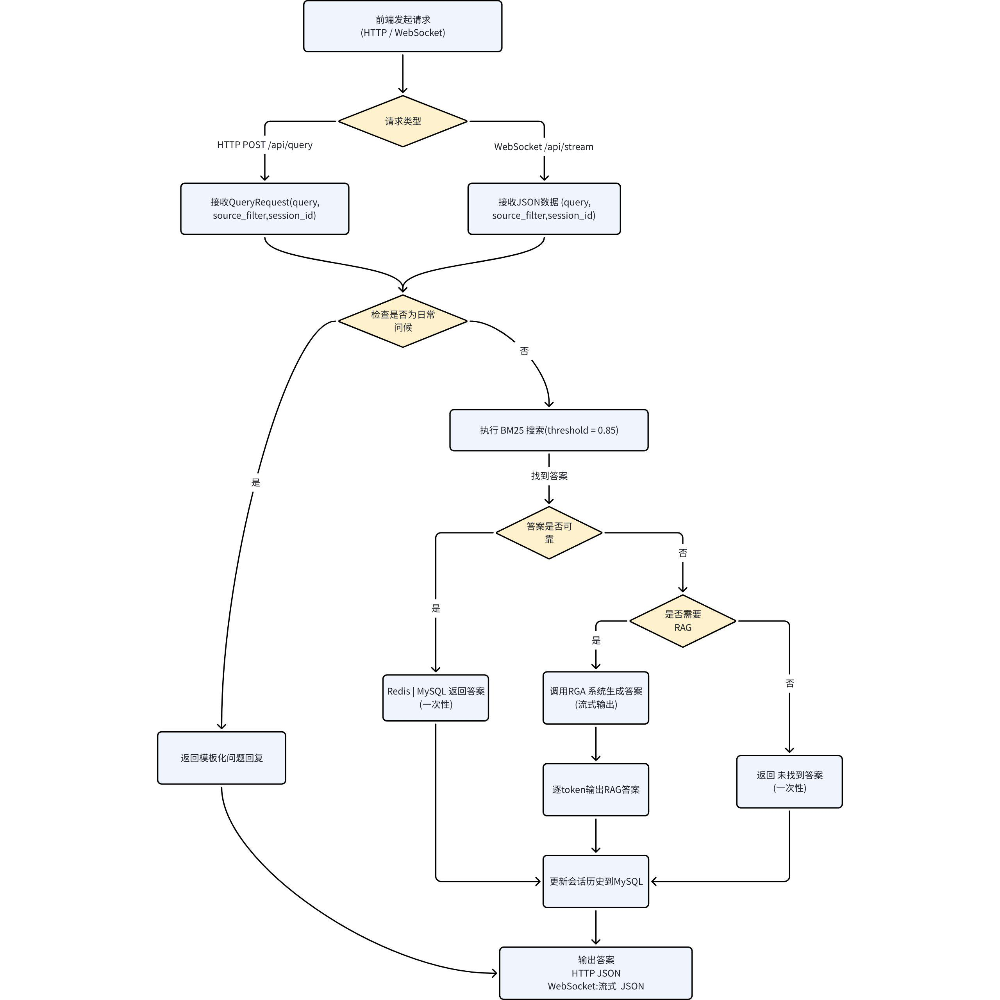
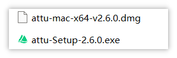
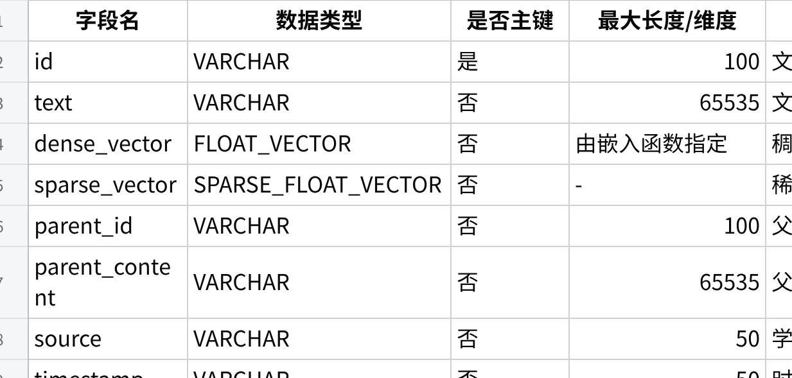
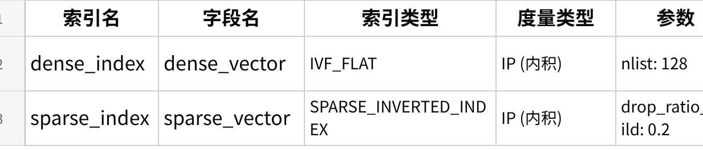
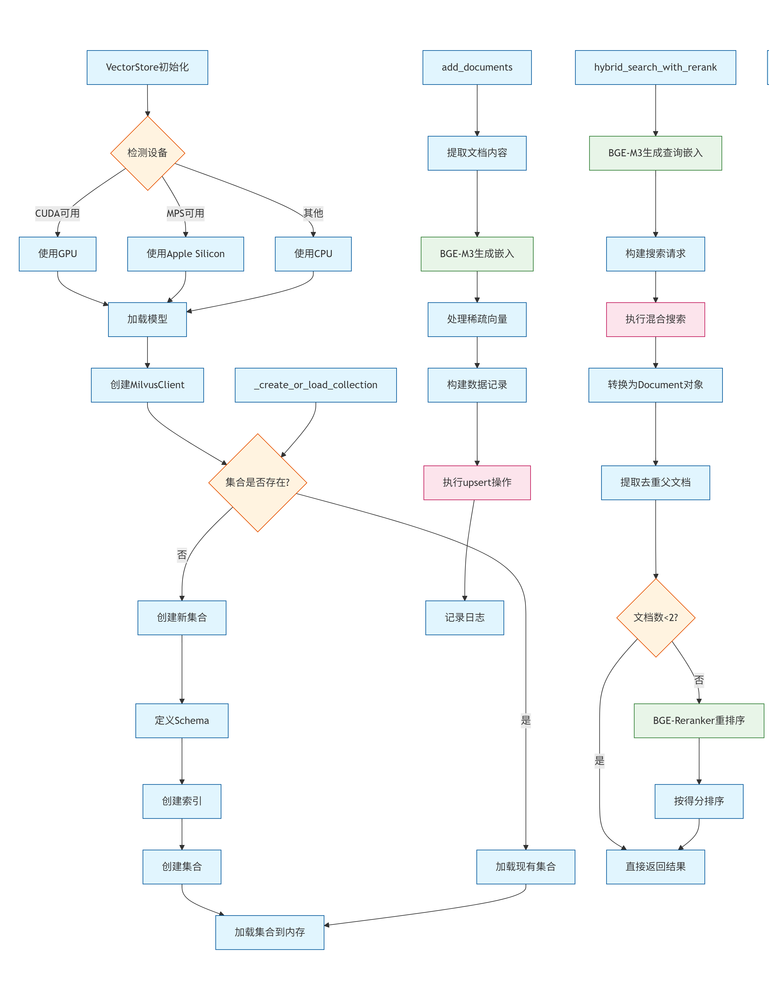
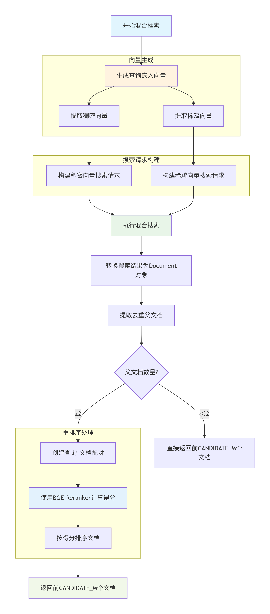
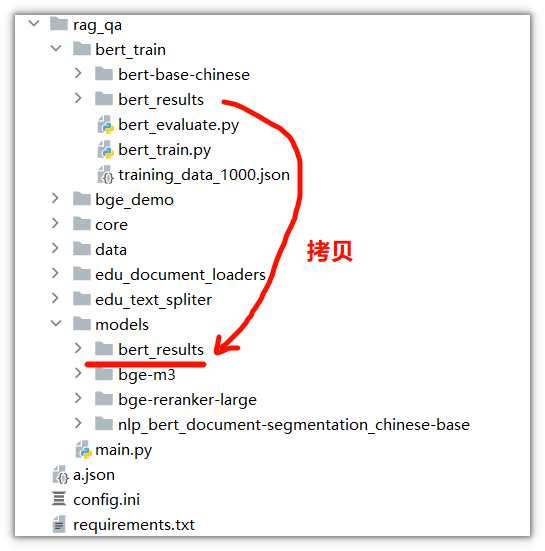
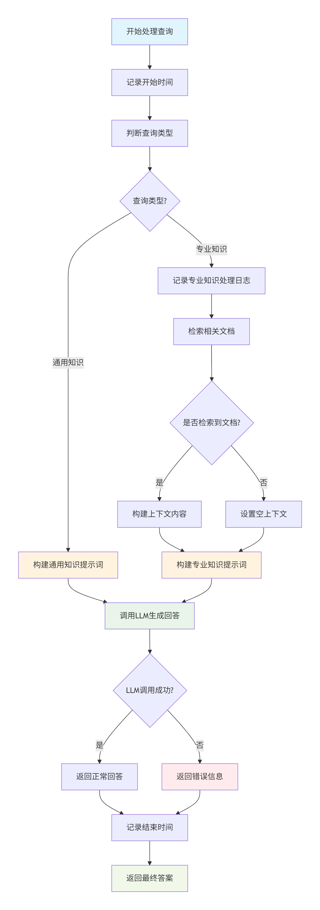
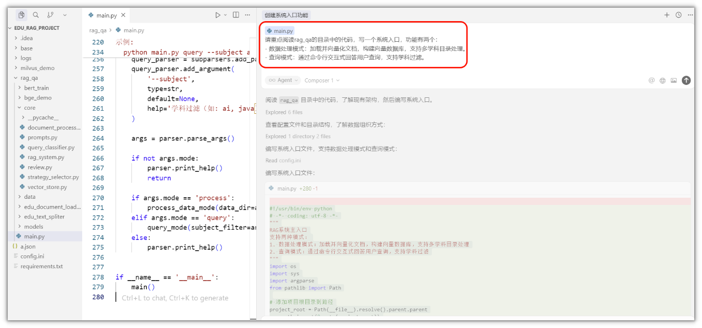
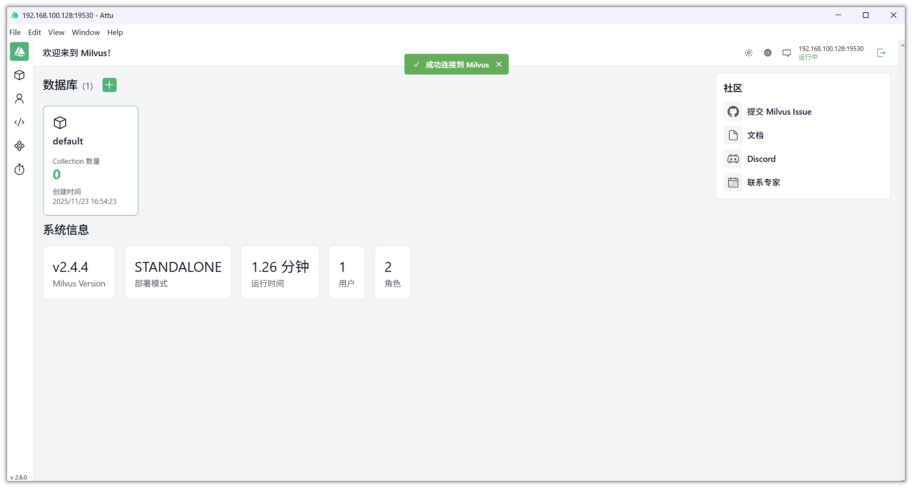

---
tags:
  - Milvus
  - 向量数据库
  - RAG
  - EduRAG
  - 环境搭建
title: 环境搭建和Milvus向量数据库
description: 传智教育EduRAG项目——环境搭建、Milvus向量数据库概念、索引类型、相似度度量、数据库操作全流程
date: 2026-06-22
sources:
  - 黑马课程讲义: EduRAG项目
---

# 01-环境搭建和Milvus向量数据库

## 1. 项目概述

### 1.1 项目背景

近年来，随着ChatGPT的广泛应用，基于大规模语言模型（LLM）的技术已成为人工智能领域的研究和应用热点。尤其是大模型在各类自然语言处理任务中的成功应用，推动了教育行业的智能化转型。然而，当前市面上大多数大语言模型存在一个普遍的问题：这些模型主要依赖于过往的训练数据，无法动态获取最新的知识以及各企业特有的私有知识。这种局限性常常导致生成答案时出现"幻觉"问题，即模型提供的答案与实际情况不符或不准确。

为了有效解决这一问题，企业普遍采用了以下两种主要手段：

**基于企业私有知识的垂直领域微调**：通过将企业领域的特定知识融合到大模型中，进行微调，使得模型能够更好地服务于垂直行业的专业需求。

**基于企业私有知识的RAG（Retrieval-Augmented Generation）问答系统**：通过构建基于检索的问答框架，结合企业私有知识库，实现更为精准且动态更新的知识问答服务，从而减少幻觉问题的发生。

在此背景下，传智教育通过采用**LangChain**和**Qwen大模型**，构建了一套智能化的学科在线答疑系统。该系统基于RAG架构，能够通过实时检索相关知识库中的信息来增强大模型的生成能力，确保回答的准确性和时效性。与此同时，系统通过自动化处理学生的答疑需求，极大地减轻了人工客服的工作压力，从而实现了高效、低成本的知识服务。

### 1.2 技术架构

系统采用**分层架构设计**，主要分为以下层次：


核心流程



### 1.3 环境要求

#### 1.3.1 创建新的虚拟环境

为了不与其他项目冲突，需要在新创建一个虚拟环境来开发项目

```bash
# 创建新的环境
conda create -n edu_rag python=3.10
# 激活
conda activate edu_rag

```

#### 1.3.2 创建项目并安装依赖库

使用pycharm创建一个新的项目，并在根目录中创建一个文件 requirements.txt


requirements.txt 文件的内容如下，可直接下载拷贝到项目的根目录

执行命令： pip install -r requirements.txt

**[requirements.txt]**

#### 1.3.3 代码目录结构

```
edu_rag_pro/
├── config.ini # 配置文件，包含所有模块的配置
├── base/
│ ├── config.py # 配置管理，加载 config.ini
│ ├── logger.py # 日志设置
├── rag_qa/
│ ├── core/
│ │ ├── document_processor.py # 文档处理模块
│ │ ├── prompts.py # RAG 提示模板
│ │ ├── query_classifier.py # 查询分类器
│ │ ├── strategy_selector.py # 检索策略选择器
│ │ ├── vector_store.py # 向量存储与检索
│ │ ├── rag_system.py # RAG 系统核心逻辑
│ ├── main.py # RAG 系统独立入口，支持存储和查询
├── requirements.txt # 依赖文件
└── logs/
└── app.log # 日志文件

```

系统的代码组织分为以下几个核心模块：

**base/**：基础支持模块，负责配置、日志处理。

**core/**：核心逻辑模块，实现RAG的关键功能。

**main.py**：系统运行入口，支持数据处理和交互查询。

**模块详情**

**base模块**：

config.py：管理系统配置，如API密钥、模型选择等。

logger.py：记录系统运行日志，便于调试和监控。从config.ini读取配置信息

**core模块**：

document_processor.py：处理输入文档，分块并准备向量存储。

prompts.py：管理Prompt模板，支持不同任务。

query_classifier.py：分类用户查询类型。

strategy_selector.py：选择合适的检索策略。

vector_store.py：管理向量数据库，进行文档存储和检索。

rag_system.py：整合RAG流程，生成最终回答。

**main.py**：命令行交互入口，测试和运行系统。

创建好的效果：



> ⚠️ **注意**：其中的config.py、logger.py、config.ini从今天资料中拷贝过来即可

ps：后期会根据实际情况进行调整配置内容

#### 1.3.4 安装Milvus

Milvus是一个向量数据库，我们需要提前装，参考文档：：[Milvus环境搭建（自己搭建）](https://qcnfzy5d3bki.feishu.cn/wiki/RGMZwXuoAiRnuLkhvkVcgLainXg)

## 2. 什么是 Milvus 向量数据库？

官网：https://milvus.io/zh

Milvus 是一款开源的向量数据库（2019年提出），其唯一目标是存储、索引和管理由深度神经网络和其他机器学习（ML）模型生成的大规模[嵌入向量](https://www.milvus-io.com/overview#Embedding-vectors)。

作为一个专门设计用于处理输入向量查询的数据库，它能够处理**万亿级别**的向量索引。与现有的关系型数据库主要处理遵循预定义模式的结构化数据不同，Milvus 从底层设计用于处理从非结构化数据转换而来的嵌入向量。

随着互联网的发展和演变，非结构化数据变得越来越常见，包括电子邮件、论文、物联网传感器数据、Facebook 照片、蛋白质结构等等。为了使计算机能够理解和处理非结构化数据，使用嵌入技术将它们转换为向量。Milvus 存储和索引这些向量。Milvus 能够通过计算它们的相似距离来分析两个向量之间的相关性。如果两个嵌入向量非常相似，则意味着原始数据源也很相似。

**为什么选择 Milvus？**

在处理大规模数据集的向量搜索时具有高性能。

开发者优先的社区，提供多语言支持和工具链。

云扩展性和高可靠性，即使出现故障也不会受到影响。

通过将标量过滤与向量相似度搜索配对，实现**混合搜索**。

## 3. 关键概念

### 3.1 非结构化数据

非结构化数据包括图像、视频、音频和自然语言等信息，这些信息不遵循预定义的模型或组织方式。这种数据类型占据了世界数据的约 80%，可以使用各种人工智能（AI）和机器学习（ML）模型将其转换为向量。

### 3.2 嵌入向量

嵌入向量是对非结构化数据（如电子邮件、物联网传感器数据、Instagram 照片、蛋白质结构等）的特征抽象。数学上，嵌入向量是**一个浮点数或二进制数**的**数组**。现代的嵌入技术被用于将非结构化数据转换为嵌入向量。

### 3.3 向量相似度搜索

向量相似度搜索是将向量与数据库进行比较，以找到与查询向量最相似的向量的过程。使用近似**最近邻搜索算法**加速搜索过程。如果两个嵌入向量非常相似，那么原始数据源也是相似的。

### 3.4 Collection 和 Field

与传统数据库引擎类似，您也可以在 Milvus 中创建数据库，并为某些用户分配权限来管理它们。那么这些用户就有权管理数据库中的集合。一个 Milvus 集群最多支持 64 个数据库.

在关系数据库中，表和字段的结构可以与Milvus中的Collection和Field进行对应：



**点击图片可查看完整电子表格**

```
注意：1个collection最多支持4个向量Field

```

#### 3.4.1 Field schema

Field schema 是字段的逻辑定义。我们在定义集合架构和管理集合之前需要定义的第一件事就是定义 Field schema。

```
Milvus 集合中仅支持一个主键字段。

```



**点击图片可查看完整电子表格**

#### 3.4.2 collection schema

collection schema 是 collection 的逻辑定义。我们需要在定义 collection schema 之前定义 field schema。



**点击图片可查看完整电子表格**

## 4. 索引和度量

索引是数据的组织单位。在搜索或查询插入的实体之前，必须声明索引类型和相似度度量。**如果您未指定索引类型，则 Milvus 将默认使用暴力搜索。**

### 4.1 索引类型

大多数由 Milvus 支持的向量索引类型使用**近似最近邻搜索**（ANNS），包括：

FLAT：FLAT最适合在小型、百万级数据集上寻求完全准确和精确搜索结果的场景。

这是最简单的索引方式，进行暴力搜索（brute-force），可以保证精确度，但效率低，尤其在数据量大时。适合场景：在小型、百万级数据集上寻求完全精确的搜索结果。

| **FLAT（暴力搜索）**                                                  |
|                                                                       |
| 就像一本未分类的电话簿，你要找一个人，就得从头到尾一个一个看。        |
|                                                                       |
| 优点：100% 准确。                                                     |
|                                                                       |
| 缺点：速度慢，只适合数据量小（百万级以下）的场景。                    |
|                                                                       |
| 例子：如果你只有1000张图片，用 FLAT 找最相似的一张没问题。            |

IVF_FLAT： 是一种基于倒排的索引方法，广泛用于在大规模数据集上实现高效的近似最近邻搜索。它适用于在精度和查询速度之间寻求平衡的场景。



**聚类** ：IVF_FLAT通过聚类算法（如k-means）将高维空间中的向量划分为多个子空间（簇）。每个簇包含一组相似的向量，并且每个簇会有一个代表向量，通常是簇的中心点。

**倒排索引** ：为每个簇创建倒排索引。每个向量会被映射到它所属的簇，这样在查询时，系统只需关注与查询向量相似的簇，而不需要搜索整个高维空间，从而显著降低搜索的时间复杂度。

**查询处理** ：

查询时，IVF_FLAT首先将查询向量分配到距离最近的簇中心（即子空间）。

然后在该簇内执行精确的线性搜索，从而查找与查询向量相似的向量。

为了优化查询，IVF_FLAT使用一个参数 nprobe 来控制搜索的簇数。 nprobe 控制搜索时考虑的簇的数量，从而平衡查询精度和查询速度：

增大 nprobe 可以搜索更多簇，返回更多候选向量，提高结果的精确度，但查询时间也会增加。减少 nprobe 可以缩小搜索范围，降低计算时间，查询速度更快，但可能会牺牲一些精度

| **IVF_FLAT（倒排索引 + 聚类）**                                                               |
|                                                                                               |
| 就像把图书馆的书先按主题分类，你找书时只需在相关主题区找。                                    |
|                                                                                               |
| 步骤：                                                                                        |
|                                                                                               |
| 聚类：把所有向量分成若干组（簇），每组有一个中心点。                                          |
|                                                                                               |
| 倒排索引：记录每个向量属于哪个组。                                                            |
|                                                                                               |
| 查询时，先找到离查询向量最近的几个组，再在这些组里细找。                                      |
|                                                                                               |
| 参数 nprobe：控制搜索几个组。越多越准但越慢，越少越快但可能漏掉一些。                         |
|                                                                                               |
| 例子：你有100万张图片，先按"猫、狗、人、车"分类。找"猫"的图片时，只搜索"猫"组和可能相关的组。 |

IVF_SQ8：是在 IVF_FLAT 基础上增加了量化步骤的一种索引方法，其核心思想与 IVF_FLAT 类似；IVF_SQ8通过 **标量量化** （Scalar Quantization）将每个维度的 4 字节浮点数表示压缩为 1 字节整数表示。



| **IVF_SQ8（带量化的 IVF）**                                           |
|                                                                       |
| 在 IVF_FLAT 基础上，对向量进行"压缩"，减少存储空间。                  |
|                                                                       |
| 量化：把每个数字从4字节浮点数压缩成1字节整数。                        |
|                                                                       |
| 例子：                                                                |
|                                                                       |
| 原始向量：[0.3, 0.9, 0.2, 0.7]                                      |
|                                                                       |
| 量化后：[1, 4, 2, 3]（按范围映射）                                  |
|                                                                       |
| 优点：节省存储，加快搜索，适合内存有限的场景。                        |
|                                                                       |
| 缺点：略有精度损失。                                                  |

IVF_PQ：是一种高效的向量索引方式，结合了倒排文件索引和乘积量化（Product Quantization）技术，旨在加速大规模高维数据集的检索。

**倒排文件索引**：IVF_PQ首先将数据集划分为多个簇，每个簇由一个聚类中心表示。查询时，系统首先计算查询向量与这些聚类中心的距离，选择最接近的几个簇进行详细搜索，从而减少计算量。

**乘积量化**：在每个簇内，向量被进一步量化为多个子向量，这些子向量通过独立的量化过程进行编码。这样可以显著降低存储需求，并加快相似度计算。

**存储与速度**：IVF_PQ通过减少存储空间的占用，同时保持较高的查询速度和准确性，适用于处理大规模高维向量数据。

| **IVF_PQ（乘积量化）**                                                                     |
|                                                                                            |
| 更极致的压缩，不仅压缩数字，还把向量拆成多个子向量分别压缩。                               |
|                                                                                            |
| 例子：                                                                                     |
|                                                                                            |
| 一个向量[0.1, 0.9, 0.2, 0.8]可以拆成两个子向量：[0.1, 0.9] 和 [0.2, 0.8]，分别量化。 |
|                                                                                            |
| 优点：极大节省存储，适合超大规模数据（十亿级以上）。                                       |
|                                                                                            |
| 缺点：精度损失比 IVF_SQ8 更大。                                                            |

HNSW：HNSW是基于图的索引，最适合对搜索效率有高要求的场景。

| **HNSW（基于图的索引）**                                              |
|                                                                       |
| 像人际网络：你通过朋友认识朋友的朋友，快速找到目标人物。              |
|                                                                       |
| 优点：查询速度非常快，适合高并发场景。                                |
|                                                                       |
| 缺点：构建索引慢，占用内存大。                                        |

请参阅[向量索引](https://www.milvus-io.com/reference/index)以了解更多详细信息。

### 4.2 相似度度量

在 Milvus 中，相似度度量用于衡量向量之间的相似性。选择一个好的距离度量方法可以显著提高分类和聚类的性能。根据输入数据的形式，选择特定的相似度度量方法可以获得最优的性能。

对于浮点嵌入，通常使用以下指标：

欧几里得距离（L2）

内积（IP）

余弦相似度 (COSINE)

| **1. 欧几里得距离（L2）**                                             |
|                                                                       |
| 就是两点之间的直线距离。                                              |
|                                                                       |
| 公式：√[(x₁−y₁)² + (x₂−y₂)² + ...]                                 |
|                                                                       |
| 值越小越相似。                                                        |
|                                                                       |
| 例子：两个点 (1,2) 和 (4,6) 的距离是 √[(1-4)² + (2-6)²] = 5。       |
|                                                                       |
| **2. 内积（IP）**                                                     |
|                                                                       |
| 衡量两个向量的"方向一致性"和"长度"。                                  |
|                                                                       |
| 公式：x₁y₁ + x₂y₂ + ...                                              |
|                                                                       |
| 值越大越相似（如果向量是归一化的）。                                  |
|                                                                       |
| 例子：向量 A = [1, 2]，B = [3, 4]，内积 = 1×3 + 2×4 = 11。        |
|                                                                       |
| **3. 余弦相似度（COSINE）**                                           |
|                                                                       |
| 只关心向量的"方向"，不关心长度。                                      |
|                                                                       |
| 公式：(A·B) / (\|A\| \|B\|)                                           |
|                                                                       |
| 值越接近1越相似。                                                     |
|                                                                       |
| 例子：两个方向完全相同的向量，余弦相似度为1。                         |

### 4.3 总结对比

**索引类型对比**



**点击图片可查看完整电子表格**

**相似度度量对比**



**点击图片可查看完整电子表格**

## 5. Milvus数据库操作

### 5.1 设置向量数据库

要创建本地的 Milvus 向量数据库，只需实例化一个MilvusClient ，如下代码：

```python
from pymilvus import MilvusClient


def operate_db():
# 连接本地Milvus
client = MilvusClient(uri="http://localhost:19530")

#创建名称为milvus_demo的数据库
databases = client.list_databases()
# 判断数据库是否存在
if 'milvus_demo' not in databases:
client.create_database(db_name="milvus_demo")
else:
client.using_database(db_name="milvus_demo")
#主函数
if __name__ == '__main__':
# 调用函数
operate_db()

```

### 5.2 Collections操作

在 Milvus 中，我们需要一个 Collections 来存储向量及其相关元数据。你可以把它想象成传统 SQL 数据库中的表格。创建 Collections 时，可以定义 Schema 和索引参数来配置向量规格，如维度、索引类型和远距离度量。此外，还有一些复杂的概念来优化索引以提高向量搜索性能。

```python
#添加索引
from pymilvus import MilvusClient, DataType


def operate_collection(client:MilvusClient):
# 定义schema
## 注意：在定义集合 Schema 时，enable_dynamic_field=True 使得您可以插入未定义的字段。一般动态字段以 JSON 格式存储，通常命名为 \$meta。在插入数据时，所有未定义的字段及其值将被保存为键值对。
## 在定义集合 Schema 时，auto_id=True 可以对主键自动增长id。
schema = client.create_schema(auto_id=False, enable_dynamic_field=True)
# # schema添加字段id, vector
schema.add_field(field_name='id', datatype=DataType.INT64, is_primary=True)
schema.add_field(field_name='vector', datatype=DataType.FLOAT_VECTOR, dim=5)
schema.add_field(field_name='scalar', datatype=DataType.VARCHAR, max_length=256, description='标量字段')

client.create_collection(collection_name="demo_v1",schema=schema)


def add_index(client:MilvusClient):
# 创建索引参数
index_params = client.prepare_index_params()
# # 在向量字段vector上面添加一个索引；
# index_type='', # 留空以使用自动索引
# 对于向量字段，常见的默认索引类型包括IVF_FLAT或HNSW等，具体取决于数据的特性和查询需求。
# 对于标量字段，常见的默认索引可能是INVERTED等。
index_params.add_index(field_name="vector", index_type="",metric_type="COSINE",index_name="vector_index")
# 创建索引
client.create_index(collection_name="demo_v1", index_params=index_params)
# print("索引创建成功")
# 查询索引
# indexes = client.list_indexes(collection_name="demo_v1")
# print(f'索引列表：{indexes}')
# 查询索引详细信息
# res = client.describe_index(collection_name="demo_v1", index_name="vector_index")
# print(f'索引详细信息：{res}')

#查询索引状态
# print(client.get_load_state(collection_name="demo_v1"))
# 加载集合
# client.load_collection(collection_name="demo_v1")
# 查询索引状态
# print(client.get_load_state(collection_name="demo_v1"))


# 释放集合
# client.release_collection(collection_name="demo_v1")
# 删除索引
# client.drop_index(collection_name="demo_v1", index_name="vector_index")

# 标量字段创建索引
# index_params1 = client.prepare_index_params()
# index_params1.add_index(field_name="scalar", index_type="",index_name="scalar_index")
# client.create_index(collection_name="demo_v1", index_params=index_params1)

# 查询索引
# indexes = client.list_indexes(collection_name="demo_v1")
# print(f'索引列表：{indexes}')
# 查询索引详细信息
# res = client.describe_index(collection_name="demo_v1", index_name="scalar_index")
# print(f'索引详细信息：{res}')

#主函数
if __name__ == '__main__':
# 连接本地Milvus
client = MilvusClient(uri="http://localhost:19530")
# 使用数据库milvus_demo
client.using_database(db_name="milvus_demo")
# 集合操作
# operate_collection(client)
# 索引操作
add_index(client)

```

### 5.3 Entity实体数据操作

在 Milvus 中，**实体指的是Collections中共享相同Schema** 的数据记录，行中每个字段的数据构成一个实体。因此，同一 Collections 中的实体具有相同的属性（如字段名称、数据类型和其他约束）。

数据的增、删、改

```python
from pymilvus import MilvusClient,DataType

def operate_collection(client:MilvusClient):

# 定义schema 来描述集合和字段
schema = client.create_schema(auto_id=False, enable_dynamic_field=True)

schema.add_field(field_name="id", datatype=DataType.INT64, is_primary=True)
schema.add_field(field_name="vector", datatype=DataType.FLOAT_VECTOR,dim=5)

index_params = client.prepare_index_params()
index_params.add_index(field_name="vector", index_type="", metric_type="COSINE", index_name="vector_index")
#创建集合
client.create_collection(collection_name="demo_v2",schema=schema,index_params=index_params)


def operate_entity(client:MilvusClient):
data = [
{"id": 0, "vector": [0.3580376395471989, -0.6023495712049978, 0.18414012509913835, -0.26286205330961354,
0.9029438446296592], "color": "pink_8682"},
{"id": 1, "vector": [0.19886812562848388, 0.06023560599112088, 0.6976963061752597, 0.2614474506242501,
0.838729485096104], "color": "red_7025"},
{"id": 2, "vector": [0.43742130801983836, -0.5597502546264526, 0.6457887650909682, 0.7894058910881185,
0.20785793220625592], "color": "orange_6781"},
{"id": 3, "vector": [0.3172005263489739, 0.9719044792798428, -0.36981146090600725, -0.4860894583077995,
0.95791889146345], "color": "pink_9298"},
{"id": 4, "vector": [0.4452349528804562, -0.8757026943054742, 0.8220779437047674, 0.46406290649483184,
0.30337481143159106], "color": "red_4794"},
{"id": 5, "vector": [0.985825131989184, -0.8144651566660419, 0.6299267002202009, 0.1206906911183383,
-0.1446277761879955], "color": "yellow_4222"},
{"id": 6, "vector": [0.8371977790571115, -0.015764369584852833, -0.31062937026679327, -0.562666951622192,
-0.8984947637863987], "color": "red_9392"},
{"id": 7, "vector": [-0.33445148015177995, -0.2567135004164067, 0.8987539745369246, 0.9402995886420709,
0.5378064918413052], "color": "grey_8510"},
{"id": 8, "vector": [0.39524717779832685, 0.4000257286739164, -0.5890507376891594, -0.8650502298996872,
-0.6140360785406336], "color": "white_9381"},
{"id": 9, "vector": [0.5718280481994695, 0.24070317428066512, -0.3737913482606834, -0.06726932177492717,
-0.6980531615588608], "color": "purple_4976"}
]
# res = client.insert(collection_name="demo_v2", data=data)
# print(res)

data = [
{"id": 10, "vector": [-0.5570353903748935, -0.8997887893201304, -0.7123782431855732, -0.6298990746450119,
0.6699215060604258], "color": "red_1202"},
{"id": 11, "vector": [0.6319019033373907, 0.6821488267878275, 0.8552303045704168, 0.36929791364943054,
-0.14152860714878068], "color": "blue_4150"},
{"id": 12, "vector": [0.9483947484855766, -0.32294203351925344, 0.9759290319978025, 0.8262982148666174,
-0.8351194181285713], "color": "orange_4590"},
{"id": 13, "vector": [-0.5449109892498731, 0.043511240563786524, -0.25105249484790804, -0.012030655265886425,
-0.0010987671273892108], "color": "pink_9619"},
{"id": 14, "vector": [0.6603339372951424, -0.10866551787442225, -0.9435597754324891, 0.8230244263466688,
-0.7986720938400362], "color": "orange_4863"},
{"id": 15, "vector": [-0.8825129181091456, -0.9204557711667729, -0.935350065513425, 0.5484069690287079,
0.24448151140671204], "color": "orange_7984"},
{"id": 16, "vector": [0.6285586391568163, 0.5389064528263487, -0.3163366239905099, 0.22036279378888013,
0.15077052220816167], "color": "blue_9010"},
{"id": 17, "vector": [-0.20151825016059233, -0.905239387635804, 0.6749305353372479, -0.7324272081377843,
-0.33007998971889263], "color": "blue_4521"},
{"id": 18, "vector": [0.2432286610792349, 0.01785636564206139, -0.651356982731391, -0.35848148851027895,
-0.7387383128324057], "color": "orange_2529"},
{"id": 19, "vector": [0.055512329053363674, 0.7100266349039421, 0.4956956543575197, 0.24541352586717702,
0.4209030729923515], "color": "red_9437"}
]

# 更新插入数据
res = client.upsert(collection_name="demo_v2", data=data)
print(res)


if __name__ == '__main__':
# 连接本地milvus
client = MilvusClient(uri="http://192.168.100.128:19530")
client.using_database(db_name="milvus_demo")
operate_entity(client)

```

```
操作数据之前，集合必须是加载状态

```

数据的查询-简单查询

```python
from pymilvus import MilvusClient


# 简单查询
def query_operation(client: MilvusClient):
# 1.单向量查询
res = client.search(collection_name="demo_v2",
data=[[0.19886812562848388, 0.06023560599112088, 0.6976963061752597, 0.2614474506242501, 0.838729485096104]],
limit=2,
search_params={"metric_type": "COSINE"}, #要根据自己创建的索引类型进行填写
output_fields=["id","vector"], )
print(res)

# 2.多向量查询
res = client.search(collection_name="demo_v2",
data=[[0.19886812562848388, 0.06023560599112088, 0.6976963061752597, 0.2614474506242501,
0.838729485096104],
[0.3172005263489739, 0.9719044792798428, -0.36981146090600725, -0.4860894583077995,
0.95791889146345]],
limit=2,
search_params={"metric_type": "COSINE"},
output_fields=["id", "vector"], )
print(res)

# 3.过滤查询
res = client.search(collection_name="demo_v2",
data=[[0.19886812562848388, 0.06023560599112088, 0.6976963061752597, 0.2614474506242501,
0.838729485096104]],
limit=5,
search_params={"metric_type": "COSINE"},
output_fields=["color"],
filter="color like 'red%'"
)
print(res)

# 4.范围查询

#定义搜索条件
# 范围搜索: radius：定义搜索空间的外边界。只有距查询向量在此距离内的向量才被视为潜在匹配。
# range_filter：虽然radius设置搜索的外部限制，但可以选择使用range_filter来定义内部边界，创建一个距离范围，在该范围内向量必须落下才被视为匹配。
search_params = {
"metric_type": "COSINE",
"params":{
"radius": 0.8, # 搜索圆的半径
"range_filter": 1 # 范围过滤器，用于过滤出不在搜索圆内的向量。
}
}

res = client.search(collection_name="demo_v2",
data=[[0.19886812562848388, 0.06023560599112088, 0.6976963061752597, 0.2614474506242501,
0.838729485096104]],
limit=5,
search_params= search_params,
output_fields=["color"]
)
print(res)


# 主函数
if __name__ == '__main__':
# 连接本地Milvus
client = MilvusClient(uri="http://localhost:19530")
# 使用数据库milvus_demo
client.using_database(db_name="milvus_demo")
# 操作数据
query_operation(client)

```

### 5.4 数据查询-复杂查询

#### 5.4.1 为什么要重排序？

**混合检索**：要对两组 ANN 搜索结果进行合并和重新排序，有必要选择适当的重新排序策略。支持两种重排策略：**加权排名策略（WeightedRanker**）和**重排序策略**（**RRFRanker**）。在选择重排策略时，需要考虑的一个问题是，在向量场中是否需要强调一个或多个基本 ANN 搜索。



如果在查询的过程中，一个collection中有多个向量字段(比如：稠密向量和稀疏向量)

| 稠密向量检索：基于语义相似性。它善于找到在"意思上"相近的文档，即使它们没有完全相同的关键词。例如，查询"如何保养车辆"，它能找到关于"汽车维护技巧"的文档。     |
|                                                                                                                                                              |
| 稀疏向量检索：基于词汇匹配（如BM25、SPLADE）。它善于找到包含精确关键词或它们的紧密同义词的文档。对于同一个查询，它会优先找到包含"保养"和"车辆"这些词的文档。 |

当按照query查询之后，可以从两个向量字段中检索出数据，比如各2个

当拿到4个文档之后，可以拼接到提示词中，但是有论文证明，把4个文档中最相关的文档放到最前面，后期的效果会更好，索引，需要对这4个文档，重新排序，找到最相关文档，依次排序

重排序在这里扮演了 "统一裁判" 和 "终极评估者" 的角色。它的核心价值在于创建一个统一的、可比较的相关性衡量标准。

#### 5.4.2 加权排名

**加权排名** 指的是：在合并来自不同检索渠道的候选结果时，根据每个渠道的重要性或置信度，为其赋予一个权重，然后将每个候选在其所属渠道中的原始分数与该渠道的权重相乘，得到一个加权分，最后根据这个加权分进行全局排序。

官方解释：https://milvus.io/docs/zh/weighted-ranker.md

如果您要求结果强调特定的向量场，建议使用该策略。通过 WeightedRanker，您可以为某些向量场分配更高的权重，从而更加强调这些向量场。例如，在多模态搜索中，图片的文字描述可能比图片的颜色更重要。

使用 WeightedRanker 策略时，需要在WeightedRanker 函数中输入权重值。混合搜索中的基本 ANN 搜索次数与需要输入的值的次数相对应。输入值的范围应为 [0,1]，数值越接近 1 表示重要性越高。

```python
from pymilvus import WeightedRanker
rerank= WeightedRanker(0.8, 0.3)

```

#### 5.4.3 RRF排序器

**RRFRanker（倒数排序融合）**：在没有特定重点的情况下，建议采用这种策略。RRF 可以有效平衡每个向量场的重要性。RRFRanker的核心思想是根据每个结果在其检索列表中的排名位置来计算分数。

官方解释：https://milvus.io/docs/zh/rrf-ranker.md

使用 RRFRanker 策略时，需要将参数值k 输入 RRFRanker。k 的默认值为 60。该参数有助于确定如何组合来自不同 ANN 搜索的排名，目的是平衡和混合所有搜索的重要性。

```python
from pymilvus import RRFRanker

ranker = RRFRanker(100)

```

#### 5.4.4 混合搜索-代码实现

```python
import random

from pymilvus import MilvusClient, DataType, AnnSearchRequest, WeightedRanker, RRFRanker


def create_collection_and_data(client):
# 定义schema
schema = client.create_schema(enable_dynamic_field=False)
# 创建字段
schema.add_field(field_name="id", datatype=DataType.INT64, is_primary=True)
schema.add_field(field_name="filmVector", datatype=DataType.FLOAT_VECTOR, dim=5) # 向量字段
schema.add_field(field_name="posterVector", datatype=DataType.FLOAT_VECTOR, dim=5) # 向量字段
# 给向量字段添加索引
index_params = client.prepare_index_params()
index_params.add_index(field_name="filmVector", index_type="IVF_FLAT", metric_type="L2", params={"nlist": 128},
index_name="film_vector_index")
index_params.add_index(field_name="posterVector", index_type="", metric_type="COSINE",
index_name="poster_vector_index")

# 创建集合
client.create_collection(collection_name="demo_v3", schema=schema, index_params=index_params)

# 批量插入数据

entities = []

for _ in range(1000):
id = random.randint(0, 10000)
film_vector = [random.random() for _ in range(5)]
poster_vector = [random.random() for _ in range(5)]
entity = {"id": id, "filmVector": film_vector, "posterVector": poster_vector}
entities.append(entity)

# 批量插入数据
client.upsert(collection_name="demo_v3", data=entities)

def search(client):

# 查询向量
query_filmVector = [[0.8896863042430693, 0.370613100114602, 0.23779315077113428, 0.38227915951132996, 0.5997064603128835]]
dense_search_params = {
"data":query_filmVector,
"anns_field":"filmVector",
"param": {"metric_type":"L2","params":{"nprobe": 10}},
"limit": 2
}
request1 = AnnSearchRequest(**dense_search_params)

query_posterVector = [[0.02550758562349764, 0.006085637357292062, 0.5325251250159071, 0.7676432650114147, 0.5521074424751443]]
sparse_search_params = {
"data": query_posterVector,
"anns_field": "posterVector",
"param": {"metric_type": "COSINE"},
"limit": 2
}
request2 = AnnSearchRequest(**sparse_search_params)

# 合并查询条件
requests = [request1, request2]
# 重排序
ranker = WeightedRanker(0.8, 0.3)
# ranker = RRFRanker(100)

# 执行查询
res = client.hybrid_search(collection_name="demo_v3", reqs=requests, ranker=ranker, limit=2,
output_fields=["id"])

# print(res)

for hits in res:
for hit in hits:
print(hit)


if __name__ == '__main__':
# 连接本地milvus
client = MilvusClient(uri="http://192.168.100.128:19530")
client.using_database(db_name="milvus_demo")
# create_collection_and_data(client)
search(client)

```

### 5.5 删除 Collections

如果想删除某个 Collections 中的所有数据，可以通过以下方法丢弃该 Collections

```python
# Drop collection
client.drop_collection(collection_name="demo_collection")

```


---

## 相关笔记

- [[AI大模型开发/AI大模型开发总览|AI大模型开发总览]]
- [[AI大模型开发基础/AI大模型开发基础总览|AI大模型开发基础]]
- [[SpringAI+AIGC应用/AI应用技术全景|AI应用技术全景（2025-2026）]]
- [[SpringAI+AIGC应用/持久化VectorStore|持久化VectorStore]]
- [[MOC-日常学习]]
