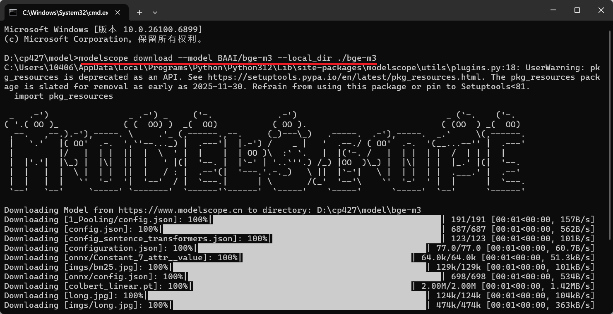

---
tags:
  - 虚拟机
  - 环境搭建
  - EduRAG
title: 挂载虚拟机
description: VMware 虚拟机 NAT 网络配置、挂载流程
date: 2025-06-22
sources:
  - 黑马课程讲义: EduRAG项目
---

# 挂载虚拟机

## 1. 挂载虚拟机

# 1). 打开Vmware虚拟机，打开 编辑 -\> 虚拟网络编辑器(N)...



选择 NAT模式，然后选择右下角的 更改设置。


设置子网IP为 **192.168.100.0**，然后选择 应用 -\> 确定。


**2). 解压 资料/Linux镜像/CentOS7-1.zip 到一个比较大的磁盘中 (没有中文的目录)。**


**3). 打开解压目录，双击 .vmx 文件，选择以 Vmware Workstation 打开这个文件。**


**4). 挂载完毕之后，启动Linux服务器。**


启动过程中，如果出现如下界面，选择 **我已移动该虚拟机**。


**5). 启动完毕之后，登录服务器。 输入用户名：root，密码：1234 （注意：linux系统输入密码是不显示的，输入完毕，回车即可登录）**


## 2. 验证软件

使用Final Shell软件连接上虚拟机

服务器的IP已固定：192.168.100.128

连接上之后，可以查看容器：

```bash
\# 进入ai_workspace目录，执行命令启动容器
docker compose up -d
#启动成功后，可以查看容器
docker ps

```


容器启动成功之后，可以在本地电脑上连接milvus(向量数据库)

安装attu（资料中已提供，可以链接milvus数据库）


安装成功之后，可以链接服务器上的milvus数据库，如下效果


成功链接之后，可以看到一个默认的数据库 default


---

## 相关笔记

- [[AI大模型开发总览|AI大模型开发总览]]
- [[1 环境搭建和Milvus向量数据库|环境搭建和Milvus向量数据库]]
