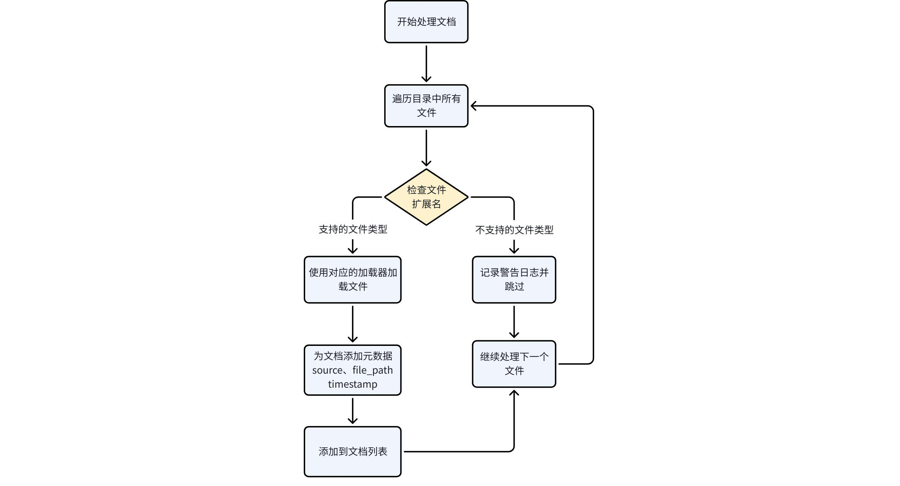
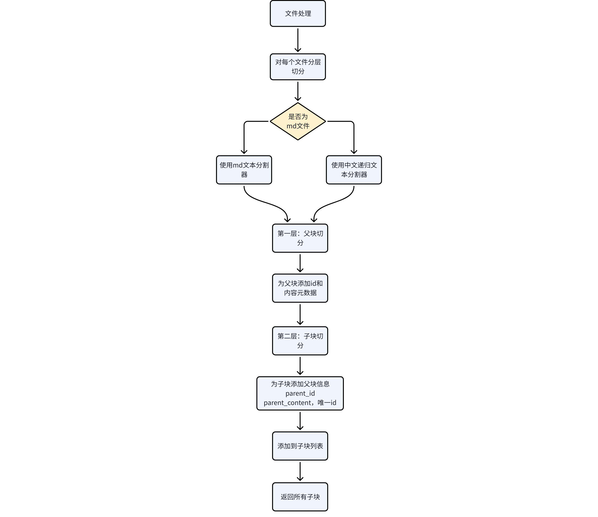

---
tags:
  - RAG
  - EduRAG
  - 问答系统
  - Python
title: RAG问答系统-核心模块
description: EduRAG 问答系统核心模块：base 模块、配置管理、检索、生成等
date: 2025-06-22
sources:
  - 黑马课程讲义: EduRAG项目
---

# 02-RAG问答系统(核心模块)

## 1. 基础模块介绍

### 1.1 基础模块

base模块是EduRAG智慧问答系统的基础，负责提供系统运行所需的核心功能，包括配置管理、日志记录。这些功能为系统的其他模块提供了稳定的支持，确保系统能够灵活配置、监控运行状态。

### 1.2 配置管理

config.py文件定义了Config类，用于集中管理系统中的所有配置参数。这些参数包括数据库连接信息、模型选择、分块策略、API设置等。通过集中管理配置，系统可以方便地调整参数、适配不同环境，并支持通过环境变量进行灵活配置。

配置文件config.ini

```bash
*\# MySQL 配置
[mysql]
host = localhost
user = root
password = 1234
database = subjects_kg

\# Redis 配置
[redis]
host = localhost
port = 6379
password = 1234
db = 0

\# 日志配置
[logger]
log_file = D:\ai_workspace\code\edu_rag_pro\logs\app.log


\# Milvus 配置
[milvus]
host = localhost
port = 19530
database_name = itcast
collection_name = edurag

\# LLM 配置
[llm]
model = qwen-plus
dashscope_api_key = sk-71f17dd2e54c45c8af4a9624af85cd79
dashscope_base_url = https://dashscope.aliyuncs.com/compatible-mode/v1

\# 检索参数配置
[retrieval]
parent_chunk_size = 1200
child_chunk_size = 300
chunk_overlap = 50
retrieval_k = 3
candidate_m = 2

\# 应用配置
[app]
valid_sources = ["ai", "java", "test", "ops", "bigdata"]
customer_service_phone = 13000000000*

```

| Mysql、Redis、milvus 根据自己的实际情况来调整参数                                                         |
|                                                                                                           |
| logger的日志地址调整为自己的代码目录日志文件路径                                                          |
|                                                                                                           |
| llm为百炼大模型，改为自己的api-key（如没有，需注册申请，[百炼官网](https://bailian.console.aliyun.com/)） |
|                                                                                                           |
| 检索参数配置和应用配置，暂时先拷贝过来，后续用到再详细讲解                                                |

读取配置文件

```python
*\# 导入配置解析库
import configparser
\# 导入路径操作库
from pathlib import Path


class Config:
\# 初始化配置，加载 config.ini 文件
def __init__(self, config_file=None):
\# 项目根目录
self.base_dir = Path(__file__).resolve().parent.parent
\# 解析配置文件路径
config_path = Path(config_file) if config_file else self.base_dir / 'config.ini'
if not config_path.is_absolute():
config_path = self.base_dir / config_path
\# 创建配置解析器
self.config = configparser.ConfigParser()
\# 读取配置文件
self.config.read(config_path, encoding='utf-8')

\# MySQL 配置
\# MySQL 主机地址
self.MYSQL_HOST = self.config.get('mysql', 'host', fallback='localhost')
\# MySQL 用户名
self.MYSQL_USER = self.config.get('mysql', 'user', fallback='root')
\# MySQL 密码
self.MYSQL_PASSWORD = self.config.get('mysql', 'password', fallback='1234')
\# MySQL 数据库名
self.MYSQL_DATABASE = self.config.get('mysql', 'database', fallback='subjects_kg')

\# Redis 配置
\# Redis 主机地址
self.REDIS_HOST = self.config.get('redis', 'host', fallback='localhost')
\# Redis 端口
self.REDIS_PORT = self.config.getint('redis', 'port', fallback=6379)
\# Redis 密码
self.REDIS_PASSWORD = self.config.get('redis', 'password', fallback='123456')
\# Redis 数据库编号
self.REDIS_DB = self.config.getint('redis', 'db', fallback=0)

\# Milvus 配置
\# Milvus 主机地址
self.MILVUS_HOST = self.config.get('milvus', 'host', fallback='localhost')
\# Milvus 端口
self.MILVUS_PORT = self.config.get('milvus', 'port', fallback='19530')
\# Milvus 数据库名
self.MILVUS_DATABASE_NAME = self.config.get('milvus', 'database_name', fallback='itcast')
\# Milvus 集合名
self.MILVUS_COLLECTION_NAME = self.config.get('milvus', 'collection_name', fallback='edurag')

\# LLM 配置
\# LLM 模型名
self.LLM_MODEL = self.config.get('llm', 'model', fallback='qwen-plus')
\# DashScope API 密钥
self.DASHSCOPE_API_KEY = self.config.get('llm', 'dashscope_api_key',fallback="sk-71f17dd2e54c45c8af4a9624af85cd79")
\# DashScope API 地址
self.DASHSCOPE_BASE_URL = self.config.get('llm', 'dashscope_base_url',
fallback='https://dashscope.aliyuncs.com/compatible-mode/v1')

\# 检索参数
\# 父块大小
self.PARENT_CHUNK_SIZE = self.config.getint('retrieval', 'parent_chunk_size', fallback=1200)
\# 子块大小
self.CHILD_CHUNK_SIZE = self.config.getint('retrieval', 'child_chunk_size', fallback=300)
\# 块重叠大小
self.CHUNK_OVERLAP = self.config.getint('retrieval', 'chunk_overlap', fallback=50)
\# 检索返回数量
self.RETRIEVAL_K = self.config.getint('retrieval', 'retrieval_k', fallback=5)
\# 最终候选数量
self.CANDIDATE_M = self.config.getint('retrieval', 'candidate_m', fallback=2)

\# 应用配置
\# 有效来源列表
self.VALID_SOURCES = eval(
self.config.get('app', 'valid_sources', fallback='["ai", "java", "test", "ops", "bigdata"]'))
\# 客服电话
self.CUSTOMER_SERVICE_PHONE = self.config.get('app', 'customer_service_phone', fallback='12345678')
\# 日志文件路径
log_file = self.config.get('logger', 'log_file', fallback='logs/app.log')
log_path = Path(log_file)
if not log_path.is_absolute():
log_path = self.base_dir / log_path
self.LOG_FILE = str(log_path)

if __name__ == '__main__':
conf = Config()
print(conf.CHILD_CHUNK_SIZE)*

```

### 1.3 日志记录

logger.py文件定义了setup_logging函数，用于配置系统的日志记录器。日志记录器将运行信息、警告和错误输出到文件和控制台，便于开发、调试和运维人员监控系统状态。

代码：

```python
*\# base/logger.py*
*\# 导入日志库*
import logging
*\# 导入路径操作库*
import os
*\# 导入配置类*
from base.config import Config


def setup_logging(log_file=Config().LOG_FILE):
*\# 创建日志目录*
os.makedirs(os.path.dirname(log_file), exist_ok=True)
*\# 获取日志器*
logger = logging.getLogger("EduRAG")
*\# 设置日志级别*
logger.setLevel(logging.INFO)
*\# 避免重复添加处理器*
if not logger.handlers:
*\# 创建文件处理器*
file_handler = logging.FileHandler(log_file, encoding='utf-8')
*\# 设置文件处理器级别*
file_handler.setLevel(logging.INFO)
*\# 创建控制台处理器*
console_handler = logging.StreamHandler()
*\# 设置控制台处理器级别*
console_handler.setLevel(logging.INFO)
*\# 设置日志格式*
formatter = logging.Formatter('%(asctime)s - %(name)s - %(levelname)s - %(message)s')
*\# 为文件处理器设置格式*
file_handler.setFormatter(formatter)
*\# 为控制台处理器设置格式*
console_handler.setFormatter(formatter)
*\# 添加文件处理器*
logger.addHandler(file_handler)
*\# 添加控制台处理器*
logger.addHandler(console_handler)
*\# 返回日志器*
return logger

*\# 初始化日志器*
logger = setup_logging()

```

**日志级别**：默认设为INFO，记录关键运行信息。

**双重输出**：同时输出到文件和控制台，便于实时监控和后续分析。

**格式化**：日志包含时间戳、名称、级别和内容，便于问题定位。

## 2. 文档解析

document_processor.py是EduRAG系统的核心模块之一，用于文档解析。主要负责**加载**多种格式的文档（如.txt、.pdf等），并对其进行分层**切分**，生成**父块**和**子块**，为后续的向量存储和检索做好准备。

### 2.1 文档拆分逻辑

#### 2.1.1 为什么要对文档拆分？

核心原因在于，大语言模型（LLM）无法一次性处理过长的文本，并且未经处理的原始文档不利于精确检索。拆块就是为了解决这两个根本问题。

#### 2.1.2 为什么要拆分为父子块？

保持上下文完整性：父块保留较大的文本内容，确保重要上下文信息不丢失

提高检索精度：子块提供更精细的文本片段，便于精准匹配查询

层级关系维护：建立父子关系，可以在检索到子块时追溯其父块上下文

平衡检索效率与准确性：大块保证上下文，小块提高检索精度


### 2.2 工具准备

从当天资料中找到对应的py文件，拷贝到项目中对应的位置


edu_document_loaders 文档加载工具，可以加载不同类型的文档(Word、PPT、image、PDF)

edu_text_spliter 文本分割工具

### 2.3 加载文件

加载文件逻辑



代码实现

```python
*\# core/document_processor.py
import os
from langchain_community.document_loaders import TextLoader
from langchain_community.document_loaders.markdown import UnstructuredMarkdownLoader
from langchain.text_splitter import MarkdownTextSplitter
from datetime import datetime
from rag_qa.edu_text_spliter.edu_chinese_recursive_text_splitter import ChineseRecursiveTextSplitter
from rag_qa.edu_document_loaders.edu_docloader import OCRDOCLoader
from rag_qa.edu_document_loaders.edu_imgloader import OCRIMGLoader
from rag_qa.edu_document_loaders.edu_pdfloader import OCRPDFLoader
from rag_qa.edu_document_loaders.edu_pptloader import OCRPPTLoader
from base.config import Config
from base.logger import logger

conf = Config()
\# 定义支持的文件类型及其对应的加载器字典
document_loaders = {
\# 文本文件使用 TextLoader
".txt": TextLoader,
\# PDF 文件使用 OCRPDFLoader
".pdf": OCRPDFLoader,
\# Word 文件使用 OCRDOCLoader
".docx": OCRDOCLoader,
\# PPT 文件使用 OCRPPTLoader
".ppt": OCRPPTLoader,
\# PPTX 文件使用 OCRPPTLoader
".pptx": OCRPPTLoader,
\# JPG 文件使用 OCRIMGLoader
".jpg": OCRIMGLoader,
\# PNG 文件使用 OCRIMGLoader
".png": OCRIMGLoader,
\# Markdown 文件使用 UnstructuredMarkdownLoader
".md": UnstructuredMarkdownLoader
}

\# 定义函数，从指定文件夹加载多种类型的文件，并添加元数据
def load_documents_from_directory(directory_path):
\# 初始化空列表，用于存储加载后的文档
documents = []

\# 获取支持的文件列表扩展名
supperted_extensions = document_loaders.keys()
\# 从目录中提取学科类别 (ai_data \--\> ai)
source = os.path.basename(directory_path).replace("_data", "")

\# 遍历指定目录及子目录中的所有文件
'''
参数：
root: 当前正在遍历的目录路径（字符串
_ : 当前目录下的子目录列表（列表）
files: 当前目录下的文件列表（列表）
os.walk: 这是一个生成器函数，会递归遍历目录树
'''
for root,_,files in os.walk(directory_path):
#遍历当前目录下的所有的文件
for file in files:
\# 拼接文件的完整路径
file_path = os.path.join(root, file)
\# 获取文件的扩展名
file_extension = os.path.splitext(file)[1]
if file_extension in supperted_extensions:
try:
\# 获取文件的加载器
load_class = document_loaders[file_extension]
\# 如果是txt文件，则只需要指定编码格式
if file_extension == ".txt":
loader = load_class(file_path, encoding="utf-8")
else:
loader = load_class(file_path)
\# 获取文档的内容
load_docs = loader.load()
for doc in load_docs:
\# 添加文档的元数据，学科类别、文件路径，创建时间
doc.metadata["source"]= source
doc.metadata["file_path"]= file_path
doc.metadata["timestamp"]= datetime.now().isoformat()

\# 将文档添加到总列表中
documents.extend(load_docs)
logger.info(f"加载文件 {file_path} 成功")
except Exception as e:
logger.error(f"加载文件 {file_path} 失败: {str(e)}")
else:
logger.warning(f"不支持的文件类型 {file_extension}")

return documents

if __name__ == "__main__":
chunks = load_documents_from_directory("D:\\ai_workspace\\code\\edu_rag_pro\\rag_qa\data\\ai_data")
print(chunks)*

```

**文档加载**：支持多种格式（如.txt、.pdf），使用专用加载器处理复杂文档。

### 2.4 拆分文件

继续在document_processor.py中添加函数，来对加载之后的文件，进行拆分

拆分逻辑



代码实现

```python
*\# 处理文档并进行分层拆分，返回子块结果*
def process_documents(directory_path,parent_chunk_size=conf.PARENT_CHUNK_SIZE,
child_chunk_size=conf.CHILD_CHUNK_SIZE,
chunk_overlap=conf.CHUNK_OVERLAP):
*\# 从指定目录加载文档*
documents = load_documents_from_directory(directory_path)
*\# 记录加载的文档的总数*
logger.info(f"加载了 {len(documents)} 个文档")
*\# 初始化父块和子块的分割器*
parent_splitter = ChineseRecursiveTextSplitter(chunk_size=parent_chunk_size, chunk_overlap=chunk_overlap)
child_splitter = ChineseRecursiveTextSplitter(chunk_size=child_chunk_size, chunk_overlap=chunk_overlap)
*\# 初始化markdowan分割器*
markdown_parent_splitter = MarkdownTextSplitter(chunk_size=parent_chunk_size, chunk_overlap=chunk_overlap)
markdown_child_splitter = MarkdownTextSplitter(chunk_size=child_chunk_size, chunk_overlap=chunk_overlap)

*\# 初始化空列表，用于存储子块*
child_chunks = []

*\# 遍历文档 带索引*
for i,doc in enumerate(documents):
*\# 获取文档的扩展名*
file_extenstion = os.path.splitext(doc.metadata.get("file_path", ""))[1].lower()
*\# 选择分割器*
is_markdown = (file_extenstion == ".md")
parent_splitter_to_use = markdown_parent_splitter if is_markdown else parent_splitter
child_splitter_to_use = markdown_child_splitter if is_markdown else child_splitter
logger.info(f"处理文档: {doc.metadata['file_path']}, 使用切分器: {'Markdown' if is_markdown else 'ChineseRecursive'}")

*\# 使用父块分割器进行分割*
parent_docs = parent_splitter_to_use.split_documents([doc])
*\# 遍历父块，带上索引*
for j,parent_doc in enumerate(parent_docs):
*\# 为每个父块生成唯一id,格式为：doc_i_parent_j*
parent_id = f'doc_{i}_parent_{j}'
*\# 将父块id添加到元数据中*
parent_doc.metadata["parent_id"] = parent_id
*\# 将父块内容添加到元数据中*
parent_doc.metadata["parent_content"] = parent_doc.page_content

*\# 使用子块分割器进行分割*
child_docs = child_splitter_to_use.split_documents([parent_doc])
*\# 遍历子块，带上索引*
for k,sub_doc in enumerate(child_docs):

*\# 为子块添加到父块id到元数据中*
sub_doc.metadata["parent_id"] = parent_id
*\# 添加父块的内容到元数据中*
sub_doc.metadata["parent_content"] = parent_doc.page_content

*\# 为每个子块生成唯一id,格式为：parent_id_child_k*
child_id = f'{parent_id}_child_{k}'
sub_doc.metadata["id"] = child_id

child_chunks.append(sub_doc)
*\# 记录子块总数日志*
logger.info(f"子块数量: {len(child_chunks)}")
*\# 返回所有子块列表*
return child_chunks

if __name__ == "__main__":
chunks = process_documents("D:\\ai_workspace\\code\\edu_rag_pro\\rag_qa\data\\ai_data")
print(chunks)

```

**分层切分**：采用ChineseRecursiveTextSplitter生成父块和子块，优化中文文本处理。

**元数据管理**：为每个块添加唯一ID、来源和时间戳，便于检索和溯源。

## 3. 向量存储

vector_store.py是EduRAG系统的核心模块之一，封装了与Milvus向量数据库的交互逻辑。它负责将文档转化为向量存储到数据库中，并提供高效的混合检索功能。通过结合**BGE-M3**嵌入模型和重排序机制，该模块确保系统能够快速检索到与用户查询最相关的文档。

### 3.1 功能概述

VectorStore类提供了以下主要功能：

**初始化与集合管理**：创建或加载Milvus向量数据库集合。

**文档向量化与存储**：将分块后的文档转换为向量并存储。

**混合检索与重排序**：结合稠密和稀疏向量进行检索，并通过重排序优化结果。

以下将逐一讲解每个方法的实现细节。

### 3.2 Milvus 集合 Schema 说明文档

#### 3.2.1 字段说明表


**点击图片可查看完整电子表格**

#### 3.2.2 索引说明表


**点击图片可查看完整电子表格**

**集合配置**：auto_id=False（手动指定ID），enable_dynamic_field=True（支持动态字段）

**BGE-M3 模型**：使用 BGE-M3 多向量嵌入模型生成 dense 和 sparse 两种向量表示

**索引用途**：

dense_index：用于语义相似度检索，适合理解查询意图的检索场景

sparse_index：用于词汇匹配检索，适合关键词匹配的检索场景

### 3.3 模型选择

参考链接：[向量模型和重排序模型](https://qcnfzy5d3bki.feishu.cn/wiki/Q1LwwKFRhile6ukjeJzcug9CnDd)

### 3.4 实现流程


### 3.5 代码实现

#### 3.5.1 初始化方法

__init__方法初始化VectorStore类的实例，设置基本参数并调用集合创建或加载方法。

```python
*\# core/vector_store.py*
*\# 导入 BGE-M3 嵌入函数，用于生成文档和查询的向量表示*
import os

from milvus_model.hybrid import BGEM3EmbeddingFunction
*\# 导入 Milvus 相关类，用于操作向量数据库*
from pymilvus import MilvusClient, DataType, AnnSearchRequest, WeightedRanker
*\# 导入 Document 类，用于创建文档对象*
from langchain.docstore.document import Document
*\# 导入 CrossEncoder，用于重排序和 NLI 判断*
from sentence_transformers import CrossEncoder
*\# 导入 hashlib 模块，用于生成唯一 ID 的哈希值*
import hashlib
from base.config import Config
from base.logger import logger
import sys
local_path = os.path.abspath(os.path.dirname(__file__))
rag_qa_path = os.path.abspath(os.path.dirname(local_path))
sys.path.insert(0, rag_qa_path)

conf = Config()

class VectorStore:
def __init__(self,
collection_name=conf.MILVUS_COLLECTION_NAME,
host=conf.MILVUS_HOST,
port=conf.MILVUS_PORT,
database=conf.MILVUS_DATABASE_NAME):
self.collection_name = collection_name
self.host = host
self.port = port
self.database = database

*\# 自动检测设备：优先使用 CUDA，否则使用 CPU*
import torch
if torch.cuda.is_available():
device = 'cuda'
elif hasattr(torch.backends, 'mps') and torch.backends.mps.is_available():
device = 'mps'
else:
device = 'cpu'
logger.info(f"使用设备: {device}")

*\# 加载本地模型 bge-m3*
bge_m3_model_path = os.path.join(rag_qa_path, 'models', 'bge-m3')
*\# 加载*
self.embedding_function = BGEM3EmbeddingFunction(model_name_or_path=bge_m3_model_path,use_fp16=True,device=device)
'''
BGE-M3 是多向量嵌入模型，常见有两种：
dense（密集向量）：用于语义相似度检索
sparse（稀疏向量）：用于词汇匹配检索
'''
self.dense_dim = self.embedding_function.dim["dense"]
*\# 创建 Milvus 客户端*
self.client = MilvusClient(uri=f'http://{self.host}:{self.port}',db_name=self.database)

*\# 加载重排序模型*
rerank_model_path = os.path.join(rag_qa_path, 'models', 'bge-reranker-large')
self.reranker = CrossEncoder(rerank_model_path, device=device)

self._create_or_load_collection()

```

**参数设置**：

使用Config中的默认值初始化集合名称、主机、端口和数据库名称。

**模型初始化**：

reranker：加载BGE-Reranker模型，用于后续重排序。

embedding_function：初始化BGE-M3嵌入模型，禁用FP16，使用CPU运行。

dense_dim：获取稠密向量的维度。

**客户端连接**：

创建MilvusClient实例，连接到指定主机和数据库。

**集合管理**：

调用_create_or_load_collection方法，确保集合可用。

**BGE-M3模型**：提供稠密和稀疏向量生成能力。

**灵活性**：通过参数支持自定义配置。

#### 3.5.2 创建或加载集合

_create_or_load_collection方法检查并创建或加载Milvus集合，定义字段结构和索引参数。

代码：

```python
def _create_or_load_collection(self):
*\# 检查指定集合是否存在 不存在则创建*
if not self.client.has_collection(self.collection_name):
*\# 创建集合*
schema = self.client.create_schema(auto_id=False,enable_dynamic_field=True)
*\# 添加字段 id，作为主键 VARCHAR类型，最大长度100*
schema.add_field(field_name="id", datatype=DataType.VARCHAR,is_primary=True,max_length=100)
*\# 添加文本字段，VARCHAR 类型，最大长度 65535*
schema.add_field(field_name="text", datatype=DataType.VARCHAR, max_length=65535)
*\# 添加稠密向量字段，FLOAT_VECTOR 类型，维度由嵌入函数指定*
schema.add_field(field_name="dense_vector", datatype=DataType.FLOAT_VECTOR, dim=self.dense_dim)
*\# 添加稀疏向量字段，SPARSE_FLOAT_VECTOR 类型*
schema.add_field(field_name="sparse_vector", datatype=DataType.SPARSE_FLOAT_VECTOR)
*\# 添加父块 ID 字段，VARCHAR 类型，最大长度 100*
schema.add_field(field_name="parent_id", datatype=DataType.VARCHAR, max_length=100)
*\# 添加父块内容字段，VARCHAR 类型，最大长度 65535*
schema.add_field(field_name="parent_content", datatype=DataType.VARCHAR, max_length=65535)
*\# 添加学科类别字段，VARCHAR 类型，最大长度 50*
schema.add_field(field_name="source", datatype=DataType.VARCHAR, max_length=50)
*\# 添加时间戳字段，VARCHAR 类型，最大长度 50*
schema.add_field(field_name="timestamp", datatype=DataType.VARCHAR, max_length=50)

*\# 创建索引参数对象*
index_params = self.client.prepare_index_params()
*\# 为稠密向量字段添加 IVF_FLAT 索引，度量类型为内积 (IP)*
index_params.add_index(
field_name="dense_vector",
index_name="dense_index",
index_type="IVF_FLAT",
metric_type="IP",
params={"nlist": 128}
)
*\# 为稀疏向量字段添加 SPARSE_INVERTED_INDEX 索引，度量类型为内积 (IP)*
index_params.add_index(
field_name="sparse_vector",
index_name="sparse_index",
index_type="SPARSE_INVERTED_INDEX",
metric_type="IP",
params={"drop_ratio_build": 0.2}
)

*\# 创建 Milvus 集合，应用定义的 Schema 和索引参数*
self.client.create_collection(collection_name=self.collection_name, schema=schema,
index_params=index_params)
*\# 记录创建集合的日志*
logger.info(f"已创建集合 {self.collection_name}")
else:
logger.info(f"集合 {self.collection_name} 已存在")

*\# 加载集合*
self.client.load_collection(self.collection_name)

```

**检查集合是否存在**：

使用has_collection判断是否需要创建新集合。

**定义Schema**：

设置字段：包括id（主键）、text（原文）、向量字段和元数据字段。

禁用自动ID，启用动态字段。

**创建索引**：

稠密向量使用IVF_FLAT索引，稀疏向量使用SPARSE_INVERTED_INDEX。

**创建并加载集合**：

调用create_collection创建集合，并加载到内存。

**其他说明**

**字段设计**：支持多种数据类型和元数据管理。

**索引优化**：平衡检索速度和精度。

#### 3.5.3 添加文档

add_documents方法将分块后的文档转换为向量并存储到Milvus集合中。

代码：

```python
*\# 向向量存储中添加文档*
def add_documents(self,documents):
*\# 获取文档的文本内容*
texts = [doc.page_content for doc in documents]
*\# 使用bge-m3嵌入生成文档的嵌入*
embeddings = self.embedding_function(texts)

*\# 初始化空列表，用于存储插入的数据*
data = []
*\# 遍历每个文档，带上索引i*
for i,doc in enumerate(documents):
*\# 生成文档内容的MD5 哈希值，作为唯一ID*
text_hash = hashlib.md5(doc.page_content.encode("utf-8")).hexdigest()
*\# 初始化稀疏向量字典*
sparce_vector = {}
row = embeddings['sparse'][[i]]
*\# 获取稀疏向量的非零索引值*
indices = row.indices
*\# 获取稀疏向量的非零值*
values = row.data
*\# 将索引和值配对，填充到稀疏向量字典中*
for index,value in zip(indices,values):
sparce_vector[index] = value

data.append( {
"id": text_hash,
"text": doc.page_content,
"dense_vector": embeddings['dense'][i],
"sparse_vector": sparce_vector,
"parent_id": doc.metadata["parent_id"],
"parent_content": doc.metadata["parent_content"],
"source": doc.metadata.get("source","unknown"),
"timestamp": doc.metadata.get("timestamp","unknown"),
})
if data:
*\# 使用 upsert 操作插入数据，覆盖重复 ID*
self.client.upsert(collection_name=self.collection_name, data=data)
*\# 记录插入或更新的文档数量日志*
logger.info(f"已插入或更新 {len(data)} 个文档")

```

**提取文本**：

从文档对象中提取文本内容。

**生成向量**：

使用BGE-M3模型生成稠密和稀疏向量。

**构造数据**：

为每篇文档生成唯一ID（MD5哈希）。

将向量和元数据组织成字典。

**存储数据**：

使用upsert操作插入或更新数据。

**其他说明**

**唯一性**：通过MD5哈希确保ID唯一。

**稀疏向量处理**：将稀疏矩阵转换为字典格式。

#### 3.5.4 混合检索与重排序

hybrid_search_with_rerank方法实现混合检索并重排序，返回最相关文档。

流程：


代码：

```python
def hybrid_search_with_reranker(self,query,k=conf.RETRIEVAL_K,source_filter=None):
*\# 使用BGE-m3模型嵌入函数生成查询的嵌入向量*
query_embddings = self.embedding_function([query])
*\# 获取查询的稠密向量*
dense_query_vector = query_embddings['dense'][0]
*\# 初始化查询的稀疏向量字典*
sparse_query_vector = {}
row = query_embddings["sparse"][[0]]
index = row.indices
value = row.data

for idx, val in zip(index, value):
sparse_query_vector[idx] = val

*\# 初始化过滤表达式*
filter_expr = f"source = '{source_filter}'" if source_filter else ""
*\# 创建稠密向量的搜索对象*
dense_request = AnnSearchRequest(data=[dense_query_vector], anns_field="dense_vector",
param={"metric_type": "IP", "params": {"nprobe": 10}}, limit=k, expr=filter_expr)
*\# 创建稀疏向量的搜索对象*
sparse_request = AnnSearchRequest(data=[sparse_query_vector],
anns_field="sparse_vector",
param={"metric_type": "IP", "params": {}},
limit=k,
expr=filter_expr)

*\# 创建加权排序器 稀疏向量0.7 稠密向量 1.0*
ranker = WeightedRanker(0.7, 1.0)

results = self.client.hybrid_search(collection_name=self.collection_name,
reqs=[sparse_request, dense_request],
ranker=ranker,
limit=k,
output_fields=["text", "parent_id", "parent_content", "source", "timestamp"])[0]

*\# 将搜索结果转换为Document对象*
sub_chunks = [self._doc_from_hit(hit['entity']) for hit in results]

*\# 从子块中去重父文档*
parent_docs = self._get_unique_parent_docs(sub_chunks)

*\# 如果只有一个文档，直接返回*
if len(parent_docs) \< 2:
return parent_docs[:conf.CANDIDATE_M]

if parent_docs:
*\# 创建查询与文档的内容配对列表*
pairs = [[query,doc.page_content]for doc in parent_docs]

*\# 使用重排序器模型，重新排序*
scores = self.reranker.predict(pairs)

*\# 根据得分从高到低排序文档*
ranked_parent_docs = [doc for _,doc in sorted(zip(scores, parent_docs), reverse=True)]
else:
ranked_parent_docs = []

*\# 返回前 m 个重排序后的文档*
return ranked_parent_docs[:conf.CANDIDATE_M]

```

**生成查询向量**：

使用BGE-M3生成稠密和稀疏向量。

**构造检索请求**：

为稠密和稀疏向量分别创建AnnSearchRequest。

**混合检索**：

使用WeightedRanker融合结果。

**重排序**：

使用CrossEncoder重新排序父文档。

**其他说明**

**混合检索**：提升覆盖率和准确性。

**重排序**：确保最相关文档优先。

#### 3.5.5 获取唯一父文档

_get_unique_parent_docs方法从子块中提取去重的父文档。

代码：

```python
\# 定义私有方法，从子块中提取去重的父文档
def _get_unique_parent_docs(self, sub_chunks):
\# 初始化集合，用于存储已处理的父块内容（去重）
parent_contents = set()
\# 初始化列表，用于存储唯一父文档
unique_docs = []
\# 遍历所有子块
for chunk in sub_chunks:
\# 获取子块的父块内容，默认为子块内容
parent_content = chunk.metadata.get("parent_content", chunk.page_content)
\# 检查父块内容是否非空且未重复
if parent_content and parent_content not in parent_contents:
\# 创建新的 Document 对象，包含父块内容和元数据
unique_docs.append(Document(page_content=parent_content, metadata=chunk.metadata))
\# 将父块内容添加到去重集合
parent_contents.add(parent_content)
\# 返回去重后的父文档列表
return unique_docs

```

**去重**：

使用集合记录已处理的父内容。

**构造文档**：

创建包含父内容的Document对象。

**其他说明**

**去重逻辑**：避免重复父文档。

**元数据保留**：保持完整性。

#### 3.5.6 从查询结果创建文档

_doc_from_hit方法将Milvus查询结果转换为Document对象。

代码：

```python
\# 定义私有方法，从 Milvus 查询结果创建 Document 对象
def _doc_from_hit(self, hit):
\# 创建并返回 Document 对象，填充内容和元数据
return Document(
page_content=hit.get("text"),
metadata={
"parent_id": hit.get("parent_id"),
"parent_content": hit.get("parent_content"),
"source": hit.get("source"),
"timestamp": hit.get("timestamp")
}
)

```

**提取内容和元数据**：

从查询结果中获取字段。

**创建对象**：

构造Document实例。

## 4. Prompt管理

prompts.py定义了RAGPrompts类，负责管理系统中使用的所有Prompt模板。这些模板用于指导大语言模型完成任务，统能够确保输入的一致性和输出质量。

代码：

```python

*\# core/prompts.py*
*\# 导入 PromptTemplate 类，用于创建 Prompt 模板*
from langchain.prompts import PromptTemplate


*\# 定义 RAGPrompts 类，用于管理所有 Prompt 模板*
class RAGPrompts:
*\# 定义 RAG 提示模板*
\@staticmethod
def rag_prompt():
*\# 创建并返回 PromptTemplate 对象*
return PromptTemplate(
template="""
你是一个智能助手，帮助用户回答问题。
如果提供了上下文，请基于上下文回答；如果没有上下文，请直接根据你的知识回答。
如果答案来源于检索到的文档，请在回答中说明。

上下文: {context}
问题: {question}

如果无法回答，请回复："信息不足，无法回答，请联系人工客服，电话：{phone}。"
回答:
""",
*\# 定义输入变量*
input_variables=["context", "question", "phone"],
)
*\# \@staticmethod*
*\# def rag_prompt():*
*\# return PromptTemplate(*
*\# template="""*
*\# 你是一个智能助手，负责帮助用户回答问题。请按照以下步骤处理：*
*\#*
*\# 1. **分析问题和上下文**：*
*\# - 基于提供的上下文（如果有）和你的知识回答问题。*
*\# - 如果答案来源于检索到的文档，请在回答中明确说明，例如："根据提供的文档，......"。*
*\#*
*\# 2. **评估对话历史**：*
*\# - 检查对话历史是否与当前问题相关（例如，是否涉及相同的话题、实体或问题背景）。*
*\# - 如果对话历史与问题相关，请结合历史信息生成更准确的回答。*
*\# - 如果对话历史无关（例如，仅包含问候或不相关的内容），忽略历史，仅基于上下文和问题回答。*
*\#*
*\# 3. **生成回答**：*
*\# - 提供清晰、准确的回答，避免无关信息。*
*\# - 如果上下文和历史消息均不足以回答问题，请回复："信息不足，无法回答，请联系人工客服，电话：{phone}。"*
*\#*
*\# **上下文**: {context}*
*\# **对话历史**:*
*\# {history}*
*\# **问题**: {question}*
*\#*
*\# **回答**:*
*\# """,*
*\# input_variables=["context", "history", "question", "phone"],*
*\# )*


if __name__ == '__main__':
prompt = RAGPrompts.rag_prompt()
prompt_format = prompt.format(context="黑马程序员",question="你好", phone="400-888-8888")
print(prompt_format)

```

**rag_prompt**：

**作用**：核心回答模板，结合检索到的上下文生成最终答案。

**输入变量**：context（检索文档内容）、question（用户查询）、phone（客服电话）。

**设计逻辑**：支持有无上下文的回答，并提供兜底回复，确保用户体验。

**hyde_prompt**：

**作用**：生成假设答案，用于HyDE（Hypothetical Document Embeddings）策略，优化抽象查询的检索。

**输入变量**：query（用户查询）。

**设计逻辑**：通过生成假设答案，间接增强查询与文档的语义匹配。

**subquery_prompt**：

**作用**：将复杂查询分解为多个子查询，适合涉及多方面的查询。

**输入变量**：query（用户查询）。

**设计逻辑**：分解复杂问题以提高检索覆盖率。

**backtracking_prompt**：

**作用**：将复杂查询简化为更基础的问题，便于检索。

**输入变量**：query（用户查询）。

**设计逻辑**：通过简化查询降低检索难度。

## 5. 检索策略和RAG系统设计

### 5.1 意图识别

#### 5.1.1 BERT微调

参考文档：[bert微调](https://qcnfzy5d3bki.feishu.cn/wiki/CJqwwy9N6irOEVkPJR6cdxjDnae)

#### 5.1.2 意图识别模型集成

定义脚本query_classifier.py把刚才训练的模型加入到models目录中，然后使用脚本加载新模型，来进行意图识别预测


详细代码：

```python
import os *\# 导入操作系统接口模块，用于文件路径检查*
import torch *\# 导入PyTorch深度学习框架*
from transformers import BertTokenizer, BertForSequenceClassification *\# 导入BERT分词器和序列分类模型*
from base.logger import logger *\# 导入日志记录器*

class QueryClassifier:
def __init__(self, model_dir):
if not os.path.exists(model_dir): *\# 检查模型目录是否存在*
raise FileNotFoundError(f"模型目录不存在: {model_dir}") *\# 如果不存在则抛出异常*

self.device = torch.device("cuda" if torch.cuda.is_available() else "cpu") *\# 自动选择GPU或CPU设备*
self.tokenizer = BertTokenizer.from_pretrained(model_dir) *\# 加载BERT分词器*
self.model = BertForSequenceClassification.from_pretrained(model_dir) *\# 加载BERT分类模型*
self.model.to(self.device) *\# 将模型移动到指定设备（GPU或CPU）*
self.model.eval() *\# 设置模型为评估模式（禁用dropout等训练特性）*
logger.info(f"模型加载成功，使用设备: {self.device}") *\# 记录模型加载成功的日志*

def predict_category(self, query):
if not query or not isinstance(query, str): *\# 检查查询是否为空或不是字符串类型*
return "通用知识" *\# 返回默认类别*

try:
encoding = self.tokenizer(query, truncation=True, padding=True, *\# 对查询文本进行分词和编码，启用截断和填充*
max_length=128, return_tensors="pt") *\# 最大长度128，返回PyTorch张量*
encoding = {k: v.to(self.device) for k, v in encoding.items()} *\# 将编码结果移动到指定设备*

with torch.no_grad(): *\# 禁用梯度计算以节省内存和加速推理*
outputs = self.model(**encoding) *\# 使用模型进行前向传播预测*
prediction = torch.argmax(outputs.logits, dim=1).item() *\# 获取logits最大值对应的类别索引*

return "专业咨询" if prediction == 1 else "通用知识" *\# 根据预测结果返回类别名称（1=专业咨询，0=通用知识）*
except Exception as e: *\# 捕获所有异常*
logger.error(f"预测失败: {e}") *\# 记录错误日志*
return "通用知识" *\# 发生错误时返回默认类别*

if __name__ == '__main__':
model_dir = r"D:\ai_workspace\code\428\edu_rag_project\rag_qa\models\bert_results" *\# 指定模型目录*
classifier = QueryClassifier(model_dir) *\# 创建分类器实例*
query = "springboot的原理是什么" *\# 测试查询*
category = classifier.predict_category(query) *\# 进行预测*
print(f"查询类别: {category}")

```

### 5.2 RAG核心逻辑

rag_system.py定义了RAGSystem类，整合系统的各个模块，完成从查询输入到答案生成的完整流程。它通过查询分类选择处理路径，利用检索策略优化文档检索，并结合上下文生成最终答案。

#### 5.2.1 初始化

初始化内容包括：

向量数据库对象

提示词模版

意图识别二分类模型

LLM客户端

```python
*\# core/rag_system.py 源码
from openai import OpenAI

from rag_qa.core.vector_store import VectorStore
from rag_qa.core.prompts import RAGPrompts
\# 导入 time 模块，用于计算时间
import time
import os
from base.config import Config
from base.logger import logger
from rag_qa.core.query_classifier import QueryClassifier

conf = Config()

class RAGSystem:
def __init__(self, vector_stroe):
\# 初始化向量数据库对象 提示词模版 分类器 大模型客户端
self.vector_store = vector_stroe

self.rag_prompt = RAGPrompts.rag_prompt()

local_path = os.path.abspath(os.path.dirname(__file__))
rag_qa_path = os.path.abspath(os.path.dirname(local_path))
model_dir = os.path.join(rag_qa_path, 'models', 'bert_results')
self.query_classifier = QueryClassifier(model_dir=model_dir)

\# 初始化 OpenAI API 客户端
* *self.client = OpenAI(api_key=conf.DASHSCOPE_API_KEY,
base_url=conf.DASHSCOPE_BASE_URL)*

```

#### 5.2.2 知识问答

执行流程：


代码：

```python
*\# 定义函数，生成回答
def generate_answer(self, query,source_filter=None):
\# 记录开始时间
start_time = time.time()
logger.info(f"开始处理查询：'{query}',学科过滤：{source_filter}")

\# 判断查询类型
query_category = self.query_classifier.predict_category(query)
logger.info(f"查询分类结果：{query_category} (查询: '{query}')")

\# 如果查询属于'通用知识' 则直接使用LLM回答
if query_category == "通用知识":
prompt_input = self.rag_prompt.format(context="通用知识", question=query, phone=conf.CUSTOMER_SERVICE_PHONE)
try:
answer = self.llm(prompt_input)
except Exception as e:
logger.error(f"LLM处理失败: {e}")
answer = f"抱歉，处理您的通用知识问题时出错。请联系人工客服：{conf.CUSTOMER_SERVICE_PHONE}"

\# 记录结束时间
end_time = time.time()
logger.info(f"处理结束，耗时：{end_time - start_time:.2f}秒")
return answer

\# 否则 选择专业知识回答，需要结合RAG
logger.info("正在处理专业知识问题\...")


\# 检索相关文档
context_docs = self.vector_store.hybrid_search_with_reranker(query, k=conf.RETRIEVAL_K, source_filter=source_filter)

context = ""
if context_docs:
\# 使用换行符分隔
context = "\n\n".join([doc.page_content for doc in context_docs])
logger.info(f"检索到 {len(context_docs)} 个文档")

prompt_input = self.rag_prompt.format(context=context, question=query, phone=conf.CUSTOMER_SERVICE_PHONE)
try:
answer = self.llm(prompt_input)
except Exception as e:
logger.error(f"LLM处理失败: {e}")
answer = f"抱歉，处理您的通用知识问题时出错。请联系人工客服：{conf.CUSTOMER_SERVICE_PHONE}"

\# 记录查询处理完成的日志
processing_time = time.time() - start_time
logger.info(f"查询处理完成 (耗时: {processing_time:.2f}s, 查询: '{query}')")
return answer
def llm(self, prompt):
\# 调用 DashScope API
try:
\# 创建聊天完成请求
completion = self.client.chat.completions.create(
model=Config().LLM_MODEL,
messages=[
{"role": "system", "content": "你是一个有用的助手。"},
{"role": "user", "content": prompt},
],
temperature=0.1
)
\# 返回完成结果
return completion.choices[0].message.content
except Exception as e:
\# 记录 API 调用失败
logger.error(f"DashScope API 调用失败: {e}")
\# 默认返回直接检索
return ""

if __name__ == '__main__':
store = VectorStore()
rag_system = RAGSystem(store)
#query = "人工智能在教育领域的应用有哪些？"*
query = "AI学科的课程有哪些？"*
answer = rag_system.generate_answer(query)
print(answer)*

```

### 5.3 系统运行入口

main.py是EduRAG系统的运行入口，提供两种运行模式：

**数据处理模式**：加载并向量化文档，构建向量数据库，支持多学科目录处理。

**查询模式**：通过命令行交互式回答用户查询，支持学科过滤。

使用cursor生成入口代码：


提示词：

```bash
#main.py
请重点阅读rag_qa的目录中的代码，写一个系统入口，功能有两个：
- 数据处理模式：加载并向量化文档，构建向量数据库，支持多学科目录处理。
- 查询模式：通过命令行交互式回答用户查询，支持学科过滤。

```

完整代码

```python
#!/usr/bin/env python*
*\# -*- coding: utf-8 -*-*
*"""*
*RAG系统主入口*
*支持两种模式：*
*1. 数据处理模式：加载并向量化文档，构建向量数据库，支持多学科目录处理*
*2. 查询模式：通过命令行交互式回答用户查询，支持学科过滤*
*"""*
import os
import sys
import argparse
from pathlib import Path

*\# 添加项目根目录到路径*
project_root = Path(__file__).resolve().parent.parent
sys.path.insert(0, str(project_root))

from base.config import Config
from base.logger import logger
from rag_qa.core.vector_store import VectorStore
from rag_qa.core.rag_system import RAGSystem
from rag_qa.core.document_processor import process_documents

conf = Config()


def process_data_mode(data_dir=None, subject=None):
*"""*
*数据处理模式：加载并向量化文档，构建向量数据库*

*Args:*
*data_dir: 数据目录路径，默认为 rag_qa/data*
*subject: 指定处理的学科，如果为None则处理所有学科*
*"""*
*\# 确定数据目录*
if data_dir is None:
rag_qa_path = Path(__file__).resolve().parent
data_dir = rag_qa_path / "data"
else:
data_dir = Path(data_dir)

if not data_dir.exists():
logger.error(f"数据目录不存在: {data_dir}")
print(f"错误：数据目录不存在: {data_dir}")
return

logger.info(f"开始数据处理模式，数据目录: {data_dir}")
print(f"\n{'='*60}")
print(f"数据处理模式")
print(f"{'='*60}")
print(f"数据目录: {data_dir}")

*\# 初始化向量数据库*
try:
vector_store = VectorStore()
logger.info("向量数据库初始化成功")
except Exception as e:
logger.error(f"向量数据库初始化失败: {e}")
print(f"错误：向量数据库初始化失败: {e}")
return

*\# 获取所有学科目录*
subject_dirs = []
if subject:
*\# 处理指定学科*
subject_dir = data_dir / f"{subject}_data"
if subject_dir.exists():
subject_dirs = [subject_dir]
else:
logger.error(f"学科目录不存在: {subject_dir}")
print(f"错误：学科目录不存在: {subject_dir}")
return
else:
*\# 处理所有学科目录*
for item in data_dir.iterdir():
if item.is_dir() and item.name.endswith("_data"):
subject_dirs.append(item)

if not subject_dirs:
logger.warning(f"未找到任何学科目录（格式：*_data）")
print(f"警告：未找到任何学科目录（格式：*_data）")
return

print(f"找到 {len(subject_dirs)} 个学科目录")
print(f"{'='*60}\n")

*\# 处理每个学科目录*
total_docs = 0
for subject_dir in subject_dirs:
subject_name = subject_dir.name.replace("_data", "")
print(f"\n处理学科: {subject_name}")
print(f"目录: {subject_dir}")
print("-" * 60)

try:
*\# 加载和拆分文档*
logger.info(f"开始处理学科目录: {subject_dir}")
documents = process_documents(str(subject_dir))

if not documents:
logger.warning(f"学科目录 {subject_dir} 中没有找到文档")
print(f" 警告：未找到文档")
continue

*\# 添加到向量数据库*
logger.info(f"开始向量化文档，共 {len(documents)} 个文档块")
vector_store.add_documents(documents)

total_docs += len(documents)
print(f" ✓ 成功处理 {len(documents)} 个文档块")
logger.info(f"学科 {subject_name} 处理完成，共 {len(documents)} 个文档块")

except Exception as e:
logger.error(f"处理学科目录 {subject_dir} 时出错: {e}")
print(f" ✗ 处理失败: {e}")
continue

print(f"\n{'='*60}")
print(f"数据处理完成！")
print(f"总共处理 {len(subject_dirs)} 个学科，{total_docs} 个文档块")
print(f"{'='*60}\n")


def query_mode(subject_filter=None):
*"""*
*查询模式：通过命令行交互式回答用户查询*

*Args:*
*subject_filter: 学科过滤，如果为None则不进行学科过滤*
*"""*
logger.info(f"开始查询模式，学科过滤: {subject_filter}")
print(f"\n{'='*60}")
print(f"RAG 查询系统")
print(f"{'='*60}")

if subject_filter:
print(f"学科过滤: {subject_filter}")
if subject_filter not in conf.VALID_SOURCES:
print(f"警告：学科 '{subject_filter}' 不在有效学科列表中")
print(f"有效学科: {', '.join(conf.VALID_SOURCES)}")
else:
print(f"无学科过滤（将搜索所有学科）")
print(f"有效学科: {', '.join(conf.VALID_SOURCES)}")

print(f"\n提示：")
print(f" - 输入问题后按回车键查询")
print(f" - 输入 'quit' 或 'exit' 退出")
print(f" - 输入 'change_subject' 切换学科过滤")
print(f"{'='*60}\n")

*\# 初始化RAG系统*
try:
vector_store = VectorStore()
rag_system = RAGSystem(vector_store)
logger.info("RAG系统初始化成功")
except Exception as e:
logger.error(f"RAG系统初始化失败: {e}")
print(f"错误：RAG系统初始化失败: {e}")
return

current_filter = subject_filter

*\# 交互式查询循环*
while True:
try:
*\# 获取用户输入*
query = input("\n请输入问题: ").strip()

if not query:
continue

*\# 处理特殊命令*
if query.lower() in ['quit', 'exit', 'q']:
print("再见！")
logger.info("用户退出查询模式")
break

if query.lower() == 'change_subject':
print(f"\n当前学科过滤: {current_filter if current_filter else '无'}")
print(f"有效学科: {', '.join(conf.VALID_SOURCES)}")
new_filter = input("请输入新的学科过滤（直接回车取消过滤）: ").strip()
if new_filter:
if new_filter in conf.VALID_SOURCES:
current_filter = new_filter
print(f"已设置学科过滤: {current_filter}")
else:
print(f"无效的学科，请从以下选择: {', '.join(conf.VALID_SOURCES)}")
else:
current_filter = None
print("已取消学科过滤")
continue

*\# 执行查询*
print(f"\n正在处理查询\...")
logger.info(f"用户查询: '{query}', 学科过滤: {current_filter}")

answer = rag_system.generate_answer(query, source_filter=current_filter)

print(f"\n回答:")
print(f"{'-'*60}")
print(answer)
print(f"{'-'*60}")

except KeyboardInterrupt:
print("\n\n再见！")
logger.info("用户中断查询模式")
break
except Exception as e:
logger.error(f"处理查询时出错: {e}")
print(f"\n错误：处理查询时出错: {e}")
print("请重试或联系技术支持")


def main():
*"""主函数，解析命令行参数并执行相应模式"""*
parser = argparse.ArgumentParser(
description='RAG系统 - 支持数据处理和查询两种模式',
formatter_class=argparse.RawDescriptionHelpFormatter,
epilog="""
示例:
\# 数据处理模式 - 处理所有学科
python main.py process

\# 数据处理模式 - 处理指定学科
python main.py process \--subject ai

\# 数据处理模式 - 指定数据目录
python main.py process \--data-dir /path/to/data

\# 查询模式 - 无学科过滤
python main.py query

\# 查询模式 - 指定学科过滤
python main.py query \--subject ai
"""
)

subparsers = parser.add_subparsers(dest='mode', help='运行模式')

*\# 数据处理模式*
process_parser = subparsers.add_parser('process', help='数据处理模式：加载并向量化文档')
process_parser.add_argument(
'\--data-dir',
type=str,
default=None,
help='数据目录路径（默认: rag_qa/data）'
)
process_parser.add_argument(
'\--subject',
type=str,
default=None,
help='指定处理的学科（如: ai, java），如果不指定则处理所有学科'
)

*\# 查询模式*
query_parser = subparsers.add_parser('query', help='查询模式：交互式问答')
query_parser.add_argument(
'\--subject',
type=str,
default=None,
help='学科过滤（如: ai, java），如果不指定则不进行学科过滤'
)

args = parser.parse_args()

if not args.mode:
parser.print_help()
return

if args.mode == 'process':
process_data_mode(data_dir=args.data_dir, subject=args.subject)
elif args.mode == 'query':
query_mode(subject_filter=args.subject)
else:
parser.print_help()


if __name__ == '__main__':
main()

```

### 5.4 RAG系统运行

**命令行运行（main.py）**：

**数据处理**：

```
python rag_qa/main.py process
\# 指定数据目录
python rag_qa/main.py process \--data-dir /path/to/data

```

**查询模式**：

```
\# 无学科过滤（搜索所有学科）
python rag_qa/main.py query

\# 指定学科过滤（只搜索ai学科）
python rag_qa/main.py query \--subject ai

```

示例输出：

```
(Edu_Rag) PS D:\ai_workspace\code\428\edu_rag_project\> python rag_qa/main.py query
2025-11-27 21:13:40,987 - EduRAG - INFO - 开始查询模式，学科过滤: None

============================================================
RAG 查询系统
============================================================
无学科过滤（将搜索所有学科）
有效学科: ai, java, test, ops, bigdata

提示：
- 输入问题后按回车键查询
- 输入 'quit' 或 'exit' 退出
- 输入 'change_subject' 切换学科过滤
============================================================

2025-11-27 21:13:41,000 - EduRAG - INFO - 使用设备: cpu
Using fp16 with CPU can lead to runtime errors such as 'LayerNormKernelImpl', It's recommended to set 'use_fp16 = False' when using cpu.
The CrossEncoder \`model_name\` argument was renamed and is now deprecated, please use \`model_name_or_path\` instead.
2025-11-27 21:13:44,439 - EduRAG - INFO - 集合 edurag 已存在
2025-11-27 21:13:44,496 - EduRAG - INFO - 模型加载成功，使用设备: cpu
2025-11-27 21:13:44,654 - EduRAG - INFO - RAG系统初始化成功

请输入问题: AI学科的课程有哪些？

正在处理查询\...
2025-11-27 21:13:56,366 - EduRAG - INFO - 用户查询: 'AI学科的课程有哪些？', 学科过滤: None
2025-11-27 21:13:56,366 - EduRAG - INFO - 开始处理查询：'AI学科的课程有哪些？',学科过滤：None
2025-11-27 21:13:56,508 - EduRAG - INFO - 查询分类结果：专业咨询 (查询: 'AI学科的课程有哪些？')
2025-11-27 21:13:56,508 - EduRAG - INFO - 正在处理专业知识问题\...
You're using a XLMRobertaTokenizerFast tokenizer. Please note that with a fast tokenizer, using the \`__call__\` method is faster than using a method to encode the text followed by a call to the \`pad\` method to get a padded encoding.
2025-11-27 21:13:56,799 - EduRAG - INFO - 检索到 1 个文档
2025-11-27 21:14:01,514 - EduRAG - INFO - 查询处理完成 (耗时: 5.15s, 查询: 'AI学科的课程有哪些？')

回答:
xxxxxxxxxxxxxxxxxxxxxxxxxx

```


---

## 相关笔记

- [[AI大模型开发总览|AI大模型开发总览]]
- [[1 环境搭建和Milvus向量数据库|环境搭建和Milvus向量数据库]]
