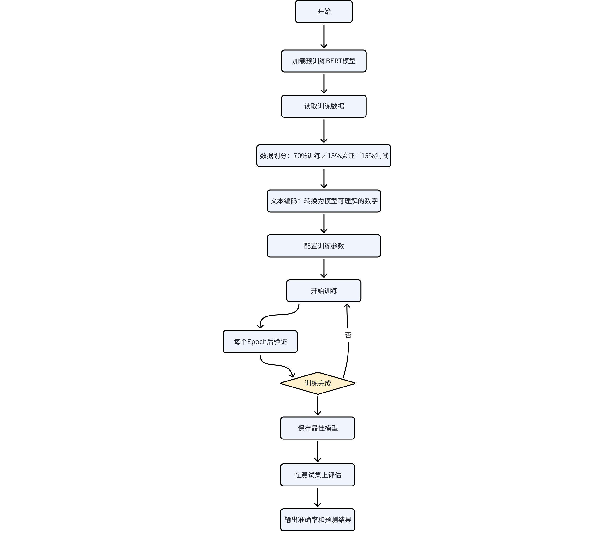
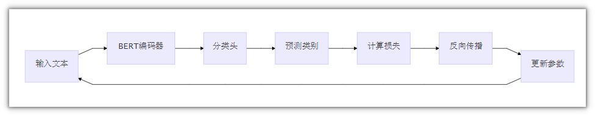
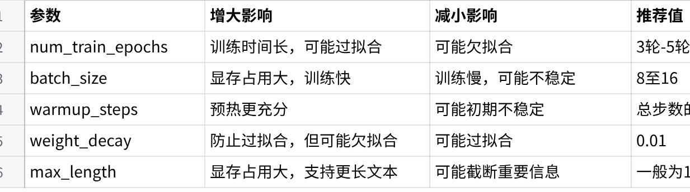

---
tags:
  - BERT
  - 微调
  - NLP
  - EduRAG
title: BERT微调
description: BERT 微调原理、文本分类、FAQ 意图识别微调实战
date: 2025-06-22
sources:
  - 黑马课程讲义: EduRAG项目
---

# bert微调

## 1. 什么是BERT微调？

### 1.1 简单理解

BERT就像一个已经读过大量中文书籍的"学霸"，它已经掌握了中文语言的基本规律。但是，如果我们想让这个学霸专门解决某个特定问题（比如判断一个问题是"通用知识"还是"专业咨询"），就需要给它一些针对性的训练，这个过程就叫**微调（Fine-tuning）**。

### 1.2 为什么需要微调？

**预训练模型**：BERT已经学会了理解中文，但不知道如何做分类任务

**微调**：在预训练的基础上，用我们的数据教会它做二分类（通用知识 vs 专业咨询）

**优势**：不需要从零训练，节省时间和计算资源训练流程详解

整理流程



## 2. 数据准备阶段

### 2.1 数据格式

数据文件 abc.json 采用JSONL格式（每行一个JSON对象）：

```json
{"query": "Python课程学什么？", "label": "专业咨询"}
{"query": "今天星期几？", "label": "通用知识"}

```

### 2.2 数据划分

训练集: 70% # 用于模型学习

验证集: 15% # 用于调整超参数，监控训练过程

测试集: 15% # 用于最终评估，模拟真实场景

```
也可以划分为：8:1:1

```

**为什么这样划分？**

训练集要足够大，让模型学到规律

验证集帮助我们发现过拟合（模型在训练集上表现好，但验证集表现差）

测试集是"期末考试"，只在最后使用，确保评估结果真实

## 3. 文本编码阶段

BERT不能直接理解文字，需要转换成数字：

```json
原始文本: "Python课程学什么？"
↓
分词: ["Python", "课程", "学", "什么", "？"]
↓
编码: [101, 1234, 5678, 9012, 3456, 7890, 102]
↓
输入模型

```

**关键参数：max_length=128**

限制文本最大长度为128个token（词）

超过的会被截断，不足的会用特殊符号填充

128是平衡效果和速度的常用值

## 4. 模型训练阶段



## 5. 重要参数说明

**🎯 核心训练参数**

**1. num_train_epochs = 3**

**含义**：训练轮数，模型会完整遍历训练集3次

**调参建议**：

太少（1-2轮）：模型可能没学充分

太多（10+轮）：容易过拟合，浪费时间

**推荐**：3-5轮，观察验证集指标决定是否继续

**2. per_device_train_batch_size = 8**

**含义**：每次训练时，每个设备（GPU/CPU）处理的样本数量

**调参建议**：

太小（1-4）：训练慢，梯度不稳定

太大（32+）：显存可能不够

**推荐**：根据显存调整，8-16是常见选择

**显存不足时**：减小batch_size，或使用梯度累积

**3. warmup_steps = 50**

**含义**：学习率预热步数，前50步学习率从0逐渐增加到设定值

**为什么需要？**

没有预热：学习率突然很大 → 训练初期不稳定 → 可能学偏

有预热：学习率慢慢增加 → 训练更稳定 → 效果更好

**调参建议**：

小数据集：10-50步

大数据集：500-1000步

**经验公式**：总训练步数的10%

**4. weight_decay = 0.01**

**含义**：权重衰减系数，防止模型过拟合

**简单理解**：

过拟合 = 模型"死记硬背"训练数据，不会举一反三

weight_decay = 给模型参数加"约束"，让它学得更"通用"

**调参建议**：

0.01是常用值

过拟合严重时：增加到0.1

欠拟合时：减小到0.001

**5. max_length = 128**

**含义**：输入文本的最大长度（token数）

**调参建议**：

短文本任务（如分类）：128足够

长文本任务（如文档分类）：512（BERT最大支持）

> ⚠️ **注意**：长度越长，计算量越大，显存占用越多

**6. evaluation_strategy = "epoch"**

**含义**：每个epoch结束后在验证集上评估一次

**可选值**：

"no"：不评估

"steps"：每隔N步评估（需配合eval_steps）

"epoch"：每个epoch评估（推荐）

**7. load_best_model_at_end = True**

**含义**：训练结束后，自动加载验证集上表现最好的模型

**为什么重要？**

训练过程中，模型可能先变好再变差（过拟合）

这个参数确保我们得到的是"最佳状态"的模型，而不是最后一轮可能已经过拟合的模型

**8. metric_for_best_model = "eval_loss"**

**含义**：用于判断"最佳模型"的指标

**可选值**：

"eval_loss"：验证集损失（越小越好）

"eval_accuracy"：验证集准确率（越大越好）

**选择建议**：

分类任务：通常用eval_accuracy

如果准确率波动大：用eval_loss更稳定

**9. save_total_limit = 1**

**含义**：最多保存1个模型检查点

**作用**：节省磁盘空间，只保留最佳模型

**📊 参数影响总结表**



**点击图片可查看完整电子表格**

## 6. 常见问题解答

**Q1: 训练时显存不足怎么办？**

**解决方案**：

减小 batch_size（如从8改为4）

减小 max_length（如从128改为64）

使用梯度累积（在代码中添加 gradient_accumulation_steps）

**Q2: 模型在训练集上准确率高，但测试集上低？**

**这是过拟合！**

增加 weight_decay（如0.01 → 0.1）

减少 num_train_epochs

增加训练数据量

使用数据增强

**Q3: 训练很慢怎么办？**

**优化建议**：

使用GPU（如果有）

增大 batch_size（在显存允许范围内）

减小 max_length

使用混合精度训练（fp16=True，需要支持的GPU）

**Q4: 如何判断模型训练好了？**

**观察指标**：

验证集准确率不再提升（甚至下降）→ 可能过拟合，可以停止

验证集准确率持续上升 → 可以继续训练

训练损失和验证损失都降到很低且稳定 → 训练完成

## 7. 总结

**训练流程三要素**

**数据**：质量好、数量足、格式对

**参数**：根据任务和数据调整，不要盲目使用默认值

**评估**：用独立的测试集，确保结果真实

**微调成功的关键**

✅ 数据划分合理（训练/验证/测试）

✅ 参数设置得当（特别是学习率、batch_size、epochs）

✅ 及时监控验证集指标，防止过拟合

✅ 使用最佳模型进行最终评估


---

## 相关笔记

- [[AI大模型开发总览|AI大模型开发总览]]
- [[1 环境搭建和Milvus向量数据库|环境搭建和Milvus向量数据库]]
