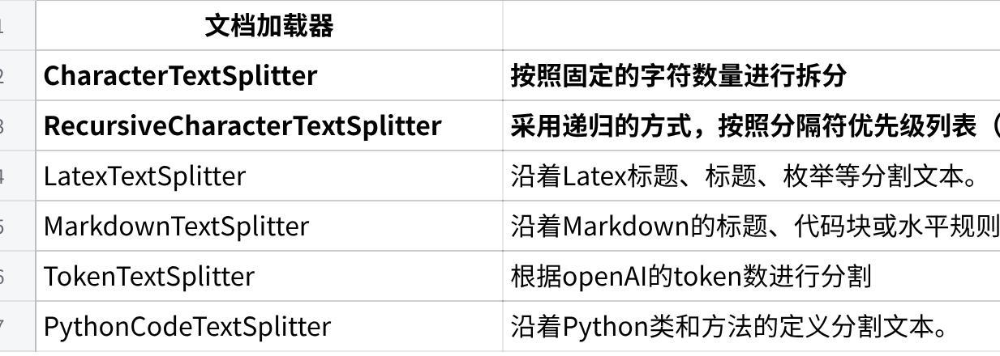

## 01-Python基础
## 1 Python介绍
### 1.1 基本特点
Python是一门**面向对象**的**解释型**编程语言
1989年吉多·范罗苏姆（龟叔）发明，1991年公开版本发行
Python3.X 在2008年发布，为了不带来过多的累赘，没有考虑兼容Python2.X
应用：科学计算、自然语言处理、图形图像处理、脚本开发、Web 应用；TIOBE排名第一
设计哲学：优雅，明确，简单，可读性强，宣言：**人生苦短，我用pyhon**
### 1.2 应用领域
数据科学与人工智能（AI）
机器学习/深度学习：这是Python目前最火热的领域。拥有TensorFlow, PyTorch等顶级框架
数据分析与可视化：Pandas（数据处理和分析），NumPy（科学计算），Matplotlib, Seaborn（数据可视化）是事实上的行业标准工具
自然语言处理（NLP）：NLTK, spaCy等库提供了强大的支持
Web开发
后端开发：Django（"全能型"框架，内置众多功能，适合大型项目）、Flask（轻量级微框架，灵活自由）、FastAPI（现代高性能框架，非常适合构建API）
网络爬虫：Scrapy、Beautiful Soup等库使得爬取网络数据变得非常简单
自动化运维与DevOps
> 可以轻松编写自动化脚本（如批量文件处理、部署、监控等），并且是很多运维工具（如Ansible, SaltStack）的实现语言
自动化测试
Selenium（Web UI自动化）、Appium（APP自动化）等工具都支持Python，自动化测试工程师的重要工具
## 2 环境搭建
### 2.1 Python解释器
Python是一种解释性语言，也就是一边解释，一边执行，而负责解释工作的就是python解释器，通常有下面几种：
**CPython：**官方提供的解析器，C语言实现的，也是最常用的Python实现
JPython：Java语言实现的Python解析器，将Python代码编程成Java字节码执行
IronPython：运行在微软Net平台上的Python解析器，直接把Python代码编译成Net字节码
PyPy：使用Python语言实现的Python解析器
### 2.2 安装Anaconda
Anaconda（水蟒）：是一个科学计算软件发行版，内置了CPython，并且还集成了大量常用扩展包
包含了 180 多个科学计算包及其依赖项，并且支持在一台电脑上运行多个pyhon环境
官方地址： https://www.anaconda.com/
### 2.3 安装PyCharm
PyCharm是专用于Python开发的工具，类似于Java的开发工具IDEA
安装PyCharm
从IDEA中导出常用配置，导入到PyCharm中
### 2.4 创建python项目
使用命令行创建一个python的基础**环境**，并切换到新环境
```
  Shell
  # 0) 查看目前安装了的环境
  conda env list
  # 1） 新建环境 conda create -n 环境名称 python=python版本
  conda create -n py_base python=3.10
  #2）激活新环境中
  # conda activate py_base
  #） 环境也可以暂时停用和删除
  # conda deactivate
  # conda env remove -n 环境名称
```
开pyCharm，创建一个新的项目， 注意选择conda环境
## 3 基础语法
### 3.1 入门案例
在项目中创建一个目录
在目录中创建一个入门的python文件
在python文件中编写一个输出`Hello World`的程序，并执行

### 3.2 基本语法
#### 3.2.1 注释
单行注释：以#开头，#右边的所有文字当作说明
多行注释："""内容"""，三个引号 （单引号或者双引号都可以）引起来的内容作为对代码的解释说明，内容可以换行
```
  Python
  01-注释
  *# 单行注释*
  print("这是单行注释")
  """
  多行注释
  """
  print("这是多行注释")
```
#### 3.2.2 变量
变量是存储数据的容器，定义格式：变量名 = 变量的值
变量的命名规则：① 必须由字母、数字、下划线组成 ② 不能以数字开头 ③ 严格区分大小写 ④ 不能使用内置关键字 ⑤ 推荐使用_分割单词而不是使用驼峰
```
  Python
  02-变量
  """*
  *变量是存储数据的容器，定义格式：变量名 = 变量的值*
  *变量的命名规则：*
  * ① 必须由字母、数字、下划线组成*
  * ② 不能以数字开头*
  * ③ 严格区分大小写*
  * ④ 不能使用内置关键字*
  * ⑤ 推荐使用_分割单词而不是使用驼峰*
  *"""*
  *# 使用变量定义一个学生的姓名、年龄、性别; 并打印*
  *# 变量名 = 变量的值*
  *name = "张三"*
  *age = 18*
  *gender = "男"*
  *print(name, age, gender) # 张三 18 男
```
#### 3.2.3 基础数据类型
python的基础数据类型有四种，分别是：
Int 整数类型
Float 浮点类型
Boolean 布尔类型
String 字符串类型
注意：
使用type(变量名) 可以查看变量的数据类型
python属于弱类型语言**，**变量的数据类型可以根据上下文自动改变
```
  Python
  03-基础数据类型
  """
  python的基础数据类型有四种，分别是：
  - Int 整数类型
  - Float 浮点类型
  - Boolean 布尔类型
  - String 字符串类型
  注意：
  1. 使用type(变量名) 可以查看变量的数据类型
  2. python属于弱类型语言，变量的数据类型可以根据上下文自动改变
  """
  # 定义四种类型变量
  a = 10
  b = 10.05
  c = True
  d = "哈哈"
  # 1. 使用type(变量名) 可以查看变量的数据类型
  print(a, type(a)) # 10 \<class 'int'\>
  print(b, type(b)) # 10.05 \<class 'float'\>
  print(c, type(c)) # True \<class 'bool'\>
  print(d, type(d)) # 哈哈 \<class 'str'\>
  # 2. python属于弱类型语言，变量的数据类型可以根据上下文自动改变
  d = 15
  print(d, type(d)) # 15 \<class 'int'\>
```
### 3.3 运算符
Python支持多种运算操作，主要包括：算术运算、比较运算和赋值运算、逻辑运算符等等
#### 3.3.1 算术运算符
\+ 加法
\- 减法
\* 乘法
/ 除法，类似于自然计算中的除法, 返回数据类型为float浮点类型 10 / 4 = 2.5
// 整除法，两数相除,保留整数部分 10 / 4 = 2
\*\* 幂指数，如2的3次方，2 \*\* 3
\% 取模（求余运算）
案例：
```
  Python
  01-算术运算符
  """*
  *算数运算符:*
  * 基本符号: + 加法 - 减法 \* 乘法 % 取模（求余运算）*
  * / 除法，类似于自然计算中的除法*
  * // 整除法，两数相除,保留整数部分*
  * \*\* 幂指数，如2的3次方，2 \*\* 3*
  *"""
  *# 定义 变量a、b,分别赋值10、4 然后分别测试各个运算符
  *a = 10*
  *b = 4*
  *print(a + b) # 14*
  *print(a - b) # 6*
  *print(a \* b) # 40*
  *print(a / b) # 2.5*
  *print(a // b) # 2*
  *print(a % b) # 2*
  *print(a \*\* b) # 10000
```
#### 3.3.2 比较运算符
用于比较两个值，返回布尔结果（True 或 False）：
示例代码：
```
  Python
  02-比较运算符
  *"""*
  *比较运算符*
  *== 等于 != 不等于*
  *\> 大于 \< 小于*
  *\>= 大于等于 \<= 小于等于*
  *"""*
  a, b, c = 1, 2, 1
  print(a == c) *# True*
  print(a != c) *# False*
  print(a \> c) *# False*
  print(a \< c) *# False*
  print(a \>= c) *# True*
  print(a \<= c) *# True*
```
#### 3.3.3 赋值运算符
除了基本的 =，Python 还支持复合赋值运算符：
示例代码：
```
  Python
  03-赋值运算符
  *"""*
  *赋值运算符*
  *+= : a = a + b \-\-\--\> a += b*
  *-= : a = a - b \-\-\--\> a -= b*
  *\*= : a = a \* b \-\-\--\> a \*= b*
  */= : a = a / b \-\-\--\> a /= b*
  *"""*
  a, b = 2, 1
  a += b
  print(a) *# 3*
  a -= b
  print(a) *# 2*
  a \*= b
  print(a) *# 2*
  a /= b
  print(a) *# 2.0*
  a //= b
  print(a) *# 2.0*
```
#### 3.3.4 逻辑运算符
逻辑运算符用于组合多个比较条件，常用于 if 判断等场景。Python 提供了三个逻辑运算符：
```
  Python
  04-逻辑运算符
  """
  and 与（且） A and B 两个条件都为 True，结果才为 True
  or 或 A or B 任意一个为 True，结果就为 True
  not 非（取反） not A 如果 A 是 True，结果为 False，反之亦然
  """
  # and 与（且） A and B 两个条件都为 True，结果才为 True
  print(True and True) # True
  print(True and False) # False
  print(False and False) # False
  print("=" \* 40)
  # or 或 A or B 任意一个为 True，结果就为 True
  print(True or True) # True
  print(True or False) # True
  print(False or False) # False
  print("=" \* 40)
  # not 非（取反） not A 如果 A 是 True，结果为 False，反之亦然
  print(not True) # False
  print(not False) # True
```
### 3.4 输入与输出
#### 3.4.1 输入input()
在Python中，可以使用input()函数接受用户的输入信息，如果用户没有输入任何内容，则input()函数处于等待状态，直到用户输入结束
input()函数的返回值就是用户的输入的内容，**输入内容的类型为字符串类型**
```
  Python
  变量名称 = input('提示信息：')
  Python
  01-输入.py
  """
  在Python中，可以使用input()方法接受用户的输入信息，如果用户没有输入任何内容，则input()函数处于等待状态，直到用户输入结束。
  input()方法的返回值就是用户的输入的内容，输入内容的类型为字符串类型; 如果需要其它类型,需要自行转换
  """
  # 从控制台接收名字和年龄 并将输入的值和类型打印在控制台
  name = input("请输入您的名字:")
  age = input("请输入您的年龄:")
  print(name, type(name)) # 张三 \<class 'str'\>
  print(age, type(age)) # 19 \<class 'str'\>
  # 如果需要其它类型,需要自行转换
  age = int(age)
  print(age, type(age)) # 19 \<class 'int'\>
```
#### 3.4.2 输出print()
在Python代码中，我们可以使用print()函数实现变量或数据的打印输出
完整写法 print(变量或内容, **sep**='分隔符', **end**='结束符')
参数一：可变参数，可以输出1个或多个值
参数二：sep 分隔符，默认为空格
参数三：end 结束符 默认为 \\n 换行
在Python中，print()不仅可以实现普通变量的打印输出，还可以使用f形式对其进行格式化输出，基本语法：
```
  Python
  print(f'xxx{变量名称}xxx')
  Python
  02-输出
  """
  在Python代码中，我们可以使用print()函数实现变量或数据的打印输出
  完整写法 print(变量或内容, sep='分隔符', end='结束符')
  - 参数一：可变参数，可以输出1个或多个值
  - 参数二：sep 分隔符，默认为空格
  - 参数三：end 结束符 默认为 \\n 换行
  在Python中，print()不仅可以实现普通变量的打印输出，还可以使用f形式对其进行格式化输出，基本语法：
  print(f'xxx{变量名称}xxx')
  """
  # print(变量或内容, sep='分隔符', end='结束符')
  print("张三", "李四", "王五", sep=",", end="!\\n")
  print("=" \* 40)
  # 在Python中，print()不仅可以实现普通变量的打印输出，还可以使用f形式对其进行格式化输出，基本语法：
  # print(f'xxx{变量名称}xxx')
  name = "张三"
  age = 18
  money = 1000.125
  print(f"我的名字是{name},我的年龄是{age},我的零花钱有{money:.2f}")
```
### 3.5 分支结构
#### 3.5.1 if条件判断
+-----------------------------------+-----------------------------------+
| if\...else                        | if\...elif\...else                |
|                                   |                                   |
| if 条件:                          | if xxx1:                          |
|                                   |                                   |
| 满足条件时要做的事情              | 满足条件时要做的事情              |
|                                   |                                   |
| else:                             | elif xxx2:                        |
|                                   |                                   |
| 不满足条件时要做的事情            | 满足条件时要做的事情              |
|                                   |                                   |
|                                   | else:                             |
|                                   |                                   |
|                                   | 其他                              |
+-----------------------------------+-----------------------------------+
```
  Python
  02-if分支结构
  """
  1) 单分支结构
  if 判断条件:
  分支代码
  2) 多分支结构
  if 判断条件:
  分支代码
  else:
  分支代码
  3) 多分支结构
  if 判断条件:
  分支代码
  elif 判断条件
  分支代码
  else
  分支代码
  """
  # 案例1: 写一个网吧登录的程序, 年满18岁就可以上网,不满18岁就不可以上网
  # age = int(input("请输入您的年龄:"))
  # if age \>= 18:
  # print("可以上网")
  # else:
  # print("不可以上网")
  # 案例2：提示用户输入用户的年龄信息，18岁以下提示童工一枚；18-60周岁提示合法工龄；超过60提示退休年龄
  age = int(input("请输入您的年龄:"))
  if age \< 18:
  print("童工一枚")
  elif 18 \<= age \<= 60:
  print("合法工龄")
  else:
  print("退休年龄")
```
#### 3.5.2 三目运算符
在Python中三目运算符也叫三元运算符，其主要作用：**就是用于简化if\...else\...语句**。

---
## 相关笔记
- [[AI大模型开发基础-02-Python基础]] — 面向对象编程
- [[AI大模型开发基础-03-Python-Web]] — Python Web开发
- MOC: [[MOC-日常学习]]