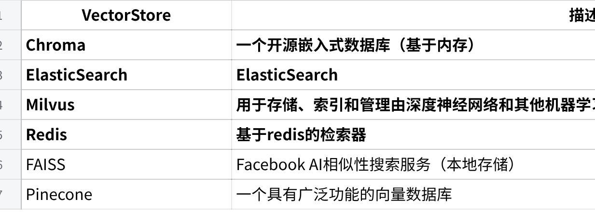

## 03-Python-Web
## 1 web开发
### 1.1 FastAPI
#### 1.1.1 介绍
FastAPI是一个用于构建 API 的现代、快速（高性能）的 web 框架
**文档**： [https://fastapi.tiangolo.com](https://fastapi.tiangolo.com/)
**源码**： <https://github.com/fastapi/fastapi>
## 关键特性:
**快速**：可与 **NodeJS** 和 **Go** 并肩的极高性能
**高效编码**：提高功能开发速度约 200％ 至 300％。
**更少 bug**：减少约 40％ 的人为（开发者）导致错误。
**智能**：极佳的编辑器支持。处处皆可自动补全，减少调试时间。
**简单**：设计的易于使用和学习，阅读文档的时间更短。
**简短**：使代码重复最小化。通过不同的参数声明实现丰富功能。bug 更少。
**健壮**：生产可用级别的代码。还有自动生成的交互式文档。
**标准化**：基于（并完全兼容）API 的相关开放标准：[OpenAPI](https://github.com/OAI/OpenAPI-Specification) (以前被称为 Swagger) 和 [JSON Schema](https://json-schema.org/)。
#### 1.1.2 依赖安装
```
  Bash
  # 类似于SpringMVC的web框架
  pip install fastapi
  # 类似于Tomcat的中间件服务器
  pip install "uvicorn\[standard\]"
```
#### 1.1.3 入门代码
```
  Python
  main.py
  # 导入了Union(web服务器)和FastAPI(web框架)
  from typing import Union
  from fastapi import FastAPI
  # 创建了FastAPI对象, 起名叫app
  app = FastAPI()
  # 定义请求方式和路径
  \@app.get("/")
  async def read_root():
  return {"Hello": "World"}
  # http://127.0.0.1:8000/items/123?q=你好
  # 方式: get
  # 路径: /items/{item_id} {item_id} 路径参数
  \@app.get("/items/{item_id}")
  # 参数1: int 类型的 item_id
  # 参数2: Union\[str, None\] = None 类型的 q 可以接收str或者是None类型的参数, 默认值是None
  async def read_item(item_id: int, q: Union\[str, None\] = None):
  return {"item_id": item_id, "q": q}
```
#### 1.1.4 运行服务
运行服务有两种主要方式：
命令行方式：在主文件所在目录运行下面命令 uvicorn main:app \--reload
> 
mian方式：在主文件中添加下面内容，然后直接main方法运行
```
  Python
  if \_\_name\_\_ == "\_\_main\_\_":
  uvicorn.run(app, host="127.0.0.1", port=8000)
```
使用浏览器访问 <http://127.0.0.1:8000/items/5?q=somequery> 将会看到如下 JSON 响应：
```
  Bash
  {"item_id": 5, "q": "somequery"}
```
#### 1.1.5 接收参数
pydantic是一个基于Python类型注解的数据验证与解析库，支持自动校验、类型转换、嵌套模型、导入导出、配置管理等功能
它广泛用于数据清洗、API 参数校验、配置系统构建，尤其是FastAPI等现代Web框架的核心组件之一
现在修改main.py文件借助Pydantic来从PUT请求中接收请求体
```
  Python
  from typing import Union
  import uvicorn
  from fastapi import FastAPI
  from pydantic import BaseModel
  app = FastAPI()
  # 类似于Dto
  class Item(BaseModel):
  name: str
  price: float
  is_offer: Union\[bool, None\] = None
  \@app.get("/")
  async def read_root():
  return {"Hello": "World"}
  \@app.get("/items/{item_id}")
  async def read_item(item_id: int, q: Union\[str, None\] = None):
  return {"item_id": item_id, "q": q}
  \@app.put("/items/{item_id}")
  async def update_item(item_id: int, item: Item):
  return {"item_name": item.name, "item_id": item_id}
  if \_\_name\_\_ == "\_\_main\_\_":
  uvicorn.run(app, host="0.0.0.0", port=8000)
```
### 1.2 web案例
使用FastAPI和PyMySQL来完成博客系统的**增删改查**
该前端在当天资料中，是一个html，用浏览器打开即可访问后端接口

#### 1.2.1 创建项目
根据下面说明创建一个项目，并准备创建对应的文件
```
  Bash
  b_blog_pro/
  ├── .env # 配置文件，包含所有模块的配置
  ├── blog_dao.py # 封装操作mysql数据库的方法
  ├── main.py # FastAPI 暴露对外访问的接口
  ├── requirements.txt # 依赖文件
```
**requirements.txt**：项目的依赖文件，执行 pip install -r requirements.txt 可以安装配置
```
  Bash
  # 项目依赖
  # Usage: pip install -r requirements.txt
  fastapi==0.119.0
  uvicorn==0.37.0
  SQLAlchemy==2.0.39
  PyMySQL==1.1.1
  python-dotenv==1.1.1
```
**.env：**在文件中新增MySQL的配置
```
  Bash
  *# MySQL链接*
  MySQL_HOST="localhost"
  MySQL_PORT=3306
  MySQL_USER="root"
  MySQL_PASSWORD="root"
  MySQL_DATABASE="blog_db"
  MySQL_CHARSET="utf8"
```
**blog_dao.py：**在文件中添加blog增删改查的方法
```
  Python
  import pymysql
  *# 操作博客表的工具类*
  class BlogDao:
  def \_\_init\_\_(self):
  self.cursor = None
  self.connect = None
  *# 创建客户端*
  def create_client(self):
  *# 1. 创建连接*
  self.connect = pymysql.connect(
  host="localhost",
  port=3306,
  user="root",
  password="root",
  database="blog_db",
  charset="utf8")
  *# 2. 获取游标*
  self.cursor = self.connect.cursor()
  *# 关闭客户端*
  def close_client(self):
  self.cursor.close()
  self.connect.close()
  *# 新增*
  def insert_blog(self, title, content, author):
  try:
  self.create_client()
  *# 3. 编写SQL并执行*
  sql = "insert into blog_posts(title,content,author) values(%s,%s,%s)"
  self.cursor.execute(sql, (title, content, author))
  *# 4. 提交事务*
  self.connect.commit()
  *# 5. 处理结果(id)*
  return self.cursor.lastrowid
  except Exception as e:
  self.connect.rollback()
  raise Exception(f"操作失败{e}")
  finally:
  *# 6. 释放资源*
  self.close_client()
  *# 查询所有博客*
  def find_all_blog(self):
  try:
  *# 1. 创建连接*
  self.create_client()
  *# 2. 编写SQL并执行*
  sql = "select \* from blog_posts"
  self.cursor.execute(sql)
  *# 3. 处理结果(id)*
  return \[Blog(\*row) for row in self.cursor.fetchall()\]
  except Exception as e:
  raise Exception(f"操作失败{e}")
  finally:
  *# 4. 释放资源*
  self.close_client()
  *# 主键查询*
  def find_blog_by_id(self, id):
  try:
  *# 1. 创建连接*
  self.create_client()
  *# 2. 编写SQL并执行*
  sql = "select \* from blog_posts where id=%s"
  self.cursor.execute(sql, id)
  *# 3. 返回结果*
  row = self.cursor.fetchone()
  return Blog(\*row)
  except Exception as e:
  raise Exception(f"操作失败{e}")
  finally:
  *# 4. 释放资源*
  self.close_client()
  *# 根据id更新内容*
  def update_blog(self, id, title, content, author):
  try:
  self.create_client()
  *# 3. 编写SQL并执行*
  sql = "update blog_posts set title = %s ,content = %s,author = %s where id = %s"
  rows = self.cursor.execute(sql, (title, content, author, id))
  *# 4. 提交事务*
  self.connect.commit()
  *# 5. 处理结果(影响行数)*
  return rows
  except Exception as e:
  self.connect.rollback()
  raise Exception(f"操作失败{e}")
  finally:
  *# 6. 释放资源*
  self.close_client()
  *# 根据id删除*
  def delete_blog(self, id):
  try:
  self.create_client()
  *# 3. 编写SQL并执行*
  sql = "delete from blog_posts where id = %s"
  rows = self.cursor.execute(sql, id)
  *# 4. 提交事务*
  self.connect.commit()
  *# 5. 处理结果(影响行数)*
  return rows
  except Exception as e:
  self.connect.rollback()
  raise Exception(f"操作失败{e}")
  finally:
  *# 6. 释放资源*
  self.close_client()
  *# 实体类*
  class Blog:
  def \_\_init\_\_(self, id, title, content, author, created_at, updated_at):
  self.id = id
  self.title = title
  self.content = content
  self.author = author
  self.created_at = created_at
  self.updated_at = updated_at
  def \_\_str\_\_(self):
  return f'Blog {self.id}, {self.title}'
```
## 替换配置
load_dotenv() 会从项目根目录的 .env 文件（默认路径）中读取键值对，并将这些变量注入到 Python 的运行时环境变量（即 `os.environ`）中
避免在代码中硬编码敏感信息（如数据库密码、API 密钥），提升安全性

#### 1.2.2 实现代码
定义main.py中新增查询所有博客的接口
```
  Python
  from typing import Union
  import uvicorn
  from fastapi import FastAPI
  from pydantic import BaseModel
  from starlette.middleware.cors import CORSMiddleware
  from blog_dao import BlogDao
  app = FastAPI()
  *# CORS 解决跨域问题*
  app.add_middleware(
  CORSMiddleware,
  allow_origins=\["\*"\],
  allow_credentials=True,
  allow_methods=\["\*"\],
  allow_headers=\["\*"\],
  )
  *# DTO*
  class Blog(BaseModel):
  author: str
  title: str
  content: str
  *# 查询所有*
  \@app.get("/posts")
  async def find_all():
  try:
  return BlogDao().find_all_blog()
  except Exception as e:
  raise Exception(e)
  *# 主键查询*
  \@app.get("/posts/{post_id}")
  async def find_by_id(post_id: int):
  try:
  return BlogDao().find_blog_by_id(post_id)
  except Exception as e:
  raise Exception(e)
  *# 新增*
  \@app.post("/posts")
  async def save(blog: Blog):
  try:
  BlogDao().insert_blog(blog.title, blog.content, blog.author)
  return {"status": 200, "msg": "新增成功"}
  except Exception as e:
  print(e)
  return {"status": 500, "msg": "新增失败"}
  *# 更新*
  \@app.put("/posts/{id}")
  async def save(id: int, blog: Blog):
  try:
  BlogDao().update_blog(id, blog.title, blog.content, blog.author)
  return {"status": 200, "msg": "修改成功"}
  except Exception as e:
  print(e)
  return {"status": 500, "msg": "修改失败"}
  *# 删除*
  \@app.delete("/posts/{post_id}")
  async def save(post_id: int):
  try:
  BlogDao().delete_blog(post_id)
  return {"status": 200, "msg": "删除成功"}
  except Exception as e:
  print(e)
  return {"status": 500, "msg": "删除失败"}
  if \_\_name\_\_ == "\_\_main\_\_":
  uvicorn.run(app, host="127.0.0.1", port=8000)
```
## 2 提示词工程
### 2.1 介绍
提示词工程（Prompt Engineering）是一种通过给大模型发送精心设计的提示词来引导大模型做出更符合人类预期操作的技术
提示词往往需要清晰明确地表达需求，并提供充足上下文，以使语言模型准确理解我们的意图
面向超大规模的模型的微调方法主要有下面几种：
上下文学习法 In-Context Learning：直接挑选少量的样本作为该任务的提示
指令学习法 Instruction-Tuning：构建任务指令集，促使模型根据任务指令做出反馈
思维链法 Chain-of-Thought：给予或激发模型具有推理和解释的信息，通过线性链式的模式指导模型生成合理的结果
#### 2.1.1 上下文学习法
上下文学习法是直接在提供给模型的输入文本中，嵌入少量任务相关的输入-输出示例，但不包含任何明确的指令告诉模型"现在要做这个任务"
模型通过观察这些上下文中的示例模式，推断出当前任务的要求，并对新的输入生成相应的输出
根据提供的输入-输出示例的数量，又可以细分为下面三种情况：
**Zero-shot：**给出任务的描述, 不提供任何示例，直接让大模型执行任务
**One-shot：**给出任务描述，提供一个示例，然后让大模型执行任务
**Few-shot：**给出任务描述，提供N个示例，然后让大模型执行任务

#### 2.1.2 指令学习法
指令学习法本质上是对下游任务的指令，简单的来说：就是告诉模型需要做什么任务，输出什么内容
因此, 在对大规模模型进行微调时, 可以为各种类型的任务定义指令, 并进行训练，来提高模型对不同任务的泛化能力
#### 2.1.3 思维链法
思维链 (Chain-of-thought，CoT) 是一种改进的提示策略，用于提高 LLM 在复杂推理任务中的性能，如算术推理、常识推理和符号推理.
相比于之前传统的上下文学习，思维链多了具体的步骤
下面是思维链法的一个案例

#### 2.1.4 总结对比
三种方法可结合使用（如用ICL提供示例，CoT引导推理，Instruction约束输出格式），形成更强大的Prompt-Tuning策略
### 2.2 案例
当前金融领域数据大量激增, 如何从繁杂的数据中获取有效的信息, 进而帮助投资者或者研究者减少决策失误带来的损失，成为金融数据分析方法研究的热门话题
人工智能技术的应用可以为金融企业提供更高效、精准的服务，也可以帮助投资者更好的地进行投资决策
风险评估：通过AI技术识别出不同金融风险事件类型、反欺诈行为等风险，提高贷款的准确性和风险控制能力
投资决策：通过AI技术对历史数据、财务报表等信息分析，为投资者提供精准的投资决策支持
客户服务：通过AI技术，实现智能客服等功能，进而为客户提供便捷而又准确的答案
---
## 相关笔记
- [[AI大模型开发基础-01-Python基础]] — Python基础
- [[AI大模型开发基础-02-Python基础]] — Python面向对象
- MOC: [[MOC-日常学习]]