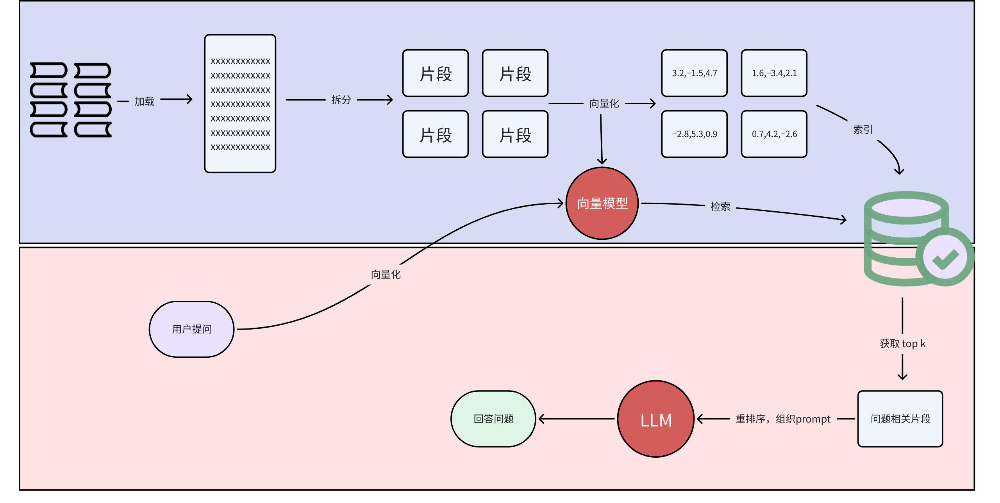
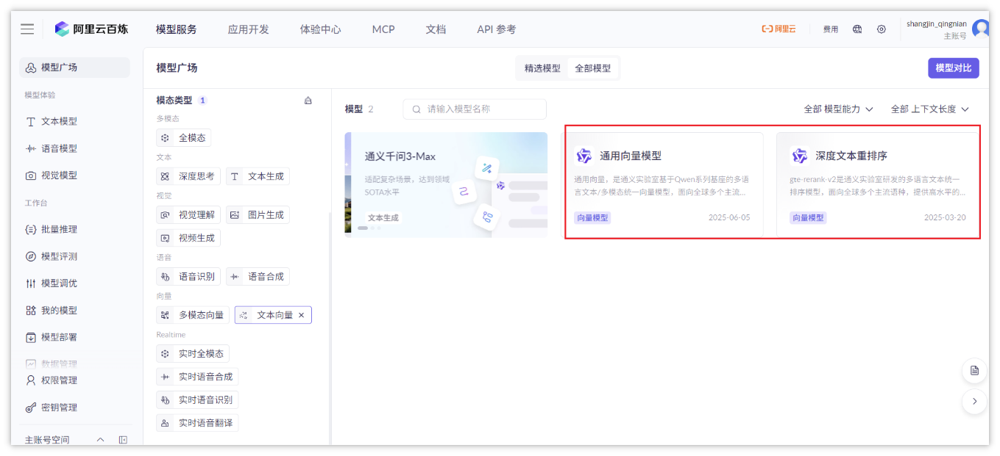
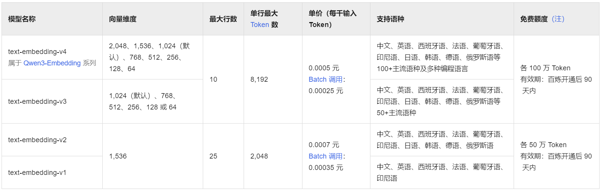

## 05-LangChain
### 1. Index组件
大模型处理用户问题是可能存在**幻觉**的，大模型幻觉指的是大型语言模型生成的内容看似流畅、合理，但实际上与输入信息不符、违背事实或纯粹是编造的现象
幻觉产生的根源与大模型的本质及工作原理有关，它并非连接"事实数据库"的搜索引擎，而是基于概率的"模式匹配与文本生成引擎"，主要原因如下：
大模型中的知识是靠学习海量数据统计规律来完成，而非核查事实
训练大模型时数据可能不完美、缺失、陈旧
大模型对物理世界无真实体验理解，只学过相关概念，就可能生成物理上不可能或逻辑荒谬的内容
提示词问题诱导模型产生幻觉
目前业界解决幻觉问题最主流、最有效的技术路径就是**大模型微调**和**RAG(检索增强生成)**
**微调：**把预训练好的大模型看作一个具备了通用知识的大学生，微调就是让这个大学生去深入学习某一专业领域（如法律、医疗）的知识，从而成为该领域的专家
**RAG：**在模型生成答案之前，先从外部知识源（如公司内部文档、数据库、最新网页等）检索相关信息，然后将这些信息作为上下文和用户问题一起交给大模型
> 要求模型根据这些给定的、可信的信息来生成答案
今天我们重点来介绍RAG来解决大模型幻觉问题，工作原理如下图：

## 上半部分：知识库构建（数据预处理）
**加载文档：**将原始的源文档加载到系统中，转化为可处理的文本格式（从不可读的文件变为纯文本字符串）
**拆分文档：**把长文本切分成语义连贯的小片段，因为LLM有上下文长度限制，且长文本直接向量化会丢失细节（长文本 → 多个\[片段1, 片段2, \...\]）
**向量化：**用向量模型将文本片段转化为稠密向量（数值数组，向量的作用是用"数学距离"表示文本语义相似度）
**索引：**将所有文本片段的向量存储到向量数据库，并建立**"向量→原始文本片段"**的映射
## 下半部分：用户问答（在线推理）
**用户提问向量化：**用户输入问题后，用同一个向量模型将问题转化为向量
**检索：**在向量数据库中，计算问题向量与所有文档向量的相似度，筛选出最相关的Top K个文本片段
**重排序与Prompt构建：**对检索到的片段进行**二次排序**，然后将这些片段组织成LLM能理解的提示词
**LLM生成答案：**将构建好的提示词输入LLM，让LLM结合"外部知识片段"和"自身能力"生成答案
**回答问题：**将LLM生成的答案返回给用户
针对于RAG的整个流程，在LangChain中提供了Indexes组件，它可以完成文档的处理，包括：文档加载、向量化、检索等
并且文档不局限于txt、pdf等文本类内容，还涵盖email、区块链、视频等内容
Indexs组件的主要组成部分有：文档加载器、文本分割器、文本向量化、文本存储和检索器
### 1.1 文档加载器
LangChain中提供了多种文件格式的加载器，常见有：txt、pdf、csv、markdown、json、html等等，常见的加载器API:
TextLoader txt格式
PyPDFLoader pdf格式
UnstructuredMarkdownLoader md格式
CSVLoader csv格式
我们今天仅仅介绍上面四种，其他的自行查看官方文档：https://docs.langchain.com/oss/python/integrations/document_loaders
根据官方文档，所有的api使用步骤大同小异，基本就是下面几个步骤：
```
  Python
  *# 1）导包*
  from langchain_community.document_loaders import TextLoader
  *# 2）定义加载器对象*
  text_loader = TextLoader(file_path="abc.txt"*,*encoding="utf-8")
  *# 3）加载文档*
  docs = text_loader.load()
  # 4) 打印文档
  print(docs)
```
docs 为一个list列表，里面装入的是Document对象，其中Document对象有两个属性
metadata 文档的元数据，包含了文件的来源和文件名
page_content 文件中的内容 字符串类型
#### 1.1.1 txt格式
```
  Python
  01-txt
  *"""*
  *TextLoader: 实现txt文档加载*
  *"""*
  *# 1) 导包*
  from langchain_community.document_loaders import TextLoader
  *# 2) 创建加载器对象*
  loader = TextLoader(file_path="../z-file/life_insurance_terms.txt", encoding="utf-8")
  *# 3) 加载文档*
  docs = loader.load()
  *# 4) 打印文档*
  for doc in docs:
  print(doc.page_content)
  print(doc.metadata)
  print("=============================")
```
#### 1.1.2 pdf格式
处理pdf需要先安装依赖：pip install pypdf==6.1.0
```
  Python
  02-pdf
  *"""*
  *PyPDFLoader: 实现pdf文档加载*
  *"""*
  *# 1) 导包*
  from langchain_community.document_loaders import PyPDFLoader
  *# 2) 创建加载器对象*
  loader = PyPDFLoader(file_path="../z-file/product_faq.pdf")
  *# 3) 加载文档*
  docs = loader.load()
  *# 4) 打印文档*
  for doc in docs:
  print(doc.page_content)
  print(doc.metadata)
  print("=============================")
```
#### 1.1.3 markdown格式
处理pdf需要先安装依赖
pip install markdown
pip install unstructured==0.18.15
```
  Python
  03-markdown
  *"""*
  *UnstructuredMarkdownLoader: 实现Markdown加载*
  *"""*
  *# 1) 导包*
  from langchain_community.document_loaders import UnstructuredMarkdownLoader
  *# 2) 创建加载器对象*
  loader = UnstructuredMarkdownLoader(
  file_path="../z-file/AI面试题.md",
  mode="elements", *# 按照语义拆分为多个小文档*
  strategy="fast"
  )
  *# 3) 加载文档*
  docs = loader.load()
  *# 4) 打印文档*
  for doc in docs:
  print(doc.page_content)
  print(doc.metadata)
  print("=============================")
```
UnstructuredMarkdownLoader中的参数说明：
mode：值为elements的时候，会按照md文档的语义进行拆分(标题、段落、列表、表格等)成多个小文档
strategy：解析策略
fast 解析加载文件速度是比较快（但可能丢失部分结构或元数据）
hi_res: (高分辨率解析) 解析精准（速度慢一些）
ocr_only 强制使用ocr提取文本，仅仅适用于图像（对md无效）
#### 1.1.4 csv格式
代码执行完成后会自动拆分，每一行生成一个Document对象
```
  Python
  04-csv
  *"""*
  *CSVLoader: 实现csv文档加载*
  *"""*
  *# 1) 导包*
  from langchain_community.document_loaders import CSVLoader
  *# 2) 创建加载器对象*
  loader = CSVLoader(file_path="../z-file/insurance_compare.csv", encoding="utf-8")
  *# 3) 加载文档*
  docs = loader.load()
  *# 4) 打印文档*
  for doc in docs:
  print(doc.page_content)
  print(doc.metadata)
  print("=============================")
```
### 1.2 文档拆分器
文档拆分是构建RAG系统的关键步骤，主要解决以下问题：
上下文长度限制：LLM有固定的上下文窗口，需要将长文档拆分成合适的大小
信息相关性：确保检索到的文档块包含完整且相关的信息
语义完整性：尽量保持文本的语义完整性，避免在关键信息处截断
常用的**拆分策略**包括：
固定大小拆分：按固定字符数或token数拆分
重叠拆分：在块之间添加重叠部分，保持上下文连贯性
语义拆分：基于句子或段落边界进行拆分
递归拆分：多层级的分隔符策略
LangChain提供了很多的文档分割器，这里展示一部分：

## 点击图片可查看完整电子表格
更多分割器，请查看官网：https://python.langchain.com/docs/concepts/text_splitters/
#### 1.2.1 字符拆分器
CharacterTextSplitter是最基础的文本拆分器，按照固定的字符数量进行拆分，支持添加重叠部分来保持上下文连贯性
**chunk_size**：每个文本块的最大字符数
**chunk_overlap**：块之间的重叠字符数（10-20%）
**separator**：用于拆分文本的分隔符
**注意：优先按照分隔符进行拆分**，如果拆分之后太小(小于chunk_size)，也会进行合并
```
  Python
  """*
  *CharacterTextSplitter是最基础的文本拆分器，按照固定的字符数量进行拆分，支持添加重叠部分来保持上下文连贯性*
  *- chunk_size：每个文本块的最大字符数*
  *- chunk_overlap：块之间的重叠字符数*
  *- separator：用于拆分文本的分隔符 优先按照分隔符进行拆分，如果拆分之后太小(小于chunk_size)，也会进行合并*
  *"""*
  *# 准备示例文本*
  *sample_text = """*
  *LangChain是一个强大的LLM应用开发框架，它提供了一系列工具和组件，帮助开发者构建基于大语言模型的应用程序。*
  *框架的核心思想是通过链式调用将不同的组件组合起来，实现复杂的任务流程。LangChain支持多种功能，包括提示模板、记忆机制、文档加载器、文本分割器和代理等。*
  *在文档处理方面，LangChain提供了多种文本分割策略，可以根据不同的需求选择合适的拆分方法。字符拆分器是最简单直接的方式，适合处理格式统一的文本内容。*
  *对于更复杂的文档结构，建议使用递归拆分器，它能够更好地保持文本的语义完整性，避免在重要的语义边界处截断文本。*
  *"""*
  *# 导包*
  *from langchain_text_splitters import CharacterTextSplitter*
  *# 创建字符拆分对象*
  *splitter = CharacterTextSplitter(*
  * separator="", # 拆分字符*
  * chunk_size=100, # 每个块最大100字符*
  * chunk_overlap=10 # 块之间重叠10字符*
  *)*
  *# 文本拆分*
  *chunks = splitter.split_text(sample_text)*
  *# 打印*
  *for chunk in chunks:*
  * print(len(chunk))*
  * print(chunk)*
  * print("\*"\*60)
```
#### 1.2.2 递归拆分器
RecursiveCharacterTextSplitter是更智能的拆分器，采用递归的方式，按照分隔符优先级逐步拆分文本，直到达到合适的块大小
这种方法能支持自定义分隔符列表，然后按优先级使用不同的分隔符，能更好地保持文本的语义完整性
```
  Python
  # 准备更复杂的示例文本
  complex_text = """
  第一章：LangChain 基础概念
  1.1 框架介绍
  LangChain是一个用于开发大语言模型应用的框架。它提供标准化的接口和丰富的组件库，让开发者能够快速构建复杂的AI应用。框架设计遵循模块化原则，每个组件都可以独立使用或组合使用。
  1.2 核心组件
  LangChain的核心组件包括：模型（Models）、提示（Prompts）、链（Chains）、代理（Agents）和记忆（Memory）。这些组件协同工作，实现了从简单的问答系统到复杂的多步推理应用。
  第二章：文本处理技术
  2.1 文档加载
  LangChain支持从多种数据源加载文档，包括本地文件系统、网络资源、数据库等。常用的文档加载器有TextLoader、PDFLoader、WebBaseLoader等。
  2.2 文本分割
  文本分割是将长文档拆分成适合LLM处理的小块的过程。递归拆分器通过多级分隔符策略，优先在段落、句子等自然边界处拆分，保持语义完整性。
  2.3 向量化存储
  拆分后的文本块需要转换为向量表示，并存储到向量数据库中，以便后续的相似性检索。常用的向量数据库有Chroma、Pinecone、Weaviate等。
  """
  # 导包
  from langchain_text_splitters import RecursiveCharacterTextSplitter
  # 创建字符拆分对象
  splitter = RecursiveCharacterTextSplitter(
  separators=\["\\n\\n", "\\n", "。", "，", " ", ""\], # 分隔符优先级列表
  chunk_size=100, # 每个块最大100字符
  chunk_overlap=10 # 块之间重叠10字符
  )
  # 文本拆分
  chunks = splitter.split_text(complex_text)
  # 打印
  for chunk in chunks:
  print(len(chunk))
  print(chunk)
  print("\*"\*60)
```
### 1.3 文档向量化
文档拆分之后，需要把小的文本块使用嵌入模型（向量化模型）存储到向量数据库中
langchain支持的嵌入模型有很多，我们可以给大家演示两个
#### 1.3.1 阿里/text-embedding-v4
继续采用百炼平台中提供好的嵌入模型(兼容了openai)


参考：[百炼平台中的说明](https://help.aliyun.com/zh/model-studio/use-bailian-in-langchain#e43d66bb40rpq)
需要先安装依赖库：pip install dashscope
```
  Python
  *# 准备示例文本*
  import os
  from langchain_text_splitters import CharacterTextSplitter
  sample_text = """
  LangChain是一个强大的LLM应用开发框架，它提供了一系列工具和组件，帮助开发者构建基于大语言模型的应用程序。
  框架的核心思想是通过链式调用将不同的组件组合起来，实现复杂的任务流程。LangChain支持多种功能，包括提示模板、记忆机制、文档加载器、文本分割器和代理等。
  在文档处理方面，LangChain提供了多种文本分割策略，可以根据不同的需求选择合适的拆分方法。字符拆分器是最简单直接的方式，适合处理格式统一的文本内容。
  对于更复杂的文档结构，建议使用递归拆分器，它能够更好地保持文本的语义完整性，避免在重要的语义边界处截断文本。
  """
  *# 创建字符拆分器对象*
  splitter = CharacterTextSplitter(
  separator="\\n", *# 使用换行符作为分隔符*
  chunk_size=150, *# 每个块最大150字符*
  chunk_overlap=20, *# 块之间重叠20字符*
  )
  *# 执行文本拆分*
  chunks = splitter.split_text(sample_text)
  print(f"拆分了{len(chunks)}份")
  *# 开始向量化*
  *# 1） 导包*
  from langchain_community.embeddings import DashScopeEmbeddings
  *# 2) 创建对象*
  *# os.environ\['DASHSCOPE_BASE_URL'\] = 'https://dashscope.aliyuncs.com/compatible-mode/v1'*
  model = DashScopeEmbeddings(
  model="text-embedding-v4",
  dashscope_api_key=os.getenv('OPENAI_API_KEY'), *# 设置apiKey*
  )
  *# 3) 向量化*
  embeddings = model.embed_documents(texts=chunks)
  *# 4) 打印*
  for embedding in embeddings:
  print(len(embedding),embedding)
```
参考：[百炼平台中的说明](https://help.aliyun.com/zh/model-studio/use-bailian-in-langchain#e43d66bb40rpq)
#### 1.3.2 BAAI/bge-m3
在模型开放平台中，**huggingface**和**魔搭**中开源了很多的优秀的模型，有一些嵌入模型，比三方平台提供的模型还要优秀，我们以魔搭中的**BAAI/bge-m3**模型为例
## \[该类型的内容暂不支持下载\]
## 特点：
支持多种语言嵌入，超过100种语言
长文本处理，最高可支持8192个token
多功能检索，支持稠密向量嵌入和稀疏检索(词频检索)
模型维度，可支持1024维
开源免费，可靠实用
## ① 下载大模型到本地
找一个空目录运行下面命令就可以下载一个大模型了
```
  Bash
  pip install modelscope
  modelscope download \--model BAAI/bge-m3 \--local_dir ./dir
```
## ② 调用本地大模型
安装依赖： pip install -U FlagEmbedding
```
  Python
  # 准备示例文本*
  *from langchain_text_splitters import CharacterTextSplitter*
  *sample_text = """*
  *LangChain是一个强大的LLM应用开发框架，它提供了一系列工具和组件，帮助开发者构建基于大语言模型的应用程序。*
  *框架的核心思想是通过链式调用将不同的组件组合起来，实现复杂的任务流程。LangChain支持多种功能，包括提示模板、记忆机制、文档加载器、文本分割器和代理等。*
  *在文档处理方面，LangChain提供了多种文本分割策略，可以根据不同的需求选择合适的拆分方法。字符拆分器是最简单直接的方式，适合处理格式统一的文本内容。*
  *对于更复杂的文档结构，建议使用递归拆分器，它能够更好地保持文本的语义完整性，避免在重要的语义边界处截断文本。*
  *"""*
  *# 创建字符拆分器对象*
  *splitter = CharacterTextSplitter(*
  * separator="\\n", # 使用换行符作为分隔符*
  * chunk_size=150, # 每个块最大150字符*
  * chunk_overlap=20, # 块之间重叠20字符*
  *)*
  *# 执行文本拆分*
  *chunks = splitter.split_text(sample_text)*
  *print(f"拆分了{len(chunks)}份")*
  *# 开始向量化*
  *# 1) 导包*
  *from FlagEmbedding import BGEM3FlagModel*
  *# 2) 创建模型*
  *model = BGEM3FlagModel('D:/dev/model/bge-m3',use_fp16=True)*
  *# 3) 向量化*
  *embeddings_2 = model.encode(chunks)\['dense_vecs'\]*
  *print(embeddings_2)
---
## 相关笔记
- [[AI大模型开发基础-04-LangChain]] — LangChain概述
- [[AI大模型开发基础-01-Python基础]] — Python基础
- MOC: [[MOC-日常学习]]
```