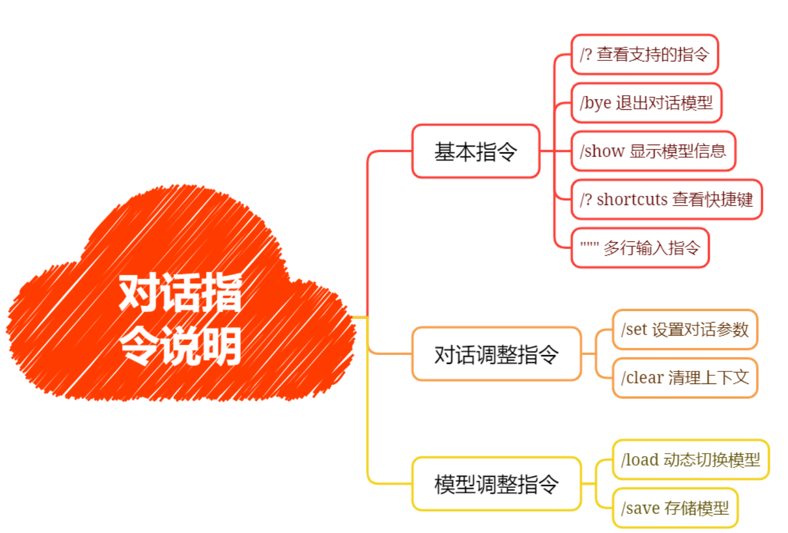
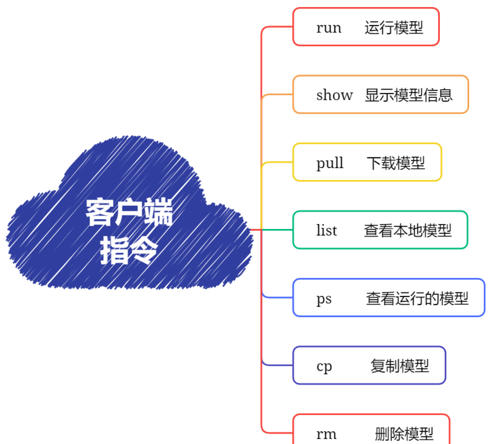
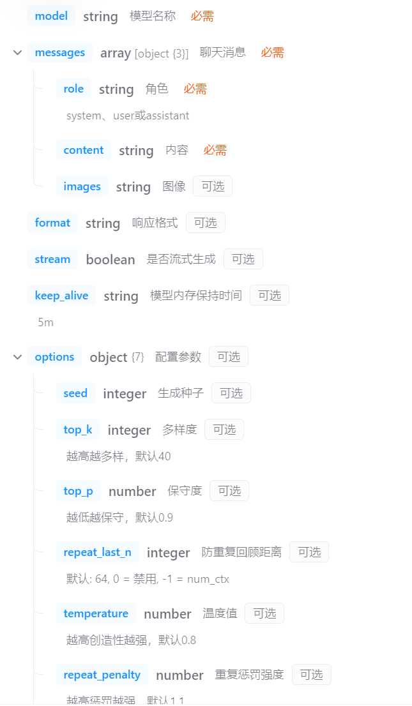
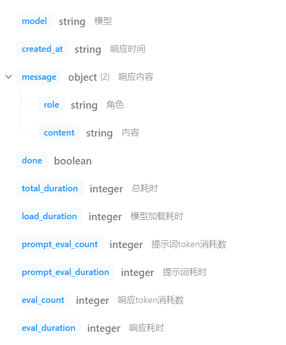
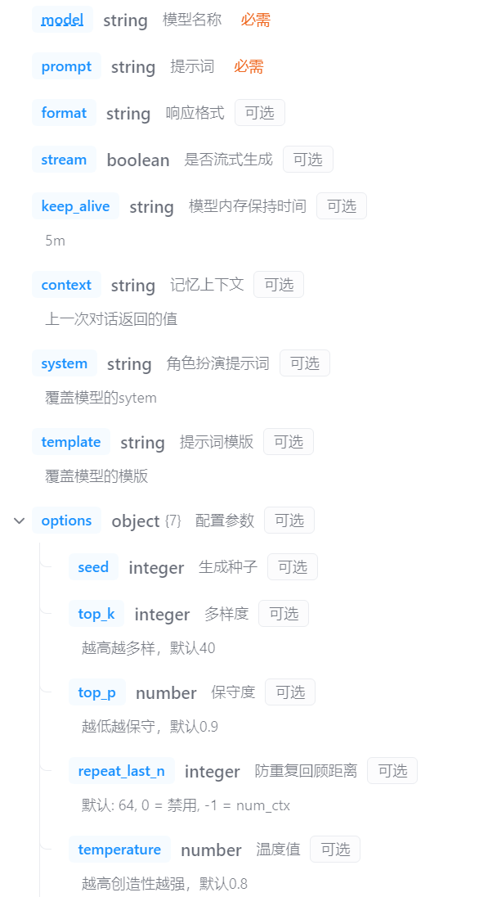
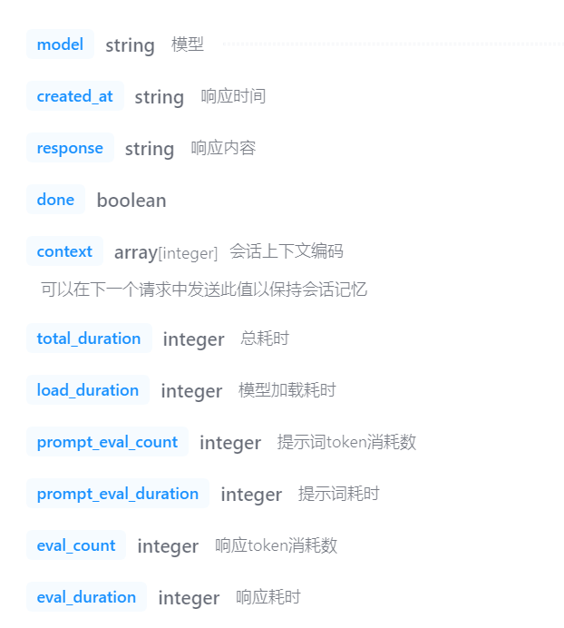
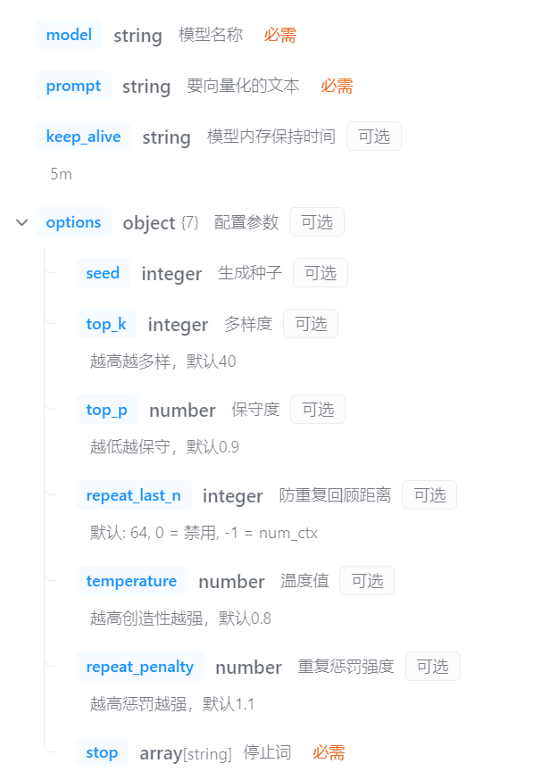
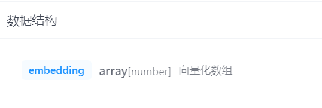
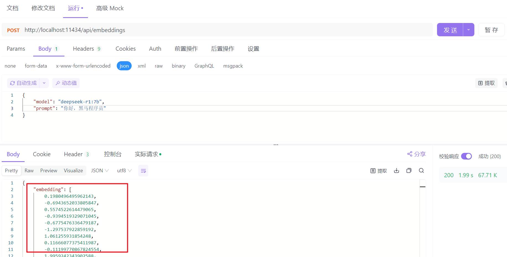
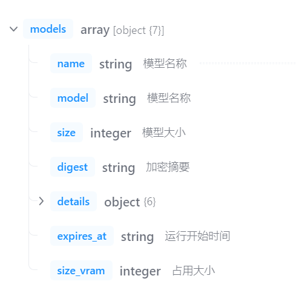

# Ollama命令和API详解

> 由飞书 Word 文档转换，图片已本地化

**附3-Ollama命令和API详解**  
**1. Ollama对话指令**  
在Ollama终端中提供了一系列指令，可以用来调整和控制对话模型：

**/? 指令**  

**/bye 指令**  

**/show 指令**  

**/? shortcuts 指令**  

**""" 指令**  

**/set 指令**  

**点击图片可查看完整电子表格**  

**JSON格式输出**  
**输出对话统计日志**  
**/clear 指令**  
在命令行终端中对话是自带上下文记忆功能，如果要清除上下文功能，则使用/clear指令清楚上下文内容，例如：
前2个问题都关联的，在输入/clear则把前2个问题的内容给清理掉了，第3次提问时则找不到开始的上下文了。
**/load 指令**  

**/save 指令**  

**2. Ollama客户端命令**  
Ollama客户端还提供了系列命令，来管理本地大模型，接下来就先了解一下相关命令：

**run 命令**  

例如，在启动时增加 --verbose参数，则在对话时，自动增加统计token信息：

**show 命令**  

例如，查看提示词模版：
**pull 命令**  
查询模型名称的网站：https://ollama.com/

**list/ls 命令**  

**列表字段说明：**  
- NAME：名称
- ID：大模型唯一ID
- SIZE：大模型大小
- MODIFIED：本地存活时间
**注意：在ollama的其它命令中，不能像docker一下使用ID或ID缩写，这里只能使用大模型全名称。**  
**ps 命令**  

**列表字段说明：**  
- NAME：大模型名称
- ID：唯一ID
- SIZE：模型大小
- PROCESSOR：资源占用
- UNTIL：运行存活时长
**rm 命令**  

**3. Ollama的常用API**  
官网API地址：
**[该类型的内容暂不支持下载]**  
注意：ollama的默认端口号是11434，如果访问本地：http://localhost:11434
**3.1 聊天对话API**  
概念：聊天对话接口，是实现类似ChatGPT、文心、通义千问等网页对话功能的关键接口
请求路径：/api/chat
请求方式：post
请求参数：（Body 参数application/json）

示例：
响应参数：

示例：

**3.2 内容生成API**  
概念：针对给定的提示生成相应的回复，并使用所提供的模型进行处理。
请求路径：/api/generate
请求方式：POST
请求参数：

示例：
响应参数：

示例：
**3.3 向量化接口API**  
向量化接口常用来进行模型的微调（训练），简单来说，就是把常见的文本信息转成大模型可认识的数字串
请求路径：/api/embeddings
请求方式：POST
请求参数：

示例：
响应参数：

示例：

**3.4 查询运行中的模型列表API**  
请求参数：/api/ps
请求方式：GET
请求参数：无
响应参数：

示例：
