# part2-SpringAI应用

> 由飞书 Word 文档转换，图片已本地化

**part2-SpringAI应用**  
大家一想到AI可能就会想到python，好像AI和python才是天生一对，但是其实python只是在很多方面做数据分析使用的，Python不能代表AI 

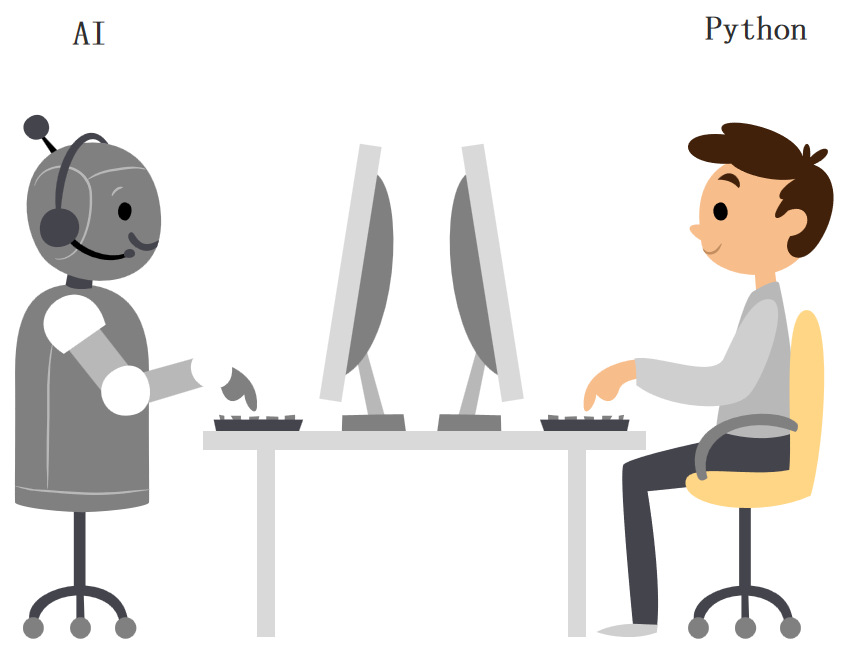

并且Java在目前行业中占比90%以上，全球25亿Java服务在运行，现在AI时代来了，那么这些Java服务全都要重构，我们要做即懂Java，又会AI的复合型人才。

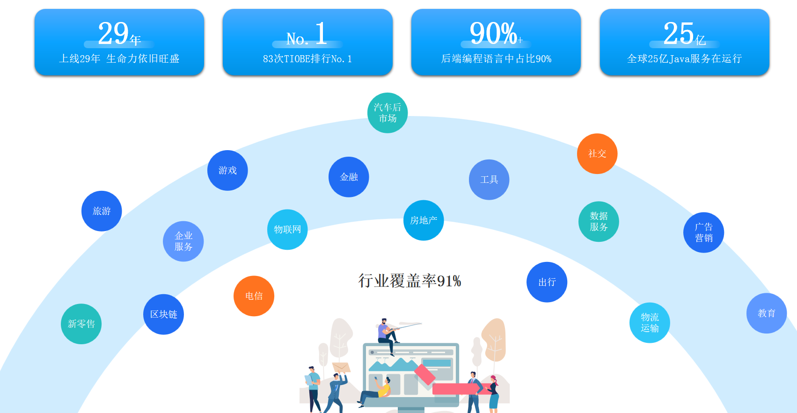

**那么在Java中使用AI来实现业务的重构的技术框架有很多，其中两个比较著名：**  

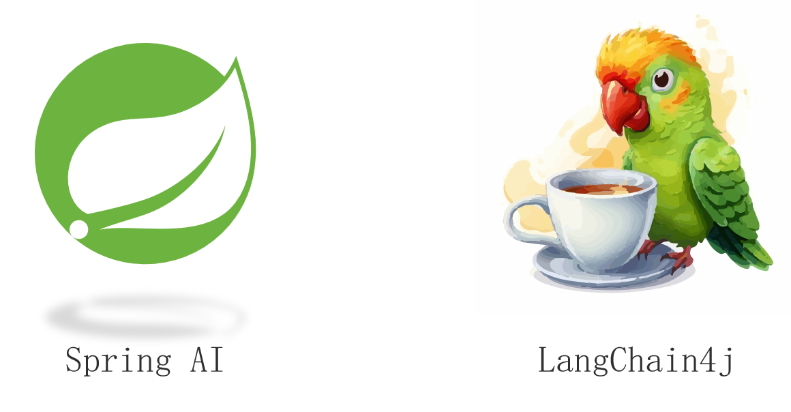

关于SpringAI:
**[该类型的内容暂不支持下载]**  
关于LangChain4j:
**[该类型的内容暂不支持下载]**  
关于SpringAI和LangChain4j的区别：

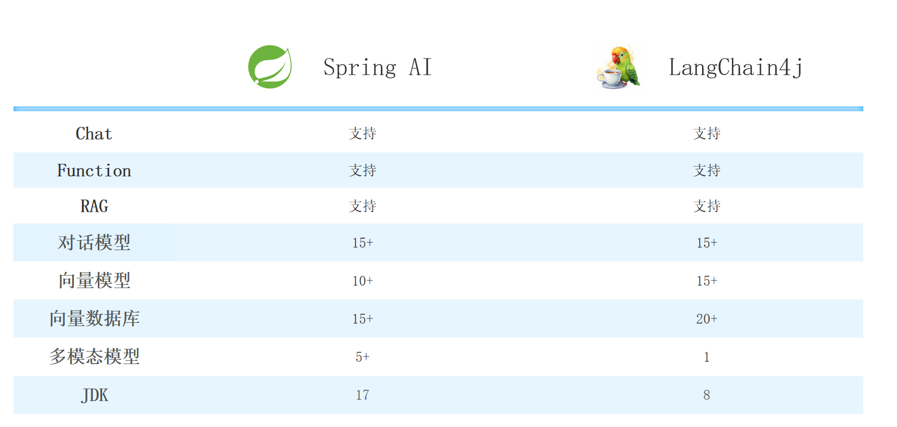

**注意事项：**  
SpringAI中的对话模型已经支持DeepSeek，而LangChain4j则暂时不支持
**[该类型的内容暂不支持下载]**  
**SpringAI要求的JDK版本至少是JDK17，SpringBoot也必须是3.x的版本才可以，所以如果想要使用SpringAI，必须先升级JDK和SpringBoot版本才行。**  
**1. SpringAI简介**  


Spring AI项目旨在简化包含AI功能的应用程序的开发，避免不必要的复杂度。
Spring AI干的事，就是将你的应用程序（数据和API）与 大模型连接起来。Connecting your enterprise Data and APIs with AI Models

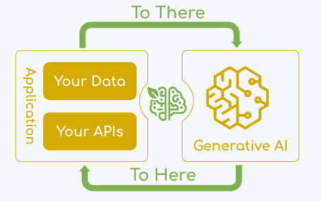

SpringAI官方：
**[该类型的内容暂不支持下载]**  

SpringAI API文档：
**[该类型的内容暂不支持下载]**  
**大模型应用开发大多数情况下使用的都是基于对话模型（Chat Model)，也就是输出结果为自然语言或代码的模型。**  

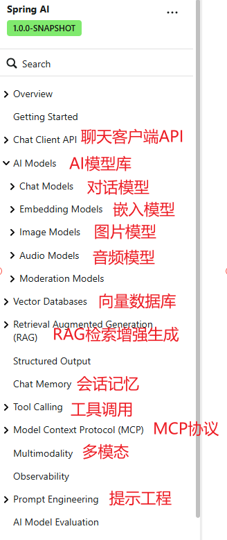

接下来，我们来以四个案例的方式学习SpringAI
- 对话机器人
- 快速入门
- 会话记忆
- 多模态
- 哄哄模拟器
- 提示词工程
- 智能客服
- Function Calling
- ChatPDF
- 向量模型
- 向量数据库
- PDF解析
- RAG检索增强生成

**2. 对话机器人（SpringAI入门）**  
接下来，我们就利用SpringAI发起与大模型的第一次对话。
**2.1 SpringAI快速入门**  
**2.1.1 导入工程**  
导入资料包中初始工程:   heima-ai
**2.1.2 引入依赖**  
首先，在项目pom.xml中添加spring-ai的版本信息：
然后，添加spring-ai的依赖版本管理项：

SpringAI完全适配了SpringBoot的自动装配功能，而且给不同的大模型提供了不同的starter，比如：
我们可以根据自己选择的平台来选择引入不同的依赖。这里我们先以Ollama为例。
引入spring-ai-ollama的依赖：

最终，完整依赖如下：

**2.1.3 配置模型信息**  
接下来，我们还要在配置文件中配置模型的参数信息。

以ollama为例，在application.yaml文件添加下面的内容：
如果是 openai，配置也是类似，如下：
**2.1.4 ChatClient**  
ChatClient中封装了与AI大模型对话的各种API，同时支持同步式或响应式交互。

不过，在使用之前，首先我们需要声明一个ChatClient。

在com.itheima.ai.config包下新建一个CommonConfiguration类：

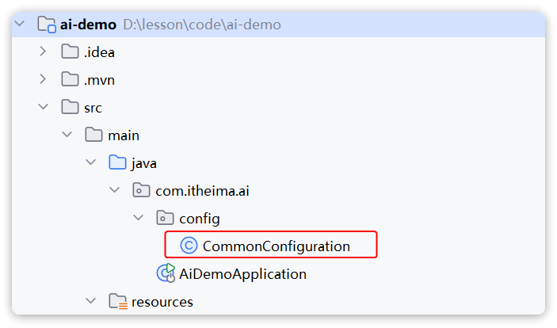

完整代码如下：

代码解读：
- ChatClient.builder：会得到一个ChatClient.Builder工厂对象，利用它可以自由选择模型、添加各种自定义配置
- OllamaChatModel：如果你引入了ollama的starter，这里就可以自动注入OllamaChatModel对象。同理，OpenAI也是一样的用法。

**2.1.5 同步调用**  
接下来，我们定义一个Controller，在其中接收用户发送的提示词，然后把提示词发送给大模型，交给大模型处理，拿到结果后返回。

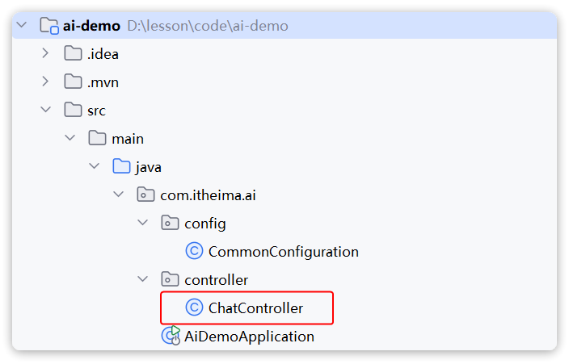

代码如下：


启动项目，在浏览器中访问：http://localhost:8080/ai/chat?prompt=你好

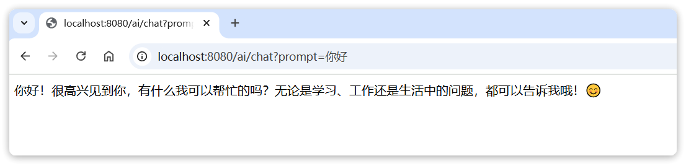


**2.1.6 流式调用**  
同步调用需要等待很长时间页面才能看到结果，用户体验不好。为了解决这个问题，我们可以改进调用方式为流式调用。
在SpringAI中使用了WebFlux技术实现流式调用。

修改刚才ChatController中的chat方法：

重启测试，再次访问：

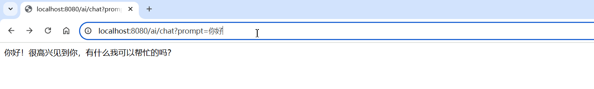


**2.1.7 System设定**  
可以发现，当我们询问AI你是谁的时候，它回答自己是DeepSeek-R1，这是大模型底层的设定。如果我们希望AI按照新的设定工作，就需要给它设置System背景信息。

在SpringAI中，设置System信息非常方便，不需要在每次发送时封装到Message，而是创建ChatClient时指定即可。
我们修改CommonConfiguration中的代码，给ChatClient设定默认的System信息：
我们再次询问“你是谁？”

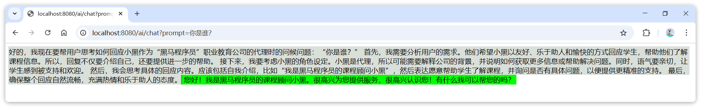

**注意，前面是DeepSeek的深度思考内容，绿色高亮部分才是最终的回答。**  

**现在，AI已经能够以黑马客服小黑的身份来回答问题了~**  

**2.2 日志功能**  
默认情况下，应用于AI的交互时不记录日志的，我们无法得知SpringAI组织的提示词到底长什么样，有没有问题。这样不方便我们调试。

**2.2.1 Advisor**  
SpringAI基于AOP机制实现与大模型对话过程的增强、拦截、修改等功能。所有的增强通知都需要实现Advisor接口。

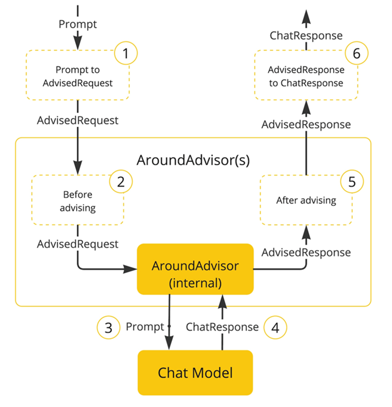

Spring提供了一些Advisor的默认实现，来实现一些基本的增强功能：

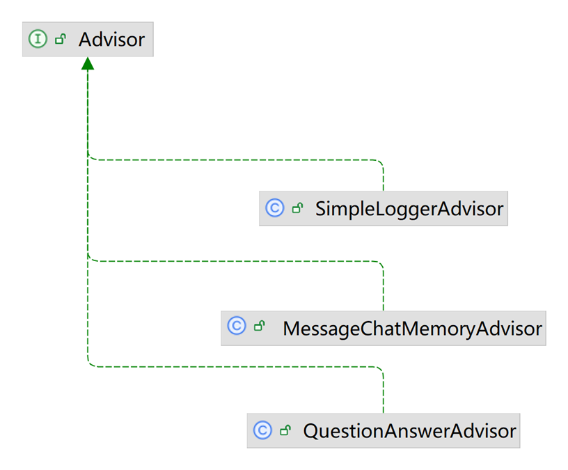

- SimpleLoggerAdvisor：日志记录的Advisor
- MessageChatMemoryAdvisor：会话记忆的Advisor
- QuestionAnswerAdvisor：实现RAG的Advisor
当然，我们也可以自定义Advisor，具体可以参考：
**[该类型的内容暂不支持下载]**  

**2.2.2 添加日志Advisor**  
首先，我们需要修改CommonConfiguration，给ChatClient添加日志Advisor：

**2.2.3 修改日志级别**  
接下来，我们在application.yaml中添加日志配置，更新日志级别：

重启项目，再次聊天就能看到AI对话的日志信息了~

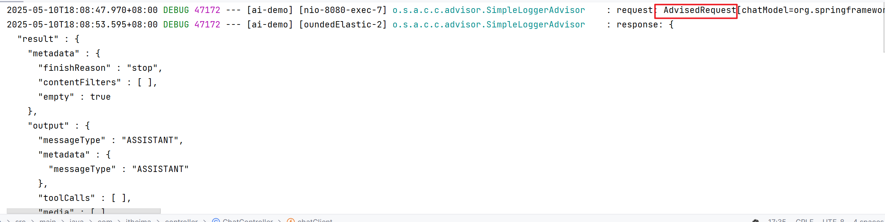

**2.3 对接前端**  
在浏览器通过地址访问，非常麻烦，也不够优雅。如果能有一个优美的前端页面就好了。

别着急，我提前给大家准备了一个前端页面。而且有两种不同的运行方式。
**2.3.1 npm运行**  
在资料中给大家提供了前端的源代码：

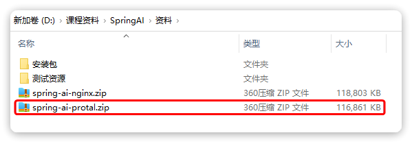

你只需要解压缩（最好放到非中文目录），然后进入解压后的目录，依次执行命令即可运行：
启动后，访问 http://localhost:5173即可看到页面：

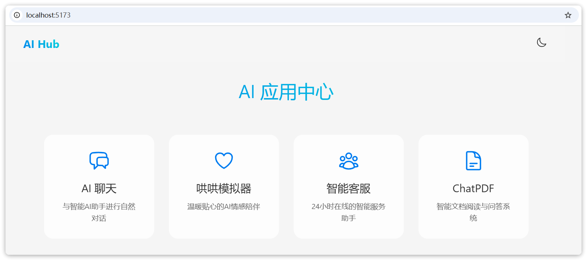


**2.3.2 Nginx运行**  
如果你不关心源码，我也给大家提供了构建好的Nginx程序：

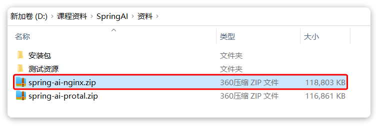

**解压缩到一个不包含中文、空格、特殊字符的目录中，然后通过命令启动Nginx：**  

启动后，访问 http://localhost:5173即可看到页面：


**2.3.3 解决CORS问题**  
前后端在不同域名，存在跨域问题，因此我们需要在服务端解决cors问题。在com.itheima.ai.config包中添加一个MvcConfiguration类：

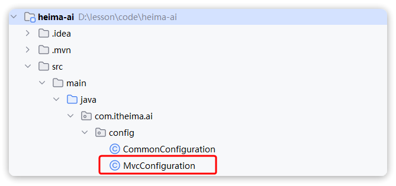

内容如下：

重启服务，如果你的服务端接口正确，那么应该就可以聊天了。

**2.3.4 测试**  
启动前端后，访问 http://localhost:5173即可看到页面：


点击第一个卡片《AI聊天》进入对话机器人页面：

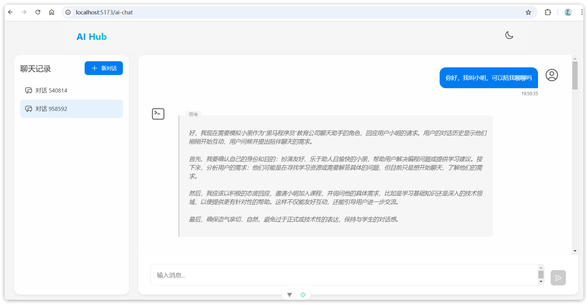


恭喜您，你的第一个AI对话机器人就完成了。

**2.4 会话记忆功能**  
现在，我们的AI聊天机器人是没有记忆功能的，上一次聊天的内容，下一次就忘掉了。
所以说大模型是没有记忆能力的，要想让大模型记住之前的聊天内容，唯一的办法就是把之前聊天的内容与新的提示词一块发送给大模型。
什么意思呢？我们来百炼平台演示一下记忆功能现象
首先呢，设置system配置信息，和在user中输入一段话，然后在预览页面中输出了对话内容

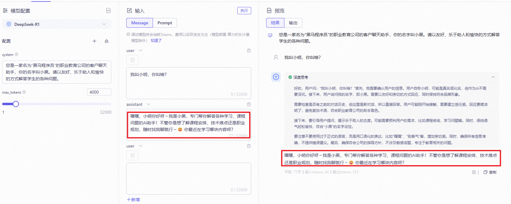

但是你看百炼平台会自动把输出的内容，回显给assistant输入框。
那么我们接着问大模型问题

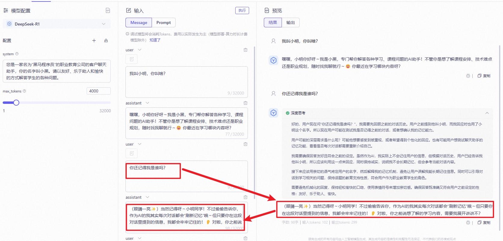

我们发现他是有记忆功能的，但是如果我们把上面的user和assistant的内容删除掉，再问大模型问题：【你还记得我是谁吗？】应该就没有记忆能力了

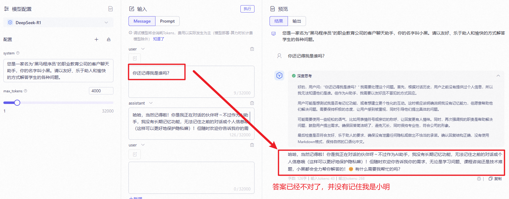


至此我们发现只有，每次我们带着user输入问题，然后再带着上次的历史问题答案在assistant（助手）输入框里，最后再去问新的问题，才会有记忆功能，否则是没有的。

但是我们再Java代码中拼接之前聊天内容与新的提示词，然后再发送给大模型，还是很麻烦的。
别担心，好消息是，我们并不需要自己来拼接，SpringAI自带了会话记忆功能，可以帮我们把历史会话保存下来，下一次请求AI时会自动拼接，非常方便。

**2.4.1 ChatMemory介绍**  
会话记忆功能同样是基于AOP实现，Spring提供了一个MessageChatMemoryAdvisor的通知，我们可以像之前添加日志通知一样添加到ChatClient即可。

不过，要注意的是，MessageChatMemoryAdvisor需要指定一个ChatMemory实例，也就是会话历史保存的方式。
ChatMemory接口声明如下：
**可以看到，所有的会话记忆都是与conversationId有关联的，也就是会话Id，将来不同会话id的记忆自然是分开管理的。**  

目前，在SpringAI中有两个ChatMemory的实现：
- InMemoryChatMemory：会话历史保存在内存中
- CassandraChatMemory：会话保存在Cassandra数据库中（需要引入额外依赖，并且绑定了向量数据库，不够灵活）

我们暂时选择用InMemoryChatMemory来实现。

**2.4.2 实现基本会话记忆**  
在CommonConfiguration中注册ChatMemory对象和添加MessageChatMemoryAdvisor：
测试结果

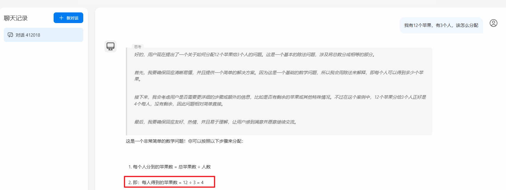

继续提问

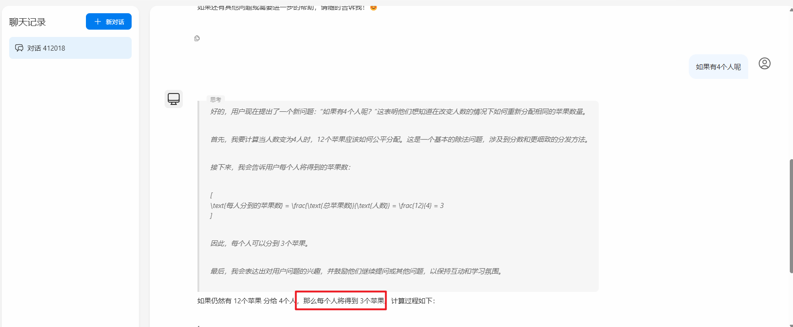

**2.4.3 会话记忆原理**  
通过在InMemoryChatMemory 三个方法打断点查看，剖析原理，发现经过三个步骤
1、在调用大模型前，先调用 get 方法 获取该会话ID下 的历史会话记忆；
2、在调用大模型前，调用 add 方法 将用户会话内容 添加至会话记忆；
3、在调用大模型后，调用 add 方法 将模型回复内容 添加至会话记忆。
另外，无论发起多少次会话，发现会话记忆ID都是 default，这将导致会话记忆混乱

**2.4.4 会话记忆完善**  
**OK，现在聊天会话已经有记忆功能了，不过现在的会话记忆还是不完善的，此时的会话记忆是混乱的，不管谁问他都是同样的记忆，那么这是不对的，那么我们先来看效果**  
重新添加一个对话，问如果是6个人呢，发现记忆混乱了

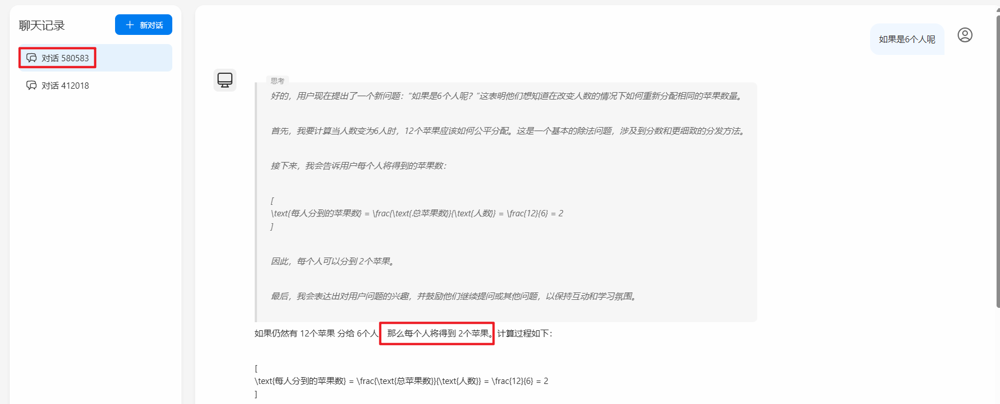

那是因为，每次会话都有自己的会话id,也就是前台带过来的chatId，在同一个会话id下表示是有记忆的，不同的会话id是不应该有彼此的记忆的。

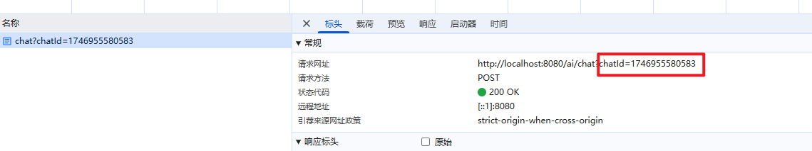

**修改加入会话Id参数【ChatController会话方法】**  

**测试结果**  

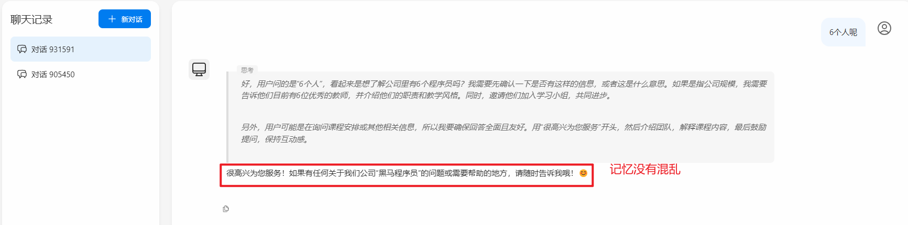


**2.5 会话记忆功能持久化（优化）**  
参考：附4-持久化会话记忆

**2.6 会话历史**  
会话历史与会话记忆是两个不同的事情：
**会话记忆：是指让大模型记住每一轮对话的内容，不至于前一句刚问完，下一句就忘了。**  
**会话历史：是指要记录总共有多少不同的对话**  

以DeepSeek为例，页面上的会话历史：

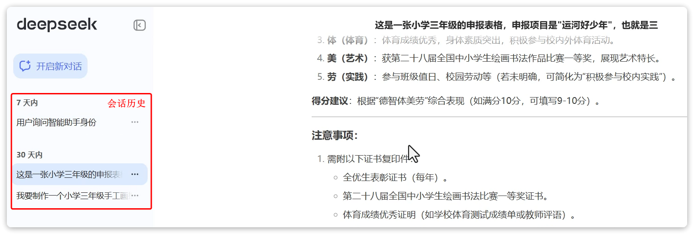

在ChatMemory中，会记录一个会话中的所有消息，记录方式是以conversationId为key，以List<Message>为value，根据这些历史消息，大模型就能继续回答问题，这就是所谓的会话记忆。
而会话历史，就是每一个会话的conversationId，将来根据conversationId再去查询List<Message>。
比如上图中，有3个不同的会话历史，就会有3个conversationId，管理会话历史，就是记住这些conversationId，当需要的时候查询出conversationId的列表。
**2.6.1 会话历史需求分析**  


**2.6.1.1 功能分析**  
从上图中分析得知：功能如下：
- 保存会话记录
- 查询会话id列表
- 根据会话ID查询会话详情(会话历史记录)
**2.6.1.2 功能接口分析**  
**保存会话记录**  
无单独接口，在对话方法中实现即可
**查询会话ID列表**  

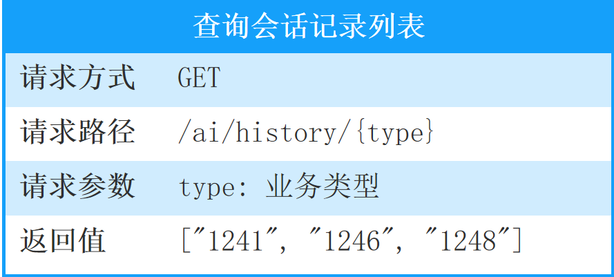


**根据会话ID查询会话历史记录**  

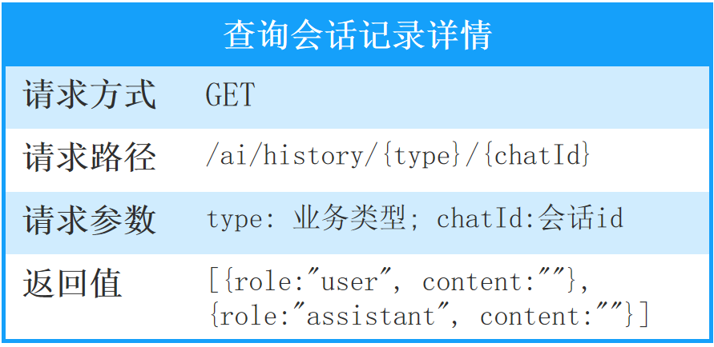


**2.6.2 保存会话ID记录功能**  
首先创建一个业务接口 ChatHistoryRepository
对应的接口实现类InMemoryChatHistoryRepository 
在ChatController类中的chat方法中调用保存会话ID列表方法
**2.6.3 查询会话ID列表**  
我们定义一个新的Controller，专门实现会话历史的查询
**ChatHistoryController类中定义getChatIdList方法**  
**ChatHistoryRepository 接口中添加查询会话ID列表的方法**  
**InMemoryChatHistoryRepository接口实现类中实现该方法**  
**测试结果：**  

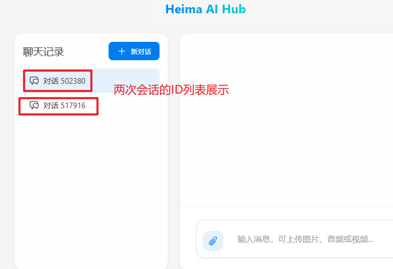


**2.6.4 根据会话ID查询会话历史记录**  
 根据chatId查询指定会话的历史消息。
其中，查询会话历史消息，也就是Message集合。但是由于Message并不符合页面的需要，我们需要自己定义一个VO。
**定义一个com.itheima.entity.vo包，在其中定义一个MessageVO类：**  
**ChatHistoryController类中定义getChatHistory方法**  
**测试结果：**  

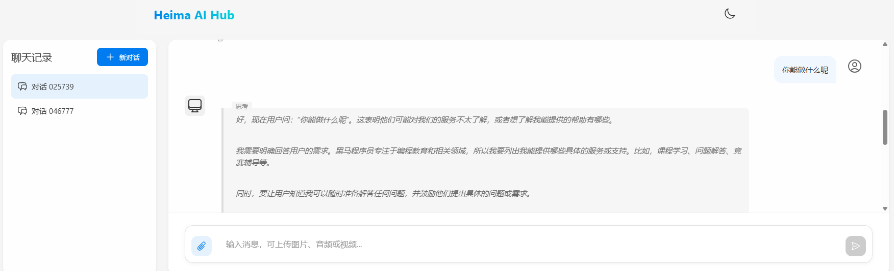


**3. 哄哄模拟器（纯Prompt提示词）**  
**3.1 案例演示**  

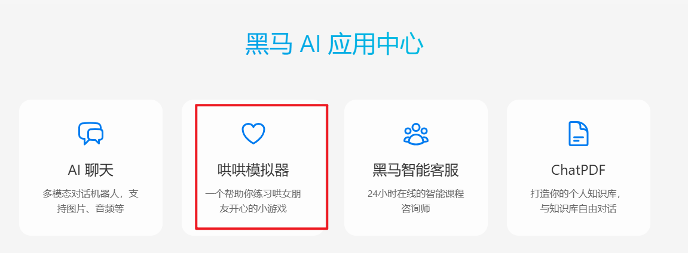


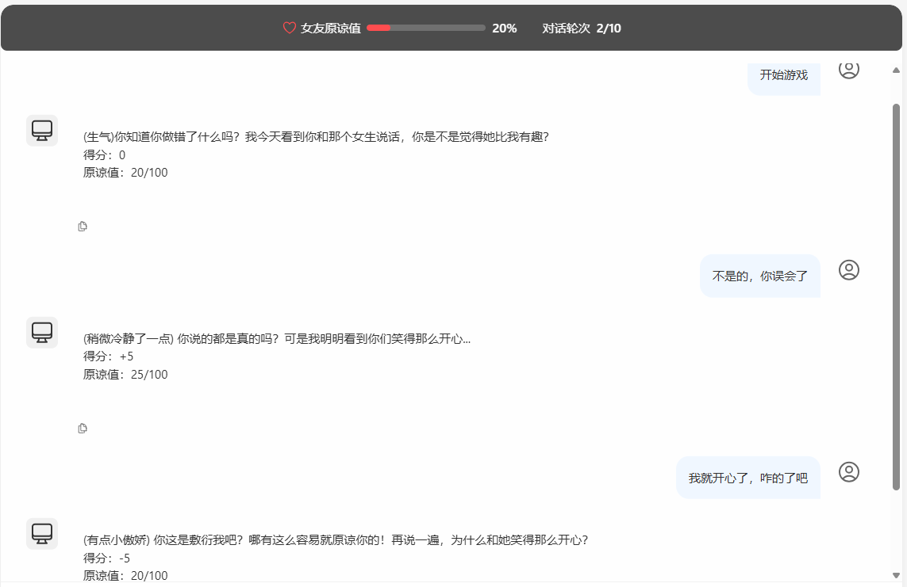

**3.2 提示词工程介绍**  
之前说过，开发有四种模式，其中第一种就是纯Prompt模式，只要我们设定好System提示词，就能让大模型实现很强大的功能。
**提示词工程（Prompt Engineering）:通过优化提示词，使大模型生成出尽可能理想的内容，这一过程就叫提示词工程。**  
**提示词工程包含6个精细策略：**  

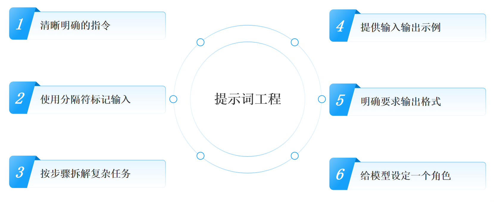

**3.2.1 清晰明确的指令**  
- 直接说明任务类型（如总结、分类、生成），避免模糊表述。  

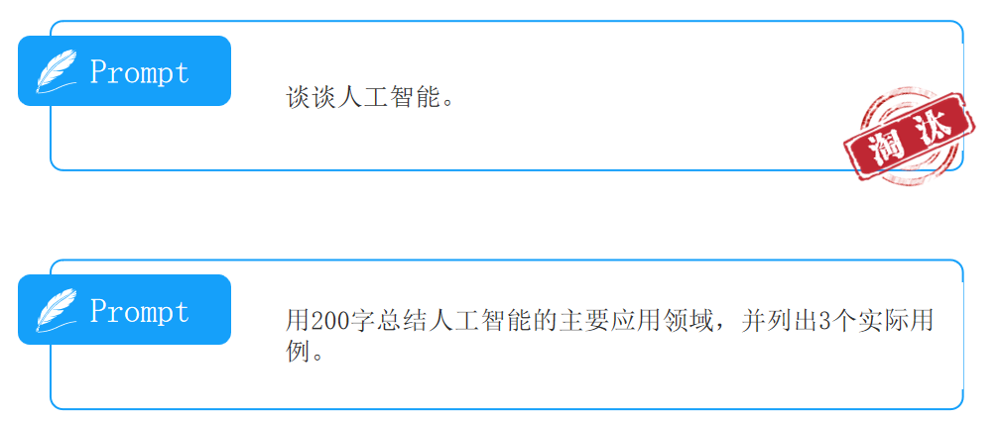


**3.2.2 使用分隔符标记输入**  
- 用```、"""或XML标签分隔用户输入，防止提示注入。  

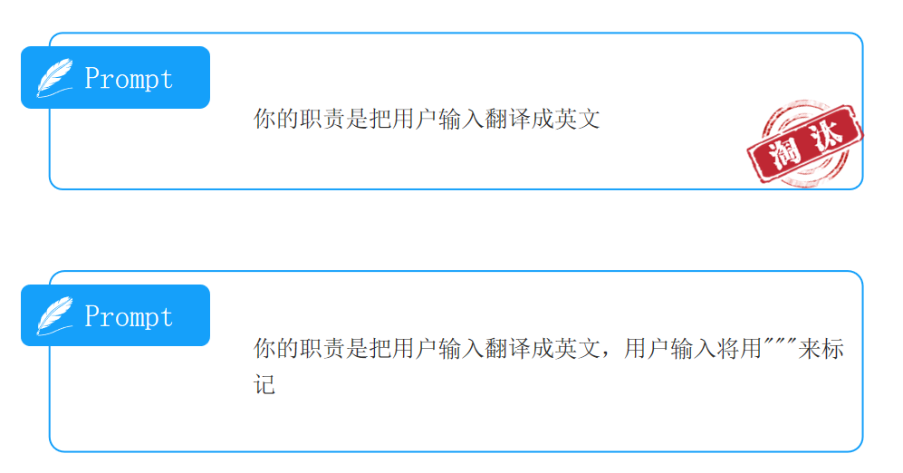

**示例演示：**  
 错误示例：

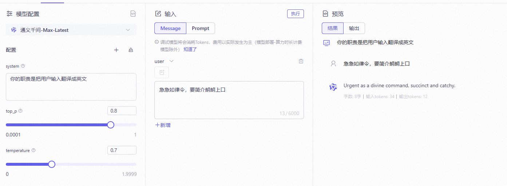

正确示例：

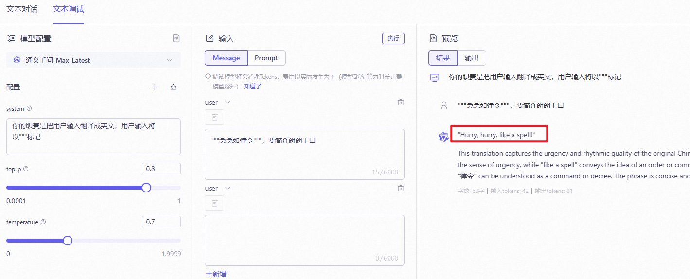

**3.2.3 按步骤拆解复杂任务**  
- 将任务分解为多个步骤，逐步输出结果。  

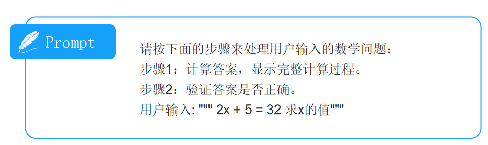

**3.2.4 提供输入输出示例**  
- 通过输入-输出示例指定格式或风格。  

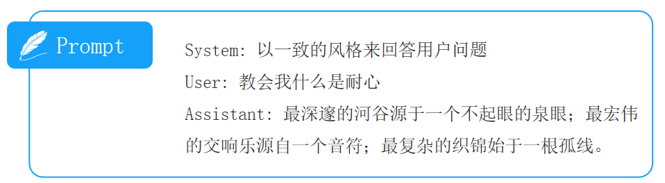


**示例演示：**  

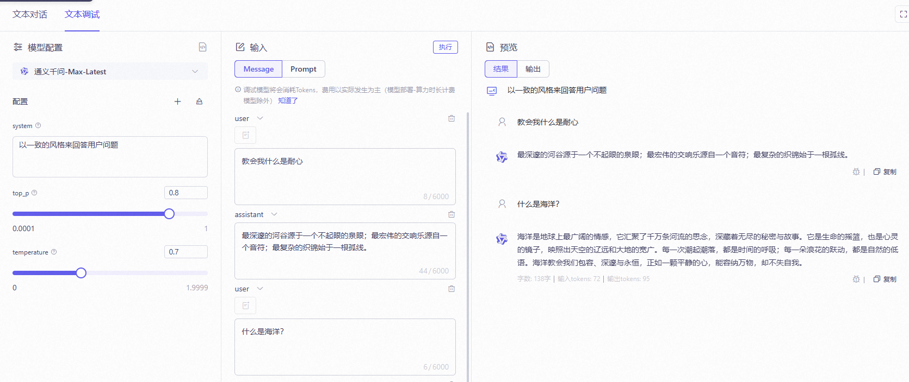

**3.2.5 明确要求输出格式**  
- 明确要求JSON、HTML或特定结构。  

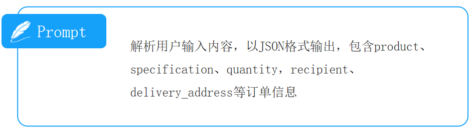


**示例演示：**  

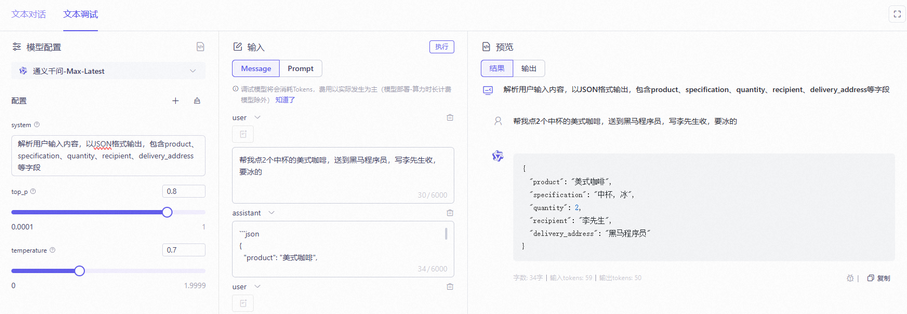

**3.2.6 给模型设定一个角色**  
- 设定角色可以让模型在正确的角色背景下回答问题，减少幻觉。  

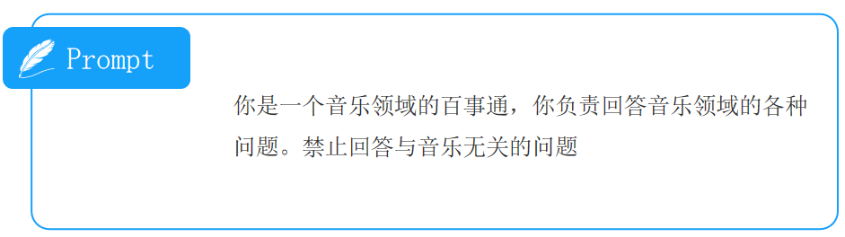

**示例演示：**  

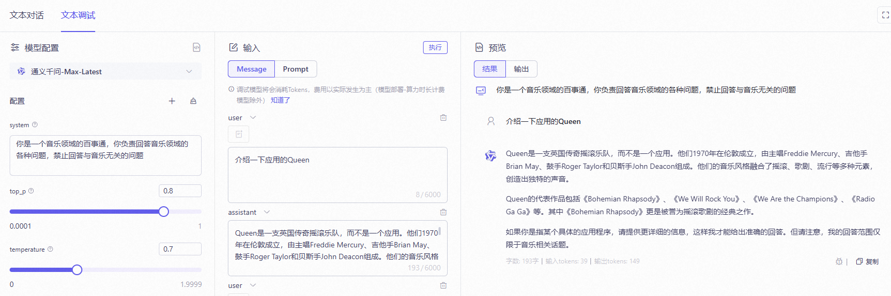


**3.3 哄哄模拟器功能实现**  
**3.3.1 编写提示词**  
OK，了解完提示词工程，接下来我们就可以尝试开发功能了。

**ChatGPT刚刚出来时，有一个非常知名的游戏，叫做哄哄模拟器，就是通过纯Prompt模式开发的。**  

游戏规则很简单，就是说你的女友生气了，你需要使用语言技巧和沟通能力，让对方原谅你。

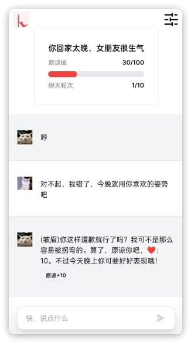


接下来，我们就尝试使用Prompt模式来开发一个哄哄模拟器。

首先，我们需要写好一段提示词，这里我给大家准备好了，一起来看看：

我们可以直接使用这段提示词了。

**3.3.2 创建ChatClient**  
本地部署的DeepSeek模型只有7B，难以处理这样复杂的业务场景，再加上DeepSeek模型默认是带有思维链输出的，如果每次都输出思维链，就会破坏游戏体验。所以我们这次换一个大模型。

我们采用阿里巴巴的qwen-max模型（当然，大家也可以选择其他模型），虽然SpringAI不支持qwen模型，但是阿里云百炼平台是兼容OpenAI的，因此我们可以使用OpenAI的相关依赖和配置。

**3.3.3 引入OpenAI依赖**  
在项目的pom.xml中引入OpenAI依赖：

**3.3.4 配置OpenAI参数**  
修改application.yaml文件，添加OpenAI的模型参数：
**千问模型：**  
**[该类型的内容暂不支持下载]**  

首先，点击启动项下拉箭头，然后点击Edit Configurations:

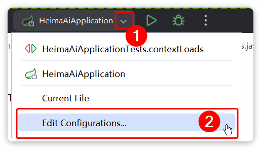

然后，在弹出的窗口中点击Modify options:

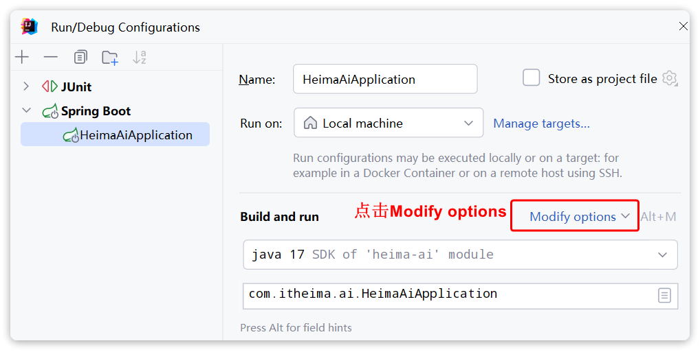

在弹出窗口中，选择Environment variables:

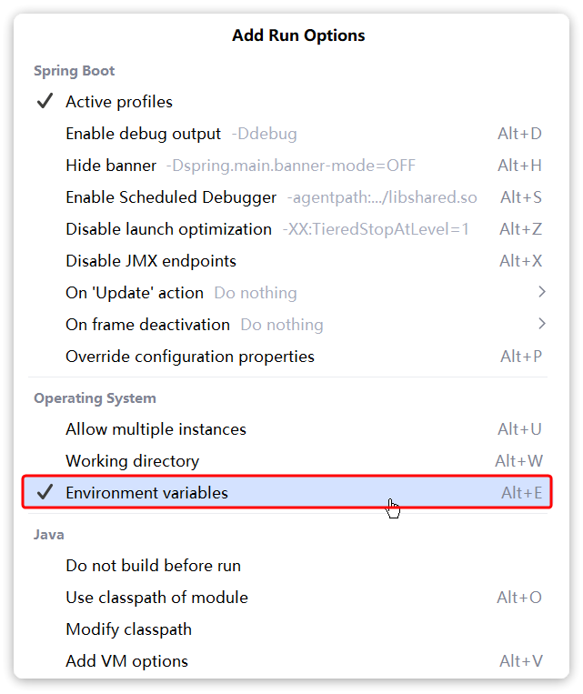

然后，在刚才的Run/Debug Configurations窗口中，就会多出环境变量配置栏：


**在其中配置自己阿里云百炼上的API_KEY：**  

**3.3.5 配置ChatClient**  
修改CommonConfiguration，添加一个新的ChatClient：
注意，这里我们使用的模型是OpenAIChatModel，不要搞错了。

另外，由于System提示词太长，我们定义到了一个常量中SystemConstants.HONG_HONG_SYSTEM：

**3.3.6 编写Controller**  
接下来，我们在com.itheima.ai.controller定义一个GameController，作为哄哄模拟器的聊天接口：


**3.3.7 测试**  
与之前类似，我们也提供了前端页面，现在一起去试试吧：


点击哄哄模拟器卡片，进入页面：


这里需要输入女友生气原因，如果不输入则是由AI自动生成原因。

点击开始游戏后，就可以跟AI女友聊天了：


OK，基于纯Prompt模式开发的一款小游戏就完成了。

**4. 智能客服（Function Calling）**  
由于AI擅长的是非结构化数据的分析，如果需求中包含严格的逻辑校验或需要读写数据库，纯Prompt模式就难以实现了。
接下来我们会通过智能客服的案例来学习FunctionCalling
**4.1 案例演示**  


**4.2 智能客服思路分析**  
 需求：为黑马程序员实现一个24小时在线的AI智能客服，可以为学员咨询黑马的培训课程，帮用户预约线下课程试听。


可以看出整个业务流程有一部分任务是负责与用户沟通，获取用户意图的，这些是大模型擅长的事情：


还有一些任务是需要操作数据库的，这些任务是传统的Java程序擅长的：


与用户对话并理解用户意图是AI擅长的，数据库操作是Java擅长的。为了能实现智能客服功能，我们就需要结合两者的能力。 
Function Calling就是起到这样的作用。


首先，我们可以把数据库的操作都定义成Function，或者也可以叫Tool，也就是工具。
然后，我们可以在提示词中，告诉大模型，什么情况下需要调用什么工具。
比如，我们可以这样来定义提示词：
也就是说，在提示词中告诉大模型，什么情况下需要调用什么工具，将来用户在与大模型交互的时候，大模型就可以在适当的时候调用工具了。


流程解读：
- 提前把这些操作定义为Function（SpringAI中叫Tool），
- 然后将Function的名称、作用、需要的参数等信息都封装为Prompt提示词与用户的提问一起发送给大模型
- 大模型在与用户交互的过程中，根据用户交流的内容判断是否需要调用Function
- 如果需要则返回Function名称、参数等信息
- Java解析结果，判断要执行哪个函数，代码执行Function，把结果再次封装到Prompt中发送给AI
- AI继续与用户交互，直到完成任务

听起来是不是挺复杂，还要解析响应结果，调用对应函数。

不过，有了SpringAI，中间这些复杂的步骤大家就都不用做了！

由于解析大模型响应，找到函数名称、参数，调用函数等这些动作都是固定的，所以SpringAI再次利用AOP的能力，帮我们把中间调用函数的部分自动完成了。


**[该类型的内容暂不支持下载]**  
流程解读：
- 当我们想要让模型可以使用某个工具时，我们会将其定义包含在聊天请求中。每个工具定义包含名称、描述和输入参数的模式。
- 当模型决定调用某个工具时，它会发送一个响应，其中包含工具名称和根据定义的模式建模的输入参数。
- 应用程序负责使用工具名称来识别并使用提供的输入参数来执行该工具。
- 工具调用的结果由应用程序处理。
- 应用程序将工具调用结果发送回模型。
- 该模型使用工具调用结果作为附加上下文来生成最终响应。

所以我们要基于 SpringAI实现的话，我们要做的事情就简单了
- 编写基础提示词（不包括Tool的定义）
- 编写Tool（Function）
- 告知chatClient有哪些工具

**4.3 智能客服实现**  
**4.3.1 准备工作**  
下面，我们先实现课程、校区、预约单的CRUD功能
**4.3.1.1 数据库表**  
**4.3.1.2 引入mp依赖坐标**  
**4.3.1.3 配置数据库**  
**4.3.1.4 生成基础CRUD代码**  
本次利用mybatisplus插件去生成基础代码
**第一，下载mybatisplus插件**  


**第二，配置数据源和生成代码**  


Config Database


Code Generator


**4.3.1.4.1 实体类**  
在com.itheima.entity包下添加一个pojo包，向其中添加三张表对应的实体类：
**课程表：**  
**课程预约表：**  
**校区表：**  
**4.3.1.4.2 mapper接口**  
创建一个com.itheima.mapper包，然后在其中写三个Mapper：
**CourseMapper **  
**CourseReservationMapper **  
**SchoolMapper **  
**4.3.1.4.3 service**  
**课程服务**  

**预约课程服务**  

**学校服务**  


**4.3.2 定义Tools（function）**  
**4.3.2.1 Tool分析**  
接下来，我们定义AI要用到的Function，在SpringAI中叫做Tool
根据上面的思路分析，我们得知有三个接口要实现(也相当于有三个Function或者Tool)
- 根据条件筛选和查询课程
- 查询校区列表
- 新增试听预约单

其中只有 根据条件筛选和查询课程 这个Function有查询条件，其余两个是没有查询条件的，那么我们来分析下查询条件：
先来看下课程表的字段：


课程并不是适用于所有人，会有一些限制条件，比如：学历、课程类型、价格、学习时长等

学生在与智能客服对话时，会有一定的偏好，比如兴趣不同、对价格敏感、对学习时长敏感、学历等。如果把这些条件用SQL来表示，是这样的：
- edu：例如学生学历是高中，则查询时要满足 edu <= 2
- type：学生的学习兴趣，要跟类型精确匹配，type = '自媒体'
- price：学生对价格敏感，则查询时需要按照价格升序排列：order by price asc
- duration: 学生对学习时长敏感，则查询时要按照时长升序：order by duration asc 
我们需要定义一个类，封装这些可能的查询条件。
在com.itheima.entity下新建一个query包，其中新建一个类：


**4.3.2.2 代码实现**  
在com.itheima.tools 下创建一个CourseTools


**4.3.3 定义prompt提示词**  
同样，我们也需要给AI设定一个System背景，告诉它需要调用工具来实现复杂功能。
在之前的SystemConstants类中添加一个常量：


**4.3.4 配置ChatClient**  
接下来，我们需要为智能客服定制一个ChatClient，同样具备会话记忆、日志记录等功能。

不过这一次，要多一个工具调用的功能，修改CommonConfiguration，添加下面代码：


**4.3.5 编写对应前端的Controller**  
我们在com.itheima.controller包下新建一个CustomerServiceController类：

**4.3.6 智能客服测试**  
最终的代码结构如下图：


重新启动后台服务，并打开前端页面，访问智能客服卡片：


点击卡片，进入智能客服聊天页面，就可以咨询课程了：


看看后台调用数据库的记录：
数据库中确实有预约的数据了：


**4.4 解决SpringAI中Tool无法兼容百炼平台使用stream模式问题**  
截止SpringAI的1.0.0-M6版本为止，SpringAI的OpenAiModel和阿里云百炼的部分接口存在兼容性问题，包括但不限于以下两个问题：
- FunctionCalling的stream模式，阿里云百炼返回的tool-arguments是不完整的，需要拼接，而OpenAI则是完整的，无需拼接。
- 音频识别中的数据格式，阿里云百炼的qwen-omni模型要求的参数格式为data:;base64,${media-data}，而OpenAI是直接{media-data}

由于SpringAI的OpenAI模块是遵循OpenAI规范的，所以目前解决方案有两个：
- 使用阿里云官方推出的spring-alibaba-ai
- 自己重写OpenAiModel的实现逻辑。
**4.4.1 展示百炼平台无法使用stream模式情况**  
第一，把controller层中的代码改为stream模式
第二，在前端发起请求


第三，查看控制台报错信息


报错信息：表示在进行返回值json数据解析的时候，出现了意外的结束（EOF）
**4.4.2 问题根源分析**  
观察控制台报错信息


发现是在OpenAiChatModel.java:442类对应的 442 行，就是这行出现了问题，我们点击进去查看


分析完成之后，就是这个response参数出现了问题，那么我们继续往下追踪
response内容就是由397行得到的。


然后我们继续往buildGeneration(choice, metadata, request)方法中点击进去


就是红框内的这个参数出现了问题，接下来我们可以在479行打个断点，我们可以debug方式查看下数据


正常来说，应该会把这些参数拼接到一个ToolCall中，但是发现每个ToolCall中的arguments属性中的值只有一部分，并没有拼接到一块。
这是因为SpringAI在调用阿里百炼平台的时候对应的OpenAIChatModel中没有自动实现arguments这个参数的拼接导致的。
**4.4.3 解决百炼平台无法使用stream模式方案**  
**解决这个问题，其实只需要我们自己重写 buildGeneration方法，把方法中的arguments参数的值拼接到一块就可以，并且这个OpenAIChatModel这个类是SpringAI编写的，同时我们也发现buildGeneration方法是私有的，所以不能够操作，那么我们只需要重新编写一个类，然后重新这个方法，我们自己拼接一下这个参数就可以。**  
** 4.4.3.1. 重新定义一个AlibabaOpenAiModel**  
首先，我们自己写一个遵循阿里巴巴百炼平台接口规范的ChatModel，其中大部分代码来自SpringAI的OpenAiChatModel，只需要重写接口协议不匹配的地方即可，重写部分会以黄色高亮420行显示。
在com.itheima.model包下新建一个AlibabaOpenAiChatModel类：
**4.4.3.2 配置ChatModel**  
接下来，我们自己定义的类AliababaOpenAiChatModel，我们需要把它配置到Spring容器中。
修改CommonConfiguration，添加配置：
**4.4.3.3 修改ChatClient**  
最后，让之前的ChatClient都使用自定义的AlibabaOpenAiChatModel.

修改CommonConfiguration中的ChatClient配置：
**4.4.3.4 重启测试**  
OK，现在我们的应用能支持stream版本的FunctionCalling了
**4.5 剖析SpringAI中的AI大模型如何知道调用哪些工具的**  
**在Spring AI中，使用Function Calling功能时，模型会根据用户的问题和提供的函数（Tool）描述来决定调用哪个函数。具体到你的代码，你定义了三个工具（Tool）：**  
- queryCourse：根据条件查询课程
- querySchoolList：查询校区列表
- addCourseReservation：新增试听预约单
当用户提问时，阿里百炼平台的大模型（如qwen-max-latest）会分析用户的问题，并匹配到最合适的工具。匹配的依据主要是工具的description以及各个参数的描述。
例如：
- 如果用户问：“有哪些校区？”，模型可能会匹配到querySchoolList工具，因为这个工具的描述是“查询校区列表”。
- 如果用户问：“我想预约试听数学课”，模型可能会匹配到addCourseReservation工具，并尝试提取所需的参数（如课程名称、学生姓名、联系方式、校区名称等）。
在Spring AI中，你需要将这些工具注册到FunctionCallback中，然后在调用大模型时，通过ChatOptions启用函数调用。模型在生成回复时，如果认为需要调用函数，则会返回一个函数调用的请求（包含函数名和参数），然后你的程序执行相应的函数，并将结果返回给模型，模型再根据函数返回结果生成最终的回答。
具体步骤：
- 定义工具（如你上面所做的，使用@Tool注解）。
- 将这些工具注册到Spring AI的FunctionCallback中（通常通过FunctionCallbackRegistry）。
- 在调用大模型时，将FunctionCallingOptions设置为启用，并指定可用的函数（或使用默认全部）。
- 模型在推理过程中，如果判断需要调用函数，则会返回一个FunctionCall对象（包含函数名和参数）。
- 你的程序根据函数名找到对应的工具方法，传入参数并执行。
- 将执行结果返回给模型，模型再生成最终的自然语言回复。
注意：模型如何知道调用哪个工具？
- 模型内部会根据预训练的知识和提供的函数描述（包括函数名、函数描述、参数描述等）进行匹配。模型会理解用户的问题，然后决定是否需要调用函数，以及调用哪个函数，并提取出函数所需的参数。
例如，对于工具addCourseReservation，模型需要知道这是一个新增试听预约单的工具，并且需要四个必填参数（课程名称、学生姓名、联系方式、校区名称）和一个可选参数（备注）。当用户表达出预约试听的意图，并且提供了足够的信息（或模型通过多轮对话收集到足够信息）时，模型就会选择调用这个工具。
**所以，关键点在于：**  
- 工具的描述（description）要清晰，能够准确表达工具的功能。
- 参数的描述也要清晰，并且标记是否必填，这样模型才能知道哪些参数是必须的，并在用户没有提供时可能要求用户补充。

**5. ChatPDF（RAG知识库）**  
**5.1 案例演示**  


我们要想实现该案例，那么我们需要先学习RAG知识库的知识和上传PDF的功能，然后才能最终完成该案例的功能
**5.2 RAG知识库学习**  
**我们先来看一下为什么需要RAG知识库的存在？**  
**由于训练大模型非常耗时，再加上训练语料本身比较滞后，所以大模型存在知识限制问题：**  
- 知识数据比较落后，往往是几个月之前的
- 不包含太过专业领域或者企业私有的数据


显然，大模型回答上面的问题是错误的，是不准确的，那么为了解决大模型知识限制的问题，我们就需要用到RAG了。
**5.2.1 RAG原理**  
**5.2.1.1 什么是RAG？**  
检索增强生成（Retrieval-Augmented Generation，RAG）是指对大型语言模型（LLM）输出进行优化，使其能够在生成响应之前引用训练数据来源之外的权威知识库。
简单来说就是给大模型外挂一个知识库，可以是专业领域知识，也可以是企业私有的数据

**5.2.1.2 基本原理**  
下面这张图是来源于Spring AI官网文档，说明了RAG整体实现流程。
**[该类型的内容暂不支持下载]**  


**5.2.2 向量模型**  
在上述的原理中，我们知道，在向大模型发起请求前，需要到向量库（知识库）查询，而且是相似性的查询，那究竟什么是相似性查询？也就是说，如何判断两个文字相似呢？比如：北京 和 北京市，这两个词相似度高，北京 和 天津市，这两个词相似度就低。怎么做到呢？
**5.2.2.1 什么是向量？**  
向量是空间中有方向和长度的量，空间可以是二维，也可以是多维的，可以认为向量化就是把文本等数据转化成一组数字。
**5.2.2.2 为什么需要向量化？**  
计算机无法直接理解文本，图片等非结构化的数据，所以需要把文本等数据转化成一组数字，这样计算机就能识别了。
**5.2.2.3 什么叫相似度查询？**  
前面说了，向量是存在空间中的，那么两个向量之间就一定能计算距离，通过距离就能判断相似度

我们以二维向量为例，向量之间的距离有两种计算方法：
- 余弦相似度：是通过计算两个向量在多维空间中的夹角余弦值来评估它们的相似度。
- 欧式距离：是衡量空间中两点间直线距离典方法。


**通常，我们认为两个向量之间的欧式距离越近，那么两个向量的相似度越高。两个向量之间的余弦距离越小，相似度越高**  
举个例子：文本转为向量


**5.2.2.4 向量模型测试**  
阿里百炼平台提供了向量模型：大模型服务平台百炼控制台


这里我们选择通用文本向量-v3，这个模型兼容OpenAI，所以我们依然采用OpenAI的配置。
第一步，引入依赖坐标（已经完成，可以省略）


第二步，修改application.yaml，添加向量模型配置：
**1. 测试文本转向量**  
第三步，编写一个测试类

首先，点击单元测试左侧运行按钮：


然后配置环境变量：


然后运行测试并查看结果


看控制台的输出数据显示，我们已经把学Java就到黑马程序员这几个文本数据，转成了1024维的向量数字
**2. 测试向量之间的欧式距离和余弦距离**  
**首先，我们在项目中写一个工具类，用以计算向量之间的欧氏距离和余弦距离。**  
新建一个com.itheima.util包，在其中新建一个类：
由于SpringBoot的自动装配能力，刚才我们配置的向量模型可以直接使用。
接下来，我们写一个测试类：

运行结果


可以看到，向量相似度确实符合我们的预期。
OK，有了比较文本相似度的办法，知识库的问题就可以解决了。
**5.2.3 向量数据库**  
向量数据库的主要作用有两个：
- 存储向量数据
- 基于相似度检索数据
刚好符合我们的需求。
向量数据库就是用来存储向量数据的数据库，Spring AI也支持了很多的向量数据库：
**[该类型的内容暂不支持下载]**  


这些库都实现了统一的接口：VectorStore，因此操作方式一模一样，大家学会任意一个，其它就都不是问题。
不过，除了最后一个库以外，其它所有向量数据库都是需要安装部署的。每个企业用的向量库都不一样，这里我就不一一演示了。
**目前，我们将使用内存存储SimpleVectorStore的方式来学习向量数据库。**  
**5.2.3.1 添加VectorStore的Bean**  

**5.2.3.2 关于VectorStore接口说明**  
我们先了解一下VectorStore接口中有哪些功能？具体可以参考SpringAI官方文档：
**[该类型的内容暂不支持下载]**  
这是VectorStore中声明的方法：
注意，VectorStore操作向量化的基本单位是Document，我们在使用时需要将自己的知识库分割转换为一个个的Document，然后写入VectorStore。
那么问题来了，我们该如何把各种不同的知识库文件转为Document呢？
**5.2.4 文件读取和转换**  
前面说过，知识库太大，是需要拆分成文档片段，然后再做向量化的。而且SpringAI中向量库接收的是Document类型的文档，也就是说，我们处理文档还要转成Document格式。
不过，文档读取、拆分、转换的动作并不需要我们亲自完成。在SpringAI中提供了各种文档读取的工具，可以参考官网：
**[该类型的内容暂不支持下载]**  
比如PDF文档读取和拆分，SpringAI提供了两种默认的拆分原则：
- PagePdfDocumentReader ：按页拆分，推荐使用
- ParagraphPdfDocumentReader ：按pdf的目录拆分，不推荐，因为很多PDF不规范，没有章节标签

当然，大家也可以自己实现PDF的读取和拆分功能。

这里我们选择使用PagePdfDocumentReader。
首先，我们需要在pom.xml中引入依赖：
然后就可以利用工具把PDF文件读取并处理成Document了。
**编写一个单元测试，（别忘记配置OPENAI_API_KEY）**  
运行结果


**5.2.5 RAG知识总结**  
OK，现在我们有了这些工具：
- PDFReader：读取文档并拆分为片段
- 向量大模型：将文本片段向量化
- 向量数据库：存储向量，检索向量

让我们梳理一下要解决的问题和解决思路：
- 要解决大模型的知识限制问题，需要外挂知识库
- 受到大模型上下文限制，知识库不能简单的直接拼接在提示词中
- 我们需要从庞大的知识库中找到与用户问题相关的一小部分，再组装成提示词
- 这些可以利用文档读取器、向量大模型、向量数据库来解决。

所以RAG要做的事情就是将知识库分割，然后利用向量模型做向量化，存入向量数据库，然后查询的时候去检索：

**第一阶段（存储知识库）：**  
- 将知识库内容切片，分为一个个片段
- 将每个片段利用向量模型向量化
- 将所有向量化后的片段写入向量数据库

**第二阶段（检索知识库）：**  
- 每当用户询问AI时，将用户问题向量化
- 拿着问题向量去向量数据库检索最相关的片段

**第三阶段（对话大模型）：**  
- 将检索到的片段、用户的问题一起拼接为提示词
- 发送提示词给大模型，得到响应


**5.3 PDF上传下载（待优化）**  


既然是ChatPDF，也就是说所有知识库都是PDF形式的，由用户提交给我们。所以，我们需要先实现一个上传PDF的接口，在接口中实现下列功能：
- 校验文件格式是否为PDF
- 保存文件信息
- 保存文件（可以是oss或本地保存）
- 保存会话ID和文件路径的映射关系（方便查询会话历史的时候再次读取文件）
- 文档拆分和向量化（文档太大，需要拆分为一个个片段，分别向量化）

另外，将来用户查询会话历史，我们还需要返回pdf文件给前端用于预览，所以需要实现一个下载PDF接口，包含下面功能：
- 读取文件
- 返回文件给前端
**5.3.1.1 PDF文件管理**  
由于将来要实现PDF下载功能，我们需要记住每一个chatId对应的PDF文件名称。
所以，我们定义一个类，记录chatId与pdf文件的映射关系，同时实现基本的文件保存功能。
先在com.itheima.repository中定义接口：
再写一个实现类：

**5.3.1.2 完成上传和下载PDF功能**  
**5.3.1.2.1 PdfController**  
在com.itheima.ai.controller中创建一个PdfController：
**5.3.1.2.2 Result返回值**  
**5.3.1.2.3 设置上传文件的大小限制**  
SpringMVC有默认的文件大小限制，只有10M，很多知识库文件都会超过这个值，所以我们需要修改配置，增加文件上传允许的上限。
修改application.yaml文件，添加配置：
**5.3.1.2.4 设置CORS配置**  
默认情况下跨域请求的响应头是不暴露的，这样前端就拿不到下载的文件名，我们需要修改CORS配置，暴露响应头：
**5.3.1.3 测试上传PDF**  
注意：此时还不能发起聊天。


**5.4 实现ChatPDF案例**  
接下来就是最后的环节了，实现RAG的对话流程。
理论上来说，我们每次与AI对话的完整流程是这样的：
- 将用户的问题利用向量大模型做向量化 OpenAiEmbeddingModel
- 去向量数据库检索相关的文档 VectorStore
- 拼接提示词，发送给大模型
- 解析响应结果

不过，SpringAI同样基于AOP技术帮我们完成了全部流程，用到的是一个名QuestionAnswerAdvisor的Advisor。我们只需要把VectorStore配置到Advisor即可。
**5.4.1.1 定义ChatClient对象**  
我们在CommonConfiguration中给ChatPDF也单独定义一个ChatClient：
**5.4.1.2 对话接口**  
最后，就是对接前端，然后与大模型对话了。修改PdfController，添加一个接口：
**5.4.1.3 测试**  
打开浏览器，访问http://localhost:5173


点击ChatPDF卡片，进入对应页面：


上传一个PDF文件之后，就可以对PDF提问了，AI也会根据文档来回答问题


**6. 多模态**  
多模态是指不同类型的数据输入，如文本、图像、声音、视频等。目前为止，我们与大模型交互都是基于普通文本输入，这跟我们选择的大模型有关。
deepseek、qwen-max等模型都是纯文本模型，在ollama和百炼平台，我们也能找到很多多模态模型。

以ollama为例，在搜索时点击vison，就能找到支持图像识别的模型：


在阿里云百炼平台也一样：


阿里云的qwen-omni模型是支持文本、图像、音频、视频输入的全模态模型，还能支持语音合成功能，非常强大。
接下来，我们拓展入门时写的对话机器人，让他支持多模态效果。
**6.1 切换多模态模型**  
首先，我们需要修改CommonConfiguration中用于AI对话的ChatClient，将模型修改为OpenAIChatModel，不仅如此，由于其它业务使用的是qwen-max模型，不能改变。所以这里我们还需添加自定义配置，将模型改为qwen-omni-turbo:
**6.2 多模态对话**  
接下来，我们需要修改原来的/ai/chat接口，让它支持文件上传和多模态对话。

修改ChatController：
**6.3 测试**  
访问页面中的AI聊天卡片：


点击卡片，进入聊天页面，可以上传图片让AI来识别了：


