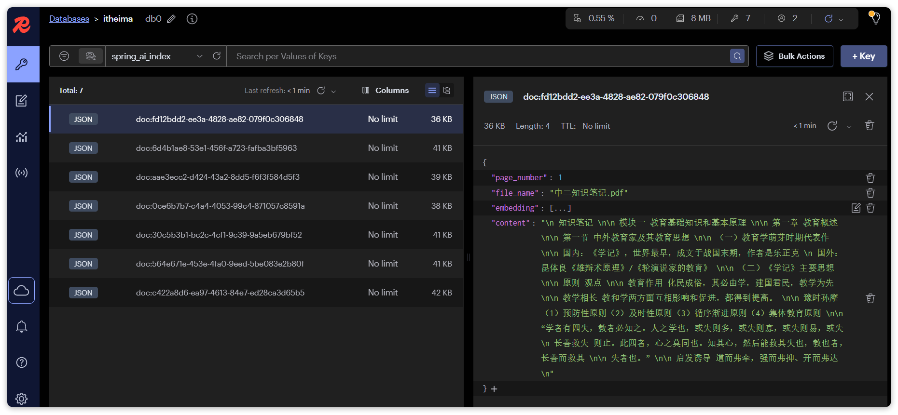

# 持久化VectorStore

> 由飞书 Word 文档转换，图片已本地化

**附5-持久化VectorStore**  
SpringAI提供了很多持久化的VectorStore，我们以其中两个为例来介绍：
- RedisVectorStore ： 目前测试metafiled过滤有异常
- CassandraVectorStore

**1. RedisVectorStore**  
首先，你需要安装一个Redis Stack，这是Redis官方提供的拓展版本，其中有向量库的功能。
可以使用Docker安装：
安装完成后，你可以通过命令行访问：
也可以通过浏览器访问控制台：http://localhost:8001，注意，这里的IP要换成你自己的

然后，你可以在项目中引入RedisVectorStore的依赖：
在application.yml配置Redis：
接下来，无需声明bean，直接就可以直接使用VectorStore了。

**2. CassandraVectorStore**  
首先，需要安装一个Cassandra访问。
我们使用Docker安装：

接下来，我们在项目中添加cassandra依赖：

配置Cassandra地址：

配置VectorStore：
