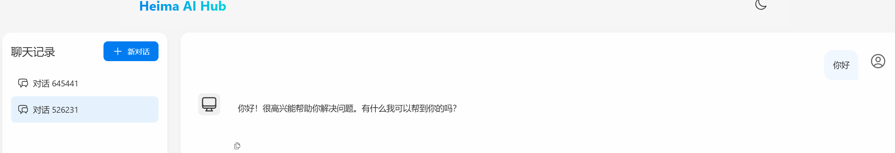
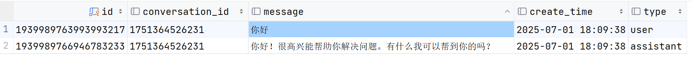

# 持久化会话记忆(mysql)

> 由飞书 Word 文档转换，图片已本地化

**附4-持久化会话记忆（mysql）**  
**1. mysql持久化**  
之前我们是将对话记忆存储在了InMemoryChatMemory，本质是存在了内存里，一旦重启服务，上下文全部消失，所以无法使用，真正想要使用，肯定还是需要持久化
这里我们选择mysql持久化，其他redis等方式，本质上是一样的，我们可以举一反三
**1.1 准备mysql环境**  
配置文件
mybatisplus依赖
sql脚本：
实体类：
mapper接口
service接口
service实现类
**1.2 自定义ChatMemory（重点）**  
想要持久化到数据库，那就要自己定义ChatMemory
我们新建一个MysqlChatMemory，并实现ChatMemory接口
把之前的 InMemoryChatMemory 换成 MysqlChatMemory
**1.3 测试持久化会话**  
访问前端http://localhost:5173/ai-chat

发起对话，查看数据库表中是否有数据

