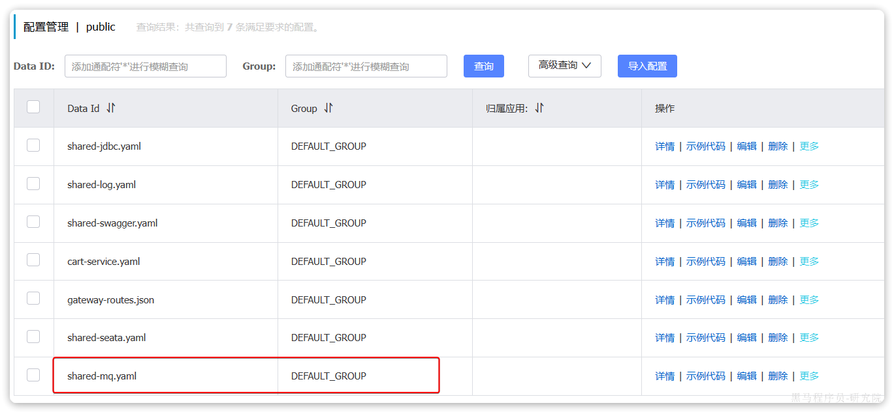
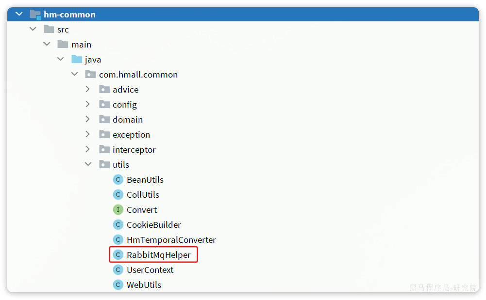
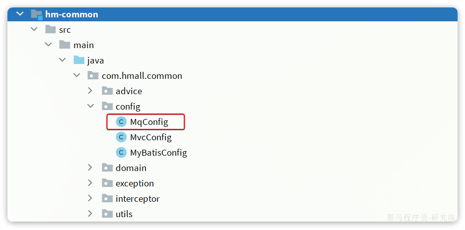
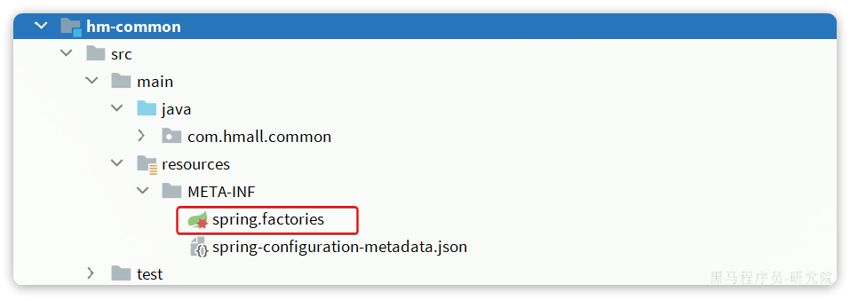

> 📂 [[微服务框架-黑马新版|课程索引]]

# 抽取[[day04-MQ基础|MQ]]工具的作业参考

MQ在企业开发中的常见应用我们就学习完毕了，除了收发消息以外，消息可靠性的处理、生产者确认、消费者确认、延迟消息等等编码还是相对比较复杂的。

因此，我们需要将这些常用的操作封装为工具，方便在项目中使用。

## 1.抽取共享配置

首先，我们需要在nacos中抽取[[day04-MQ基础|RabbitMQ]]的共享配置，命名为`shared-mq.yaml`：



其中只包含mq的基础共享配置，内容如下：

```YAML
spring:
  rabbitmq:
    host: ${hm.mq.host:192.168.150.101} # 主机名
    port: ${hm.mq.port:5672} # 端口
    virtual-host: ${hm.mq.vhost:/hmall} # 虚拟主机
    username: ${hm.mq.un:hmall} # 用户名
    password: ${hm.mq.pw:123} # 密码
```


## 2.引入依赖

在`hm-common`模块引入要用到的一些依赖，主要包括`amqp、jackson`。但是不要引入starter，因为我们希望可以让用户按需引入。

依赖如下：

```XML
<!--AMQP依赖-->
<dependency>
    <groupId>org.springframework.amqp</groupId>
    <artifactId>spring-amqp</artifactId>
    <scope>provided</scope>
</dependency>
<!--Spring整合Rabbit依赖-->
<dependency>
    <groupId>org.springframework.amqp</groupId>
    <artifactId>spring-rabbit</artifactId>
    <scope>provided</scope>
</dependency>
<!--json处理-->
<dependency>
    <groupId>com.fasterxml.jackson.dataformat</groupId>
    <artifactId>jackson-dataformat-xml</artifactId>
    <scope>provided</scope>
</dependency>
```

注意：依赖的`scope`要选择`provided`，这样依赖仅仅是用作项目编译时不报错，真正运行时需要使用者自行引入依赖。


## 3.封装工具

在hm-common模块的`com.hmall.common.utils`包下新建一个`RabbitMqHelper`类：



代码如下：

```Java
package com.hmall.common.utils;

import cn.hutool.core.lang.UUID;
import lombok.RequiredArgsConstructor;
import lombok.extern.slf4j.Slf4j;
import org.springframework.amqp.rabbit.connection.CorrelationData;
import org.springframework.amqp.rabbit.core.RabbitTemplate;
import org.springframework.util.concurrent.ListenableFutureCallback;

@Slf4j
@RequiredArgsConstructor
public class RabbitMqHelper {

    private final RabbitTemplate rabbitTemplate;

    public void sendMessage(String exchange, String routingKey, Object msg){
        log.debug("准备发送消息，exchange:{}, routingKey:{}, msg:{}", exchange, routingKey, msg);
        rabbitTemplate.convertAndSend(exchange, routingKey, msg);
    }

    public void sendDelayMessage(String exchange, String routingKey, Object msg, int delay){
        rabbitTemplate.convertAndSend(exchange, routingKey, msg, message -> {
            message.getMessageProperties().setDelay(delay);
            return message;
        });
    }

    public void sendMessageWithConfirm(String exchange, String routingKey, Object msg, int maxRetries){
        log.debug("准备发送消息，exchange:{}, routingKey:{}, msg:{}", exchange, routingKey, msg);
        CorrelationData cd = new CorrelationData(UUID.randomUUID().toString(true));
        cd.getFuture().addCallback(new ListenableFutureCallback<>() {
            int retryCount;
            @Override
            public void onFailure(Throwable ex) {
                log.error("处理ack回执失败", ex);
            }
            @Override
            public void onSuccess(CorrelationData.Confirm result) {
                if (result != null && !result.isAck()) {
                    log.debug("消息发送失败，收到nack，已重试次数：{}", retryCount);
                    if(retryCount >= maxRetries){
                        log.error("消息发送重试次数耗尽，发送失败");
                        return;
                    }
                    CorrelationData cd = new CorrelationData(UUID.randomUUID().toString(true));
                    cd.getFuture().addCallback(this);
                    rabbitTemplate.convertAndSend(exchange, routingKey, msg, cd);
                    retryCount++;
                }
            }
        });
        rabbitTemplate.convertAndSend(exchange, routingKey, msg, cd);
    }
}
```


## 4.自动装配

最后，我们在hm-common模块的包下定义一个配置类：




将`RabbitMqHelper`注册为Bean：

```Java
package com.hmall.common.config;

import com.fasterxml.jackson.databind.ObjectMapper;
import com.hmall.common.utils.RabbitMqHelper;
import org.springframework.amqp.core.RabbitTemplate;
import org.springframework.amqp.rabbit.core.RabbitTemplate;
import org.springframework.amqp.support.converter.Jackson2JsonMessageConverter;
import org.springframework.amqp.support.converter.MessageConverter;
import org.springframework.boot.autoconfigure.condition.ConditionalOnBean;
import org.springframework.boot.autoconfigure.condition.ConditionalOnClass;
import org.springframework.context.annotation.Bean;
import org.springframework.context.annotation.Configuration;

@Configuration
@ConditionalOnClass(value = {MessageConverter.class, RabbitTemplate.class})
public class MqConfig {

    @Bean
    @ConditionalOnBean(ObjectMapper.class)
    public MessageConverter messageConverter(ObjectMapper mapper){
        // 1.定义消息转换器
        Jackson2JsonMessageConverter jackson2JsonMessageConverter = new Jackson2JsonMessageConverter(mapper);
        // 2.配置自动创建消息id，用于识别不同消息
        jackson2JsonMessageConverter.setCreateMessageIds(true);
        return jackson2JsonMessageConverter;
    }

    @Bean
    public RabbitMqHelper rabbitMqHelper(RabbitTemplate rabbitTemplate){
        return new RabbitMqHelper(rabbitTemplate);
    }
}
```


注意：

由于hm-common模块的包名为`com.hmall.common`，与其它微服务的包名不一致，因此无法通过扫描包使配置生效。


为了让我们的配置生效，我们需要在项目的classpath下的META-INF/spring.factories文件中声明这个配置类：



内容如下：

```Properties
org.springframework.boot.autoconfigure.EnableAutoConfiguration=\
  com.hmall.common.config.MyBatisConfig,\
  com.hmall.common.config.MqConfig,\
  com.hmall.common.config.MvcConfig
```


至此，RabbitMQ的工具类和自动装配就完成了。