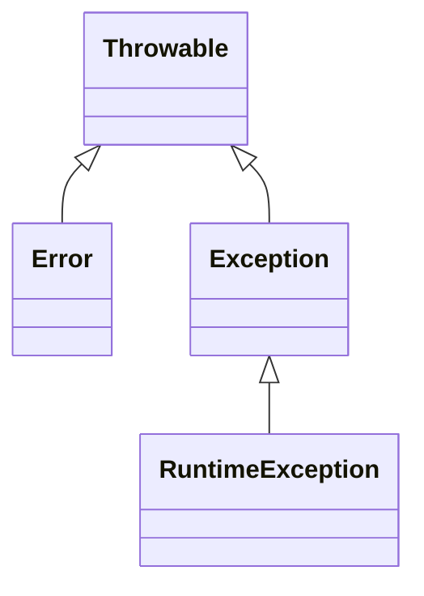

---
tags:
  - 面试
  - java基础
date: 2026-06-04
---
# 2024传智播客\-面试知识点

# 第一章 java基础

## 1、基础语法与面向对象

### 1\.1 重载与重写的区别

- 重载是对象的方法之间，它们方法名相同，但方法的参数列表不同

- 重写是父子类（包括接口与实现类）中两个同名方法，它们方法名相同，且方法的参数列表相同

- 重载在编译阶段，由**编译器**根据传递给方法的参数来区分方法，例如

    ```Java
    MyObject obj = ...
    obj.test(123);   // 应该是调用 test(int x) 这个方法
    obj.test("abc"); // 应该是调用 test(String x) 这个方法
    ```

- 而重写是在运行阶段，由虚拟机**解释器**去获取引用对象的实际类型，根据类型才能确定该调用哪个方法，例如

    ```Java
    Super obj = ...
    obj.test();     // 到底是调用父类，还是子类的 test 方法，必须检查引用对象的实际类型才能确定
    ```

- 有没有发生重写，可以使用 @Override 来检查


> ***P\.S\.***
> 
> - 括号内的说明是为了严谨，自己知道就行，回答时不必说出，这样比较简洁
> 
> - 个人觉得，在回答方法重载时，不必去细说什么参数的类型、个数、顺序，就说参数列表不同就完了
> 
> - 个人觉得，重点在于点出：重载是编译时由**编译器**来区分方法，而重写是运行时由**解释器**来区分方法
> 
> - 语法细节，问了再说，不问不必说
> 
>     - 重写时，子类方法的访问修饰符要 \&gt;= 父类方法的访问修饰符
> 
>     - 重写时，子类方法抛出的检查异常类型要 \&lt;= 父类方法抛出的检查异常类型，或子类不抛异常
> 
>     - 重写时，父子类的方法的返回值类型要一样，或子类方法返回值是父类方法返回值的子类
> 
> 

---

### 1\.2 == 与 equals 的区别

- 对于基本类型，== 是比较两边的值是否相同

- 对于引用类型，== 是比较两边的引用地址是否相同，用来判断是否引用着同一对象

- equals 要看实现

    - Object\.equals\(Object other\) 的内部实现就是 ==，即判断当前对象和 other 是否引用着同一对象

    - 比如 String，它的内部实现就是去比较两个字符串中每个字符是否相同，比较的是内容

    - 比如 ArrayList，它的内部实现就是去比较两个集合中每个元素是否 equals，比较的也是内容

---

### 1\.3 String，StringBuilder 和 StringBuffer 的区别

- 它们都可以用来表示字符串对象

- String 表示的字符串是不可变的，而后两者表示的字符串是内容可变的（可以增、删、改字符串里的内容）

- StringBuilder 不是线程安全的，StringBuffer 是线程安全的，而 String 也算是线程安全的

适用场景

- 大部分场景下使用 String 就足够了

- 如果有大量字符串拼接的需求，建议用后两者，此时

    - 此字符串对象需要被多线程同时访问，用 StringBuffer 保证安全

    - 此字符串对象只在线程内被使用，用 StringBuilder 足够了

另外针对 String 类是 final 修饰会提一些问题，把握下面几点

- 本质是因为 String 要设计成不可变的，final 只是条件之一

- 不可变的好处有很多：线程安全、可以缓存等

---

### 1\.4 说说 Java 中的异常



异常的重要继承关系如图所示，其中

- Throwable 是其它异常类型的顶层父类

- Error 表示无法恢复的错误，例如 OutOfMemoryError 内存溢出、StackOverflowError 栈溢出等

    - 这类异常即使捕捉住，通常也无法让程序恢复正常运行

- Exception 表示可恢复的错误，处理方式有两种

    - 一是自己处理，用 catch 语句捕捉后，可以进行一些补救（如记录日志、恢复初始状态等）

    - 二是用 throw 语句将异常继续抛给上一层调用者，由调用者去处理

- Exception 有特殊的子类异常 RuntimeException，它与 Exception 的不同之处在于

    - Exception 被称之为**检查**异常，意思是必须在语法层面对异常进行处理，要么 try\-catch，要么 throws

    - RuntimeException 和它的子类被称为**非检查**异常（也可以翻译为字面意思：运行时异常），在语法层面对这类异常并不要求强制处理，不加 try\-catch 和 throws 编译时也不会提示错误

- 常见的非检查异常有

    - 空指针异常

    - 算术异常（例如整数除零）

    - 数组索引越界异常

    - 类型转换异常

    - \.\.\.

---

## 2、集合类

### 2\.1 你知道的数据结构有哪些

线性结构

- 动态数组：相对于普通数组可以扩容

    - java 中 ArrayList 就属于动态数组

    - 数组的特点是其中元素是连续存储的

- 链表：由多个节点链在一起

    - java 中的 LinkedList 就属于链表

    - 链表的特点是其中元素是不连续存储的，每次需要根据当前节点，才能找到相邻节点

- 栈：符合 First In Last Out（先进后出）规则

    - java 中的 LinkedList 可以充当栈

    - 它的 push 方法向栈顶添加元素

    - 它的 pop 方法从栈顶移除元素

    - 它的 peek 方法从栈顶获取元素（不移除）

- 队列：符合 First In First Out（先进先出）规则

    - java 中 LinkedList 也可以充当队列

    - 它的 offer 方法用来向队列尾部添加元素（入队）

    - 它的 poll 方法用来从队列头部移除元素（出队）

非线性结构

- 优先级队列：在队列基础上增加了优先级，队列会根据优先级调整元素顺序，保证优先级高的元素先出队

    - java 中 PriorityQueue 可以作为优先级队列

    - 它底层用大顶堆或小顶堆来实现

    - 它适用于实现排行榜、任务调度等编码

    - 它特别适合于流式数据的处理，利用它能够大大节省内存

- Hash 表（哈希表，也叫散列表）：由多对 key \- value 组成，会根据 key 的 hash 码把它们分散存储在数组当中，其中 key 的 hash 码与数组索引相对应

    - java 中的 HashMap，Hashtable 都属于哈希表

    - 它特别适用于实现数据的快速查找

- 红黑树：可以自平衡的二叉查找树，相对于线性结构来说，拥有更好的性能

    - java 中的 TreeMap 属于红黑树

- 跳表：多级链表结构，也能达到与红黑树同级的性能，且实现更为简单

    - java 中的 ConcurrentSkipListMap 用跳表结构实现

    - redis 中的 SortedSet 也是用跳表实现

- B\+ 树：可以自平衡的 N 叉查找树

    - 关系型数据库的索引常用 B\+ 树实现


> ***P\.S\.***
> 
> - 以上数据结构不必全部掌握，根据自己实际情况，捡熟悉的回答即可
> 
> - 以上仅是这些数据结构的简述，关于它们的详细讲解，请参考黑马《数据结构与算法》课程：
> 
>     - 上篇 https://www\.bilibili\.com/video/BV1Lv4y1e7HL
> 
>     - 下篇 https://www\.bilibili\.com/video/BV1rv4y1H7o6
> 
> 

---

### 2\.2 说说 java 中常见的集合类

重要的集合接口以及实现类参考下图

```mermaid
classDiagram
class Collection {<<interface>>}
class List {<<interface>>}
class Set {<<interface>>}
class Map {
<<interface>>
entrySet()*
keySet()*
values()*
}
Collection <|-- List
Collection <|-- Set
List <|.. ArrayList
List <|.. LinkedList
List <|.. Vector
Set <|.. HashSet
Map <|.. HashMap
Map <|.. TreeMap
Map <|.. Hashtable
Map <|.. ConcurrentHashMap
HashMap <|.. LinkedHashMap
Set <-- Map
Collection <-- Map```

接口

- 接口四个：Collection、List、Set、Map，它们的关系：

    - Collection 是父接口，List 和 Set 是它的子接口

- Map 接口与其它接口的关系

    - Map 调用 entrySet\(\)，keySet\(\) 方法时，会创建 Set 的实现

    - Map 调用 values\(\) 方法时，会用到 Collection 的实现

List 实现（常见三个）

- ArrayList 基于数组实现

    - 随机访问（即根据索引访问）性能高

    - 增、删由于要移动数组元素，性能会受影响

    - 【进阶】但如果增、删操作的是数组尾部不牵涉移动元素

- LinkedList 基于链表实现

    - 随机访问性能低，因为需要顺着链表一个个才能访问到某索引位置

    - 增、删性能高

    - 【进阶】说它随机访问性能低是相对的，如果是头尾节点，无论增删改查都快

    - 【进阶】说它增删性能高也是有前提的，并没有包含定位到该节点的时间，把这个算上，增删性能并不高

- Vector 基于数组实现

    - 相对于前两种 List 实现是线程安全的

    - 【进阶】一些说法说 Vector 已经被舍弃，这是不正确的

Set 实现

- HashSet 内部组合了 HashMap，利用 Map key 唯一的特点来实现 Set

    - 集合中元素唯一，注意需要为元素实现 hashCode 和 equals 方法

    - 【进阶】Set 的特性只有元素唯一，有些人说 Set 无序，这得看实现，例如 HashSet 无序，但TreeSet 有序

Map 实现（常见五个）

- HashMap 底层是 Hash 表，即数组 \+ 链表，链表过长时会优化为红黑树

    - 集合中 Key 要唯一，并且它需要实现 hashCode 和 equals 方法

- LinkedHashMap 基于 HashMap，只是在它基础上增加了一个链表来记录元素的插入顺序

    - 【进阶】这个链表，默认会记录元素插入顺序，这样可以以插入顺序遍历元素

    - 【进阶】这个链表，还可以按元素最近访问来调整顺序，这样可以用来做 LRU Cache 的数据结构

- TreeMap 底层是红黑树

- Hashtable 底层是 Hash 表，相对前面三个实现来说，线程安全

    - 【进阶】它的线程安全实现方式是在 put，get 等方法上都加了 synchronized，锁住整个对象

- ConcurrentHashMap 底层也是 Hash 表，也是线程安全的

    - 【进阶】它的 put 方法执行时仅锁住一个链表，并发度比 Hashtable 高

    - 【进阶】它的 get 方法执行不加锁，是通过 volatile 保证数据的可见性


> ***P\.S\.***
> 
> - 未标注的是必须记住的部分
> 
> - 标注【进阶】的条目是该集合比较有特色的地方，回答出来就是**加分**项，不过也根据自己情况来记忆
> 
> 

---

### 2\.3 HashMap 原理（数据结构）

底层数据结构：数组\+链表\+红黑树

接下来的回答中要点出**数组的作用**，**为啥会有冲突**，**如何解决冲突**

- 数组：存取元素时，利用 key 的 hashCode 来计算它在数组中的索引，这样在没有冲突的情况下，能让存取时间复杂度达到 $O(1)$

- 冲突：数组大小毕竟有限，就算元素的 hashCode 唯一，数组大小是 n 的情况下要放入 n\+1 个元素，根据鸽巢原理，肯定会发生冲突

- 解决冲突：一种办法就是利用链表，将这些冲突的元素链起来，当然在在此链表中存取元素，时间复杂度会提高为 $O(n)$

接下来要能说出为什么在在链表的基础上还要有红黑树

- 树化目的是避免链表过长引起的整个 HashMap 性能下降，红黑树的时间复杂度是 $O(\log{n})$

有一些细节问题可以继续回答，比如树化的时机【进阶】

- 时机：在数组容量达到 \&gt;= 64 且链表长度 \&gt;= 8 时，链表会转换成红黑树

- 如果树中节点做了删除，节点少到已经没必要维护树，那么红黑树也会退化为链表

---

### 2\.4 HashMap 原理（扩容）

扩容因子：0\.75 也就是 3/4

- 初始容量 16，当放入第 13 个元素时（超过 3/4）时会进行扩容

- 每次扩容，容量翻倍

- 扩容后，会重新计算 key 对应的桶下标（即数组索引）这样，一部分 key 会移动到其它桶中

---

### 2\.5 HashMap 原理（方法执行流程）

以 put 方法为例进行说明

1. 产生 hash 码。

    - 先调用 key\.hashCode\(\) 方法

    - 为了让哈希分布更均匀，还要对它返回结果进行二次哈希，这个结果称为 hash

    - 二次哈希就是把 hashCode 的高 16 位与低 16 位做了个异或运算

2. 搞定数组。

    - 如果数组还不存在，会创建默认容量为 16 的数组，容量称为 n

    - 否则使用已有数组

3. 计算桶下标。

    - 利用 \(n \- 1\) \&amp; hash 得到 key 对应的桶下标（即数组索引）

    - 也可以用 hash % n 来计算，但效率比前面的方法低，且有负数问题

    - 用 \(n \- 1\) \&amp; hash 有前提，就是容量 n 必须是 2 的幂（如 16，32，64 \.\.\.）

4. 计算好桶下标后，分三种情况

    - 如果该桶位置还空着，直接根据键值创建新的 Node 对象放入该位置即可

    - 如果该桶是一条链表，沿着链表找，看看是否有值相同的 key，有走更新，没有走新增

        - 走新增逻辑的话，是把节点链到尾部（尾插法）

        - 新增后还要检查链表是否需要树化，如果是，转成红黑树

        - 新增的最后要检查元素个数 size，如果超过阈值，要走扩容逻辑

    - 如果该桶是一棵红黑树，走红黑树新增和更新逻辑，同样新增的最后要看是否需要扩容


> ***P\.S\.***
> 
> - 以上讲解基于 jdk 1\.8 及以上版本的 HashMap 实现
> 
> - 考虑到 jdk 1\.7 已经很少使用了，故不再介绍基于 1\.7 的 HashMap，有需求可以看 b 站黑马面试视频
> 
> 

---

## 3、网络编程

### 3\.1 说说 BIO、NIO、AIO

问这个问题，通常是考察你对 Web 应用高并发的理解

预备知识

- 开发 Web 应用，肯定分成客户端和服务器。

- 客户端与服务器交互，肯定得做这么几件事：

    1. 服务器线程**等待**有客户端**连接**上来

    2. 客户端真的连上来了，**建立连接**

    3. 客户端没有向服务器发送请求，此时服务器线程需要**等待数据**准备好

    4. 客户端向服务器发送请求，需要将请求**数据**从网卡**复制**到系统内存

- 上面 a\. c\. 这两个阶段，没有客户端连接，没有数据请求，这时是否需要一个线程时刻盯着？

    - 如果需要占用一个线程，那么就称线程被阻塞

    - 如果不需要线程盯着，线程可以腾出手来去干别的活，那么就称线程非阻塞

- d\. 阶段的数据复制，不会用到 CPU，也就是不会用到线程，同样也存在线程阻塞还是线程非阻塞两种情况


BIO（阻塞 I/O）

- 是指 b\. c\. d\.这几个阶段，线程都得阻塞，腾不出手干别的，即使此时它无所事事  

- 高并发下，阻塞线程多了，处理连接、处理请求的能力就会大受影响

    - 增加线程不可行，毕竟线程是有限资源，这是成本问题

    - 不增加线程也不行，没有新线程，没人去处理新连接，处理新请求


NIO（非阻塞 I/O）

- 是指 b\. c\. 这两个阶段，线程可以不阻塞，腾出手干别的（怎么干别的，要靠多路复用）

- 非阻塞 I/O 通常结合多路复用技术一起使用，能够在高并发下用少量线程处理大量请求

    - 多路复用是以**面向事件**的方式处理连接、处理请求，有事件发生才去处理，没有事件则不会占用线程

    - 使用了多路复用技术后，新客户端来了要连接，客户端发来了新请求，都会产生事件，把这些事件交给一个线程去统一处理就行了

    - 线程不会在高并发下存在无事可做的现象，它被充分压榨，利用率高


AIO（异步 I/O）

- NIO 在 d\. 这个阶段，线程仍需阻塞，不能被解放出来干其它活

- AIO 则更进一步，只需要提前准备好回调函数，在数据复制时线程被解放，该干嘛干嘛，等数据复制完毕，由系统使用另外线程来调用回调函数做后续处理

- AIO 在 Linux 下本质还是用多路复用技术来实现


小结

- BIO 并发性低，但代码更容易编写

- NIO 并发性高，不过代码编写困难

- AIO 并发性在 Linux 下没有本质提高，用的人少

- 【进阶】Java 21 起，正式支持虚拟线程

    - 配合虚拟线程时，仍然是以 BIO 方式来编写代码，代码编写容易

    - 虚拟线程非常廉价，线程不是不够吗，可劲加就行（不用担心线程闲置问题）

    - Java 21 重新实现了网络 API，虚拟线程底层也会配合多路复用机制，在代码易编写的情况下，兼具高性能


> ***P\.S\.***
> 
> - B 是 Blocking 阻塞
> 
> - N 是 Non\-Blocking 非阻塞
> 
> - A 是 Asynchronous 异步
> 
> 


## 4、IO流

分类

- 字节流，读写时以字节为单位，抽象父类是 InputStream 和 OutputStream

- 字符流，读写时以字符为单位，抽象父类是 Reader 和 Writer

- 转换流，用来把字节流转换为字符流，相关类：InputStreamReader 和 OutputStreamWriter

- 缓冲流，增加缓冲来提高读写效率，相关类：

    - BufferedInputStream

    - BufferedOutputStream

    - BufferedReader

    - BufferedWriter

- 对象流，配合序列化技术将 java 对象转换成字节流或逆操作，相关类：ObjectInputStream，ObjectOutputStream

---

## 5、线程与并发

### 5\.1 ThreadLocal 的原理

ThreadLocal 的主要目的是用来实现多线程环境下的变量隔离

- 【解释】即每个线程自己用自己的资源，这样就不会出现共享，既然没有共享，就不会有多线程竞争的问题


原理

- 每个线程对象内部有一个 ThreadLocalMap，它用来存储这些需要线程隔离的资源

- 资源的种类有很多，比如说数据库连接对象、比如说用来判断身份的用户对象 \.\.\.

- 怎么区分它们呢，就是通过 ThreadLocal，它作为 ThreadLocalMap 的 key，而真正要线程隔离的资源作为 ThreadLocalMap 的 value

    - ThreadLocal\.set 就是把 ThreadLocal 自己作为 key，隔离资源作为值，存入当前线程的 ThreadLocalMap

    - ThreadLocal\.get 就是把 ThreadLocal 自己作为 key，到当前线程的 ThreadLocalMap 中去查找隔离资源

- ThreadLocal **一定要记得**用完之后调用 remove\(\) 清空资源，避免内存泄漏

---

### 5\.2 解释悲观锁与乐观锁

悲观锁

- 像 synchronized，Lock 这些都属于悲观锁

- 如果发生了竞争，失败的线程会进入阻塞

- 【理解】悲观的名字由来：**害怕**其他线程来同时修改共享资源，因此用互斥锁让同一时刻只能有一个线程来占用共享资源

乐观锁

- 像 AtomicInteger，AtomicReference 等原子类，这些都属于乐观锁

- 如果发生了竞争，失败的线程不会阻塞，仍然会重试

- 【理解】乐观的名字由来：**不怕**其他线程来同时修改共享资源，事实上它根本不加锁，所有线程都可以去修改共享资源，只不过并发时只有一个线程能成功，其它线程发现自己**失败**了，就去**重试**，直至成功

适用场景

- 如果竞争少，能很快占有共享资源，适合使用乐观锁

- 如果竞争多，线程对共享资源的独占时间长，适合使用悲观锁


> ***P\.S\.***
> 
> - 这里讨论 Java 中的悲观锁和乐观锁，其它领域如数据库也有这俩概念，当然思想是类似的
> 
> 

---

### 5\.3 synchronized 原理

以重量级锁为例，比如 T0、T1 两个线程同时执行加锁代码，已经出现了竞争（代码如下）

```Java
synchronized(obj) { // 加锁
    ...
} // 解锁
```

1. 当执行到行1 的代码时，会根据 obj 的对象头**找到**或**创建**此对象对应的 Monitor 对象（C\+\+对象）

2. 检查 Monitor 对象的 owner 属性，用 Cas 操作去设置 owner 为当前线程，Cas 是原子操作，只能有一个线程能成功

    1. 假设 T0 Cas 成功，那么 T0 就加锁成功，可以继续执行 synchronized 代码块内的部分

    2. T1 这边 Cas 失败，会自旋若干次，重新尝试加锁，如果

        1. 重试过程中 T0 释放了锁，则 T1 不必阻塞，加锁成功

        2. 重试时 T0 仍持有锁，则 T1 会进入 Monitor 的等待队列阻塞，将来 T0 解锁后会唤醒它恢复运行（去重新抢锁）

---

### 5\.4【追问】 synchronized 锁升级

synchronized 锁有三个级别：偏向锁、轻量级锁、重量级锁，性能从左到右逐渐降低

- 如果就一个线程对同一对象加锁，此时就用偏向锁

- 又来一个线程，与前一个线程交替为对象加锁，但只是交替，没有竞争，此时要升级为轻量级锁

- 如果多个线程加锁时发生了竞争，必须升级为重量级锁

【说明】

- 自 java 6 开始对 synchronized 提供了锁升级功能，之前只有重量级锁

- 但从 java 15 开始，偏向锁被标记为已废弃，将来会移除（因为实际带来的性能提升不明显，某些情况下反而影响性能）

---

### 5\.5 对比 synchronized 和 volatile

并发编程需要从三个方面考虑线程安全，分别是：原子性、可见性、有序性

- volatile 修饰共享变量，可以保证它的可见性和有序性，但不能保证原子性

- synchronized 代码块，不仅能保证共享变量的可见性、有序性，同时也能保证原子性


> ***P\.S\.***
> 
> - 实际上用 volatile 去保证可见性和有序性，并不像上面那一句话描述的那么简单，可以参考黑马课程
> 
> 

---

### 5\.6 对比 synchronized 和 Lock

- synchronized 是关键字，Lock 是 Java 接口

- 前者底层是 C\+\+ 代码实现锁，后者是 Java 自己的代码来实现锁

- Lock 功能更多，比如可以选择是公平锁还是非公平锁、可以设置加锁超时时间、可打断等

- Lock 的提供多种扩展实现（例如读写锁），可以根据场景选择更合适的实现

- Lock 释放锁需要调用 unlock 方法，而 synchronzied 在代码块结束无需显式调用就可以释放锁

---

### 5\.7 线程池的核心参数

记忆七个参数

1. 核心线程数

    1. 核心线程会常驻线程池

2. 最大线程数

    1. 如果同时执行的任务数超过了核心线程数，且队列已满，会创建新的线程来救急

    2. 总线程数（新线程\+原有的核心线程）不超这个最大线程数

3. 存活时间

    1. 超过核心线程数的线程一旦闲下来，会存活一段时间，然后被销毁

4. 存活时间单位

5. 工作队列

    1. 如果同时执行的任务数超过了核心线程数，会把暂时无法处理的任务放入此队列

6. 线程工厂

    1. 可以控制池中线程的命名规则，是否是守护线程等（不太重要的参数）

7. 拒绝策略，队列放满任务，且所有线程都被占用，再来新任务，就会有问题，此时有四种拒绝策略：

    1. AbortPolicy 报错策略，直接抛异常

    2. CallerRunsPolicy 推脱策略，线程池不执行任务，推脱给任务提交线程

    3. DiscardOldestPolicy 抛弃最老任务策略，把队列中最早的任务抛弃，新任务加入队列等待

    4. DiscardPolicy 抛弃策略，直接把新任务抛弃不执行

---

## 6、JVM 虚拟机

### 6\.1 JVM 堆内存结构

堆内存的布局与垃圾回收器有关。

传统的垃圾回收器会把堆内存划分为：老年代和年轻代，年轻代又分为

- 伊甸园 Eden

- 幸存区 S0，S1

如果是 G1 垃圾回收器，会把内存划分为一个个的 Region，每个 Region 都可以充当

- 伊甸园

- 幸存区

- 老年代

- 巨型对象区

---

### 6\.2 垃圾回收算法

记忆三种：

1. 标记\-清除算法。优点是回收速度快，但会产生内存碎片

2. 标记\-整理算法。相对清除算法，不会有内存碎片，当然速度会慢一些

3. 标记\-复制算法。将内存划分为大小相等的两个区域 S0 和 S1

    1. S0 的职责用来存储对象，S1 始终保持空闲

    2. 垃圾回收时，只需要扫描 S0 的存活对象，把它们复制到 S1 区域，然后把 S0 整个清空，最后二者互换职责即可

    3. 不会有内存碎片，特别适合存活对象很少时（因为此时复制工作少）

---

### 6\.3【追问】伊甸园、幸存区、老年代细节

- 对象最初都诞生在伊甸园，这些对象通常寿命都很短，在伊甸园空间不足，会触发年轻代回收，还活着的对象进入幸存区 S0，年轻代回收适合采用标记\-复制算法

- 接下来再触发年轻代回收时，会将伊甸园和 S0 仍活着的对象复制到 S1，清空 S0，交换 S0 和 S1 职责

- 经过多次回收仍不死的对象，会**晋升**至老年代，老年代适合放那些长时间存活的对象

- 老年代回收如果满了，会触发老年代垃圾回收，会采用标记\-整理或标记\-清除算法。老年代回收时的暂停时间通常比年轻代回收更长


还会常问

晋升条件

- 注意不同垃圾回收器，晋升条件不一样

- 在 parallel 里，经历 15 次（默认值）新生代回收不死的对象，会晋升

    - 可以通过 \-XX:MaxTenuringThreshold 来调整

    - 例外：如果幸存区中的某个年龄对象空间占比已经超过 50%，那么大于等于这个年龄的对象会**提前晋升**


大对象的处理

- 首先大对象不适合存储在年轻代，因为年轻代是复制算法，对象移动成本高

- 注意不同垃圾回收器，大对象处理方式也不一样

- 在 serial 和 cms 里，如果对象大小超过阈值，会直接把大对象晋升到老年代

    - 这个阈值通过 \-XX:PretenureSizeThreshold 来设置

- 在 g1 里，如果对象被认定为巨型对象（对象大小超过了 region 的一半），会存储在巨型对象区

    - Region 大小是堆内存总大小 / 2048（必须取整为2的幂），或者通过 \-XX:G1HeapRegionSize 来设置


> ***P\.S\.***
> 
> 著名教材《深入理解Java虚拟机》一书关于这些论述，很多观点陈旧过时，需要带批判眼光来学习。例如在它的《内存分配与回收策略》这一章节，提到了这些：
> 
> - 对象优先在Eden分配（OK）
> 
> - 大对象直接进入老年代（没有提到 g1 情况）
> 
> - 长期存活的对象将进入老年代（即我上面讲的晋升条件，但没强调要区分垃圾回收器）
> 
> - 动态对象年龄判定（即提前晋升）
> 
> - 空间分配担保（已过时）文中提到的 \-XX:\+HandlePromotionFailure 参数在 jdk8 之后已经没了
> 
> 

---

## 7、Lambda表达式

什么是 Lambda 表达式

- 文献中把 Lambda 表达式一般称作**匿名函数**，语法为 `\(参数部分\) \-\&gt; 表达式部分`

- 它本质上是一个**函数对象**

- 它可以用在那些需要将**行为参数化**的场景，例如 Stream API，MyBatisPlus 的 QueryWrapper 等地方


Lambda 与匿名内部类有何异同

- 它们都可以用于需要行为参数化的场景

- Lambda 表达式必须配合函数式接口使用，而匿名内部类不必拘泥于函数式接口，其它接口和抽象类也可以

- Lambda 表达式比匿名内部类语法上更加简洁

- 匿名内部类是在编译阶段由程序员编写提供，而 Lambda 表达式是在运行阶段动态生成它所需的类

- 【进阶】Lambda 中 this 含义与匿名内部类中的 this 不同

---

## 8、反射及泛型

### 8\.1 反射

什么是反射

- 反射是 java 提供的一套 API，通过这套 API 能够在**运行期间**

    - 根据类名加载类

    - 获取类的各种信息，如类有哪些属性、哪些方法、实现了哪些接口 \.\.\.

    - 类型参数化，根据类型创建对象

    - 方法、属性参数化，以统一的方式来使用方法和属性

- 反射广泛应用于各种框架实现，例如

    - Spring 中的 bean 对象创建、依赖注入

    - JUnit 单元测试方法的执行

    - MyBatis 映射查询结果到 java 对象

    - \.\.\.

- 反射在带来巨大灵活性的同时也不是没有缺点，那就是反射调用效率会受一定影响

---

### 8\.2 泛型

什么是 Java 泛型

- 泛型的主要目的是实现**类型参数化**，java 在定义类、定义接口、定义方法时都支持泛型

- 泛型的好处有

    - 提供编译时类型检查，避免运行时类型转换错误，提高代码健壮性

    - 设计更通用的类型，提高代码通用性


【例如】想设计 List 集合，里面只放一种类型的元素，如果不用泛型，怎么办呢？你必须写很多实现类

- Impl1 实现类中，只放 String

- Impl2 实现类中，只放 Integer

- \.\.\.

- 要支持新的元素类型，实现类型也得不断增加，解决方法需要把元素类型作为参数，允许它可变化：List\&lt;T\&gt;，其中 T 就是泛型参数，它将来即可以是 String，也可以是 Integer \.\.\.


> ***P\.S\.***
> 
> - 【例如】是为了帮助你理解，不是必须答出来。
> 
> - 关键是答出类型参数化，懂的面试官不必多说，不懂的也没必要跟他继续啰嗦
> 
> 

---

## 9、Tomcat优化


> ***P\.S\.***
> 
> Tomcat 优化要从多方面综合考虑，如
> 
> - Tomcat JVM 参数调优
> 
> - Tomcat 线程池配置
> 
> - 网络配置优化
> 
> - 静态资源优化
> 
> - 日志记录优化
> 
> - \.\.\.
> 
> 篇幅原因，本题作答时只侧重其中线程池配置和网络配置这两方面
> 
> 


以 springboot（3\.2\.3） 中的 tomcat 配置为例

```Properties
server.tomcat.max-connections=8192
server.tomcat.accept-count=100
server.tomcat.threads.max=200
server.tomcat.threads.min-spare=10
```

- Tomcat I/O 模式默认采用 NIO，由于一般采用 Linux 系统，因此改成 NIO2 没有必要

- 这些配置项值都是 springboot 的默认值，这些值其实够用，根据情况调整，其中

    - max\-connections 控制最大连接数

    - accept\-count 控制连接队列中的连接数

    - threads\.max 控制线程池中最大线程数

    - threads\.min\-spare 控制线程池中最少备用线程数


【进阶】虚拟线程优化

- springboot（3\.2\.x）配合 jdk 21 可以使用虚拟线程来优化

    ```Properties
    spring.threads.virtual.enabled=true 
    ```

- 更早 springboot 想使用 jdk 21 虚拟线程，可以用替换 Tomcat 线程池的办法

    ```Java
    @Bean
    public TomcatProtocolHandlerCustomizer<?> tomcatProtocolHandlerCustomizer() {
        return protocolHandler -> protocolHandler
            .setExecutor(Executors.*newVirtualThreadPerTaskExecutor*());
    }
    ```

---

# 第二章 基础算法

## 1、加密算法

### 1\.1【问】请介绍一下你知道的加密算法

参考回答：

一般分类如下

1. 对称加密

2. 非对称加密

3. 哈希摘要

4. 电子签名

5. 密码存储

其中

- 对称加密常见的有：DES、AES 等，国家标准有 SM4

- 非对称加密常见的有：RSA，ECDSA 等，国家标准有 SM2

- 哈希摘要有：MD5、SHA\-2、SHA\-3 等，国家标准有 SM3

- 电子签名有：通常会结合 RSA、ECDSA 和哈希摘要完成签名，或者是 HMAC

- 密码存储：直接使用哈希摘要作为密码存储、加盐存储、BCrypt

---

### 1\.2【追问】解释对称加密、非对称加密、哈希摘要

- 对称加密

    - 加密和解密的密钥使用同一个

    - 因为密钥只有一个，所以密钥需要妥善保管

    - 加解密速度快

- 非对称加密

    - 密钥分成公钥、私钥，其中公钥用来加密、私钥用来解密

    - 只需将私钥妥善保管，公钥可以对外公开

    - 如果是双向通信保证传输数据安全，需要双方各产生一对密钥

        - A 把 A公钥 给 B，B 把 B公钥 给 A，他们各自持有自己的私钥和对方的公钥

        - A 要发消息给 B，用 B公钥 加密数据后传输，B 收到后用 B私钥 解密数据

        - 类似的 B 要发消息给 A，用 A公钥 加密数据后传输，A 收到后用 A私钥 解密数据

    - 相对对称加密、加解密速度慢

- 哈希摘要，摘要就是将原始数据的特征提取出来，它**能够代表原始数据**，可以用作数据的完整性校验

    - 举个例子，张三对应着完整数据

    - 描述张三时，会用它的特征来描述：他名叫张三、男性、30多岁、秃顶、从事 java 开发、年薪百万，这些特征就对应着哈希摘要，以后拿到这段描述，就知道是在说张三这个人

    - 为什么说摘要能区分不同数据呢，看这段描述：还是名叫张三、男性、30多岁、秃顶、从事 java 开发、月薪八千，有一个特征不符吧，这时可以断定，此张三非彼张三

---

### 1\.3【追问】解释签名算法

电子签名，主要用于**防止数据被篡改**。

先思考一下单纯用摘要算法能否防篡改？例如


- 发送者想把一段消息发给接收者

- 中途 message 被坏人改成了 massage（摘要没改）

- 但由于发送者同时发送了消息的摘要，一旦接收者验证摘要，就可以发现消息被改过了

坏人开始冒坏水


- 但摘要算法都其实都是公开的（例如 SHA\-256），坏人也能用相同的摘要算法

- 一旦这回把摘要也一起改了发给接收者，接收者就发现不了

怎么解决？


- 发送者这回把**消息连同一个密钥**一起做摘要运算，密钥在发送者本地不随网络传输

- 坏人不知道密钥是什么，自然无法伪造摘要

- 密钥也可以是两把：公钥和私钥。私钥留给发送方签名，公钥给接收方验证签名，参考下图

    - 注意：验签和加密是用对方公钥，签名和解密是用自己私钥。不要弄混


---

### 1\.4【追问】你们项目中密码如何存储？

- 首先，明文肯定是不行的

- 第二，单纯使用 MD5、SHA\-2 将密码摘要后存储也不行，简单密码很容易被彩虹表攻击，例如

    - 攻击者可以把常用密码和它们的 MD5 摘要结果放在被称作【彩虹表】的表里，反查就能查到原始密码

    |    加密结果|    原始密码|
    |---|---|
    |    e10adc3949ba59abbe56e057f20f883e|    123456|
    |    e80b5017098950fc58aad83c8c14978e|    abcdef|
    |    \.\.\.|    \.\.\.|

因此

- 要么提示用户输入足够强度的密码，增加破解难度

- 要么我们帮用户增加密码的复杂度，增加破解难度

    - 可以在用户简单密码基础上加上一段盐值，让密码变得复杂

    - 可以进行多次迭代哈希摘要运算，而不是一次摘要运算

- 还有一种办法就是用 BCrypt，它不仅采用了多次迭代和加盐，还可以控制成本因子来增加哈希运算量，让攻击者知难而退

---

### 1\.5【追问】比较一下 DES、AES、SM4

它们都是对称加密算法

- DES（数据加密标准）使用56位密钥，已经不推荐使用

- AES（高级加密标准）支持 128、192、256位密钥长度，在全球范围内广泛使用

- SM4（国家商用密码算法）支持 128位密钥，在中国范围内使用

---

### 1\.6【追问】比较一下 RSA、ECDSA 和 SM2

它们都是非对称加密算法

- RSA 的密钥长度通常为 1024\~4096，而 SM2 的密钥长度是 256

- SM2 密钥长度不需要那么长，是因为它底层依赖的是椭圆曲线、离散对数，反过来 RSA 底层依赖的是大数分解，前者在相同安全级别下有更快的运算效率

- SM2 是中国国家密码算法，在国内受政策支持和推广

- ECDSA 与 SM2 实现原理类似

---

## 2、排序

### 2\.1 【问】请介绍一下你知道的排序算法有哪些

#### 初级答法

常见的排序算法有：冒泡排序、选择排序、插入排序、快速排序、归并排序、堆排序等

> ***P\.S\.***
> 
> - 适合对以上排序算法一知半解，不太自信的同学，所谓***言多必失***，回答基本的就行
> 
> - 但要对接下来【各种排序的时间复杂度】的追问做到心中有数，这个必须背一背（参考后面的表格）
> 
> 


---

#### 进阶答法

排序算法大致可分为两类：

- A\. 基于比较的排序算法

- B\. 非比较排序算法

比较排序算法有：快排、归并、堆排序、插入排序等

非比较排序算法有：计数排序、桶排序、基数排序等

比较排序算法中

- 快排、归并、堆排序能够达到 $O(n \cdot \log{n})$的（平均）时间复杂度

- 而插入排序的（平均）时间复杂度是 $O(n^2)$

- 但并不是说复杂度高的算法就差，这要看数据规模和数据有序度，例如

    - 数据量小，或是有序度高的数据就适合用插入排序

    - 同样是数据量大的数据排序，如果数据的有序度高，归并优于快排

    - 快排虽然是比较排序中最快的算法，但若是分区选取不好，反而会让排序效率降低

    - 工业级的排序都是混合多种排序算法，例如 java 排序的实现就是混合了插入、归并与快排，不同的数据规模、不同场景下切换不同的排序算法

至于计数、桶、基数可以达到进一步让时间复杂度降至$O(n)$，当然这与被排序数字的位数、范围等都有关系，您想知道的话，咱们可以细聊。

> ***P\.S\.***
> 
> - 适合对这些排序算法非常熟悉的同学，这时应注重回答的条理性
> 
>     - 首先，对算法进行简单分类，让答案更为清晰
> 
>     - 其次，不要等面试官来继续追问，而是主动回答各个算法的时间复杂度和适用场景，体现你对它们的熟悉
> 
>     - 第三，一定要对各个算法的细节有充分准备，否则问到答不出来就尴尬了，这时不如降级为【初级答法】
> 
> 


---

### 2\.2【问】请说说 XX 算法最好、平均、最差时间复杂度、是否稳定 \.\.\.

此时的回答参考下面两张表

表A 比较排序算法

|**算法**|**最好**|**最坏**|**平均**|**空间**|**稳定**|**思想**|**注意事项**|
|---|---|---|---|---|---|---|---|
|冒泡|$n$|$n^2$|$n^2$|$1$|是|比较|数据有序，就能达到最好情况|
|选择|$n^2$|$n^2$|$n^2$|$1$|否|选择|交换次数一般少于冒泡|
|堆|$n \cdot \log{n}$|$n \cdot \log{n}$|$n \cdot \log{n}$|$1$|否|选择|<br>|
|插入|$n$|$n^2$|$n^2$|$1$|是|比较|数据有序，就能达到最好情况|
|希尔|$n \cdot \log{n}$|$n^\frac{3}{2}$|$n^\frac{4}{3}$|$1$|否|插入|有多种步长序列，它们的时间复杂度略有差异|
|归并|$n \cdot \log{n}$|$n \cdot \log{n}$|$n \cdot \log{n}$|$n$|是|分治||
|快速|$n \cdot \log{n}$<br>|$n^2$<br>|$n \cdot \log{n}$|$\log{n}$|否|分治|快排通常用递归实现，空间复杂度中的 $\log{n}$ 就是递归栈所花费的额外空间|

表B 非比较排序算法

计数排序

- 平均时间复杂度：$O(n+r)$，其中 $r$ 是数字的范围

- 空间复杂度: $O(n+r)$

桶排序

- 最糟时间复杂度：所有数字放入一个桶，此时又变成了一个桶内的比较排序，时间复杂度取决于桶内排序算法

- 平均时间复杂度：$O(\frac{n^2}{k}+n+k)$，若桶的个数 $k \approx n$，则可以认为整体时间复杂度为 $O(n)$

- 空间复杂度：$O(n+k)$

基数排序

- 一般配合桶排序实现，因此也会涉及到桶个数 $k$

- 平均时间复杂度：$O(w \cdot (n+k))$，其中 $w$ 是待排序数字的位数

- 空间复杂度：与桶排序空间复杂度相同，每次按位排序时，桶可以重用

---

### 2\.3【问】冒泡排序的实现思路

参考下图

1. 将整个数组分成【未排序】和【已排序】两个区域

2. 每一轮冒泡在【未排序】中从左向右，相邻两数进行比较（图中的 i 与 i\+1 处），若它们逆序则交换位置，当这一轮结束时，【未排序】中最大的数会交换至【已排序】

3. 这样进行多轮冒泡操作，【已排序】逐渐扩大，而【未排序】逐渐缩小，直至缩减为一，算法结束


> ***P\.S\.***
> 
> - 本图只展示了第一轮冒泡
> 
> - 上述回答话术偏向书面化，实际回答时应当更自由、更口语化一些，这样可以避免回答时刻板、雷同，但回答中的关键点不能少，这些关键点列举如下：
> 
>     1. 强调把数组分成**两个区域**：已排序、未排序
> 
>     2. 强调每轮冒泡是**从左向右，两两比较**
> 
>     3. **每轮冒泡的结果**：会将本次最大的数字交换到右侧
> 
> - 参考代码
> 
> ```Java
> static void bubbleSort(int[] arr) {
>     // n 为数组长度
>     int n = arr.length; 
>     // 外层循环控制冒泡次数，是数组长度减一
>     for (int j = 0; j < n-1; i++) {
>         // 内层循环表示本轮两两比较的次数，首轮 n-1, 次轮 n-2, 再次轮 n-3 ...
>         for (int i = 0; i < n-1-j; i++) {
>             // 若相邻数字逆序
>             if (arr[i] > arr[i+1]) {
>                 // 交换
>                 swap(arr, i, i+1);
>             }
>         }
>     }
> }
> ```
> 
> 

---

### 2\.4【追问】冒泡排序如何优化

怎么优化呢？每次循环时，若能给【未排序区】确定更合适的边界，则可以减少冒泡轮数

看下面的图


- 以前的实现，每轮只能冒泡一个数字

- 用 x 记录**最后一次交换时** i 的位置（索引1处），白话讲就是未排序区的右侧

- 后续比较 3与4 未交换、4与5 **未交换，说明它们都有序**，相当于一轮就冒泡了3个数字

- 实施此优化后，遇到有序数组，则排序时间复杂度可以降至$O(n)$

---

### 2\.5【追问】冒泡排序与其它排序算法比较

- 与**选择**比

    - 时间复杂度：都是 $O(n^2)$

    - 交换

        - 冒泡在相邻元素两两比较时，遇到逆序元素，立刻就要进行交换

        - 选择可以每轮的结束时，把最大元素交换到已排序区

        - 选择的交换次数（或者说元素的移动次数）更少

    - 稳定性

        - 冒泡是稳定排序

        - 选择是不稳定排序

    - 对有序数组排序

        - 冒泡可以优化，时间复杂度能降至$O(n)$

        - 选择不能优化

- 与**插入**比

    - 时间复杂度：都是 $O(n^2)$

    - 交换

        - 插入的交换次数更少

    - 稳定性

        - 二者都是稳定排序算法

    - 对有序数组排序

        - 都可以只比较一轮，无需交换，时间复杂度达到$O(n)$

- 与剩余的排序算法比较

    - 时间复杂度不在同一级别，无可比性

---

### 2\.6【问】选择排序的实现思路

参考下图

1. 将整个数组分成【未排序】和【已排序】两部分

2. 每一轮选出【未排序】中最大的元素，交换到【已排序】

3. 这样进行多轮选择操作，【已排序】逐渐扩大，而【未排序】逐渐缩小，直至缩减为一，算法结束


> ***P\.S\.***
> 
> - 图中展示了 4 轮选择，直至有序
> 
> - 还是建议在理解了关键点的基础上自由发挥，用自己语言描述算法
> 
> - 回答关键点
> 
>     - 两个区域：已排序、未排序
> 
>     - 每次选中未排序区域中最大元素（也可以选最小元素），交换至已排序区域
> 
> - 参考代码
> 
> ```Java
> static void sort(int[] a) {
>     // n 为数组长度
>     int n = a.length;
>     *// 进行 n - 1 轮选择，left 代表已排序区域的最左侧*
> *    *for (int left = n - 1; left > 0 ; left--) {
>         // 每次找到最大元素的索引
>         int max = left;
>         for (int i = 0; i < left; i++) {
>             if (a[i] > a[max]) {
>                 max = i;
>             }
>         }
>         // 本轮结束前，将最大元素交换到*已排序区域的最左侧*
>         swap(a, max, left);
>     }
> }
> ```
> 
> 

---

### 2\.7【追问】解释什么是不稳定排序

什么是稳定及不稳定排序算法，参照下图进行回答

- 有两个排序时取值相等的元素，比如图中的红桃五和黑桃五

- 如果这些相等元素排序前后的相对位置没有改变（都是红五前、黑五后）那么该排序算法是稳定的

- 如果这些相等元素排序前后的相对位置发生了改变（排序后变成了黑五前、红五后）那么该排序算法不稳定


---

### 2\.8【追问】为啥说选择排序是不稳定的

初始状态如下


- 最初 3 在 3\&\#39; 的左边

- 第一轮选中最大的5，交换4

- 第二轮选中最大的4，交换了 3\&\#39;

- \.\.\.

- 排序结束，3\&\#39; 跑到了 3 的左侧

过程可以参考下面的动画效果


---

### 2\.9【追问】选择排序与其它排序算法比较

- 同级别像插入、冒泡等都是稳定排序算法，而选择属于不稳定排序算法

- 它们的时间复杂度都一样，平均时间复杂度都是$O(n^2)$，不咋地

- 选择排序还应当与堆排序比较

    - 相似点：都是每轮选出最大元素，交换至已排序区域

    - 不同点：数据结构不同，选择排序底层是线性结构，而堆排序结构是大顶堆，这就造成每次选择的效率是堆结构更高

---

### 2\.10【问】插入排序的实现思路

参考下图

1. 将数组分成【已排序】（左边）和【未排序】（右边）两个区域

2. 每次从【未排序】的最左边拿出一个数，与已排序的数自右向左比较，直至找到合适位置，插入即可

3. 这样进行多轮插入操作，直至【未排序】中没有数，算法结束


> ***P\.S\.***
> 
> - 图中 low 指向的是【未排序】区域的最左侧，t 的值即要插入的值
> 
> - 回答前想一想自己平时是怎么摸牌、打牌的
> 
>     - 手上已经有 2、3、4、5 这几张排好的牌，又摸到一张 A，此时应该把它插到哪？
> 
>     - 手上的牌就是已排序区域，摸的新牌来自未排序区，从右找的话，那么就找比新牌小的那个位置插入
> 
> - 参考代码
> 
> ```Java
> static void sort(int[] a) {
>     // n 为数组长度
>     int n = a.length;
>     // low 代表未排序区域的最左侧
>     for (int low = 1; low < n; low++) {
>         // t 代表要插入的值
>         int t = a[low];        
>         // i 是已排序区域指针
>         int i = low - 1;
>         // 从右向左找比 t 小的位置
>         while (i >= 0 && a[i] > t) {
>             // 没找到，需要把当前的数向右移动一格，把位置空出来
>             a[i + 1] = a[i]; 
>             i--;
>         }
>         // i 在循环内多减了一次，因此 i+1 是插入位置
>         a[i + 1] = t;
>     }
> }
> ```
> 
> 

---

### 2\.11【追问】插入排序的适用场景

1. 数据规模较小

2. 数据有序度高

3. 链表排序

---

### 2\.12【追问】插入排序与其它排序算法比较

1. 插入排序优于时间复杂度同级的冒泡、选择，它既是稳定排序算法、又能对已排序数据达到$O(n)$的复杂度

2. 插入排序还经常与希尔排序比较，希尔排序可以看作插入排序的增强版

3. 工业排序实现中，会结合插入、快排、归并做混合排序

---

### 2\.13【问】归并排序的实现思路

参考下图，关键就三点：

1. 分 \- 一开始数组很大，不知道如何排序？

    1. 没事，每次从数组中间切一刀，处理的数据减少一半，数组划分成小数组

    2. 小数组若还是太大，继续划分。

2. 治 \- 小数组可以直接排序时，停止划分，每个小数组排好序。

3. 合 \- 已有序小数组两两合并，越合越大，最终求得整个问题的解。


> ***P\.S\.***
> 
> - 上图中，先执行【分】，把原始数组划分成 8、7、5、4、3、2、1、6 八个小数组，分到无可再分
> 
> - 每个小数组认为已有序，小数组已经【治】，开始【合】
> 
> - 两两合并：
> 
>     - 8 7 =\&gt; 78
> 
>     - 5 4 =\&gt; 45
> 
>     - 3 2 =\&gt; 23
> 
>     - 1 6 =\&gt; 16
> 
>     - 78 45 =\&gt; 4578
> 
>     - 23 16 =\&gt; 1236
> 
>     - 4578 1236 =\&gt; 12345678
> 
> - 参考代码
> 
> ```Java
> static void sort(int[] a1) {
>     // a1 是原始数组，a2 是临时数组
>     int[] a2 = new int[a1.length];    
>     split(a1, 0, a1.length - 1, a2);
> }
> 
> static void split(int[] a1, int left, int right, int[] a2) {
>     int[] array = Arrays.copyOfRange(a1, left, right + 1);
>     // 2. 治：当 left == right 表示只剩一个元素，此时已有序
>     if (left == right) {
>         return;
>     }
>     // 1. 分：m 表示每次划分的中间索引，然后两边继续递归，直到【治】后返回
>     int m = (left + right) >>> 1;
>     split(a1, left, m, a2);             
>     split(a1, m + 1, right, a2);       
>     // 3. 合：合并两个有序区间子数组，注意合并的结果暂存在 a2，要拷贝回 a1
>     merge(a1, left, m, m + 1, right, a2);
>     System.arraycopy(a2, left, a1, left, right - left + 1);
> }
> 
> // 合并数组中两个有序区间 [iStart,iEnd] 和 [jStart,jEnd]
> static void merge(int[] a1, int iStart, int iEnd, int jStart, int jEnd, int[] a2) {
>     int k = iStart;
>     int i = iStart;
>     int j = jStart;
>     while (i <= iEnd && j <= jEnd) {
>         if (a1[i] < a1[j]) {
>             a2[k] = a1[i];
>             i++;
>         } else {
>             a2[k] = a1[j];
>             j++;
>         }
>         k++;
>     }
>     if (i > iEnd) {
>         System.arraycopy(a1, j, a2, k, jEnd - j + 1);
>     }
>     if (j > jEnd) {
>         System.arraycopy(a1, i, a2, k, iEnd - i + 1);
>     }
> }
> ```
> 
> 

---

### 2\.14【追问】归并排序与其它排序算法比较

常见的是把它与快速排序比较

1. 相同点是，二者都基于分治思想，平均时间复杂度都能达到$O(n \cdot \log{n})$

2. 分治细节不同

    1. 归并是分到分无可分、在合并的过程中逐渐有序

    2. 快排是在每次分区时，就将比基准点小的换到左边分区，比基准点大的换到右边分区，不需要后面合的过程

3. 稳定性不同

    1. 归并是稳定的

    2. 快排是不稳定的

4. 时间复杂度有差异

    1. 归并，时间复杂度总会保持$O(n \cdot \log{n})$

    2. 快排，若基准点选择不好，两个分区划分不均匀，则会退化至 $O(n^2)$

---

### 2\.15【追问】归并排序能做哪些优化

1. 一种常见的优化是，如果切分后的小数组元素较少，可以切换为插入排序，而不必一定要等到元素个数切分至1

2. 归并排序通常用递归实现，可以考虑修改为迭代实现，减少递归开销

3. 归并排序可以改进为并行归并算法，提升多核 cpu 下的排序能力

---

### 2\.16【问】快速排序的实现思路

参考下图

1. 分区

    1. 在未排序区域内，选择最左侧元素作为基准点

    2. 把区域内比基准点小的元素交换到它左边，比基准点大的元素交换到它右边

    3. 分区结束，基准点已经排到了它正确的位置

2. 在基准点两边的区域重复上述分区过程，直至分区内只剩一个或没有元素时结束


> ***P\.S\.***
> 
> - 参考代码
> 
> ```Java
> static void sort(int[] a) {
>     quick(a, 0, a.length - 1);
> }
> 
> static void quick(int[] a, int left, int right) {
>     if (left >= right) {
>         return;
>     }
>     int p = partition(a, left, right);
>     quick(a, left, p - 1);
>     quick(a, p + 1, right);
> }
> 
> // 分区方法，在区域 left~right 内，找到基准点正确的索引值
> static int partition(int[] a, int left, int right) {
>     int i = left;
>     int j = right;
>     // pv 代表基准点的值
>     int pv = a[left];
>     while (i < j) {
>         // 从右找到 j 处比基准点小（或等于）的元素
>         while (i < j && a[j] > pv) {
>             j--;
>         }
>         // 从左找到 i 处比基准点大的元素
>         while (i < j && a[i] <= pv) {
>             i++;
>         }
>         // 它们位置不正确，交换
>         swap(a, i, j);
>     }    
>     // 把基准点交换到中间
>     swap(a, left, j);
>     // 此时，基准点左边都是比它小的，右边都是比它大的，返回基准点索引
>     return j;
> }
> ```
> 
> 

---

### 2\.17【追问】快速排序还有哪些优化手段

1. 分区不均衡会让快排效率变低。使用随机数作为基准点，避免选中最值基准点导致的分区不均衡

2. 如果基准点的重复值较多，则原来算法中的分区效果也不好，要想办法让这些重复值也分布均匀

3. 当分区内元素少到一定程度，可以切换为插入排序

---

### 2\.18【问】堆排序的实现思路

参考下图

1. 首先建立一个大顶堆，堆顶元素就是最大元素，把它交换到数组尾部，最大元素就排好序了

2. 交换到堆顶的元素破坏了堆特性，对它下潜，下潜完成后堆顶就成了第二大元素，再把它交换到数组尾部，二大元素也排好了

3. 这样依此类推，下潜=\&gt;堆顶元素交换=\&gt;下潜=\&gt;堆顶元素交换 \.\.\. 直至剩余一个元素，算法结束


> ***P\.S\.***
> 
> - 参考代码
> 
> ```Java
> public static void sort(int[] a) {
>     heapify(a, a.length);
>     for (int right = a.length - 1; right > 0; right--) {
>         swap(a, 0, right);
>         down(a, 0, right);
>     }
> }
> 
> // 建堆 O(n)
> private static void heapify(int[] array, int size) {
>     for (int i = size / 2 - 1; i >= 0; i--) {
>         down(array, i, size);
>     }
> }
> 
> // 下潜 O(log n)
> private static void down(int[] array, int parent, int size) {
>     // 比较 parent 和它的左、右孩子
>     while (true) {
>         int left = parent * 2 + 1;
>         int right = left + 1;
>         // max 代表 parent 和它的左、右孩子中最大值
>         int max = parent;
>         if (left < size && array[left] > array[max]) {
>             max = left;
>         }
>         if (right < size && array[right] > array[max]) {
>             max = right;
>         }
>         // 最大的就是 parent 自己
>         if (max == parent) { 
>             break;
>         }
>         // parent 与孩子中较大者交换
>         swap(array, max, parent);
>         // 继续下潜
>         parent = max;
>     }
> }
> ```
> 
> 

---

### 2\.19【追问】堆排序与其它排序算法比较

- 堆排序同级别排序方法有快排、归并等，它们的时间复杂度都是$O(n\cdot\log{n})$

- 堆排序中的下潜操作涉及到父元素与它的左右孩子交换，数据量较大时，父元素距离它的孩子较远，这样可能会造成（CPU）缓存未命中，增加内存访问成本。快排和归并则没有这个问题

> ***P\.S\.***
> 
> - 个人认为，堆相对于堆排序更为重要，它可以应用于优先级队列、TopK 问题 \.\.\. 
> 
> 

---

## 3、字符串类

### 3\.1、字符串反转

- 源于 Leetcode 344 题

- 举一反三 Leetcode 151 题（反转单词）

- 思路 \- 双指针

    1. 一开始，i 指针指向数组起始元素，j 指针指向数组结束元素，交换 i、j 指向的元素。

    2. i 向后移动，j 向前移动，重复以上过程 ，直至 i、j 相遇，算法结束。

- 参考代码

```Java
static void reverseString(char[] s) {
    *reverseString*(s, 0, s.length - 1);
}

static void reverseString(char[] s, int begin, int end) {
    int i = begin;
    int j = end;
    while (i < j) {
        *swap*(s, i, j);
        i++;
        j--;
    }
}

static void swap(char[] array, int i, int j) {
    char c = array[i];
    array[i] = array[j];
    array[j] = c;
}
```

---

### 3\.2、【问】说说你的项目中，哪里用到了字符串匹配技术

参考回答：

我的项目中，很多地方都会用到字符串匹配技术，主要采用正则匹配，例如：

1. 表单提交时，用它来校验数据，比如邮箱地址、电话号码、身份证号码等

2. 网页爬取时，使用正则抽取网页中的图片链接

3. 日志处理时，提取日志中的特定信息

4. 一些框架的配置路由规则时，是使用正则表达式来定义

5. 数据清洗时，使用正则表达式转换或清洗文本数据

6. 编辑代码时，使用正则来完成搜索或批量替换等操作

> **P\.S\.**
> 
> - 以上 6 点，不必面面俱到，应该是自己熟悉哪块，就重点准备哪块。
> 
> 

---

例1：表单校验，例如要校验手机号，则正则写作

```JavaScript
/^1\d{10}$/.test(手机号)
```

解释：

1. 其中 ^ $ 用来匹配开始和结束位置

2. 假设手机号规则是 1 开头，后面 10 位数字，因此这里用 \\d\{10\} 匹配后 10 个数字

---

例2：网页爬取时，抽取下面 html 代码中的图片链接

```HTML
const html = `


`
```

正则写作

```JavaScript
const htmlPattern = //g
let groups
while ((groups = htmlPattern.exec(html)) !== null) {
  console.log(`${groups[2]}`)
}
```

有一定难度，解释如下

1. `\(\[\&\#39;\&\#34;\]\)`用来匹配单引号或双引号，最外层的 `\(\)` 是对它分组，即第一组

2. 与第一组呼应的，`\\1` 代表引用第一组，前面是单引号 `\\1` 就是单引号，前面是双引号 `\\1` 就是双引号

3. `\(\.\+?\)`是第二组，就是引号中图片地址，其中 ? 用来避免贪婪

4. `\(\.\*?\)`是第三组，代表 alt 这部分内容

5. 最后遍历每次匹配结果，取到其中第二组，即为图片地址

---

例3：提取日志文件中的信息

日志文件如下

```JavaScript
const logData = `
[2022-01-01 12:30:45] - GET /home 200 OK
[2022-01-01 12:31:02] - POST /login 401 Unauthorized
[2022-01-01 12:32:15] - GET /products/123 404 Not Found
`
```

正则写作

```JavaScript
const logPattern = /\[.*?\] - (\w+) (\/\S+) (\d{3}) (\w+)/g;
let groups;
while ((groups = logPattern.exec(logData)) !== null) {
  console.log(`Method: ${groups[1]}, Path: ${groups[2]}, Status: ${groups[3]} ${groups[4]}`);
}
```

解释：正则表达式共分了 4 组

- 第一组匹配【请求方法】

- 第二组匹配【请求路径】，第一个 `/` 要转义，`\\S`表示非空格字符，不用`\\w`的原因是路径中可能有第二层`/`

- 第三组匹配【响应码】

- 第四组匹配【响应消息】

---

## 4、搜索类

### 4\.1、【问】请介绍一下二分查找算法

参考回答：

- 二分查找也称之为折半查找，是一种在***有序***数组内查找特定元素的搜索算法，非常高效，时间复杂度是$O(\log{n})$

- 它具体实现步骤是：

    - 定义两个指针 i、j，分别指向有序数组的起始和结束位置

    - 找到指针范围内中间元素

        - 如果目标 \&lt; 中间元素，则在左半部分继续搜索

        - 如果目标 \&gt; 中间元素，则在右半部分继续搜索

        - 如果目标 = 中间元素，则找到目标，算法结束

参考代码：

```Java
// a 为已排序数组，target 为搜索目标
static int binarySearch(int[] a, int target) {
    int i = 0, j = a.length - 1;
    while (i <= j) {
        // m 为中间索引，无符号右移是避免整数除法溢出
        int m = (i + j) >>> 1;
        // 目标小于中间元素，改动右边界（下次循环在左边搜索）
        if (target < a[m]) {
            j = m - 1;
        } 
        // 目标大于中间元素，改动左边界（下次循环在右边搜索）
        else if (a[m] < target) {
            i = m + 1;
        } 
        // 找到
        else {
            return m;
        }
    }
    // 未找到
    return -1;
}
```

---

### 4\.2、【问】请介绍什么是回溯算法

参考回答：

- 在求解问题的过程中，要记录每一步的状态，因为接下来的尝试有可能不成功，这时就需要回溯（其实就是撤销）到之前的某一步，换另一种方法继续尝试。

- 回溯通常结合递归来实现，因为递归栈保存了递归方法上次调用时各个变量的状态，用来实现回溯更为自然

- 回溯里还有个常见术语叫做剪枝。在递归过程中，通过条件检查减少一些不必要的递归，这称为剪枝

    - 因为多路递归的执行通常用一棵递归树表示，因此术语剪枝非常形象。

回溯举例，$N$ 皇后问题（在$N \cdot N$的棋盘上放置$N$个皇后，保证同一行、同一列、同一斜线上只有一个皇后）

1. 初始状态（图中白色表示没有冲突可以放置的格子，而红色表示不能放）


2. 第二行，第三列的格子放了一个皇后，可以看到接下来第三行格子冲突了，因此需要进行**回溯**撤销


3. 回溯到初始状态


4. 这回换成向第二行，第四列的格子放皇后，可以预见，接下来可以有一个解


---


# 第三章 web阶段

### 什么是HTTP协议 ?

- **必答内容：**

HTTP协议就是 \&\#34;超文本传输协议\&\#34;，规定了客户端与服务器端数据通信的规则。 而HTTP协议，它的底层，是基于TCP协议的，而TCP协议呢，是面向连接、安全且无状态的协议。

那在现在的Web开发中，基本上所有的请求都是基于HTTP协议 或 HTTPS协议的。


- **可能追问的问题：**

1\)\. 那HTTP协议与HTTPS协议的区别是什么 ?

- 那HTTP协议与HTTPS协议最大的区别，当然是数据传输的安全性了。 HTTP协议的信息是以明文传输，如果敏感信息被截取了，是可以直接获取传递的信息的。 相对之下，HTTPS协议是基于SSL加密传输的信息，可以确保数据的安全传输。

- 还有呢，就是端口不同。 HTTP协议默认端口 80，而HTTPS协议默认的端口 443。

所以说，HTTP协议的安全性没有HTTPS高，但是HTTPS协议会比HTTP耗费更多的服务器资源。


### HTTP协议中请求方式GET 与 POST 什么区别 ?

- **必答内容：**

那两种请求方式，使我们进行项目开发，最为常见的两种请求方式。 两者的区别主要有以下几点：

- 传递参数的大小限制不同。GET请求参数在URL中传递，所以参数的大小会收到URL长度的限制。 而POST请求，是在请求体中传递参数，只受到服务器端的配置限制。

- 安全性不同。 GET请求的参数暴露在URL中，安全性较低，不适合传递敏感信息。 而POST请求参数在HTTP消息体中传递，安全性相对较高。

- 应用场景不同。 GET请求一般用于获取数据，而POST请求则用于提交数据。


- **进阶回答：**

那在项目开发中，现在的url风格，基本都是restful风格。所以呢，项目开发中，请求方式除了GET、POST之外，还有像PUT、POST也是非常常用的。 


- **可能会继续追问的问题：**

你刚才提到Restful，什么是Restful，谈谈你的理解？

Restful其实就是一种软件架构风格，那既然是一种风格，就说明是可以被打破的，项目开发可以不按这套风格来。 但是我之前接触的项目，都是Restful风格的。 按照我的理解，Restful风格的两大特点：

- 通过请求url地址，来定位要操作的资源。（如：http://localhost:8080/users/1，通过这个url，我就知道对1号用户资源进行操作）

- 通过请求方式，来决定对资源进行什么样的操作。比如，GET 方式，就是用来查询的；POST方式，就是用来新增的；PUT方式，就是用来修改数据的；而DELETE方式就是用来删除数据的。


### HTTP协议中常见的状态码 ?

HTTP协议的状态码，大的方面来说，分为5类， 分别是1xx，2xx，3xx，4xx，5xx。而在项目开发中，最为常见的状态码有这么几个：

- 101：这个状态码，表示临时状态码，表示请求已经接受，服务器正在处理 （之前项目中，使用websocket时见到这个状态码）

- 200：这个状态码，是最常见的，表示请求成功。

- 302：表示重定向。

- 401：表示此次请求需要用户身份认证，未认证就响应401。

- 404：表示服务器无法找到对应的资源（请求路径找不到）。

- 500：服务器内部错误。


### 转发 与 重定向的区别？

这个在现在的前后端分离开发中，基本上就不存在对应的转发操作 和 重定向操作了。 

- **转发**是指服务器收到用户请求后，在服务器端将请求转发给另一个资源进行处理，然后将处理结果返回给用户，用户并不知道这个过程，是服务器内部完成的，整个过程只有一次请求。

- **重定向**是指当用户访问某个URL时，服务器返回一个特殊的响应码（3xx），并通过响应头（Location）告诉浏览器需要跳转到另一个URL。浏览器收到重定向响应后，会向新的URL发起新的请求，然后显示新页面的内容。整个过程对于浏览器来说是两次请求。

总的来说，重定向是在客户端发生的，浏览器需要重新发送请求；而转发是在服务器端发生的，对于客户端来说是透明的。


### Cookie会话跟踪的原理？

会话跟踪的方案有很多，比如像 Cookie、Session、以及令牌技术，都可以进行会话跟踪。

Cookie是属于客户端会话跟踪方案，是存储在客户端浏览器的。 当我们第一次访问服务器的时候，服务器会创建Cookie，并在响应头 `set\-Cookie` 中将Cookie响应给浏览器，浏览器接收到响应头之后，会自动将Cookie的值存储在浏览器中。

然后在后续的每一次请求中，浏览器都会自动的获取浏览器存储的Cookie值，并在请求头 `Cookie` 中将其携带到服务器，服务器就可以获取到Cookie中的数据了，从而完成会话跟踪\.


所以，总的来说，Cookie会话跟踪的原理，其实就是HTTP协议中规定的两个头信息：一个是响应头 `Set\-Cookie`，一个是请求头 `Cookie`。 但是由于Cookie存储在客户端浏览器，所以这种会话跟踪方案其实并不安全，因为用户是可以操作Cookie的（比如用户可以自己删除、禁用Cookie）。


**帮助理解的图示：**


### Session会话跟踪的原理？

Session是服务端会话跟踪方案，具体的机制是这样的：

- 首先，当用户首次访问网站的时候，服务器会为该用户创建一个会话对象Session，而每一个Session对象都有一个唯一标识ID，同一次会话中需要共享的数据，就可以存储在Session中。然后在服务器给客户端浏览器响应的时候，会将会话对象Session的ID在响应头 `Set\-Cookie` 中响应给浏览器。（Cookie的名字为JSESSIONID，Cookie的值为服务端会话对象Session的ID值）

- 浏览器接收到Cookie之后，就会自动将Cookie的值（JSESSIONID）存储起来，然后在后续访问服务器的时候，再将Cookie的值（JSESSIONID）携带到服务器。 在服务器中，就可以根据 JSESSIONID的值，找到对应的会话对象Session，从而操作会话对象Session中的数据了。


所以，总的来说，Sesssion会话跟踪的底层，其实还是基于Cookie实现的。 在Session会话跟踪的过程中，基于Cookie传递的其实就是Session会话对象的ID。

那这种方案，虽然Session存储在服务器端，用户无法操作，比较安全。 但是，在集群环境下Session的共享却是一个问题。


**帮助理解的图示：**


# 第四章 数据库

## 1、基本知识

### 1\.1 MySQL数据库中的 char 与 varchar的区别是什么? 

MySQL中的 `char` 和 `varchar` 都是用于存储字符串的数据类型，但它们在存储方式和性能上有所不同。以下是它们的主要区别：

第一点呢，就是存储方式不同：

- char：定长字符串，长度是固定的，不管实际存储的字符串长度如何，都会占用固定长度的存储空间。如：char\(10\) 会始终占用10个字符的空间。

- varchar：变长字符串，长度不固定。占用的空间与实际存储的字段长度有关。 如：varchar\(10\) 表示最多可以存储10个字符，如果存储的字符串长度不足10，假设为5，只会占用5个字符空间。

第二点呢，就是性能不同：

- 对于char，由于其固定长度，操作会快些，但是会存储浪费磁盘空间的问题。

- 对于varchar，由于长度可变，操作时会相对慢一点，但是可以节省磁盘空间，尤其是存储的数据长度不固定时。

所以呢，我们在设计表结构的时候，需要根据具体的场景来选择具体的数据类型。 就比如啊，如果是手机号、身份证号这样的字段，由于长度固定，我们就直接选择char类型即可，并指定长度，如：char\(11\)、char\(18\)。再比如，像用户名、备注信息这类长度不固定的，我们直接选择varchar类型，长度根据页面原型和需求文档确定。


### 1\.2 什么是事务以及事务的四大特性？

- **必答内容：**

事务是数据库中的基本概念，是指一组操作的集合，而这一组操作要么同时成功，要么同时失败，从而保证数据库中数据的正确性和完整性。

那事务呢，具有四大特性，也就是我们常说的ACID，分别是：原子性、一致性、隔离性、持久性。 那接下来，我就分别来聊聊这四大特性。

1\)\. 原子性指的是事务中的这一组操作，是不可分割的最小操作单元了，操作要么全部成功，要么全部失败。

2\)\. 一致性是指在事务操作的前后，必须使数据处于一致的状态。

3\)\. 隔离性指的是数据库中提供了隔离机制，保证事务在不受外部并发操作的影响的独立环境中运行。

4\)\. 持久性就比较简单了，就是事务一旦提交或回滚了，它对数据库的改变就是永久的。


- **可能继续发问的问题：**

1\)\. 你刚才提到了并发事务，那并发事务回引发哪些问题? 

并发事务引发的问题，主要有这么几个：

- 脏读：就是一个事务，读取到了另一个事务还没有提交的数据。

- 不可重复读：指的是在同一个事务中，先后读取同一条记录，但两次读取的数据不同。

- 幻读：指的是一个事务按照条件查询数据时，没有对应的行，但是插入时，又发现这行数据已经存在了好像出现了幻觉。


2\)\. 如何解决这些问题呢?

那这些问题，在数据库系统中都已经解决了。在数据库中提供了不同的隔离级别来解决这些问题， 分别有以下几种：

- READ UNCOMMITED ：读未提交。 这种隔离级别下，会出现脏读、不可重复读、幻读问题。

- READ COMMITED：读已提交。 这种隔离级别，解决了脏读问题，但是会出现不可重复读、幻读问题。

- REPEATABLE READ：可重复读。这种隔离级别，解决了脏读、不可重复读问题，但是会出现幻读问题。

- SERIALIZABLE：串行化。解决了上述所有的并发事务问题。

而在MySQL数据库中，默认的隔离级别是 `REPEATABLE READ`（可重复读）。


3\)\. 那为什么没有用`SERIALIZABLE`\(串行化\) 这种隔离级别呢?

其实，隔离级别，也不是越高越好。因为隔离级别高了，确实可以解决并发事务引发的问题，但是隔离级别越高，性能也越低。 


## 2、索引基础

### 2\.1 MySQL数据库索引的数据结构？

- **必答内容：**

在MySQL中的索引类型有多种哈，比如像B\+tree索引、Hash索引等，但在InnoDB存储引擎中默认使用的是B\+tree的索引。 


- **可能继续追问的问题：**

1\)\. B\+tree索引结构的特点是什么?

- B\+tree呢，也叫多路平衡搜索树，也就是一个节点中可以存储多个key，多个key，也就对应多个指针，大数据量的情况下，树的高度更低。（树的阶数更多，高度更低，检索更快）。

- 在B\+tree中，所有的数据都是存放在叶子节点的，非叶子节点，仅仅起到索引数据的作用。

- 而在B\+tree的叶子节点中，形成了一个双向链表，便于区间范围查询。


2\)\. 那为什么MySQL数据库的索引结构要采用B\+tree?

- 参考 2\.4 


### 2\.2 知道什么是聚簇索引，什么是二级索引吗？

- **必答内容：**

这个还是比较清楚的，因为这个是我们在项目中进行SQL语句优化的理论基础。

聚簇索引，有时候也称为聚集索引，他的特点呢就是数据与索引存放在一块儿，B\+tree的叶子节点保存了整行数据，而且在一张表中，聚簇索引有且仅有一个，默认主键索引就是聚簇索引。

二级索引，有时候也称为非聚簇索引 或 辅助索引，指的是数据和索引分开存储，B\+tree的叶子节点保存对应的主键，二级索引在一张表中可以有多个。


- **进阶内容（细节）：**

那刚才提到，默认主键索引就是聚簇索引；虽然在项目开发中我们建议每一张表都必须要添加一个主键，但是从数据库本身来说，一张表是可以没有主键的，那如果没有主键，MySQL数据库会自动的选择第一个非空的唯一索引作为聚簇索引；而如果一张表既没有主键，又没有唯一索引，那这个时候MySQL数据库又会自动生成一个rowID作为聚簇索引。简单说，一张表必须有且仅有一个聚簇索引。

所以，从这个角度讲，在二级索引的叶子节点中存储的其实是对应的聚集索引的值（如果有主键，就是主键值；没有主键，有非空的唯一索引，那就是唯一索引的值；如果既没有主键，也没有非空的唯一索引，那就是自动生成的rowID的值）。


- **帮助理解的图示：**


    - 聚簇索引的叶子节点中存储的data，就是这个主键对应的这一行的数据。

    - 二级索引叶子节点中存储的值，就是这个字段值对应的主键ID。


### 2\.3 什么是回表查询 ？

- **必答内容：**

在MySQL默认的InnoDB存储引擎中，有两类索引，分别是：聚簇索引和二级索引。 聚簇索引，他的特点呢就是数据与索引存放在一块儿，B\+tree索引结构的叶子节点保存了整行数据，而且在一张表中，聚簇索引有且仅有一个，默认主键索引就是聚簇索引。二级索引，指的是数据和索引分开存储，B\+tree的叶子节点保存对应的主键，二级索引在一张表中可以有多个。

所谓回表查询，就指的是，在执行这条SQL语句的时候，先根据二级索引去检索出对应的主键值；然后再根据主键值，到聚簇索引中查询出对应的数据，这个过程就叫回表查询。 所以回表查询，是需要扫描两次索引的，性能相对来说会差一些。


- **进阶内容：**

所以，在项目开发中，我们进行SQL优化的时候，如果需求允许的情况下，尽量避免回表查询，主要从以下几个方面来做：

1\)\. 业务允许的情况下，尽可能根据主键查询，使用聚集索引\-避免回表查询。

2\)\. 为表中的字段，根据业务需求创建合适的联合索引，查询时使用索引覆盖\-避免回表查询。

3\)\. 使用索引下推，减少回表查询的次数。【索引下推，是mysql5\.6之后提供的功能】


- **可能继续发问的问题：**

你刚才提到索引下推，简单聊聊什么是索引下推？

索引下推（Index Condition Pushdown），是MySQL5\.6后提供的功能，指的是在多条件查询SQL执行时，提前判断对应的搜索条件是否满足，满足了再去回表（就是将本应该在 server 层进行筛选的条件，下推到存储引擎层来进行筛选判断，这样能有效减少回表），通过减少回表次数进而提高查询效率。


### 2\.4 为什么MySQL索引结构是B\+tree ?

- **必答内容：**

其实这个问题，我们可以做一个假设啊。

- 假设索引结构是二叉搜索树、平衡二叉树 或 红黑树等，其实本质都是二叉树，一个节点下最多只能有两个子节点，如果这张表要存储的数据量比较大，二叉树的层级将会非常深，检索效率会很低。

- 而如果索引结构是Btree，在B树中，非叶子节点和叶子节点既要要存储key和指针，还要存放数据，而InnoDB的物理存储结构中，一页（Page）的大小是固定的，就是16KB。 那这一页中能够存储的key的数量并不多，就会造成大数据量情况下，树的层级较深，检索速度慢。 还有一个问题，就是由于 非叶子节点和叶子节点既要要存储key，还要存放数据，查找效率并不稳定。 （有些数据，只需要一次查找，有些数据，可能需要五六次，有些\.\.\.）

所以，在MySQL数据库中才使用了B\+tree作为索引的数据结构。 主要有以下优势：

- 在B\+tree中，非叶子节点并不存放数据，只存放key和指针，所以一页（Page）中能够容纳的key将更多，相同数据量的情况下，树的层级要浅的多，检索效率高。

- 所有的数据都存储在B\+tree的叶子节点中，也就意味着无论什么数据，都需要找到叶子节点才能查询到对应的数据，检索效率更加稳定。

- 第三是B\+树数据都存储在B\+tree的叶子节点，并形成了一个双向链表，便于区间范围查询。


- **可能继续发问的问题：**

那MySQL的B\+tree的索引结构，树的高度一般是多高呢？

嗯，这个高度其实是可以计算出来的，一般高度在2\-3层，如果高度为3，基本上就可以容纳一两千万的数据了。如何计算呢？

- 我们的索引是在页（Page）中存储的，而一个页的大小模式为（16KB）。

- 对于非叶子节点来说，页中存储的除了具体的key之外，还有一个就是指针 。\(假设主键为bigint占8个字节，指针占6个字节\)

- 那么我们就可以大概计算出一页中可以存储的key数量为：16 \* 1024 / 14 = 1170 。也就意味着一个页（Page）中约可以存1170个key

- 假设一行数据的大小为1KB，一页可以存16条数据。那两层的B\+tree可以容纳：1170\*16=18720条数据。

- 那三层的B\+tree可以容纳：1170 \* 1170 \* 16 = 21902400 条数据。


- **帮助理解的图示：**


## 3、索引优化

### 3\.1 索引创建的原则 ?

- **必答内容：**

好的，我们知道索引确实可以提高查询的效率，但前提是需要针对于数据库表创建合适的索引。创建索引的时候，主要考虑一下几点原则：

1\)\. 针对于数据量较大，且查询比较繁琐的表创建索引。（单表超过10w记录）

2\)\. 针对于经常作为查询条件（where）、排序（order by）、分组（group by）操作的字段建立索引。

3\)\. 尽量选择为区分度高的列建立索引，如果该字段是唯一的，建立唯一索引，效率更高。（区分度越高，效率越高）。

4\)\. 在varchar类型的字段上，建议指定索引长度（建立前缀索引），没必要对全字段建立索引，根据实际文本区分度决定索引长度就可以。

5\)\. 尽量建立联合索引，而且在联合索引中将区分度高的字段放在前面，减少单列索引。（查询时，联合索引很多时候可以索引覆盖，避免回表，提高效率）

6\)\. 在满足业务需求的前提下，建立适当的索引，索引不宜过多。（索引过多，会增加维护索引的成本，影响增删改的效率）


- **可能会继续发问的问题：**

1\)\. 索引的创建只是第一步，要想提高查询效率，还得正确的使用索引，避免索引失效，你知道索引失效的场景吗？ 【参照 3\.2】


### 3\.2 简单聊聊索引失效的场景 ?

- **必答内容：**

好的，索引失效这个问题，确实是在项目开发中非常常见的一类问题。那我就结合我之前的项目经验来聊一下，之前遇到的一些索引失效的场景：

- 第一类呢，就是在联合索引使用的时候，违反最左前缀法则，比如查询的条件并不是从索引最左边的列开始的。

- 第二类呢，就是范围查询（非等值查询）右侧的列，不能使用索引。

- 第三类呢，就是在索引列上进行运算或函数操作，索引将失效。非常典型的，像我们基于substring这样的函数截取字段值。

- 以及如果在条件匹配时，需要进行隐式类型转换的时候。比如：`where gender = 1`，而gender是char类型，这种字符串不加引号，虽然查也能查出来，但也会造成索引失效。

- 还有像常见的，以 % 开头的like模糊匹配，索引也会失效。

当然这样的场景很多啊，上面这几个只是比较常见的索引失效的场景，所以在项目开发中，编写SQL时，就要避免这些情况的发生。


- **进阶内容：**

而对于索引是否生效，到底走哪个索引，以及具体SQL语句的执行性能到底怎么样。 这个我们可以借助于 `explain` 来查看sql语句的执行计划 ，具体问题具体分析。

我们可以通过`explain`执行计划中的 `key` 来确定此次查询是否使用了索引，以及通过 `type` 来判定SQL的执行性能，一定要规避 `type` 为all全表扫描的情况，还有像 `extra` 的信息也需要关注一下。


- **可能继续发问的问题：**

你刚才提到最左前缀法则，那什么是最左前缀法则？

最左前缀法则是针对于联合索引的，指的是 查询从索引的最左列开始，并且不跳过索引中的列。如果跳跃某一列，索引将会部分失效\(后面的字段索引失效\)。

就比如，我按照 `name，profession，age` 这个顺序，针对于这三个字段，创建了联合索引。那么此时如何是根据 `name` 查询是会走联合索引的；根据 `name, profession` 也是会走索引的；根据 `name，profession，age`  也会走索引。但是如果根据 `profession` 或 `profession，age` 查询是不会走索引的，因为没有从最左边的字段 `name` 开始查询。


- **帮助理解的图示及说明：**


## 4、SQL性能分析及优化

### 4\.1 如何定位出项目中的慢SQL?

- **必答内容：**

这个问题，在项目开发中，是非常常见的。 在我们之前的项目中，用到了链路追踪组件 SkyWalking，通过SkyWalking我们就能够知道，所有请求的调用链路及执行耗时，在显示的报表中，我们就可以看出哪一个接口比较慢，也可以看到这个接口执行过程中，每一个部分的具体耗时，包括SQL的执行具体时间也都可以看到，通过这个就可以定位慢SQL了。

那如果在一些项目中，没有用到这类的监控工具，也可以开启MySQL的慢查询日志，通过MySQL的慢查询日志来定位慢SQL。比如：我们可以在配置文件中配置一下，只要SQL语句的执行耗时超过1秒，我就需要将其记录在慢查询日志中，最终我们只需要通过这份慢查询日志，就能够知道哪些SQL的执行效率比较低。


- **可能继续问道的问题：**

而具体执行耗时多长时间才算慢 ，时间一般设置为多长呢？

这个时间，其实没有一个定数，不同性质的项目之间也有差异，所以这个慢查询的界定时间，一般都要根据项目的情况来设置一个经验值，我们之前的项目中，设置的是1秒。


### 4\.2 在项目中如何知道SQL语句的执行性能，以及索引是否生效？

- **必答内容：**

这个我们可以借助于MySQL中提供的 explain 关键字，在查询的SQL语句之前，加上explain来查询SQL语句的执行计划。

当然explain查看到的执行计划信息比较多，我们主要关注几个核心指标就可以了。比如：

- 通过 key 、key\_len 就能够知道是否命中索引。

- 通过 type 指标，就能知道该SQL的性能怎么样，有没有进一步优化的可能。一定要规避all全表扫描的情况。 type指标性能由好到坏，依次是：NULL \&gt; system \&gt; const \&gt; eq\_ref \&gt; ref \&gt; range \&gt; index \&gt; all

- 还需要关注一个指标，就是extra额外的信息。 通过这一项，我们就能够知道，有没有回表查询，有没有涉及到file sort排序。

然后，我们就可以针对 explain 查看到的执行计划，针对于SQL进行优化了。


### 4\.3 谈谈你在SQL优化方面的经验？

- **必答内容：**

嗯，这个话题就比较大了。 那我们在项目中，优化SQL的查询执行效率，会从多个维度来考虑的。

- 第一个呢，就是表的设计。

    - 比如数据类型的选择，数值类型到底选择 tinyint、int还是bigint，要根据实际需要选择。字符串类型，到底选择char还是varchar，也需要根据具体业务确定。（char定长字符串，效率高；varchar变长字符串，效率略低）

    - 还需要考虑主键的设计，主键在设计时，尽量考虑递增顺序插入的主键，比如：自增主键 或 雪花算法生成的主键。（这样可以规避页分裂、页合并现象的产生）

    

- 第二个呢，就是索引的创建。

    - 针对于数据量较大，且查询比较繁琐的表创建索引。（单表超过10w记录）

    - 针对于经常作为查询条件（where）、排序（order by）、分组（group by）操作的字段建立索引。

    - 尽量选择为区分度高的列建立索引，如果该字段是唯一的，建立唯一索引，效率更高。（区分度越高，效率越高）。

    - 在varchar类型的字段上，建议指定索引长度（建立前缀索引），没必要对全字段建立索引，根据实际文本区分度决定索引长度就可以。

    - 尽量建立联合索引，而且在联合索引中将区分度高的字段放在前面，减少单列索引。（查询时，联合索引很多时候可以索引覆盖，避免回表，提高效率）

    - 在满足业务需求的前提下，建立适当的索引，索引不宜过多。（索引过多，会增加维护索引的成本，影响增删改的效率）


- 第三个呢，就是索引的使用。

    - 编写DQL时，在满足业务需要的情况下，要尽量避免索引失效的情况。 【索引失效的情况，见 3\.2】

    - 尽量使用索引覆盖，避免回表查询，提高性能。

    - 那这些情况呢，都可以通过 `explain` 关键字来查看SQL语句的执行计划。


- **进阶回答：**

    - 那如果从数据库层面来讲，也可以基于读写分离的模式，来降低单台服务库的访问压力，从而提高效率。 

    - 当然，如果数据量过大，也可以考虑对目前项目中的数据库进行分库分表处理。


# 第五章 Spring框架

## 谈谈你对Spring IOC 与 DI的理解 ?

嗯，好的 \~

- Spring的IOC，翻译过来，叫控制反转。 指的是在Spring中使用工厂模式，为我们创建了对象，并且将这些对象放在了一个容器中，我们在使用的时候，就不用每次都去new对象了，直接让容器为我们提供这些对象就可以了。 这就是控制反转的思想。

- 而DI，翻译过来，叫依赖注入。 那刚才提到，现在对象已经交给容器管理了，那程序运行时，需要用到某个对象，此时就需要让容器给我们提供，这个过程呢，称之为依赖注入。


**可能继续追问的问题：**

- 那如何将一个对象，讲给IOC容器管理呢？ 

那现在项目开发，都是基于Springboot构建的项目，所以呢，声明bean对象，我们只需要在对应的类上加上注解就可以了。 比如：

- 如果是controller层，直接在类上加上 `@Controller`  或  `@RestController` 注解。

- 如果是service层，直接在类上加上 `@Service` 注解。

- 如果是dao层，直接在类上加上 `@Repository` 注解。当然现在基本都是Mybatis 或 MybatisPlus，所以这个注解很少用了，都用的是 `@Mapper` 注解。

- 如果是一些其他的工具类、配置类啊，我们可以通过 `@Component` 、`@Configuration` 来声明。


- 那如何完成依赖注入操作呢 ?

    依赖注入的方式比较多，我们可以使用构造函数注入 或 成员变量输入，也是使用对应的注解就可以了。常用的注解有两个：

    - `@Autowired` 和 `@Resource` 注解。 那 `@Autowired` 默认是根据类型注入，而 `@Resource` 注解默认是根据名称注入。


## Spring容器中的bean是线程安全的吗?

不是线程安全的。

针对于这个问题呢，首先我们知道spring容器的bean默认是单例的。 当多用户同时请求一个服务时，容器会给每一个请求分配一个线程，这时多个线程会并发执行该请求对应的业务逻辑，也就是bean对象的业务方法，那如果在业务方法中操作了共享的成员变量，那可能就会存在线程安全问题。


而在Spring框架中并没有对单例bean进行任何多线程的封装处理，关于单例bean的线程安全和并发问题需要我们自行去搞定。但实际上，大部分情况下Spring 的bean并没有可变的状态\(比如Controller、Service、Dao\)，所以在某种程度上说Spring的单例bean是线程安全的。

如果说存在这种情况，那就需要开发人员自行保证线程安全。要么，通过编码保证线程安全，要么，设置bean的作用域为 prototype。


## **Spring Bean的作用域如何设置，常见的取值有哪些 ？**

Spring Bean的作用域可以通过 `@Scope` 注解来设置。常见的取值如下：

- singleton ：这种bean范围是默认的，这种范围确保不管接受到多少个请求，每个容器中同一个名称的bean只有一个实例，也就是单例的 。

- prototype ：这种范围，表示非单例的。也就是说每一次用到的bean都是一个新的 。

- request ：同一个请求，使用的是同一个bean。会为每一个来自客户端的请求都创建一个实例，在请求完成以后， bean会失效并被垃圾回收器回收 。

- session：与request 请求范围类似，确保每个session会话范围内，是同一个实例，在session过期后， bean会随之失效 。

虽然，bean作用域可以设置这些值，但是在项目开发中，绝大部分的bean都不会添加这个 `@Scope` 注解，也就是说默认都是用的是单例的bean。


## Spring容器的bean什么时候初始化的?

嗯\~ 这个得分情况来看哈。

- 如果是单例的bean，默认是Spring容器启动的时候，就完成bean的初始化操作，那这是默认情况，我们可以通过 @Lazy 注解来延迟bean的初始化，延迟到第一次使用的时候。

- 而如果是非单例的bean（也就是prototype），则是在每次使用这个bean的时候，都会重新实例化一个新的bean。


## 聊一聊Bean的生命周期 ？

额，这个详细的步骤还是挺多的，我之前看过一些源码，我就挑几个主要的步骤说一下，大概流程是这样的。

首先会通过一个非常重要的类，叫做BeanDefinition获取bean的定义信息，这里面就封装了bean的所有信息，比如，类的全路径，是否是延迟加载，是否是单例等这些信息。

- 第一步在创建bean的时候，就是调用构造函数实例化bean。

- 第二步是bean的依赖注入，比如一些set方法注入，像平时开发用的`@Autowired`都是这一步完成。

- 第三步是处理Aware接口，如果某一个bean实现了Aware接口（包括BeanNameAware、BeanFactoryAware、ApplicationContextAware）就会重写方法执行。

- 第四步是bean的后置处理器BeanPostProcessor的postProcessBeforeInitialization方法运行，这个是前置增强。

- 第五步是初始化方法执行，比如实现了接口InitializingBean或者自定义了方法init\-method标签或@PostContruct。

- 第六步是执行了bean的后置处理器BeanPostProcessor的postProcessAfterInitialization方法运行，这个是前置增强主要是对bean进行增强，有可能在这里产生代理对象。

- 到此，spring容器的bean已经创建完毕了，业务逻辑运行。

- 最后一步是销毁bean，比如自定义的方法destroy\-method或@PreDestroy执行。


## 聊一聊Spring中bean的循环依赖问题 ？

嗯，好的，首先我来解释一下循环依赖。

循环依赖其实就是循环引用,也就是两个或两个以上的bean互相持有对方，最终形成闭环，比如A依赖于B，B依赖于A。

循环依赖在spring中是允许存在，spring框架通过内部的三级缓存来解决了大部分的循环依赖问题。三级缓存，每一级缓存的作用如下：

①一级缓存：`singletonObjects` 单例池，缓存已经经历了完整的生命周期，已经初始化完成的bean对象

②二级缓存：`earlySingletonObjects` 缓存早期的bean对象（生命周期还没走完，半成品的bean）

③三级缓存：`singletonFactories` 缓存的是ObjectFactory，表示对象工厂，用来创建某个对象的（比如创建代理对象）


具体的流程大概是这个样子的 ：

第一，先实例A对象，同时会创建ObjectFactory对象存入三级缓存singletonFactories  

第二，A在初始化的时候需要B对象，这个走B的创建的逻辑

第三，B实例化完成，也会创建ObjectFactory对象存入三级缓存singletonFactories  

第四，B需要注入A，通过三级缓存中获取ObjectFactory来生成一个A的对象同时存入二级缓存，这个是有两种情况，一个是可能是A的普通对象，另外一个是A的代理对象，都可以让ObjectFactory来生产对应的对象，这也是三级缓存的关键

第五，B通过从通过二级缓存earlySingletonObjects  获得到A的对象后可以正常注入，B创建成功，存入一级缓存singletonObjects  

第六，回到A对象初始化，因为B对象已经创建完成，则可以直接注入B，A创建成功存入一次缓存singletonObjects 

第七，二级缓存中的临时对象A清除 


> PS：如下代码、图示帮助理解：
> 
> 

```Java
@Component
public class A {
    @Autowired
    private B b;  
}
```

```Java
@Component
public class B {   
    @Autowired
    private A a;   
}
```

就比如A类中，需要依赖注入一个属性B; 而B类中，也需要依赖注入一个A属性。 那么当在实例化bean的时候就会出现如下现象：

A\. 假设先获取到A的构造函数，然后通过构建函数创建A对象。

B\. 然后A对象创建后，根据A的生命周期，还需要为其注入依赖的bean对象，A中依赖了B对象，所以此时会到一级缓存`singletonObjects` 单例池中查找B类对象的bean对象，拿来赋值给A对象的b属性。如果一级缓存\(单例池\)中，没有这个对象，紧接着就会去创建B对象。

C\. 那么在创建B类的Bean的过程中，首先调用B类的构造函数，来创建B对象，然后接下来就要进行依赖注入，注入属性A，此时发现，一级缓存`singletonObjects` 单例池中并没有A类对应的B，那么此时，又会去创建类A这个bean。 此时，就出现了循环依赖。


那如何解决循环依赖呢? 要想打破上述的缓存，就需要一个中间人的参与，这个中间人就是二级缓存。

A类的Bean在创建过程中，在进行依赖注入之前，先把A的原始对象放入二级缓存（提早暴露，只要放到缓存了，其他Bean需要时就可以从缓存中拿了）。

放入缓存后，再进行依赖注入，此时A类的Bean依赖了B类的Bean，如果B类的Bean不存在，则需要创建B类的Bean，而创建B类的Bean的过程和A类一样，也是先创建一个B类的原始对象，然后把B类的原始对象提早暴露出来放入缓存中，然后在对B类的原始对象进行依赖注入A，此时能从二级缓存中拿到A类的原始对象（虽然是A类的原始对象，还不是最终的Bean），B类的原始对象依赖注入完了之后，B类的生命周期结束，那么A类的生命周期也能结束。

因为整个过程中，都只有一个A原始对象，所以对于B而言，就算在属性注入时，注入的是A原始对象，也没有关系，因为A原始对象在后续的生命周期中在堆中没有发生变化。

这样，就解决了循环依赖的问题。


如果我们在项目中使用了AOP，基于AOP为类生成了代理对象，此时，靠上述的两级缓存就解决不了循环依赖问题了，那这个时候就需要借助于第三级缓存 `singletonFactories` 来解决了。


> A\. singletonObjects :  一级缓存，缓存经过了完整生命周期的bean
> 
> B\. earlySingletonObjects :  二级缓存，缓存原始对象，也就是半成品的bean
> 
> C\. singletonFactories : 三级缓存，缓存的是一个ObjectFactory，主要用来去生成原始对象进行了AOP之后得到的代理对象，在每个Bean的生成过程中，都会提前暴露一个工厂，这个工厂可能用到，也可能用不到，如果没有出现循环依赖依赖本bean，那么这个工厂无用，本bean按照自己的生命周期执行，执行完后直接把本bean放入singletonObjects中即可，如果出现了循环依赖依赖了本bean，则另外那个bean执行ObjectFactory提交得到一个AOP之后的代理对象\(如果有AOP的话，如果无需AOP，则直接得到一个原始对象\)。
> 
> 


## 构造函数的循环依赖，三级缓存可以解决吗？

嗯\~ 构造函数的循环依赖，三级缓存是解决不了的。

这是因为，由于bean的生命周期中，构造函数是第一个执行的，如果在执行构造函数的时候，发现依赖了另外一个bean，并且是循环依赖，spring框架是解决不了的，此时就需要我们手动解决，当然解决方案，也很简单，通过一个注解就搞定了， 就是 `@Lazy` 注解，通过这个注解实现延迟加载，什么时候需要对象，再进行bean对象的创建。


> PS：下面代码，只为帮助理解和演示：
> 
> 

```Java
@Component
public class A {
    private B b;
    public A(@Lazy B b){
        System.out.println("A的构造函数执行了...")
        this.b = b;
    }
}
```

```Java
@Component
public class B {
    private A a;
    public B(A a){
        System.out.println("B的构造函数执行了...")
        this.a = a;
    }
}
```


## 什么是AOP ? 

aop是面向切面编程，在spring中用于将那些与业务无关，但却对多个对象产生影响的公共行为和逻辑，抽取公共模块复用，降低耦合，一般像系统的公共日志记录，事务处理，权限的控制等都可以通过AOP来实现。


**可能继续追问的问题：**

1\)\. 你们项目中有没有使用到AOP？

这个很多地方都用到了，比如我们当时在后台管理系统中，就是使用aop来记录了系统的操作日志、以及权限控制。那就来说一下，记录日志的操作思路吧。

主要思路是这样的，使用aop中的环绕通知 加上 基于注解`@annotation` 的切点表达式来实现的。

- 首先，自定义了一个注解，比如叫 @Log，然后哪些操作需要记录日志，我们就在哪些方法上加上这个注解。

- 然后再定义一个切面类，通过环绕通知，来获取原始方法在运行的各项信息，比如：类信息、方法信息、注解、请求方式、请求参数、当前操作人、操作时间、返回值等信息，全部记录下来，保存在数据库中。

当时，我们主要记录的是一些核心业务模块的增删改的操作日志，主要便于数据追踪。


2\)\. AOP的底层是如何实现的？

SpringAOP的底层主要是通过动态代理技术实现的，主要是两种代理技术。一种是JDK的动态代理，而JDK的动态代理呢，有限制，只能针对于实现了接口的类做代理，所以，在spring中还有一种是Cglib动态代理，那Cglib动态代理呢，就没有这个限制。


3\)\. JDK动态代理 与 Cglib动态代理有什么区别呢？

- 限制不同。 JDK动态代理，要求被代理对象必须实现了接口才可以。 而Cglib动态代理，无论是否实现接口都可以（只要类不是final修饰即可）。

- 代理对象不同。 JDK动态代理生成的代理对象，与被代理对象其实是实现了相同的接口，可以说是兄弟关系。 而Cglib动态代理生成的代理对象，其实是继承了被代理类，是基于继承体系的，所以是父子关系。 也正是因为此，所以Cglib不能为被final修饰的类做代理。


## Spring中的事务是如何实现的？

spring实现的事务本质就是aop完成，对方法前后进行拦截，在执行方法之前开启事务，在执行完目标方法之后根据执行情况提交或者回滚事务。 而如果我们进行项目开发，不存在分布式事务问题，我们就可以直接使用Spring提供的`@Transactional`注解来控制事务即可。


**可能继续发问的问题:**

1\)\. 在开发中，有没有遇到事务失效的场景 ？

在刚开始上班做项目时，遇到过，但是现在在做项目，写代码时，都会规避这些坑。 事务失效比较典型的场景呢就是：

- 第一个，如果业务方法上try、catch处理，自己处理了异常，没有抛出，就会导致事务失效，所以一般处理了异常以后，别忘了抛出去就行。

- 第二个，如果方法抛出检查异常，如果报错也会导致事务失效，因为默认spring事务管理只会针对于RuntimeException进行回滚。那这个呢，就可以在spring事务的注解上，就是@Transactional上配置rollbackFor属性为Exception\.class，这样别管是什么异常，都会回滚事务。

- 第三个，是我早期开发中遇到的一个，如果业务方法上不是public修饰的，也会导致事务失效。

嗯，就能想起来那么多


2\)\. 什么是事务的传播行为 ?

Spring的事务传播行为，指的是两个被事务控制的方法，相互调用的过程中，到底是加入到已存在的事务，还是创建一个新的事务，控制的是这个事儿。 我们设置事务的传播行为，可以通过 @Transactional 注解的propagation属性来设置，可取值有很多啊，但是常见的就只有两个：

- REQUIRED：也是默认值，表示如果没有事务，就新建一个事务，如果有事务，就加入到已存在的事务中。

- REQIRES\_NEW：表示需要一个新的事务，无论当前环境是否存在事务，都会开启一个新的事务。   


> PS： 下面伪代码，仅为了帮助理解：
> 
> 

```Java
@Service
public OrderServiceImpl implements OrderService {
    @Autowired
    private OrderMapper orderMapper;
    @Autowired
    private OrderLogService orderLogService;
    
    @Transactional
    public void submitOrder(Order order){
        try {
            //.... 订单数据处理
            //....
            orderMapper.insert(order);   //保存订单数据
        } finally {
            //.... 构造订单日志数据OrderLog
            orderLogService.insertLog(orderLog); //记录订单日志, 无论是否下单成功, 都需要记录
        }
    }
}
```


```Java
@Service
public OrderLogServiceImpl implements OrderLogService{
    @Autowired
    private OrderLogMapper orderLogMapper;
    
    @Transactional(propagation=Propagation.*REQUIRES_NEW*)
    public void insertLog(OrderLogorderLog){
        orderLogMapper.insert(orderLog)
    }
}
```


## 聊聊Spring框架中的常用注解 ？

额，这个就很多很多了。 我就分为这么几类，说一下吧。

第一类是：声明bean，有@Component、@Service、@Repository、@Controller 

第二类是：依赖注入相关的，有@Autowired、@Qualifier、@Resourse

第三类是：设置作用域 @Scope

第四类是：spring配置相关的，比如@Configuration，@ComponentScan 和 @Bean 

第五类是：跟aop相关做增强的注解  @Aspect，@Before，@After，@Around，@AfterReturning，@AfterThrowing，@Pointcut


# 第六章 Spring\-MVC框架

## Spring MVC的核心组件有哪些? 

好的，SpringMVC中的组件比较多，职责各不相同，那我就说一下核心的几个。

- 那首先第一个就是DispatchServlet，叫核心控制器，这个是SpringMVC中最为核心的组件，其本质就是一个Servlet，用于将请求分发给相应的处理程序，通过DispatchServlet这个组件，就可以降低组件之间的耦合度。

- 那第二个核心组件就是HandlerMapping，叫处理器映射器，这个组件的作用，就是根据请求的url匹配能够处理这次请求的Handler（指Controller中的方法）

- 那还有就是HandlerAdapter，叫处理器适配器，其作用呢，就是来执行Handler处理器的，并获取到执行的结果。

- 第四个核心组件，就是Handler，叫处理器，其实可以简单理解为，就是我们开发的Controller中的方法。

- 最后一个就是视图解析器 ViewResolver，其作用是进行视图的解析，根据逻辑视图名解析成真正的视图（View）。当然，在现在前后端分离的开发模式中，基本上也不存在对应的jsp、freemarker这一类的视图解析了。

那刚才所提到的这些个组件呢，只有一个组件，是需要我们开发的，就是Handler，其他的组件，都不需要我们自己开发，框架底层已经提供了这些组件，并且现在我们直接基于SpringBoot进行项目开发，这些组件我们也不需要在做额外的配置了，SpringBoot底层已经自动配置好了。


## SpringMVC的请求执行流程是什么样的? 


SpringMVC的请求执行流程如下所示：

1\)\. 用户发送请求到前端控制器DispatcherServlet 。

2\)\. DispatcherServlet接收到请求之后，会调用HandlerMapping（处理器映射器），来查找能够处理本次请求的处理器，生成处理器对象及处理器拦截器\(如果有\)，然后再一起返回给DispatcherServlet 。

3\)\. DispatcherServlet调用HandlerAdapter处理器适配器，让其执行对应的Handler。

4\)\. HandlerAdapter执行对应的Handler（Controller中的方法），并将执行的结果封装在ModelAndView中返回给DispatcherServlet。

5\)\. DispatcherServlet将ModelAndView传给ViewReslover（视图解析器），视图解析器负责对视图进行解析处理，最后返回视图对象View。

6\)\. DispatcherServlet根据View进行渲染视图（即将模型数据填充至视图中）。

7\)\. DispatcherServlet响应用户 。


## SpringMVC的拦截器用过没有? 

- **必答内容：**

拦截器的应用场景还是很多的，比如在项目中，我们基于拦截器实现登录校验的功能、参数统一转换处理、数据的脱敏、统一编码处理等功能。 在SpringBoot项目拦截器的使用分为两步进行：

第一步呢，需要定义一个类实现HandlerInterceptor接口，然后再实现接口中的方法，比如：preHandle、postHandle、afterCompletion。

第二步呢，就是需要定义一个配置类，然后实现WebMvcConfigure，然后在这个配置类中配置拦截器，指定拦截器的拦截路径、排除哪些路径等信息。


- **可能继续追问的问题：**

你说的这些个功能，过滤器好像也能干，那拦截器Interceptor 与 过滤器Filter有什么区别?

- 接口规范不同：过滤器需要实现Filter接口，而拦截器需要实现HandlerInterceptor接口。

- 拦截范围不同：过滤器Filter会拦截web服务器中的所有资源，而Interceptor只会拦截Spring环境的资源，主要就是Controller。

- 实现机制不同：过滤器在实现上是基于函数回调的，拦截器是基于java的反射机制的，属于面向切面编程的一种运用。 

那其实在开发中，很多的功能，我们既可以通过过滤器Filter来实现，也可以通过拦截器Interceptor来实现。


## SpringMVC怎么处理异常? 

SpringMVC的异常处理，就比较简单了，可以直接使用Spring MVC中的全局异常处理器对异常进行统一处理，此时在我们的三层架构中，都不需要处理异常了，如果运行过程中出现异常，最终会被全局异常处理器捕获，然后返回统一的错误信息。

开发一个全局异常处理器需要使用到两个注解：@RestControllerAdvice 、@ExceptionHandler，@RestControllerAdvice加在全局异常处理器的这个类上，而@ExceptionHandler加在异常处理的方法上，来指定这个方法捕获什么样的异常。 

那在定义异常处理方法的时候，可以也定义多个，根据业务的需求，可以针对不同类型的异常，进行不同的处理。


## 聊聊SpringMVC中的常用注解? 

SpringMVC中的注解就比较多了，平时项目开发中比较常用的注解有以下几个：

1、@RequestMapping：用于映射请求路径，可以定义在类上和方法上。用于类上，则表示类中的所有的方法都是以该地址作为父路径 。我们也可以基于该注解中的method属性，来限定请求方式，由此也衍生了几个注解，如：@GetMapping、@PostMapping、@PutMapping、@DeleteMapping。

2、@RequestBody：该注解实现接收请求的json数据，将json转换为java对象 。

3、@RequestParam：指定请求参数的名称 ，如果请求参数名与方法形参不一致，可以使用此注解映射绑定 。也可以使用该注解来设置参数的默认值。

4、@PathViriable：从请求路径中获取请求参数\(/user/\{id\}\)，传递给方法的形式参数  。

5、@ResponseBody：注解实现将controller方法返回值直接作为请求体响应，如果返回值是对象/集合，会转化为json对象响应给客户端 。

6、@RequestHeader：获取指定的请求头数据  。


# 第七章 Spring\-Boot框架

## 聊聊你对SpringBoot框架的理解 ？

SpringBoot是现在Spring家族最为流行的子项目，因为采用原始的SpringFramework框架开发项目，配置起来非常的繁琐，所以在Spring的4\.0版本之后，Spring家族推出了SpringBoot框架，而Springboot就是来解决Spring框架开发繁琐的问题的，是用来简化spring框架开发的。 

主要提供了这么三大块功能：

- starter起步依赖。springboot提供了各种各样的starter，在starter起步依赖中，就封装了常用的依赖配置，大大简化了项目引入依赖坐标的复杂度。

- 自动配置。 这也是springboot中最核心的功能，springboot可以根据特定的条件（当前环境是否引入对应的依赖、配置文件中是否有某个配置项、当前环境是否已经有了某个bean）来创建对象的bean，从而完成bean的自动配置。

- jar包方式运行。 springboot中内嵌了web服务器，所以我们开发的web项目，也可以直接打成一个jar包，直接基于java \-jar 执行运行，非常的方便。


当然，这些呢，只是Springboot中提供的核心功能，还有其他的一些小功能，都是非常实用的 。


## SpringBoot框架常见的starter你都用过哪些 ？

- spring\-boot\-starter\-web \(嵌入tomcat和web开发需要servlet与jsp支持\)

- spring\-boot\-starter\-aop \(aop开发支持\)

- spring\-boot\-starter\-data\-redis \(redis支持\)

- spring\-boot\-starter\-data\-elasticsearch \(es支持\)

- spring\-boot\-starter\-amqp\(消息队列支持\)

- spring\-boot\-starter\-data\-mongodb \(mongodb的支持\)

- mybatis\-plus\-boot\-starter\(mybatis plus的支持\)

- mybatis\-spring\-boot\-starter\(mybatis的支持\)

那这些个starter，其实分为两类，一类是springboot官方提供的，命名都是：spring\-boot\-starter\-xxxx；另一类是第三方框架提供的，命名都是：xxxx\-spring\-boot\-starter。


## Spring Boot配置的优先级？

SpringBoot项目中，可以在很多地方来配置项目中的配置项，那这里我主要说两个方面：一个是配置文件，一个是外部配置。

- 在springboot项目中，支持三类配置文件，分别是：application\.properties、application\.yml、application\.yaml。 而这三类配置文件的优先级最高的是 application\.properties，其次是 application\.yml，最后是 application\.yaml。

- 而外部配置呢，常用的有两种配置形式，一种是java系统属性，比如：\-Dserver\.port=9001；另一种是命令行参数，比如：\-\-server\.port=10010。而命令行参数的优先级要高于java系统属性。

- 而整体上，外部配置的优先级要高于项目内部的配置文件中的配置，所以整体来说配置文件的优先级由高到低的顺序为：

    - 命令行参数 \&gt; java系统属性 \&gt; application\.properties \&gt; application\.yml \&gt; application\.yaml


## SpringBoot自动配置的原理是什么?

嗯，好的，它是这样的。

其实SpringBoot自动配置的核心，是引导类上加的注解`@SpringBootApplication `底层封装的一个注解，叫`@EnableAutoConfiguration`，这个注解才是实现自动化配置的核心注解。 

该注解通过`@Import`注解导入对应的配置选择器，导入了一个ImportSelector接口的实现类。 而在这个类的内部呢，读取了该项目和该项目引用的Jar包中的classpath路径下`META\-INF/spring\.factories`文件中的所配置的类的全类名。 

在这些配置类中所定义的Bean，会根据条件注解@Condition系列注解所**指定的条件来决定**是否需要将其导入到Spring容器中。

一般条件判断会有像`@ConditionalOnClass`这样的注解，判断是否有对应的class文件，如果有则加载该类，把这个配置类的所有的Bean放入spring容器中使用。


但是这里要说明一点哈，就是刚才提到的系统配置类声明的配置文件 `META\-INF/spring\.factories`， 在springboot3\.0版本之后，就已经废除了，不会在这个文件中配置自动配置类了，替换成了一份新的配置文件，配置文件名比较长，记不住，后缀名为：`XXxxxSpringAutoConfiguration\.imports`。


## SpringBoot中如何自定义starter?

嗯，这个我知道，之前在项目中，我们封装过的，像阿里云OSS操作的starter。 

- 首先，先说模块哈，自定义starter，我们通常会定义两个maven模块。

    - 一个是：xxx\-spring\-boot\-starter ，这个模块主要负责管理依赖，最后项目中引入的就是这个模块。

    - 另一个是：xxx\-spring\-boot\-autoconfigure，这个模块负责自动配置功能，所有的自动配置的核心代码，都定义在这个模块中。并在在starter模块中，还要引入autoconfigure这个模块的依赖。

- 然后再来说核心的autoconfigure模块的实现。

    - 第一步呢，就是要根据具体的需求，编写自动配置类。 基于@Configuration注解定义配置类，然后使用@Bean注解来声明bean，可以通过@Conditional系列的注解，根据条件决定是否声明这个bean。

    - 第二步，就是需要在`META\-INF/spring\.factories`配置文件中，根据规则配置自动配置类的全类名。 如果是SpringBoot3\.x版本，则需要在新的配置文件，`META\-INF/spring/xxxx\.SpringAutoConfiguration\.imports`文件中配置自动配置类的全类名。


基本上，就这么两块儿。定义好了之后，在各个项目中，就可以引入对应的starter直接使用了。


# 第八章 Mybatis及Mybatis\-Plus

## 1、系统架构流程


**执行过程：**

1. mybatis配置

mybatis\-config\.xml，名称可变，此文件作为mybatis的全局配置文件，配置了mybatis的运行环境等信息。mapper\.xml文件即sql映射文件，文件中配置了操作数据库的sql语句。此文件需要在mybatis\-config\.xml中加载；

2. 通过mybatis环境等配置信息构造SqlSessionFactory即会话工厂；

3. 由会话工厂创建sqlSession即会话，操作数据库需要通过sqlSession进行；

4. mybatis底层自定义了Executor执行器接口操作数据库，Executor接口有两个实现，一个是基本执行器、一个是缓存执行器；

5. Mapped Statement也是mybatis一个底层封装对象，它包装了mybatis配置信息及sql映射信息等。mapper\.xml文件中一个sql对应一个Mapped Statement对象，sql的id即是Mapped statement的id；

6. Mapped Statement对sql执行输入参数进行定义，包括HashMap、基本类型、pojo，Executor通过 Mapped Statement在执行sql前将输入的java对象映射至sql中，输入参数映射就是jdbc编程中对preparedStatement设置参数；

7. Mapped Statement对sql执行输出结果进行定义，包括HashMap、基本类型、pojo，Executor通过 Mapped Statement在执行sql后将输出结果映射至java对象中，输出结果映射过程相当于jdbc编程中对结果的解析处理过程。

## 2、结果集映射

在 MyBatis 中，结果集映射是指将查询数据库得到的结果集映射到 Java 对象的过程。MyBatis 提供了 XML 配置和注解两种方式来进行结果集映射。

1）使用xml的方式；则可以使用 `resultType` 或 `resultMap` ；其中 resultType可以直接指定类名即可。而 resultMap可以映射更加复杂的映射关系；包括 一对一（可以使用 `association` ）、一对多（可以使用 `collection` ）等复杂的关联关系。

2）使用注解的方式；可以使用 `@Select`、 `@Result` 配合使用。

## 3、mapper传参

在 MyBatis 中，Mapper 接口中定义的方法可以接受参数来进行数据库操作。Mapper 方法可以接受多种类型的参数，包括基本数据类型、Java 对象、Map 等。

1、在mapper接口中的方法形参前面使用 `@Param` 指定名称；然后在映射文件或者`@Select` 注解内直接使用 `\#\{\}` 或者 `$\{\}` 获取；

2、不使用 `@Param` ；那么直接在需要使用的sql语句中，参数的名称要写成 param1，param2。。。

3、如果传递的是一个对象或者map类型；那么在sql也可以直接使用对象或map的属性或key名称

## 4、xml常用配置

MyBatis 的 XML 配置文件中包含了许多常用的配置项，这些配置项可以帮助你定义映射关系、SQL 查询、参数传递等。以下是一些 MyBatis XML 配置中常用的配置：

1）**数据源配置**：配置连接数据库的信息，包括驱动类、URL、用户名和密码等。

2）**映射器配置**：指定映射器文件或映射器接口的位置。

3）**类型别名配置**：为 Java 类型指定别名，简化映射器文件中的使用。

4）**结果映射配置**：定义 SQL 查询结果与 Java 对象之间的映射关系。

5）**SQL 查询配置**：编写 SQL 查询语句，并指定参数类型、返回结果类型等。

6）**参数传递配置**：定义方法参数传递方式，可以使用基本类型、Java 对象、Map 等作为参数。

## 5、缓存机制

MyBatis 提供了两级缓存（Local Cache 和 Second Level Cache）来满足不同的需求。

1、**Local Cache（本地缓存、一级缓存）**：

- Local Cache 是指在 SqlSession 范围内的缓存，它默认开启并且无法关闭。

- 在同一个 SqlSession 中，当执行相同的查询语句（包括参数相同）时，如果之前已经查询过相同的结果，那么会直接从本地缓存中获取数据，而不会再发送 SQL 查询到数据库。

- Local Cache 是基于 HashMap 实现的，它仅在当前 SqlSession 中有效，并且对于不同的 SqlSession 是隔离的。

2、**Second Level Cache（二级缓存）**：

- Second Level Cache 是指在 Mapper 范围内的缓存，它可以跨 SqlSession 共享数据。

- 如果开发者需要使用 Second Level Cache，需要在映射文件中进行配置。

- 当开启了 Second Level Cache 后，同一个 namespace 下的查询结果会被缓存起来，其他 SqlSession 也可以共享这部分数据，从而减少数据库查询次数。

- Second Level Cache 默认是关闭的，需要手动在映射文件中配置开启。

## 6、分页插件

MyBatis 中常见的分页插件有： `PageHelper` 和 `MyBatis Plus` 都是用于简化分页查询操作的工具，它们能够大大简化分页查询的代码编写，并提供了丰富的分页功能。两类插件都是基于Mybatis的拦截器实现；所以需要在使用之前添加对应的拦截器。而在使用的时候：

- PageHelper中使用的参考： \`

```Plain Text
PageHelper.startPage(页号, 页大小);
```

- MybatisPlus中的使用参考：

```Plain Text
IPage<User> userPage = userService.page(new Page<>(页号, 页大小));
```

## 7、Mybatis\-Plus常用API

MyBatis Plus 是在 MyBatis 的基础上进行增强的工具，提供了丰富的 API 来简化数据访问层的开发。常见的api有如下图：


# 第九章 Spring\-Cloud框架

## 1、Nacos相关

### 1\.1、Nacos服务注册流程


流程如下：

- 服务启动时就会注册自己的服务信息（服务名、IP、端口）到注册中心

- 调用者可以从注册中心订阅想要的服务，获取服务对应的实例列表（1个服务可能多实例部署）

- 调用者自己对实例列表负载均衡，挑选一个实例

- 调用者向该实例发起远程调用

> 当服务提供者的实例宕机或者启动新实例时，调用者如何得知呢？
> 
> - 服务提供者会定期向注册中心发送请求，报告自己的健康状态（心跳请求）
> 
> - 当注册中心长时间收不到提供者的心跳时，会认为该实例宕机，将其从服务的实例列表中剔除
> 
> - 当服务有新实例启动时，会发送注册服务请求，其信息会被记录在注册中心的服务实例列表
> 
> - 当注册中心服务列表变更时，会主动通知微服务，更新本地服务列表
> 
> 


### 1\.2、Nacos的分级存储模型是什么意思


在 Nacos 中，分级存储模型指的是对配置数据进行按照环境、集群、命名空间等维度进行分级管理和存储的机制。这种分级存储模型可以帮助开发团队更好地管理和使用配置信息，提高配置管理的灵活性和可维护性。

在 Nacos 中，分级存储模型主要包括以下几个概念：

1. **命名空间（Namespace）**

命名空间是 Nacos 中用来隔离配置信息的最小单位，每个命名空间都有独立的配置信息存储空间。通过命名空间，可以实现不同环境（如开发、测试、生产）或不同业务线的配置信息隔离存储。

2. **组（Group）**

在命名空间内部，可以使用组来进一步划分配置信息。同一个命名空间内的不同组可以存储不同业务模块的配置信息，便于管理和维护。

3. **配置集（DataId）**

配置集是 Nacos 中存储配置信息的最小单元，它由命名空间、组和配置键（DataId）唯一确定一条配置信息。通过配置集，可以对每个具体的配置项进行管理。

4. **分级存储**

Nacos 支持在命名空间、组和配置集三个维度上进行配置信息的存储和管理。通过合理地组织命名空间、组和配置集的关系，可以实现灵活的配置信息管理，并且方便不同环境和不同业务需求下的配置隔离和管理。

通过 Nacos 的分级存储模型，开发团队可以更加灵活地管理和使用配置信息，支持多环境、多集群的配置管理，同时也为微服务架构下的配置管理提供了良好的支持。


### 1\.3、Eureka服务注册流程

1. **服务提供者注册**

- 服务提供者启动时，会向 Eureka 服务器发送注册请求，包括自身的实例信息（如 IP 地址、端口、服务名称等）。

- Eureka 服务器接收到注册请求后，将服务提供者的实例信息注册到服务注册表中。

2. **服务续约**

- 服务提供者会定时向 Eureka 服务器发送心跳续约请求，以确认自身仍然存活。

- 如果 Eureka 服务器在一定时间内没有收到服务提供者的续约请求，将会将该实例从服务注册表中剔除。

3. **服务发现**

- 服务消费者在需要调用服务提供者时，会向 Eureka 服务器发送服务发现请求，获取可用的服务实例列表。

- Eureka 服务器会返回可用的服务实例信息给服务消费者，服务消费者根据负载均衡策略选择合适的实例进行调用。

4. **服务下线**

- 当服务提供者需要下线时，会向 Eureka 服务器发送取消注册请求。

- Eureka 服务器收到取消注册请求后，将该服务实例从服务注册表中移除，不再向其他服务消费者返回该实例信息。

### 1\.4、Nacos与Eureka的区别

Eureka和Nacos的相似点有：

- 都支持服务注册发现功能

- 都有基于心跳的健康监测功能

- 都支持集群，集群间数据同步默认是AP模式，即最全高可用性

Eureka和Nacos的区别有：

- Eureka的心跳是30秒一次，Nacos则是5秒一次

- Eureka如果90秒未收到心跳，则认为服务疑似故障，可能被剔除。Nacos中则是15秒超时，30秒剔除。

- Eureka每隔60秒执行一次服务检测和清理任务；Nacos是每隔5秒执行一次。

- Eureka只能等微服务自己每隔30秒更新一次服务列表；Nacos即有定时更新，也有在服务变更时的广播推送

- Eureka仅有注册中心功能，而Nacos同时支持注册中心、配置管理

- Eureka和Nacos都支持集群，而且默认都是AP模式

## 2、Openfegin相关

### 2\.1、OpenFeign的服务调用流程

- 获取请求中的`serviceId`

- 根据`serviceId`负载均衡，找出一个可用的服务实例

- 利用服务实例的`ip`和`port`信息重构url

- 向真正的url发起请求


### 2\.2、常见的Ribbon/Spring LoadBalancer的负载均衡策略

自SpringCloud2020版本开始，已经弃用Ribbon，改用Spring自己开源的Spring Cloud LoadBalancer了。

#### **Ribbon 负载均衡策略：**

1. **RoundRobinRule（轮询策略）**：按照顺序依次选择可用的服务实例，逐个进行调用。

2. **RandomRule（随机策略）**：随机选择一个可用的服务实例进行调用。

3. **WeightedResponseTimeRule（加权响应时间策略）**：根据服务实例的响应时间和权重来动态计算一个权重值，从而决定调用哪个服务实例。

4. **RetryRule（重试策略）**：在一定的重试次数内，尝试多次调用不同的服务实例，直到找到一个可用的实例。

#### **Spring Cloud LoadBalancer 负载均衡策略：**

Spring Cloud LoadBalancer 是基于 Reactor 实现的负载均衡组件，它提供了以下常用的负载均衡策略：

1. **RoundRobinLoadBalancer**：轮询策略，按照顺序依次选择可用的服务实例进行调用。

2. **RandomLoadBalancer**：随机策略，随机选择一个可用的服务实例进行调用。

3. **NacosLoadBalancer**：根据服务的集群名和权重来动态计算选择服务实例。

## 3、限流相关

### 3\.1、Hystrix和Sentinel有什么异同

Hystrix 和 Sentinel 都是流行的服务容错和限流组件，用于提高微服务架构的稳定性和可靠性。

**相同点**：

- **服务保护**：Hystrix 和 Sentinel 都可以实现服务熔断、限流等功能，保护系统在面对异常情况下的稳定性。

- **监控**：两者都提供了监控和统计功能，可以帮助开发人员实时了解服务的运行状况。

**区别**：

- **实现方式**：Hystrix 主要基于线程池和信号量来实现服务隔离和容错。Sentinel 则基于\&\#34;流量控制、熔断降级、系统负载保护\&\#34;来实现服务保护和限流。

- **功能特点**：Hystrix 主要提供服务熔断、线程隔离、超时控制等功能。

### 3\.2、如何利用Sentinel配置限流

- 启动Sentinel控制台；

- 项目中引入Sentinel依赖；

- 先访问要限流的资源；

- 访问Sentinel控制台，设置按照qps或者线程数等限流规则

### 3\.3、滑动窗口算法

在限流中，滑动窗口算法通常用于实现基于时间的限流策略，例如限制一定时间窗口内的请求数量。

滑动时间窗口算法中只包含1个固定跨度的窗口，但窗口是可移动动的，与时间区间无关。

具体规则如下：

- 窗口时间跨度`Interval`大小固定，例如1秒

- 时间区间跨度为`Interval / n` ，例如n=2，则时间区间跨度为500ms

- 窗口会随着当前请求所在时间`currentTime`移动，窗口范围从`currentTime\-Interval`时刻之后的第一个时区开始，到`currentTime`所在时区结束。


## 4、Gateway相关\-路由断言、过滤器

### 4\.1、网关作用

**作用**：路由与鉴权，以外有如下：

> 限流：实现微服务访问流量计算，基于流量计算分析进行限流，可以定义多种限流规则。
> 
> 缓存：数据缓存。
> 
> 日志：日志记录。
> 
> 监控：记录请求响应数据，api耗时分析，性能监控。
> 
> 鉴权：权限身份认证。
> 
> 灰度：线上灰度部署，可以减小风险。
> 
> 路由：路由是API网关很核心的模块功能，此模块实现根据请求，锁定目标微服务并将请求进行转发。
> 
> 


### 4\.2、实现原理

1. **初始化阶段**：Spring Cloud Gateway 启动时会加载配置文件中定义的路由规则，创建对应的 RouteDefinition 对象。

2. **路由匹配**：当接收到一个请求时，Gateway 会依次匹配定义的路由规则，找到符合条件的路由。

3. **过滤器链**：针对匹配到的路由，依次执行该路由配置的过滤器链，对请求进行处理。

4. **执行过滤器**：每个过滤器可以修改请求和响应，记录日志，进行权限校验等操作。

5. **转发请求**：经过所有过滤器处理后，将请求转发给目标服务。

6. **返回响应**：将目标服务的响应返回给客户端。

### 4\.3、路由断言类型

在 Spring Cloud Gateway 中，断言（Predicate）用于匹配传入的 HTTP 请求，并决定是否要将请求路由到特定的目标服务。断言可以根据请求的不同属性（如路径、请求头、请求参数等）来进行条件匹配，从而实现灵活的路由规则。常见类型有如下：

### 4\.4、过滤器实现方式

在 Spring Cloud Gateway 中，过滤器（Filter）用于对传入的 HTTP 请求或传出的 HTTP 响应进行处理，可以实现日志记录、请求转发、权限校验、请求修改等功能。Spring Cloud Gateway内置了许多常用的过滤器，同时也支持自定义过滤器来满足特定的业务需求。以下是一些常用的内置过滤器及其功能：

1. **AddRequestHeader**：向请求头中添加指定的键值对。

2. **AddRequestParameter**：向请求参数中添加指定的键值对。

3. **RewritePath**：重写请求路径。

4. **StripPrefix**：去除请求路径中的n段前缀。

5. **SetStatus**：设置响应的状态码。

6. **AddResponseHeader**：向响应头中添加指定的键值对。

# 第十章 常用组件

## 1、nginx相关

### 1\.1、什么是正向代理

正向代理是一种网络代理服务器的运作模式，它充当客户端与外部服务器之间的中间人，代理客户端发起的请求，并将这些请求转发给外部服务器。在正向代理的架构中，客户端无法直接访问目标服务器，而是通过正向代理服务器来代为发起连接。以下是正向代理的基本工作原理：

1. **客户端发送请求**：客户端向正向代理服务器发起请求，请求中包含了要访问的目标服务器的信息。

2. **代理服务器转发请求**：正向代理服务器接收到客户端的请求后，会代表客户端向目标服务器发起实际的连接请求。

3. **目标服务器响应**：目标服务器接收到代理服务器发起的连接请求后，会向代理服务器返回响应数据。

4. **代理服务器响应客户端**：代理服务器再将目标服务器的响应数据返回给客户端，客户端则认为这些数据是直接从代理服务器获取的。

常见使用场景：访问受限资源、保护客户端隐私、访问跨境内容

总的来说，**正向代理充当客户端的代理**，代替客户端发起连接和获取数据，为客户端提供了更多的灵活性和隐私保护。

### 1\.2、什么是反向代理

反向代理（Reverse Proxy）是一种代理服务器的部署方式，它代表服务器接收客户端的请求，并将这些请求转发给内部的服务器。与正向代理不同，反向代理是对外隐藏了真实的服务器，并充当了客户端与内部服务器之间的中间人。客户端认为它们直接与反向代理通信，而不知道实际处理请求的是内部的服务器。

反向代理的工作流程如下：

1. **客户端发送请求**：客户端向反向代理服务器发送请求，通常是访问某个网站或服务。

2. **反向代理处理请求**：反向代理服务器接收到客户端的请求后，根据配置的规则和负载均衡策略，将请求转发给内部的一个或多个服务器。

3. **内部服务器响应**：内部服务器接收到来自反向代理的请求后，处理请求并生成响应数据。

4. **反向代理返回响应**：反向代理服务器将内部服务器的响应数据返回给客户端，客户端认为这些数据是直接从反向代理获取的。

反向代理的主要作用包括负载均衡、安全防护、缓存加速等。通过反向代理，可以提高服务器的性能、可靠性和安全性，同时隐藏了内部服务器的实际地址，增强了系统的安全性。

总的来说，**反向代理充当服务器的代理**，代替服务器处理客户端的请求和响应，为服务器提供了更好的性能和安全保护。


### 1\.3、什么是CDN服务

CDN（**内容分发网络**）是指一组分布在全球各地的服务器网络，**用于加速互联网上静态和动态内容的传输**。CDN 服务通过将内容缓存到离用户更近的服务器上，以提高用户访问这些内容的速度和性能。CDN 的基本原理是利用就近性原则，让用户能够从距离更近、网络质量更好的服务器获取所需的内容，而不必直接访问原始服务器。

CDN 服务的主要特点包括：

1. **加速访问速度**：通过在全球各地部署服务器，CDN 可以使用户能够从距离更近的服务器获取内容，减少网络延迟，提高访问速度。

2. **负载均衡**：CDN 可以根据用户的位置和网络状况，自动将请求分发到最优的服务器，从而实现负载均衡，提高服务的稳定性和可靠性。

3. **减轻源服务器压力**：CDN 可以缓存大量的静态资源，并在用户请求时直接返回，减轻了源服务器的负担，提高了源服务器的处理能力。

4. **安全防护**：CDN 可以提供一定程度的安全防护，例如防御 DDoS 攻击、恶意请求等，保护源服务器免受攻击。

CDN 服务通常用于加速网站的访问速度，提高用户体验，同时也可以用于视频直播、软件分发等领域。许多大型的互联网公司和网站都会使用 CDN 服务来优化其内容的传输和分发。

总的来说，CDN 服务通过在全球范围内部署服务器，提高了内容的传输速度、稳定性和安全性，为用户和网站提供了更好的体验和保护。

### 1\.4、Nginx的负载均衡

Nginx 是一个常用的高性能的 Web 服务器和反向代理服务器，它也可以用作负载均衡器。通过 Nginx 的负载均衡功能，**可以将客户端的请求分发到多台后端服务器上，从而提高系统的性能、可靠性和可扩展性**。

Nginx 实现负载均衡的方式通常有两种：基于轮询的负载均衡和基于权重的负载均衡。

1. **基于轮询的负载均衡**：Nginx 默认的负载均衡方式是基于轮询的。当有新的请求到达时，Nginx 会按照事先配置好的后端服务器列表顺序，依次将请求转发给这些服务器。这样可以实现比较简单的负载均衡，但无法根据后端服务器的负载情况进行动态调整。

2. **基于权重的负载均衡**：除了默认的轮询方式外，Nginx 还支持基于权重的负载均衡。通过设置不同后端服务器的权重，可以让 Nginx 按照这些权重比例来分配请求，从而实现更灵活的负载均衡策略。

另外，Nginx 也支持其他负载均衡算法，如 IP 哈希、最小连接数等。这些算法可以根据具体的业务需求和场景选择合适的负载均衡策略。

### 1\.5、Nginx限流怎么做

在 Nginx 中实现限流可以通过使用 `limit\_req` 模块来实现。`limit\_req` 模块可以根据客户端的请求数或请求频率来对请求进行限制，以保护后端服务器免受过多的请求压力。

以下是一种使用 `limit\_req` 模块进行限流的配置示例：

```Nginx
http {
    limit_req_zone $binary_remote_addr zone=limit:10m rate=10r/s;

    server {
        location / {
            limit_req zone=limit burst=20 nodelay;
            # 其他配置项
        }
    }
}
```

上述配置中，我们首先使用 `limit\_req\_zone` 指令定义了一个名为 `limit` 的限流区域，该区域将存储客户端的限流状态信息。`$binary\_remote\_addr` 是用于区分不同客户端的关键字，它使用客户端的 IP 地址进行标识。`10m` 表示限流区域的内存大小，可以根据需要进行调整。`rate=10r/s` 表示每秒钟允许的平均请求数为 10。

接下来，在 `location` 配置块中，我们使用 `limit\_req` 指令来应用限流策略。`zone=limit` 将限制区域设置为之前定义的 `limit`，`burst=20` 表示在达到限流阈值之后，允许的最大突发请求数为 20。`nodelay` 选项表示不延迟请求，即超过限流阈值的请求将被立即返回 503 错误。

通过以上配置，Nginx 将会对每个客户端 IP 地址在指定的时间窗口内进行请求计数，并根据设置的限流速率进行限制。如果某个客户端的请求数超过了限制，后续的请求将被暂时拒绝或延迟返回，直到请求速率降低到限定的阈值以下。

## 2、分布式事务

### 2\.1、CAP定理

分布式系统有三个指标：

- **C**onsistency（一致性）

- **A**vailability（可用性）

- **P**artition tolerance （分区容错性）

它们的第一个字母分别是 `C`、`A`、`P`。Eric Brewer认为任何分布式系统架构方案都不可能同时满足这3个目标，这个结论就叫做 CAP 定理。

### 2\.2、BASE理论

既然分布式系统要遵循CAP定理，那么问题来了，我到底是该牺牲一致性还是可用性呢？如果牺牲了一致性，出现数据不一致该怎么处理？

人们在总结系统设计经验时，最终得到了一些心得：

- **B**asically **A**vailable **（**基本可用**）**：分布式系统在出现故障时，允许损失部分可用性，即保证核心可用。

- **S**oft State**（**软状态**）：**在一定时间内，允许出现中间状态，比如临时的不一致状态。

- **Ev**entually Consistent**（**最终一致性**）**：虽然无法保证强一致性，但是在软状态结束后，最终达到数据一致。

以上就是BASE理论。

### 2\.3、二阶段提交

在分布式系统中，二阶段提交（Two\-Phase Commit，简称 2PC）是一种经典的协议，用于保证多个参与方在分布式事务中的一致性。

2PC 协议由两个阶段组成：

1. **准备阶段（Prepare Phase）**：

    - 协调者（通常是事务管理器）向所有参与方发送准备请求，并等待它们的响应。参与方执行本地事务，并将事务的执行结果和准备状态返回给协调者。

2. **提交阶段（Commit Phase）**：

    - 如果所有参与方的准备请求都成功，并且没有发生错误，协调者则发送提交请求给所有参与方。参与方接收到提交请求后，将正式提交事务，并释放相关资源。

如果在任何一个参与方的准备阶段出现错误、超时或者拒绝提交的情况，协调者将发送回滚请求给所有参与方，要求它们撤销之前的操作并回滚事务。

### 2\.4、SEATA模式

Seata 是一个开源的分布式事务解决方案，它提供了多种模式来支持不同场景下的分布式事务处理。主要的 Seata 分布式事务模式包括 AT 模式（TCC 模式）、TCC 模式、SAGA 模式和XA 模式。

1. **AT 模式（TCC 模式）**：

    - AT 模式是 Seata 最基础的分布式事务模式，也称为 TCC（Try\-Confirm\-Cancel）模式。在 AT  模式中，事务分为三个阶段：尝试（Try）、确认（Confirm）和取消（Cancel）。应用程序需要实现这三个阶段的方法来保证事务的一致性。

2. **TCC 模式**：

    - TCC 模式和 AT 模式类似，也是基于 Try\-Confirm\-Cancel 的思想，但相比于 AT 模式更加灵活，允许业务逻辑更细粒度地控制事务的各个阶段。

3. **SAGA 模式**：

    - SAGA 模式是一种基于状态的分布式事务模式，在每个微服务内部处理自身的事务，并通过事件机制跨服务通信，从而实现全局事务的一致性。

4. **XA 模式**：

    - XA 模式是传统的两阶段提交协议，通过 XA 接口来协调多个数据库事务。Seata 通过支持 XA 模式来实现分布式事务的一致性。

### 2\.5、Seata是强一致性事务吗

一般使用的是SEATA的AT模式；而AT模式是每个分支事务独立提交事务；所以是非强一致性事务。

### 2\.6、柔性事务与刚性事务的区别

**柔性事务**满足**BASE**理论（基本可用，最终一致）

> Basically Available基本可用
> 
> Soft\-state  软状态/柔性事务
> 
> Eventual Consistency 最终一致性
> 
> 

**刚性事务**满足**ACID**理论

> Atomic\(原子性\):要么都成功，要么都失败
> 
> Consistent\(一致性\):数据应该不被破坏
> 
> Isolate\(隔离性\):用户间操作不相混淆
> 
> Durable\(持久性\):永久保存 
> 
> 


## 3、分布式锁

### 3\.1、什么场景下要使用分布式锁

分布式锁在以下场景中非常有用：

1. **共享资源的互斥访问**：

    - 当多个分布式节点需要同时访问某个共享资源（例如数据库、文件系统）时，为了保证数据的一致性和避免冲突，可以使用分布式锁来确保同一时间只有一个节点能够访问该资源。

2. **避免重复操作**：

    - 在某些情况下，需要防止重复操作，即同一个任务在分布式环境中只能被执行一次。使用分布式锁可以确保只有一个节点能够成功获取锁并执行任务，其他节点则被阻塞或放弃执行。

3. **控制并发流量**：

    - 在高并发环境下，为了避免系统资源耗尽，可以使用分布式锁来控制并发流量。只有获取到锁的节点才能执行某个操作，其他节点需要等待锁释放后才能继续执行。

4. **避免竞态条件**：

    - 当多个节点同时进行某个操作时，可能会产生竞态条件（Race Condition），导致数据不一致或者错误的结果。通过使用分布式锁，可以在关键的操作中保持原子性，避免竞态条件的发生。

5. **任务调度与协调**：

    - 在分布式任务调度中，可以使用分布式锁来协调任务的执行顺序和避免重复执行。只有获取到锁的节点才能执行任务，其他节点需要等待或者跳过。

更常见的场景是：防止`超卖` 问题

### 3\.2、分布式锁的实现方案有哪些

1. **基于数据库的分布式锁**：

    - 可以利用数据库的唯一性约束或者悲观锁来实现分布式锁。通过在数据库中创建一个表或者记录，利用事务的特性来确保锁的唯一性。

2. **基于 Redis 的分布式锁**：

    - 使用 Redis 的 SETNX（SET if Not eXists）指令来实现简单的分布式锁。通过在 Redis 中设置一个键值对表示锁，利用原子操作来确保锁的互斥性。或者直接采用 redisson 客户端；

3. **基于 ZooKeeper 的分布式锁**：

    - 利用 ZooKeeper 的临时顺序节点和 Watch 机制来实现分布式锁。通过创建临时顺序节点来竞争锁，同时利用 Watch 机制监听节点变化来实现分布式锁的释放和获取。

### 3\.3、如何选择分布式锁方案

1、redisson：可以使用在并发高，性能要求高的场景；

2、zookeeper：采用cp模式保证高可靠性，对于更高要求绝对可靠的场景；

### 3\.4、redisson分布式锁如何应用

在 Redisson 中使用分布式锁通常包括以下步骤：

- 创建 Redisson 客户端连接到 Redis 服务器。

- 通过 Redisson API 获取分布式锁对象。

- 在关键代码段中使用分布式锁的加锁和解锁方法来控制对共享资源的访问。

例如，在 Redisson 中获取分布式锁的代码示例可能如下所示：

```Java
Config config = new Config();
config.useSingleServer().setAddress("redis://127.0.0.1:6379");
RedissonClient redisson = Redisson.create(config);

RLock lock = redisson.getLock("myLock");
try {
    // 尝试加锁，最多等待100秒，并且锁的自动过期时间为30秒
    boolean isLocked = lock.tryLock(100, 30, TimeUnit.SECONDS);
    if (isLocked) {
        // 成功获取到锁，执行关键代码段
        // ...
    } else {
        // 获取锁失败，做相应处理
        // ...
    }
} finally {
    // 释放锁
    lock.unlock();
}
```

### 3\.5、如何实现分布式锁的可重入

可重入锁意思：是对于同一线程可以多次获取锁；那不同线程之间同一把锁不能重复获取怎么保证线程可重入获取锁呢?

解决：我们可以通过维护当前持有锁的计数来实现可重入功能。

- 加锁的时候，因为保存了锁的线程标识，后续再次获取锁，先看是否是同一个线程，如果是的话只对锁计数进行递增

- 解锁时，对锁计数进行递减，同时刷新锁的过期时间。如果计数为 0，最终才释放锁

### 3\.6、如何提升分布式锁性能

1、锁定的代码块尽量的少，和尽早的释放锁；

2、redis集群有助于redis的处理效率；

3、库存数据不一定使用分布式锁，而是可将库存放入redis中，然后递减方式来实现扣减；

4、复杂一点的实现也可以采用：分段分布式锁，将库存分成好几个数据，然后锁这几个数据，也能提高性能

## 4、redis相关

### 4\.1、**Redis挂了数据如何处理**

1、redis有集群，不会轻易不可用；若某个主节点挂了则通过sentinel哨兵自动用从节点替换为主节点；

2、若redis真不可使用；可以支持查询数据库，业务还是一样可执行；然后再修复redis；

3、如果要完整的思考在redis挂掉的情况下，微服务需要高效稳定运行，那么可以在每台微服务中都设置本地缓存（hashMap、memcache、caffeineCache都可以）

### 4\.2、redis常见数据类型

Redis 是一种基于内存的键值存储数据库，支持多种数据类型，每种数据类型都有其特定的用途和适用场景。以下是 Redis 中常见的数据类型：

1. **字符串（String）**：

    - 最简单的数据类型，可以存储字符串、整数或者浮点数。常用命令包括 SET、GET、INCR 等。

2. **哈希表（Hash）**：

    - 键值对集合，其中每个键都包含一个字段和值的映射表。适合存储对象的属性集。常用命令包括 HSET、HGET、HDEL 等。

3. **列表（List）**：

    - 一个有序的字符串元素集合，可在头部或尾部插入元素。适合实现队列、栈等数据结构。常用命令包括 LPUSH、RPUSH、LPOP、RPOP 等。

4. **集合（Set）**：

    - 无序且唯一的字符串集合，支持交集、并集、差集等操作。适合存储不重复的元素。常用命令包括 SADD、SREM、SMEMBERS 等。

5. **有序集合（Sorted Set）**：

    - 类似集合，但每个元素都关联一个分数（score），可以按照分数排序。适合实现排行榜、范围查找等功能。常用命令包括 ZADD、ZRANGE、ZREVRANK 等。

### 4\.3、项目中缓存的数据类型

缓存在redis中的数据类型有：

- 字符类型的常规缓存内容（验证码）

- 列表类型的有首页广告列表

- 集合类型的热门商品


### 4\.4、redis主从集群与分片集群的区别

1. **主从集群（Master\-Slave Replication）**：

    - 主从集群是通过主节点（Master）和若干个从节点（Slave）组成的集群。主节点负责处理写操作和广播读操作给所有从节点，从节点负责处理读操作并复制主节点的数据。

    - 主从集群的优点是简单易用，从节点可以提高读取性能和数据冗余，同时也能在主节点故障时提供故障转移。提高redis的可用性

2. **分片集群（Sharded Cluster）**：

    - 分片集群将数据分片存储在多个节点上，每个节点负责存储部分数据。客户端根据一定的规则将数据请求路由到相应的节点上。

    - 分片集群的优点是能够横向扩展，提高了整体的读写性能和存储容量；同时也能提高系统的可用性和容错能力。

总的来说，主从集群适合简单场景下的读写分离和故障恢复，而分片集群适合需要大规模扩展和高性能的场景。

### 4\.5、redis持久化策略

Redis 中常用的两种持久化策略：

1. **RDB（Redis DataBase）**：

    - RDB 是将 Redis 在内存中的数据定期保存到磁盘上的一种持久化方式。通过快照的方式，将数据保存为一个压缩的二进制文件（\.rdb 文件）。

    - RDB 的优点是备份数据快速，适合用于数据恢复和全量备份；同时由于是紧凑的二进制文件，可以减少磁盘空间的占用。

    - RDB 的缺点是可能会出现数据丢失，因为数据是定期保存的；另外，在数据量较大时，生成快照可能会影响 Redis 的性能。

2. **AOF（Append Only File）**：

    - AOF 是通过将 Redis 所有写操作追加到文件末尾的方式来记录数据变动的一种持久化方式。当 Redis 重启时，可以通过重新执行 AOF 文件中的写操作来还原数据。

    - AOF 的优点是数据更加安全，可以保证每次写操作都被记录下来；同时，AOF 文件可以提供更好的数据持久性保证。

    - AOF 的缺点是相对于 RDB，AOF 文件通常会比较大，可能会增加磁盘的占用；另外，AOF 文件的恢复速度可能会比 RDB 恢复慢一些。

除了单独使用 RDB 或 AOF 外，Redis 还支持同时使用 RDB 和 AOF 两种持久化方式，以提供更好的数据持久性和灾难恢复能力。此外，Redis 也支持实时数据同步（Replication）来提高数据的可用性和容错能力。

### 4\.6、redis内存淘汰策略

Redis支持8种不同的内存淘汰策略：

- `noeviction`： 不淘汰任何key，但是内存满时不允许写入新数据，默认就是这种策略。

- `volatile\-ttl`： 对设置了TTL的key，比较key的剩余TTL值，TTL越小越先被淘汰

- `allkeys\-random`：对全体key ，随机进行淘汰。也就是直接从db\-\&gt;dict中随机挑选

- `volatile\-random`：对设置了TTL的key ，随机进行淘汰。也就是从db\-\&gt;expires中随机挑选。

- `allkeys\-lru`： 对全体key，基于LRU算法进行淘汰

- `volatile\-lru`： 对设置了TTL的key，基于LRU算法进行淘汰

- `allkeys\-lfu`： 对全体key，基于LFU算法进行淘汰

- `volatile\-lfu`： 对设置了TTL的key，基于LFI算法进行淘汰

比较容易混淆的有两个算法：

- **LRU**（**`L`**`east`**`R`**`ecently`**`U`**`sed`），最近最久未使用。用当前时间减去最后一次访问时间，这个值越大则淘汰优先级越高。

- **LFU**（**`L`**`east`**`F`**`requently`**`U`**`sed`），最少频率使用。会统计每个key的访问频率，值越小淘汰优先级越高。

### 4\.7、redis数据删除

Redis的过期KEY删除策略有两种：

- 惰性删除

- 周期删除

**惰性删除**，顾明思议就是过期后不会立刻删除。Redis会在每次访问KEY的时候判断当前KEY有没有设置过期时间，如果有，过期时间是否已经到期。

**周期删除**：顾明思议是通过一个定时任务，周期性的抽样部分过期的key，然后执行删除。

### 4\.8、redis是单线程吗

Redis 4\.0 以前是完全单线程；

Redis从4\.0开始，也有后台线程在工作，处理一些较为缓慢的操作，例如无用连接的释放、大 key 的删除等；

Redis 6\.0引入多线程IO，只是用来处理网络数据的读写和协议的解析，而执行命令依旧是单线程，所以不需要去考虑set/get、事务、lua等的并发问题

### 4\.9、为什么单线程快

- 纯内存操作，避免大量访问数据库，减少直接读取磁盘数据，redis将数据储存在内存里面，读写数据的时候都不会受到硬盘 I/O 速度的限制，所以速度快\.

- 单线程操作，避免了不必要的上下文切换和竞争条件，也不存在多进程或者多线程导致的切换而消耗CPU，不用去考虑各种锁的问题，不存在加锁释放锁操作，没有因为可能出现死锁而导致的性能消耗\.

- 采用了非阻塞I/O 多路复用机制\.

### 4\.10、redis红锁

**问题**：

在redis集群中；如果请求一个分布式锁成功；但slave还没有复制同步这个锁，master宕机了；再次去加锁的时候会从继任了master的原slave上申请加锁，也会成功。导致同一个锁被获取了不止一次。

**解决**：

对集群的每个节点进行加锁，如果大多数（N/2\+1）加锁成功了，则认为获取锁成功。

Redisson实现了红锁；但是它对每个加锁的实现，不能保证每个锁落在不同的master上。不建议使用

直接使用Redisson的普通锁即可。

## 5、mq相关

### 5\.1、为什么要使用MQ

1、分布式系统下可以实现异步处理业务，**削峰填谷**的功能；

2、实现消费者和生产者之间的解耦；——**系统解耦**


### 5\.2、MQ应用场景

应用场景1：当后台系统对数据进行添加、删除、修改后，将会发送一个消息，接收到此消息的微服务可执行对应业务。如：更新ElasticSearch的数据，更新动态，支付状态检查

应用场景2：用户登录、注册时，向用户发送短信验证码。


### 5\.3、MQ如何保障发送消息可靠

**简易快速容易实现的做法**：

1、开启生产者重试机制；

2、启用生产者发送消息后确认机制（ConfirmCallback\)


**理论上更可靠方案（一般不那么搞）**：

1. 把消息数据写入数据库，用状态码来控制消息发送状态。

2. 开启定时任务，间隔3秒，查询未发送的消息。

3. 调用消息生产者，发送消息到MQ中间件。

4. 消息生产者，设置confirmCallback确认回调对象，判断ack

\-\- true:  消息发送成功，修改消息发送状态为: 已发送。

\-\- false: 消息发送失败。定时任务重发


### 5\.4、MQ如何保障消费消息可靠

**比较现实和常见的做法**：

1、消费者确认机制

2、设置失败重试机制

3、重试失败后投递到其它交换机再处理

4、主动查询业务（兜底方案）

**理论上方案**：

1. 接收到消息后，直接存入数据库（消息幂等的处理）。

2. 定时任务定时扫描数据库未处理消息。


### 5\.5、MQ死信队列（延迟队列）

当一个队列中的消息满足下列情况之一时，可以成为死信（dead letter）：

- 消费者使用`basic\.reject`或 `basic\.nack`声明消费失败，并且消息的`requeue`参数设置为false

- 消息是一个过期消息，超时无人消费

- 要投递的队列消息满了，无法投递

如果一个队列中的消息已经成为死信，并且这个队列通过**`dead\-letter\-exchange`**属性指定了一个交换机，那么队列中的死信就会投递到这个交换机中，而这个交换机就称为**死信交换机**（Dead Letter Exchange）。而此时加入有队列与死信交换机绑定，则最终死信就会被投递到这个队列中；这个队列称为 `死信队列`。

一般情况；都是对一个消息设置过期时间，然后再到时间之后接收消息，达到延迟处理的效果；这样的死信队列也被称为延迟队列。


### 5\.6、如何防止消息重复消费

利用去重表来解决，每次接收到消息之后，先从去重表查询该消息是否已经消费，如果已经消费就不处理本来的业务，否则处理本来的业务并且往去重表添加一行消息去重记录。

### 5\.7、如何解决消息解压问题

1. 消息过多，消费者消费速度太慢。

- 多个消费者并发消费

- 多线程并发消费

- 设置消息存活时间\(TTL\) Time To Live

- 设置队列中存储消息的界限\(Lim\) limit

- 

2. 消费者消费失败，消息还在业务队列中。

- 再重试一次，如果还不行，扔到死信队列，避免队列阻塞。


### 5\.8、RabbitMQ的消息模式

模式有常见的五种：

- 简单队列模式：一个生产者，一个消费者，一个消息被一个消费者接收；

- 工作队列模式：一个生产者，生产一个消息到一个队列中，多个消费者同时监听这个队列；消息被竞争消费。（默认平均，可配置为 能者多得）

- 交换机模式

    - Fanout 广播模式：每个绑定到该类交换机的队列都能接收到消息，实现广播的效果

    - Direct 定向模式：每个绑定到交换机的队列，还有一个路由key；发送的key与绑定同类key的队列才能接收到消息

    - Topic 主题模式：每个绑定到交换机的队列，还有一个路由key；发送的key与绑定同类key的队列才能接收到消息；这个key可以使用通配符；\*表示一个字符，\#表示多个

## 6、elasticsearch相关

### 6\.1、正向索引

**正向索引**：以文档的ID为关键字，表中记录文档中每个字的位置信息，查找时扫描表中每个文档中字的信息直到找出所有包含查询关键字的文档

**正向索引**是最传统的，根据id索引的方式。但根据词条查询时，必须先逐条获取每个文档，然后判断文档中是否包含所需要的词条，是**根据文档找词条的过程**。 

### 6\.2、倒排索引

**创建倒排索引**是对正向索引的一种特殊处理和应用，流程如下：

- 将每一个文档的数据利用**分词算法**根据语义拆分，得到一个个词条

- 创建表，每行数据包括词条、词条所在文档id、位置、出现次数等信息

- 因为词条唯一性，可以给词条创建**正向**索引

**倒排索引**，是先找到用户要搜索的词条，根据词条得到保护词条的文档的id，然后根据id获取文档。是**根据词条找文档的过程**。 


### 6\.3、es索引文档过程

Elasticsearch 中索引文档的一般过程：

1. 创建索引（Index）：在 Elasticsearch 中，首先需要为文档指定一个索引，索引是文档的逻辑容器，类似于关系型数据库中的数据库。可以通过 REST API 或者编程客户端创建索引。

2. 定义映射（Mapping）：在创建索引时，可以定义文档的映射，即每个字段的数据类型和属性。映射定义了文档的结构，包括字段名、数据类型、分词器等信息。

3. 索引文档（Indexing）：一旦索引和映射准备就绪，就可以开始索引文档了。文档是 Elasticsearch 存储、索引和搜索的基本单位，通常以 JSON 格式表示。将文档发送到 Elasticsearch 的特定索引中，Elasticsearch 将文档解析、索引并存储。

4. 文档存储：Elasticsearch 将文档存储在倒排索引中，以便快速地进行全文搜索。文档被分割成多个字段，并根据字段类型进行索引化处理。如果是要索引且需要分词的，则先利用分词器进行分词，过滤，然后再形成倒排索引。

### 6\.4、es搜索步骤

1. 创建搜索请求对象，指定索引库名

2. 设置搜索请求对象参数；搜索类型（范围、词条、搜索关键字分词搜索等）、分页、排序、高亮、聚合等；

3. 执行请求；

4. 解析响应结果

### 6\.5、**es相对mysql的特点是什么**

MySQL更擅长的是事务类型的操作，存储结构化数据；

ES更擅长的是海量数据的搜索，分析和计算，不支持事务；存储非结构化数据；

### 6\.6、es集群情况

ES集群架构6个节点，索引：3分片；ES调优：在设计映射阶段针对数据搜索情况合理设置数据类型，尽可能多的设置keyword类型域；根据需要设置不同域的索引、查询分词器；查询时尽可能少使用模糊和相似查询。

如果数据量增长迅速，数据过大如何解决？可以重新创建索引（指定更多的集群节点和分片），然后将原数据导入再次导入。（注意：es在创建索引后不能直接扩容）

### 6\.7、es采用什么数据结构

由索引、类型、文档、字段构成。

> 1. index索引
> 
> 数据属于哪个索引？不同的数据用不同的索引来区分。
> 
> 比如 当前有两个索引：
> 
> Account ： 这个索引是用来存放账户数据的
> 
> Book：这个索引是用来存放书本数据的。
> 
> 2. type类型
> 
> 指明数据的类型，一个索引里可以有多个类型
> 
> 比如Account类型有：访客、普通用户、管理员
> 
> 比如Book类型有：小说、写真、教材
> 
> 3. document文档
> 
> 描述的是具体的一条数据记录，一个类型里可以有多个文档。
> 
> 4. field字段
> 
> 描述具体记录中的某个字段，一条文档记录中可以有多个字段。
> 
> 


## 7、docker相关

### 7\.1、docker与虚拟机的区别

1. 虚拟机（Virtual Machine）：虚拟机是利用虚拟化技术在物理硬件上创建一个或多个完整的虚拟计算机。每个虚拟机都包含自己的操作系统、应用程序和资源，运行在宿主机的虚拟化软件（如 VMware、VirtualBox 等）上。

2. Docker：Docker 是一种容器化平台，通过使用容器技术将应用程序及其依赖项打包在一个称为容器的单元中。Docker 容器与宿主机共享操作系统内核，但相互隔离，可以在同一宿主机上运行多个容器。

### 7\.2、常用命令


1. `docker run`：运行一个新的容器。

    - 例如：`docker run \-it \-\-name mycontainer ubuntu:latest /bin/bash`，这将在名为 \&\#34;mycontainer\&\#34; 的容器中运行最新版本的 Ubuntu 镜像，并启动一个交互式的 bash shell。

2. `docker ps`：列出当前正在运行的容器。

    - 例如：`docker ps`，这将列出当前正在运行的所有容器，包括容器 ID、名称、镜像、状态等信息。

3. `docker images`：列出本地的镜像。

    - 例如：`docker images`，这将列出本地已经下载的所有镜像，包括镜像 ID、标签、大小等信息。

4. `docker pull`：从远程仓库拉取镜像到本地。

    - 例如：`docker pull nginx:latest`，这将从 Docker Hub 拉取最新版本的 Nginx 镜像到本地。

5. `docker build`：基于 Dockerfile 构建镜像。

    - 例如：`docker build \-t myimage:1\.0 \.`，这将根据当前目录下的 Dockerfile 构建一个名为 \&\#34;myimage\&\#34; 版本号为 \&\#34;1\.0\&\#34; 的镜像。

6. `docker stop`：停止一个正在运行的容器。

    - 例如：`docker stop mycontainer`，这将停止名为 \&\#34;mycontainer\&\#34; 的容器。

7. `docker start`：启动一个已经停止的容器。

    - 例如：`docker start mycontainer`，这将启动名为 \&\#34;mycontainer\&\#34; 的已经停止的容器。

8. `docker rm`：删除一个或多个容器。

    - 例如：`docker rm mycontainer`，这将删除名为 \&\#34;mycontainer\&\#34; 的容器。

### 7\.3、docker的数据卷

Docker 的数据卷（Volume）是一种持久化存储数据的机制，可以在容器之间共享数据或者将数据持久化到宿主机上。使用数据卷可以解决容器中数据持久化和共享的问题，同时也提供了更好的数据管理和备份能力。

### 7\.4、docker的默认网络模式有哪些

Docker 中常见的默认网络模式：

1. **bridge 模式**：

    - 这是 Docker 默认使用的网络模式。在这种模式下，每个容器都会分配一个唯一的 IP 地址，并且可以通过容器名称或者 IP 地址相互通信。如果没有显式指定网络模式，那么 Docker 会自动使用 bridge 网络。

2. **host 模式**：

    - 在这种模式下，容器和宿主机共享同一个网络命名空间，容器将直接使用宿主机的网络接口。这样可以获得最佳的网络性能，但同时也可能带来一些安全隐患。

3. **none 模式**：

    - 在这种模式下，容器拥有自己的网络栈，但是不进行任何配置。这意味着容器无法直接访问外部网络，也无法被外部网络访问。这种模式通常用于一些特殊的网络场景，如只需要本地通信的容器。

### 7\.5、什么是Docker Compose

Docker Compose 是一个用于定义和运行多个 Docker 容器应用的工具。通过一个单独的 `docker\-compose\.yml` 配置文件，可以定义整个应用的服务、网络配置、数据卷等，并使用一个命令来启动、停止或管理整个应用。

## 8、git相关

### 8\.1、git本地仓库和远程仓库的区别

这两类仓库在平时开发也是必不可少的

- 本地仓库是存储在计算机本地的Git仓库，用于保存项目的完整历史记录和文件版本。可以进行开发、修改和提交代码等git控制的操作。

- 远程仓库是位于网络上的Git仓库，通常托管在远程服务器上，如GitHub、Gitee、GitLab等。它用于协作和共享代码，团队成员可以将本地仓库的更改推送到远程仓库，或者从远程仓库拉取最新的更改到本地仓库。

### 8\.2、git基本的工作原理是什么

Git的主要作用就是跟踪和管理项目文件的变化，记录文件的每个版本和修改。这里面有三个概念来进行控制

- 工作区：包含\.git文件夹的目录就是工作区，也称为工作目录，主要用于存放开发的代码

- 版本库：前面看到的\.git隐藏文件夹就是版本库，版本库中存储了很多配置信息、日志信息和文件版本信息等

- 暂存区：\.git文件夹中有很多文件，其中有一个index文件就是暂存区，也可以叫做stage。暂存区是一个临时保存修改文件的地方


### 8\.3、如果使用git产生了冲突，你是怎么解决的？

好的\~

我们团队开发，当拉取代码的时候，如果有其他同事也跟我一样修改了同一个类中的相同位置的代码就有可能会发生冲突，解决冲突的第一时间我会先找对应的同事进行沟通，这些冲突一般都是前期沟通不充分导致的，通过沟通确定是什么问题。

解决冲突操作一般会使用idea来完成，当拉取代码的时候，如果有冲突会弹窗进行提示，主要是会做版本的比对，有本地的代码和远程仓库的代码，然后根据实际情况选择即可，最终解决冲突需要commit


如果不用idea，当执行pull命令的时候，也有可能会产生冲突，解决方案是

- 首先使用git status来查看哪些文件冲突

- 找到这些冲突的文件，在文件中会有冲突代码的标记，也是两部分：本地仓库的代码和远程仓库的代码

- 然后根据实际情况，进行删除多余的代码和标记即可

- 解决完冲突以后，需要使用git add来标记已解决冲突

- 完成所有的冲突解决后，需要使用git commit命令来提交修改，如果需要推送，可以直接git push


### 8\.4、你们项目中分支是如何管理，创建分支有什么规则？

我们项目的分支主要有 `master`、 `release`、各种 `develop`，其中 develop 指的是开发过程中，每个版本根据需求实际情况, 创建一个或者多个分支，当需求开发完成以后，合并到其中一个分支，当本次需求上线后，在保证与线上代码一致的情况下, 将上线分支合并到 `release`并打上 `tag` 标签，记录版本信息，最后将`release` 再合并到 `master`， `master` 和 `release` 基本上不做修改。

- 分支名称有4段组成，格式如下: 

`dev\-分支主名称\-版本\-日期`

`分支主名称` 命名一般是模块名或者需求的简单描述，尽量做到见名知意, 后期如果需要查找旧版本信息, 相对也会比较容易查找\.

## 9、maven相关

### 9\.1、maven 用来做什么

Maven 是一个流行的项目管理工具，主要用于 Java 项目的构建、依赖管理和项目信息管理。以下是 Maven 的主要用途：

1. **项目构建**：

    - Maven 可以帮助开发者对 Java 项目进行自动化构建。通过 Maven 的约定优于配置的原则，开发者只需定义项目的基本结构和依赖关系，Maven 就可以自动完成项目的编译、测试、打包等构建工作。

2. **依赖管理**：

    - Maven 通过中央仓库和本地仓库来管理项目的依赖库。开发者可以在项目的配置文件中声明所需的依赖，Maven 将自动下载并管理这些依赖库。

3. **项目信息管理**：

    - 通过 Maven，开发者可以方便地管理项目的元数据信息，如项目名称、版本号、作者、许可证等。这些信息可以被用于生成项目文档、发布到中央仓库等操作。

4. **项目报告**：

    - Maven 提供了丰富的插件机制，可以生成各种项目报告，如单元测试报告、代码覆盖率报告、静态代码分析报告等，帮助开发者更好地了解项目的状态。

5. **项目部署**：

    - Maven 可以帮助开发者将构建好的项目部署到指定的环境中，如本地、测试、生产环境等。

### 9\.2、maven的规约说一下

- /src/main/java/ ：Java 源码。

- /src/main/resource ：Java 配置文件，资源文件。

- /src/test/java/ ：Java 测试代码。

- /src/test/resource ：Java 测试配置文件，资源文件。

- /target ：文件编译过程中生成的 \.class 文件、jar、war 等等。

- pom\.xml ：配置文件

### 9\.3、Maven的生命周期

Maven 生命周期按照构建过程分为三个部分，即 清理\(clean\)、构建\(build\) 和 站点生成\(site\)。每个部分包含不同的阶段\(phase\)，执行的顺序是固定的，也就是说 Maven 在执行构建时会依次运行每个阶段。

以下是 Maven 的生命周期和各个阶段的简要说明：

1. **清理生命周期**：

    - `pre\-clean`：在清理之前执行的动作

    - `clean`：清理上一次构建生成的文件

2. **构建生命周期**：

    - `validate`：验证项目是否正确并且所有必要信息都可用

    - `compile`：编译项目的源代码

    - `test`：测试编译后的代码

    - `package`：将编译后的代码打包成可发布的格式，如 JAR、WAR 等

    - `install`：将打包好的代码安装到本地仓库，方便其他项目进行依赖管理

    - `deploy`：将打包好的代码部署到远程仓库，方便其他人使用

3. **站点生命周期**：

    - `pre\-site`：在生成站点之前执行的动作

    - `site`：生成项目的站点文档

    - `post\-site`：在生成站点之后执行的动作，如部署站点到服务器上

    - `site\-deploy`：将生成的站点部署到远程服务器上

# 第十一章 项目相关        

## 1、《中州养老》

### 聊一下最近做的这个养老项目？

好的，面试官！

我最近做这个项目是一个单体项目，主要是给养老院使用的一个后台管理系统。它有两端：

- 第一个是给养老院员工使用的后台管理系统

- 第二个是给老人的家属使用的小程序端

这个养老院的功能是比较全的，包含了老人的预约参观、入住、退住、计费、老人健康数据监测等很多的模块

在这个项目的开发过程中，我主要负责的是项目中核心模块的设计和开发

### 你主要负责了哪些模块？

> 以下三种情况，选择其一即可
> 
> 

#### 情况1

在这个项目中的模块是很多的，我主要负责的是项目中的基础数据维护，比如在养老院中有房型管理、床位管理、护理等级管理、入住管理、在住管理这些模块。

我主要的开发工作就是设计这些模块的表结构、有的时候需要与前端开发配合，也去设计这些功能接口

面试官：那你详细说一下护理等级模块这个模块

护理等级这个模块在养老院系统的主要作用是，让将要入住的老人进行选择配置，比如有一个老人入住养老院，在前期呢，会先给老人做一个健康评估，然后销售员会根据老人的健康评估报告以及老人的年龄这些综合因素，去推荐老人选择不同的护理等级，不同的护理等级包含的护理项目是不同的，价格也是不一样的

面试官：那你详细说一下床位管理模块这个模块

床位管理这个模块在养老院系统的主要作用是，基础数据的维护，比如根据养老院实际的情况来创建对应的楼层，楼层中的房间对应编号，以及每个房间对应的床位编号，并且每个楼层的房间和床位对应的配置也是不同的。老人也可以根据自己的实际情况来选择需要入住的房间和床位。这样的话，老人就能与房间和床位进行绑定，后期方便更好的服务于老人

#### 情况2

在这个项目中的模块是很多的，我主要负责的是项目中权限管理模块。

面试官：那你详细说一下这个模块

好\~

在养老院系统中，员工都可以登录这个系统，并且每个员工的角色和岗位是不同的，所以每个员工可以看到的菜单和访问的数据是做了控制的，控制的基本思想就是RBAC权限模型。

RBAC意思是基于角色的访问控制，就是说，一个员工入职之后可以给他分配不同的角色，而每个角色对应的菜单和访问的资源是不同的，所以就可以通过RBAC的这个思想很方便的来控制用户的访问和操作权限

#### 情况3

在这个项目中的模块是很多的，我主要负责的是项目的智能监测系统。

面试官：那你详细说一下这个模块

好的\~

在养老院系统中，当老人入住选配的时候，是可以护理等级不同选择是否需要智能监测这些功能，如果老人选择了智能监测这些功能，老人入住的房间和床位中会给入住的这个老人绑定智能的硬件设备来监测老人的健康数据，同时呢，也会给老人一些穿戴设备，比如健康定位手表，这个手表也可以实时的监测老人的健康数据。

一旦监测出了老人的健康数据有异常，就是触发报警，就会给负责这个老人的护理员来发起提醒，让护理员及时去处理。这样的话就能更好的实时监测到老人的数据是否健康

同时，在家属端的小程序上，也可以及时的查看老人的健康数据清空，不然老人的健康数据历史，是否包含了异常数据等等这些

### 这个项目中使用到了什么技术？

嗯\~

在这个项目中，除了后端以外，我也负责了前端项目的部分工作

- 其中前端主要使用的是vue3、TS和腾讯的一个组件库TDesign

- 后端是以SSM为基础框架，Springboot来构建的项目，其中也包含了很多的其他技术，比如Redis缓存管理，我们使用的是Spring Cache、定时任务使用的Spring Task、使用了Nginx作为前端的静态服务器和反向代理服务器等等这些技术

- 在整合特定业务的时候，我们也对接了第三方接口来协助完成业务功能，比如我们项目中的文件都是采用的阿里云的OSS进行的存储；老人健康数据监测我们使用的阿里云的IOT平台；


### 项目的开发流程是什么？

> 回忆一下，我们开发的流程是什么，然后在此基础上做点补充，核心如下：
> 
> 

嗯！好的，面试官

- 当来了新需求之后，产品经理会召集开发人员来开会，说明需求

- 一旦需求明确之后，我们会根据需求来评估使用到的技术和工作量

- 当需求明确之后，后端开发和前端会碰头来聊一下关于功能接口的问题

> 注意：也可以说，前端如果没时间，后端会根据需求文档进行接口开发，最后再让前端去对接和联调
> 
> 

- 接口定了之后，我们会根据需求来设计表结构

- 如果有特殊的技术要求会先调研特定场景的技术，然后对接到项目中

- 表和接口都有了之后，就可以着手编码开发了

- 编码完成之后，先自测，自测没问题，就会提交测试环境，跟前端开发进行联调

- 当联调完毕后，会通知测试人员来进行功能接口的测试

- 如果测试过程中，出现了问题，就会提bug到管理工具（可能是禅道）

- 后端看到bug，修复后，再让测试进行回归bug就可以了


下面一张图方便大家记忆：


### 项目组成员有哪些？

当时，我们项目组大概有8\-9个人左右吧

- 后端开发3人

- 前端开发1人

- 测试2人（多项目组公共的）

- 项目经理1人

- 产品经理1人

- UI设计1人（多项目组公共的）

### 如何创建接口，你设计过接口吗？

首先需求确定之后，我们会根据产品原型和需求文档来设计接口，我们项目中是遵循了Restful风格的规范。主要包含了几个部分

- 请求路径：一般都是以资源名称或者小模块名称进行命名

- 请求方式

    - 查询是get请求

    - 新增是post请求

    - 修改是put请求

    - 删除是delete请求

- 接口的入参，一般也有两种形式

    - 其中get请求会使用问号传参或者是path路径传参，后端使用形参接收参数

    - 如果是put或者post请求会使用json对象传参，后端需要使用dto去接收参数

- 接口的出参，我们项目中定义了统一的接口规范

    - 如果返回数据较多，一般会封装一个vo进行返回，vo可以过滤敏感数据，或者是整合数据

### 你们项目中使用过在线接口文档吗？使用的哪个？

嗯，使用过的\~

我们项目中主要采用的swagger在线接口文档，使用它的主要的作用就是，可以很方便进行前后端协同工作

比如，当进行前后端联调的时候，前端只需要根据在线的接口文档就可以很方便查看某个接口的详细说明，可以查看接口的路径、入参、出参、请求方式 这些内容都可以查看。

如果在开发的过程中，接口有任何的变动，在线接口文档也可以做到实时同步，减少了沟通成本。

还有一个好处就是：在项目的后期，需要整理出一份接口文档，我们使用swagger工具可以很方便的导出一份离线的接口文档，也能增加我们的效率


### 你们项目中异常是如何处理的？

嗯\~

在我们的项目中定义了一个全局异常处理器来统一处理异常。

一般项目开发中的异常分为了两类：一个是预期异常，一个是运行时异常。

- 其中预期异常就是程序员手动抛出的异常，如果有业务处理不合理，可以使用异常来提供接口的返回

- 运行时异常，这类异常是项目中不可控的异常，比如代码直接报错了，这个时候接口的返回会有一个统一的返回格式，来方便的给前端进行提醒，同时呢，后端看到之后可以在后端查看异常方便进行处理

在定义全局异常的时候，会使用到两个注解

- @RestControllerAdvice  定义是一个控制器增强类，来表示这个类是一个全局异常处理器

- @ExceptionHandler  这个是在方法上进行定义，它可以指定异常的类型来进行拦截，通过不同的异常类型，进行不同的前端响应，比如预期异常可以直接返回，如果是运行时异常，则会转换响应内容


### 说几个常见的git命令

这个在我们平时开发经常使用

比如有：

- git clone 从远程仓库克隆一份代码到本地

- git add 添加一个文件或多个文件到暂存区

- git commit  提交文件到本地仓库

- git pull  拉取远程仓库的代码，并合并到本地分支代码中

- git push  推送本地代码到远程仓库

- git remote  查看远程仓库或者是设置远程仓库地址

- git reset  可以从暂存区移除文件或者指定回归的版本进行代码回退


当然，在我们平时开发中，使用的idea中都已经集成了，操作起来更方便一些


### git本地仓库和远程仓库的区别

这两类仓库在平时开发也是必不可少的

- 本地仓库是存储在计算机本地的Git仓库，用于保存项目的完整历史记录和文件版本。可以进行开发、修改和提交代码等git控制的操作。

- 远程仓库是位于网络上的Git仓库，通常托管在远程服务器上，如GitHub、Gitee、GitLab等。它用于协作和共享代码，团队成员可以将本地仓库的更改推送到远程仓库，或者从远程仓库拉取最新的更改到本地仓库。

### git基本的工作原理是什么

Git的主要作用就是跟踪和管理项目文件的变化，记录文件的每个版本和修改。这里面有三个概念来进行控制

- 工作区：包含\.git文件夹的目录就是工作区，也称为工作目录，主要用于存放开发的代码

- 版本库：前面看到的\.git隐藏文件夹就是版本库，版本库中存储了很多配置信息、日志信息和文件版本信息等

- 暂存区：\.git文件夹中有很多文件，其中有一个index文件就是暂存区，也可以叫做stage。暂存区是一个临时保存修改文件的地方


### 如果使用git产生了冲突，你是怎么解决的？

好的\~

我们团队开发，当拉取代码的时候，如果有其他同事也跟我一样修改了同一个类中的相同位置的代码就有可能会发生冲突，解决冲突的第一时间我会先找对应的同事进行沟通，这些冲突一般都是前期沟通不充分导致的，通过沟通确定是什么问题。

解决冲突操作一般会使用idea来完成，当拉取代码的时候，如果有冲突会弹窗进行提示，主要是会做版本的比对，有本地的代码和远程仓库的代码，然后根据实际情况选择即可，最终解决冲突需要commit


如果不用idea，当执行pull命令的时候，也有可能会产生冲突，解决方案是

- 首先使用git status来查看哪些文件冲突

- 找到这些冲突的文件，在文件中会有冲突代码的标记，也是两部分：本地仓库的代码和远程仓库的代码

- 然后根据实际情况，进行删除多余的代码和标记即可

- 解决完冲突以后，需要使用git add来标记已解决冲突

- 完成所有的冲突解决后，需要使用git commit命令来提交修改，如果需要推送，可以直接git push


### 你们项目中分支是如何管理，创建分支有什么规则？

我们项目的分支主要有 `master`、 `release`、各种 `develop`，其中 develop 指的是开发过程中，每个版本根据需求实际情况, 创建一个或者多个分支，当需求开发完成以后，合并到其中一个分支，当本次需求上线后，在保证与线上代码一致的情况下, 将上线分支合并到 `release`并打上 `tag` 标签，记录版本信息，最后将`release` 再合并到 `master`， `master` 和 `release` 基本上不做修改。

- 分支名称有4段组成，格式如下: 

`dev\-分支主名称\-版本\-日期`

`分支主名称` 命名一般是模块名或者需求的简单描述，尽量做到见名知意, 后期如果需要查找旧版本信息, 相对也会比较容易查找\.


### 你负责开发的这个模块，说（画）一下它们的表结构关系？

> 以下模块也是根据自己的情况来进行阐述，不用所有都阐述
> 
> 

#### 模块1\-护理模块

嗯，我在项目中负责了一个护理模块，这里面主要涉及到了4张表

> 关于业务的介绍，请参考前面章节
> 
> 

这4张表分别是：护理项目表、护理计划表、护理等级表，其中护理项目与护理计划是多对多的关系，有一张中间表，护理计划与护理等级是一对一的关系

#### 模块2\-小程序登录

小程序这个业务表结构较少，简单说明即可，比如在小程序端登录成功之后，会把用户的信息保存到本地数据库中，有一张专门的表进行存储用户的信息（这个用户是指老人的家属）


#### 模块3\-权限模块

权限的模块中表较多，一共包含了7张表来进行权限控制

这7张表分别是：用户表、角色表、资源表、职位表、部门表。

- 用户与职位是N:1关系

- 用户与部门是N:1关系

- 用户与角色是N:N关系，则它们之间必然有一个中间表

- 角色与资源是N:N关系，则它们之间必然有一个中间表


> 下图方便大家理解和记忆
> 
> 

#### 模块4\-智能监测

（1）设备管理与设备数据存储

- 有一个张设备表比较关键，可以让智能设备对养老院的业务进行绑定，绑定有两种类型

    - 如果设备绑定了床位或房间，则设备表与房间表或床位表就是多对一的关系（一个房间或者床位可以绑定多个设备）

    - 如果设备绑定了某一个老人，是穿戴设备，则设备表与老人的关系是多对一的关系

- 当设备上报数据之后，会存储到设备数据表中，设备与设备数据表是一对多的关系

（2）报警规则

当设备数据上报的过程中，如果发现了异常数据则需要养老院的工作人员及时处理

- 一个设备可能会创建多条报警规则，所以设备与报警规则表是一对多的关系

- 符合报警规则的设备数据就存储到报警数据表中，同一个报警规则可以产生多条报警数据，是一堆多的关系


### 什么是E\-R图，有什么作用？

E\-R图也称实体\-联系图，提供了表示实体类型、属性和联系的方法，用来描述现实世界的概念模型。

我们一般基于需求设计表的时候，如果业务实体比较多或者比较复杂，会借助E\-R来表示多个实体之间的关系，以及每个实体中的关键字段，方便更好的理清业务关系，也为后期创建表做好了基础。


### 如何设计表呢？

嗯！

就像前面说的，如果遇到了复杂的业务，或者一个业务中包含了多个实体，则会先使用E\-R图画出实体的关系和关键字段，然后就是详细设计每一个表结构，主要包含了四个层面吧：

- 第一个是表的命名或者字段的命名，尽可能的符合开发规范，我们一般会参考阿里的开发手册（嵩山版）

- 第二个是数据类型：然后根据字段存储的数据内容，来决定这个字段使用合适的类型，在保证长度的情况下，来选择比较合适的存储空间，比如：用户表中的姓名这个字段，数据类型是varchar，长度一般不超过50。如果是性别这个字段，一般就会有固定的两个值，就可以使用char类型，长度为1

- 第三个是主键，我们现在开发的单体项目，主键的生成策略是自增，因为是数值类型，占用存储空间也较小

- 第四是冗余字段，在后台管理系统中，很多的时候需要按照时间或者按照创建人来进行检索或者是控制权限，所以我们一般的表都会包含四个字段，分别是：创建时间、修改时间、创建人、修改人


### 你在项目中负责了哪些前端的工作？什么模块呢？

情况一：

因为现在是前后端开发，我们有的时候除了写后台的接口以外，也会写一些前端的页面，主要使用到的技术是Vue3、TypeScript、TDesign这些技术。我在养老这个项目就开发过几个页面，比如前面介绍的护理模块的开发，我就是负责了前后端的所有内容开发的。不过，都是一些基本的增删改查，基本的vue和组件的使用是可以的。更多的时候我还是主要负责后端的开发。


情况二：

在之前的项目中，都有专业的前端工程师来负责前端的开发，在项目中，我基本没涉及到过前端的开发。不过，对于一些vue3的内容，自己也学习过，一些简单的开发工作查些资料是可以完成的。

### 你对Vue熟悉吗？说一些vue常见的命令？

嗯\~，这个在使用vue的过程中是比较常见的，指令有很多，我说几个比较常见的

1. v\-show：用于控制元素的显示和隐藏。

2. v\-if：用于条件性地渲染元素。

3. v\-else\-if：与v\-if结合使用，用于添加更多的条件分支。

4. v\-else：与v\-if或v\-else\-if结合使用，用于处理其他条件。

5. v\-for：用于循环渲染元素或列表。

6. v\-text：用于更新元素的文本内容。

7. v\-bind：用于绑定属性或样式。

8. v\-on：用于监听事件并在触发时执行一些操作。


### 你用过哪些Vue3的组合式API，它们有什么作用？

嗯！这个在vue3的官网中也提供了很多，我说几个，开发中用的比较多的

- `ref`：创建一个响应式对象，可用于包装基本类型的数据，使其具有响应性。

- `reactive`：用于创建一个响应式的对象。与`ref`不同，`reactive`可以用于包装复杂的对象，使其内部的属性都成为响应式的。

- `computed`：用于创建一个计算属性。计算属性是基于其他响应式数据进行计算得到的值，当依赖的数据发生变化时，计算属性会自动更新。

- `watch`：用于监听一个响应式数据的变化。可以通过`watch`来执行一些副作用操作，比如发送网络请求、更新DOM等。

- `onMounted`、`onUpdated`、`onUnmounted`：用于在组件的生命周期钩子中执行一些操作。`onMounted`在组件挂载后执行，`onUpdated`在组件更新后执行，`onUnmounted`在组件卸载前执行。

### Vue的组件化有什么特点

我认为vue组件化有两个特点：

第一：Vue的组件一个很重要的作用就是复用性，可以让其他组件反复引用，避免代码冗余，减少代码量，降低维护成本。

第二：组件化开发使每个组件成为一个独立的模块，具有特定的功能和明确定义的接口。这使得代码更易于理解和维护，提高了代码可读性和可维护性。


### 用过Vue的父子组件吗？它们是如何通信的？

嗯！这个项目中也是很常见的，通过父子组件通信，使开发更加模块化，增加模块的复用性

第一：父组件传递信息到子组件

- 父组件中给子组件绑定属性，使用冒号的方式进行传递

- 子组件内部通过props选项接收数据

第二：子组件传递信息到父组价

- 父组件中给子组件标签通过@绑定事件

- 子组件内部通过 emit 方法触发事件

### 聊一下小程序端的有哪些业务模块？

好的\~

小程序是家属端，是让老人的家属使用的，在小程序上家属可以通过微信登录，完成登录过后，可以进行操作，比如，可以预约参观，预约探访，购买服务，管理合同等，查看房型等操作。

我在小程序端主要负责的是微信登录和预约这个模块。

### 说一下微信登录的流程？

好！

微信登录需要前后端共同写作完成开发。

- 首先前端需要调用微信端来获取一个临时登录的凭证，然后就可以向后端发起登录请求了

- 后端接收到登录请求后，获取到临时登录凭证，然后携带着这个凭证到微信开发平台发起远程接口调用，获取用户在微信方的唯一用户标识，openId

- 如果能正常获取到openId，说明这个用户是存在的，在我们的后端就可以生成jwt的token，然后返回给用户，就说明这个用户登录成功了

- 当然，在我们本地也会存在一份用户的数据，保存用户的openId，方便对客户进行跟踪和验证

- 如果需要获取用户的手机号，也需要前后端协作，也会有一个手机号的临时凭证，跟获取openId的流程差不多，只不过这次获取的是用户的手机号


### 说一下预约业务模块

好的！

- 家属在小程序上完成探访预约和参观预约

- 预约是分时段的，从8点到18点每隔半小时为一个时段，每个时段预约位数是有限的，达到限制，不再提供预约

- 用户对自己的预约是可以取消的，用户取消后，预约单状态变为已取消，但是每位用户每天只能取消3次，超过当天不能再预约

- 预约成功后，预约单为待上门状态

- 超过预约时间一小时未到访，预约单状态变为已过期

- 预约人员在规定时间内到访，后台核销，预约单状态变为已完成


### 如何校验token？流程是什么？

嗯！这个一般在登录验证的过程中，都会使用到

- 首先，我们自定义一个拦截器，来拦截请求

- 从请求头中获取token

- 然后解析token，完成校验token是否有效

- 从token解析出的用户数据存储到Threadlocal中

- 最后完成全部校验过后，拦截器放行，继续请求

- 如果中间的非空判断或者解析错误，则会直接抛出401错误，提示前端重新登录

### 哪里用到了Threadlocal，它有什么特点？

- 在拦截器中用到了Threadlocal，将获取到的用户ID赋值到线程属性中。

- ThreadLocal是Java中的一个线程局部变量工具类，它提供了一种在多线程环境下，每个线程都可以独立访问自己的变量副本的机制。ThreadLocal中存储的数据对于每个线程来说都是独立的，互不干扰。

### 项目中对接过三方接口吗？如何对接？什么业务（场景）？

是的，我开发的多个项目中都对接过第三方接口，

比如

- 项目中需要对接微信登录，获取微信用户的openId，需要发起远程请求，请求微信开发者平台提供的接口

- 项目中需要对接阿里云的OSS或者IOT平台，也需要发起远程请求到阿里的开发者平台提供的接口


一般对接这些第三方接口，

- 首先要明确的是该接口的详细描述，是否符合当前业务的需要

- 可以从三方提供的接口文档中明确接口的请求方式、入参、出参、路径等等这些必要信息


每个接口的厂商不一样的，使用java对接的方式也不相同，比如

- 对接微信，需要根据接口文档的描述，使用Http客户端来封装参数发起请求

- 对接阿里云相关接口，阿里提供了对应的sdk，只要导入pom依赖，就可以很方便的发起远程调用

- 总之，别管哪种方式，都是http请求，都要仔细按照接口文档说明进行调用


### 你们项目中哪里用到了定时任务？使用了什么技术？

嗯！这个是很常见的，我们项目中很多地方都用到了定时任务

- 预约模块的过期状态自动修改

- 智能监测模块中规则每分钟进行扫描

- 智能监测模块中，设备数据自动清理30天之前的数据

因为我们是单体项目，我们使用的就是Spring框架自带的定时任务调度Spring Task，集成它很方便，只需要两个注解就可以搞定，第一是引导类中开启任务调度，第二在任务类中使用@Scheduled注解来标明该方法的执行频率

关于执行频率，可以使用cron表达式来进行表达


### 解释一下RBAC权限系统？

嗯\~，我做的这个养老项目中，使用的就是RBAC权限模块来完成的权限控制，它的思想是这样的：基于角色的权限分配。简单说就是，当我们给用户分配资源的时候，并不是直接分配，而是给角色分配资源，然后给用户分配角色。这样的话，就可以通过用户找到角色，进而找到角色关联的资源数据。相对来说，更方便的管理。

其中核心的权限控制使用了5张表进行了管理，分别是用户表、角色表、资源表，其中用户和角色是多对多的关系，它们有一张中间表。角色和资源也是多对多的关系，它们也有一张中间表

详细的表结构说明，请参考上文：第14个面试题中的权限部分的表结构说明

### 你在项目中做过优化吗？是怎么优化的？

嗯！我想一下

我们当时开发这个项目的时候，做过很多的优化，主要的任务就是优化用户的体验，主要是尽可能的缩短接口的响应时间。

- 首先呢，我们开发完成之后，会把项目发布到测试环境中，让测试人员去这些功能，他们有的时候会采用压力进行测试，在测试的过程中，如果发现接口的响应时间超过500ms，则会提出来，让后端进行优化

- 像这些比较慢的接口，一般都是接口的返回值数据量较大才会导致响应时间过长。如果这些对应接口的数据变化写操作较少，查询又比较多的话，我们一般会采用缓存来优化性能

- 比如，权限管理这些功能，有大量的树形接口需要返回，比如资源树形、部门树形，这些响应的数据很多，并且写操作的情况又较少，所以比较适合使用缓存来解决

### 你们项目中哪里用到了什么缓存，使用的什么缓存技术？

嗯！就像刚才说的，权限管理模块中有大量的接口都使用到了缓存，我们使用的缓存是非关系型数据库Redis。在使用Redis的过程中，我们发现直接使用Spring 封装的模块RedisTemplate需要在业务层中耦合大量的代码，所以我们最好采用了Spring Cache这个缓存框架，来为业务层的代码添加缓存的逻辑，它只需要添加少量的注解就可以很方便的达到添加缓存的效果。

### Redis如何与MySQL进行数据同步

好！是这样的，我们这个项目添加缓存的地方主要是权限管理这些接口，它是一个单体项目，时效上要求没那么严格，所以我们的一个同步思路是：

- 当查询数据的时候，先判断Redis中是否有缓存

    - 如果有直接返回

    - 如果缓存中没有，则会查询数据库返回数据，同时也会把从库中查询的数据同步到redis中

- 当有写操作（增删改）的时候，会直接删除Redis的数据

这样的话，就能保证MySQL中的数据一直与Redis是同步的

### Redis的数据类型有哪些？有什么特点？

好的\~

Redis比较常见的数据类型有5种

第一是**字符串类型（String）**：它Java中的String类似

第二是**哈希\(Hash\)**：又叫散列，类似Java中的HashMap结构，存在两个key

第三是**列表（list）**：数据按照插入顺序排列，可以重复，类似Java中的LinkedList（双向链表结构）

第四是**集合（set）**：无序集合，数据排列无序，并且没有重复，类似Java中的HashSet

第五个是**有序集合（Sorted set/zset）**：集合中的每个数据会关联一个分数（score），按照分数的升序排列，并且没有重复


这几种在项目会经常使用

### 解释一下认证、授权、鉴权这些概念？

好的\~

- 认证就是在用户登录时进行身份验证（如使用用户名换和密码等），获取到用户是谁的过程

- 授权的意思是用户对系统进行操作时，赋予不同用户不同的权限使其访问的资源内容和其身份相匹配

- 鉴权的意思访问控制，系统实施严格的权限检查，确保只有被授权的用户才能访问相应的资源或操作

### Spring Security的主要功能是什么？

Spring Security是Spring框架提供的一个强大且高度可定制的安全框架，为系统提供认证，授权，会话管理，密码加密与存储，安全异常处理与重定向等安全解决方案，涵盖了从用户认证、权限控制到安全会话管理等多个层面的安全需求。

### Spring Security中的密码加密和解密是如何实现的？

好的！

因为目前使用的是SpringSecurity的密码加密，框架推荐使用的加密方式是BCrypt加密，这种加密方式是在传统的MD5加密的方式下又做了更加安全的加密和校验逻辑。

- BCrypt相比MD5加密算法长度更长，MD5的长度是32位，BCrypt的长度更长是60位

- 安全性BCrypt更好一些，MD5加密同一个字符串加密多次都是相同的，而BCrypt在对明文密码加密时，添加了一个随机字符串（盐），使得对于同一个字符串加密多次是不同的，密码加密更加安全，防止大数据对比暴力解密 。

- 两种加密方式都是不可逆的，MD5可以直接对比加密后的字符串来进行校验，BCrypt提供了check方法来校验密码是否正确，最终也是对比加密之后的字符串是否一致


### 简述你们项目的认证鉴权流程？

好的\~

说到这个鉴权流程，需要结合着认证授权一起来聊一下

- 当员工入职之后，开通了账号，由他的上级给他分配权限，比如护理员只能访问护理任务相关的菜单和请求。这个就是授权的过程，其实就是主管给员工设置了某些角色，通过这些角色就可以控制这个员工的访问范围。

- 当员工使用账号登录的时候，就是认证的过程，通过该员工的角色找到对应的访问资源列表，由于这些资源列表可能会很多，所以我们存储到了redis，key就是员工的id，value就是该员工所能访问的资源列表

- 当该账号访问其他资源的时候，我们通过spring security提供的授权管理器，来进行校验，首先从token中获取员工的id，然后通过id到redis中查找对应的资源列表，然后拿当前访问的url到资料列表中去查，如果能查到就表示有该权限，放行，如果找不到，会报一个403，说明没有权限

---

当然在我们的项目中，也有一些白名单，在白名单的资源是所有用户都可以访问请求的，这些也应该在用户认证成功之后存储到redis中，方便授权管理器进行校验


### 你们项目中哪里用到了物联网？（详细介绍业务\-\-\&gt;位置绑定设备，老人绑定设备）

由于目前的这个项目是一个养老院中的管理系统，主要会对养老院中的房间床位或者是老人进行绑定设备。

- 比如在老人的床位中绑定睡眠监测带，方便检查老人的睡眠状况

- 比如在房间绑定智能烟雾报警器，方便检查房间中的温度和湿度

- 比如给老人提供一些穿戴设备，智能定位手表，方便监测老人的健康数据等等

通过这些设备的实时上报，我们使用了阿里云的物联网平台，来监测这些设备的上报数据，一旦发现异常情况，方便养老院及时进行处理

### 解释一下物联网中的产品、物模型、设备的概念

好的\~

这些概念主要是阿里云物联网平台给提供的。

- 产品：物联网中的产品通常指的是任何可以接入物联网的物理设备或物体，能够自身信息，状态等通过网络传递给管理平台。例如，共享单车，智能音箱，智能电视，烟雾报警器，共享充电宝等等。

- 物模型：物模型是指对物理实体的建模，用于描述物理设备的特征和行为。物模型由属性、服务和事件组成，属性描述设备的静态特征，服务描述设备的动态行为，事件描述设备发生的事件。物模型是一种数据模型，由物联网平台和设备共同维护。例如，温度，湿度，电量，是否撞击等等。

- 物联网中的设备通常指的是可以接入物联网的物理设备或物体，这些设备具有一些特定的功能和特征。它是产品的具体某一个设备。

### 物联网中的数据如何采集、传输和处理？

好的！

\-首先是采集，在物联网设备中通过烧录将信息采集程序编写进硬件设备中，通过网络上传到物联网管理平台，这个烧录是嵌入式开发员工来处理的，我们Java开发主要是来处理上报之后的数据。

- Java开发通过AMQP网络协议进行异步信息的通信，使用阿里云物联网平台提供的方法获取平台参数

- 养老系统接收到设备上报的数据之后，会根据不同的设备来保存设备中每一个物模型数据

    - 为了方便查看物模型的历史数据，我们存储到了MySQL一份全量数据

    - 为了能够在系统中实时查看上报的数据，我们把最新的数据存储到了redis

### 项目中用过多线程吗？（重点讲解线程池，什么业务，线程池的核心参数和原理）

物联网中设备的数据交互用到了多线程，保证数据交互的高效，多设备能够传递信息

线程池配置七大核心参数：

1. 核心池参数：线程池中始终保持活跃的线程数

2. 最大池参数：线程池允许的最大线程数

3. 工作队列：用于保存等待执行的任务

4. 线程空闲时间：除了核心池的线程其他线程能存活的最大时间

5. 空闲时间的单位：用于指定空闲时间的单位

6. 线程工厂：用于创建新线程的工厂

7. 拒绝策略：当线程都在工作、队列都满了之后，线程池将执行拒绝策略

### 如果设备上报的数据中有异常数据，你们是怎么处理的？处理的逻辑是什么？

好的，这块业务相对来说比较复杂，我们的处理逻辑是这样的\~

- 首先呢，在智能监测这个模块中，会有一个报警规则的创建，这个报警规则就是来定义哪些产品中的哪些物模型的异常数据的处理逻辑，我举几个例子

    - 比如，睡眠监测带上报的物模型中老人的心率是比较低的，假如低于了60，就说明设备监测到的数据是一个异常的，这个时候就需要生成报警数据，然后通知负责老人的护理员进行及时的处理

    - 比如，智能烟雾报警器，它是监测房间温度和湿度的，假如房间温度大于55，则会触发报警给养老院中的行政人员，让他们及时的进行处理

- 当定义了规则之后，我们会每个1分钟来检查最新上报的数据是否符合报警规则的定义，如果符合就直接触发报警

- 在定义报警规则的时候，我们会设置报警的持续周期，如果选择了3个持续周期，则表示连续三次符合报警规则才会触发一次报警

- 同时呢，为了访问频繁的报警，在创建报警规则的时候，也可以设置报警沉默周期，意思是当触发了报警之后，会触发沉默周期生效，在沉默周期内，则不会触发报警，比如沉周期是5分钟，也就是或，报警之后的5分钟内，不会再进行报警

- 关于通知的方式呢，为了更加及时的通知到相关的负责人，我们使用了websocket来进行推送数据，一旦有报警，会把消息推送给相关的负责人，会在前端自动弹窗进行说明报警的关键信息，方便及时的处理


### MySQL的索引是如何创建的？是什么场景？\(介绍你项目中的业务\)

好的！养老系统中有一个家属端，在方便老人的家属查看老人的信息，比如就可以实时的查看老人的健康数据，也可以查看老人的健康历史数据。

由于目前设备上报的数据都是存储到了MySQL的表中，设备上报的数据是巨大的，一天大概能上报70万的数据，当家属查看老人的历史数据的时候，由于表存储的数据较多，查询的效率就会很低。所以我们的解决方案就是给表中的查询字段添加了索引，这样查询效率就得到了很大的提升

### MySQL索引底层的实现原理是什么？

MySQL的默认的存储引擎InnoDB采用的B\+树的数据结构来存储索引，选择B\+树的主要的原因是：

- 第一阶数更多，路径更短

- 第二个磁盘读写代价B\+树更低，非叶子节点只存储指针，叶子阶段存储数据

- 第三是B\+树便于扫库和区间查询，叶子节点是一个双向链表

### 如何检查MySQL索引是否失效？

我们通常会使用mysql自动的执行计划explain来去查看这条sql的执行情况，比如在这里面可以通过key和key\_len检查是否命中了索引，如果本身已经添加了索引，也可以判断索引是否有失效的情况

### 关于索引失效，你遇到过哪些？

嗯，这个情况比较多，我说一些自己的经验，以前遇到过的

比如，索引在使用的时候没有遵循最左匹配法则，第二个是，模糊查询，如果%号在前面也会导致索引失效。如果在添加索引的字段上进行了运算操作或者类型转换也都会导致索引失效。

我们之前还遇到过一个就是，如果使用了复合索引，中间使用了范围查询，右边的条件索引也会失效

所以，通常情况下，想要判断出这条sql是否有索引失效的情况，可以使用explain执行计划来分析

### 什么是聚集索引和二级索引，什么是回表查询？

好的\~，聚集索引主要是指数据与索引放到一块，B\+树的叶子节点保存了整行数据，有且只有一个，一般情况下主键在作为聚集索引的

非聚集索引值的是数据与索引分开存储，B\+树的叶子节点保存对应的主键，可以有多个，一般我们自己定义的索引都是非聚集索引

什么是回表查询？

嗯，其实跟刚才介绍的聚簇索引和非聚簇索引是有关系的，回表的意思就是通过二级索引找到对应的主键值，然后再通过主键值找到聚集索引中所对应的整行数据，这个过程就是回表

### 你参与过项目部署吗？是如何部署项目的？

参与过\~

养老项目是一个单体项目，部署起来相对来说是比较简单的。

我们在服务器中写了一个shell脚本，当项目开发到了一个小版本之后，我们会把代码合并到git的主分支中，然后执行shell脚本就可以完成自动部署，部署的过程就是

- 先从git仓库拉取最新的代码

- 然后使用maven进行编译打包安装

- 然后通过java \-jar的方式进行启动项目即可

### 常见的linux命令有哪些？

嗯\~由于我们的测试环境和生产环境都是部署在linux中的，也会经常使用到linux系统，常见的命令就比如：

- ps \-ef \| grep java  可以查看某一个进程的执行情况

- kill \-9  进程id  可以强制的结束某一个进程

- tail \-f 日志文件   可以查看系统运行的日志

- top 命令，可以查看系统的一些资源占用情况，比如cpu和内容的使用率等等这些

- 还有很多关于查看文件的命令，比如：cat、more等等这些

### 你们项目中的bug是如何管理的？

嗯！上家公司自己搭建了禅道服务器，所有的bug都提在了禅道中。

- 当某一阶段代码完成之后，会把代码提供交到测试环境，由测试人员来进行测试

- 如果测试过程中，发现了bug，他们会禅道中详细说明bug产生的原因，并且分配给对应的开发人员

- 我们开发在禅道中看到bug之后，首先会复现这个问题，然后解决掉，在禅道中标记为**已解决**

- 测试人员会对已解决的bug的再次进行回归测试，如果没有问题，则会结束这个bug


## 2、《四方保险》

### 2\.1、你在实际工作中是如何进行功能设计，系统测试？

在开发过程中，整个流程大体分为需求分析，数据库设计，接口设计，实现及单元测试，前后端联调，集成测试，回归测试。下面我们主要说下数据库设计和功能设计。

`数据库设计，我自己总结了几句话：“``划边界``”、“``找主体``”、“``定属性``”`，首先我们会按照功能进行边界划分，然后找到业务主体，针对业务主体进行属性定义，例如：

“理关系”：可以通过ER图来描述，例如


**在做接口设计时，**业务接口的结构组成，包含了四个基本要素，分别是：请求路径、请求方式、接口入参、接口出参

- 请求路径：以模块名称进行区分（英文）例如：banner/page/\{pageNum\}/\{pageSize\}

- 请求方式**：**

    - 查询  GET【具有幂等性】对于需要传递较大数据或敏感信息时可使用POST

    - 新增  PUT表示客户端提供的数据将完全替代目标资源，如果目标资源不存在，通常会创建一个新资源。

    - 修改  PATCH表示客户端提供的数据将被用来对目标资源进行部分更新，只修改客户端提供的字段，而不影响其他字段。

    - 删除  DELETE用于删除资源或执行其他与删除相关的操作

- 接口入参**：**提炼关键性传入参数，可以有路径参数、表单参数、JSON参数

- 接口返回**：**通常格式固定方便前端统一处理例如：`\{code:200,msg:\&\#34;成功\&\#34;,data:\{\}\}`

**在做功能测试时，**我们主要尽量3个步骤：

- 单元测试：本地功能开发完成后，我需要使用junit测试进行自测

- 集成测试：部署测试环境，于前端联调测试，如果发现bug进行修复，然后进行再次测试

### 2\.2、你的项目上线了吗？你们是如何部署的？

项目上线了，我们的部署环境：

- 基础组件主要使用docker\-compose构建，例如nginx、redis、rabbitm、MySQL等

- 使用nginx做反向代理，在upstream节点定义对于的gateway的实例节点，并配置server节点信息，如：端口，服务名，拦截路径等

- 在gateway的yaml文件中配置路由、断言规则，访问指定的下游web服务节点

- 网关节点及web服务节点使用Jenkins部署，Jenkins部署项目流程：

    - 首先，开发人员每天进行代码提交，提交到Git仓库

    - 然后，Jenkins作为持续集成工具，使用Git工具到Git仓库拉取代码到集成服务器，再配合JDK，Maven等软件完成代码编译，代码测试与审查，测试，打包等工作，在这个过程中每一步出错，都重新再执行一次整个流程。

    - 最后，Jenkins把生成的jar或war包分发到测试服务器或者生产服务器，测试人员或用户就可以访问应用。

Jenkins部署项目：https://blog\.csdn\.net/qq\_52030824/article/details/127621660

### 2\.3、你们的项目pv、uv多少，qps和tps多少？【你们项目并发多少】

#### 2\.3**\.1、PV、UV、IP**

**PV**（page view，页面浏览量）

> 用户每打开1个网站页面，记录1个PV。用户多次打开同一页面，PV值累计多次。主要用来衡量网站用户访问的网页数量。是评价网站流量最常用的指标之一。
> 
> 

**UV**（ unique visitor，网站独立访客）

> 通过互联网访问、流量网站的自然人。1天内相同访客多次访问网站，只计算为1个独立访客。该概念的引入，是从用户个体的角度对访问数据进行划分。
> 
> 

**IP**（独立IP）

> 1天之内（00:00\~24:00），访问网站的不重复的IP数。拥有特定唯一IP的计算机访问网站的次数，因为这种统计方式比较容易实现，具有较高的真实性。 
> 
> 

#### **2\.3\.2、TPS、QPS**

**TPS** （Transactions Per Second意思是每秒事务数）

具体事务的定义，都是人为的，可以一个接口、多个接口、一个业务流程等等。一个事务是指事务内第一个请求发送到最后一个请求的响应的过程，以此来计算使用的时间和完成的事务个数。

以单接口定义为事务为例，每个事务包括了如下3个过程：

- a、向服务器发请求

- b、服务器自己的内部处理（包含应用服务器、数据库服务器等）

- c、服务器返回结果给客户端

如果每秒能够完成N次这三个过程，tps就是N；

如果多个接口定义为一个事务，那么，会重复执行abc，完成一次这几个请求，算做一个tps。

**QPS**（Queries Per Second，意思是每秒查询率）

是一台服务器每秒能够响应的查询次数（数据库中的每秒执行查询sql的次数），显然，这个不够全面，不能描述增删改，所以，不建议用qps来作为系统性能指标

#### 2\.**3\.3、具体计算方法**

**1\.系统用户数 ；2\.同时在线用户数；3\.业务并发用户数【均值】；4\.最大并发访问数【峰值】；**
假设一个OA系统有1000用户，这是系统用户数；

最高峰同时有500人在线，是“同时在线人数”，同时在线人数也称作“最大业务并发用户数”；

500个同时使用系统用户中20%查看系统公告，不构成压力；20%填写表格（只在提交时才会请求，填写对服务器不构成压力）；40%在发呆（什么都没做）；20%用户不停从一个页面跳转另一个页面（只有这20%对服务器产生了压力）

给出一个估算业务并发用户数的公式（测试人员一般只关心业务并发用户数）

**C=nL/T :C是平均的业务并发用户数、n是login session的数量、L是login session的平均时长、T是指考察的时间段长度、**

LoginSession的数量：500:

平均使用300秒，

考察时长7200秒

平均的业务并发用户数:C=500\*300/7200=20\.83

**C^=C\+3×\(C的平方根\)：C^是指业务并发用户数的峰值。**

业务并发用户数的峰值:C^=20\+3X4\.5=33\.5

**该公式的得出是假设用户的login session产生符合泊松分布而估算得到。**
假设OA系统有1000用户，每天400个用户发访问，每个登录到退出平均时间2小时，在1天时间内用户只在8小时内使用该系统。
C=400×2/8=100
C^=100\+3×\(100的平方根\)=100\+3×10=130

另外，**如果知道平均每个用户发出的请求数uv，则系统吞吐量可以估算为uv×C**
请注意：**精确估算，还要考虑用户业务操作存在一定的时间集中性**（比如上班后1小时内是OA系统高峰期），采用公式计算仍然会存在偏差。针对此系统OA系统可以把1小时设定为考察时间的粒度，将一天8小时划分为8个区间，这样可以解决业务操作存在集中性问题，更趋于精准，偏差更小

### 2\.4、你是如何进行线上排查错误的？常用的排查命令有哪些？

#### 2\.4\.1、日志查询常用命令

在linux中可以使用head、tail等命令查看日志等文本文件，例如：

\#显示文件前10行

head \-n 10 catalina\.out

\#显示文件后10行

tail \-n 10 catalina\.out

\#持续刷新

tail \-f catalina\.out

那么如果我们需要进行关键字查询，则需要使用grep命令；

grep后面有三个参数：A/B/C \+数字；分别代表输出后N行、前N行、上下N行；

如果字符串中有空格或者特殊符号，如：”2020\-03\-30 14:57:24\.301 INFO 4145 \-“，则需要加上双引号：

grep \-A 5 需要匹配的字符串 catalina\.out

grep \-A 5 \&\#34;2020\-03\-30 14:57:24\.301 INFO 4145 \-\&\#34; catalina\.out

限制输出

如果查询的匹配项过多，而我们需要进行limit，则需要进行限制\(\-m参数\)：

\#只获取前N个匹配项

grep \-m 3 \-A 10 需要查询的字符串 catalina\.out

\#只获取后N个匹配项，需要结合tac命令使用

tac catalina\.out \| grep \-m 3 \-A 10 需要查询的字符串

tac命令用于将文件以行为单位的反序输出，即第一行最后显示，最后一行先显示。

如果说只限制输出条数，可以结合head、tail命令使用：

grep \-A 10 需要查询的字符串 catalina\.out \|head \-n 100

grep \-A 10 需要查询的字符串 catalina\.out \|tail \-n 100

#### 2\.4\.1、常用进程查询命令

在web应用程序中，tomcat线程是一个需要关注的地方。

tomcat中Connector连接器负责创建请求和返回响应，默认只有200个并发\(maxThread\)；当maxThread占满，线程会进行等待\(等待线程数量acceptCount\)；如果超过这个数值，tomcat会放弃线程，并返回connection Refused 异常。

假设我们需要持续性的监控tomcat的线程数，可以按照以下流程：

查询PID

ps \-ef\|grep tomcat

根据Pid查询线程数

ps \-Lf 找到的pid\|wc \-l

需要注意的是，tomcat线程并不能反映实际的连接情况，毕竟一个请求可能会运行多个子线程。

CPU占用以及代码定位

可以使用top或者htop查看CPU和内存消耗，htop命令更加直观和强大

更改刷新频率可以加d参数，单位\-秒

top \-d 1

单独查看进程加P参数

top \-p PID

\#根据ID查看进程详细信息

ps \-aef\|grep PID

#### 2\.4\.2、CPU飚高故障排查

假设一个java进程导致CPU飚高，我们需要根据top命令，通过进程ID找到那些高占用的线程。

这里主要关注CPU使用率以及线程执行时长两个因素。

\#查询进程中的线，H参数要大写

top \-p PID \-H


找到对应的线程后，需要将10进制的线程ID转换为16进制，并进行搜索

\#线程ID转换为16进制得到线程标记\(注意是线程ID\)

printf \&\#34;%x\\n\&\#34; 线程ID

\#jstack 查询\(注意jstack \-l后面是进程ID，grep \-A 50 匹配后50条输出\)

jstack \-l 26068 \|grep \-A 50 65f3


通过查看代码，发现的确是写了个死循环


#### 2\.4\.3、内存占用情况以及代码定位

一般情况下，如果内存消耗线性增长，则需要考虑是否存在泄露问题导致GC无法回收造成的。

top命令同样会显示内存消耗，可以使用\-a参数，或者键盘大写按下M键进行排序。

配合jvm的小工具jmap命令，可以扫描堆中对象信息，定位内存高占用的原因。

\#查看内存占用排序\( \-n 代表执行一次\)

top \-n 1 \|head \-n 20

\#jmap命令输出堆信息，histo:live输出状态是live的对象

jmap \-histo:live PID \|head \-n 20

通过下面图片可以看到，JVM中有一个自定义的实体类有500W\+个实例，这显然是有问题的。


以上只是简单的查看问题，此时需要通过dump heap快照并通过mat、jprofiler等工具进行更深层次的分析。

### 2\.5、介绍下你的保险发布是如何设计、如何实现的？

为了优化产品发布时用户一次性填写大量信息的繁琐体验，我们采用了分步表单设计策略。这一设计将产品信息发布过程拆分为四个清晰有序的步骤：产品基本信息录入、产品方案配置、产品系数设置以及产品附件上传。

首先，在产品基本信息环节，用户在添加新产品时需选择产品的类型和其他相关属性，并将其保存至产品主表中。根据所选的产品类型，系统将决定后续信息填写的具体内容和结构。

其次，针对产品方案信息部分，一个产品可能关联有一个或多个不同的产品方案。当用户开始添加方案时，系统会依据产品类型动态展示相应的保障项参数及是否包含给付计划（如理财类的养老金、年金、教育金和婚嫁金等）。接收前端提交的参数后，我们将批量将方案基本信息存入方案表，并将生成的方案ID回填至对应的方案保障项和给付计划中。在对方案进行修改时，采用先删除原有记录再新增更新后数据的方式以保持数据一致性。

接着是产品系数信息阶段，在此过程中，用户需要根据产品类型选取并设定相应系数及其对应数值。同样地，我们会在接收到前端传递的批量参数后，将其存储到产品系数表中。

最后，在处理产品附件信息时，我们通过OpenFeign远程调用对象存储微服务接口，对接了阿里云OSS对象存储服务。针对不同大小的文件，系统智能判断并采取简单上传或分片上传的方式来完成文件传输。上传成功后，我们会确保将文件的相关信息与业务ID有效绑定，从而实现产品附件资料的安全存储和管理。

总结来说，通过这种分步式的表单设计和高效的数据处理机制，我们在产品发布流程中不仅极大地提升了用户体验，还确保了产品各类信息的准确性和完整性，实现了从基础信息到附件上传的全面且精细化的产品发布管理。

### 2\.6、能简要阐述下你的保险合同如何制定的吗？

1\.保险投保路由

由于不同保险生成合同时处理方式不同所以使用了策略模式，IOC会初始化当前接口的实现类，通过标记获得bean的名称，再通过bean的名称获得具体的实现类来进行对应的路由处理，这样还可以方便后期扩展。

2\.保险合同

根据用户所选的产品、方案、系数等信息传入后端后形成保险合同。

因为合同在生成之后就不再变化，所以设计时采用了冗余的方式，即除了合同本身的内容还需要将用户所选的产品信息以JSON的格式冗余到数据库中。在发生理赔或进一步处理时可以直接从合同中拿到相关信息，可以起到数据快照的作用。

3\.保险合同订单

如果合同信息通过了第三方风控系统的判断可以购买，则形成相应的订单信息。

如果是首期需要通过代理费率和保费进行相关的费率计算。

根据保险是否为多期付款判断合同订单需要生成一个还是多个。若需要生成多个订单则根据合同中对应的周期、宽限期、复效期、计划执行时间等信息通过当前时间进行顺延，一次性生成多个订单的相关信息。生成后再通过合同编号与合同相关联。

4\.延迟取消合同

为了解决有的用户在下单之后没有支付的问题，会在下单的时候生成一个MQ消息，通过SpringCloudStream延迟30分钟后扫描之前的订单，若还未支付则取消该订单。

和电商系统的区别是保险中一个订单对应一个产品，电商一个订单可能对应多个产品，订单后面会有对应的订单项，它们之间通过订单的订单编号进行关联。

5\.并发控制

为了防止在取消的时候进行支付出现并发问题，可以使用Redis 分布式锁，在扫描订单并进行取消操作之前，首先尝试获取 Redis 分布式锁。如果成功获取到锁，则可以继续执行取消订单的逻辑。

### 2\.7、订单业务你们是如何设计的？

**不同业务系统都有自己的订单，而订单结构又各不相同，交易系统如何接收参数？**

- 交易系统通过统一的数据格式来接收参数，这个数据格式需要适用于所有业务系统发出的订单。在业务系统从订单中提取必要的参数，转换为统一的TradingVo对象，交易系统对TradingVo对象进行解析并提取需要的交易参数，然后进行后续的处理和交易。

**为什么不用订单直接作为支付依据，而是把订单转换为支付单？这样做有什么好处？**

- 防止订单重复：假设订单1001发生支付失败，此时在三方系统已记录订单1001为失败状态，如果再请求三方系统时使用旧的订单号1001，三方系统会出现订单重复的问题。而使用交易号做为外部订单号，可以保证同一订单每次生成的交易号唯一。

- 方便对账：订单在进行支付过程中可能会发生失败，就会出现一笔订单对应多笔交易号，在三方系统的处理过程中会对所有的交易单进行记录，可以方便地进行对账。同时，对于用户来说订单号是不变的，同时交易的变化过程也会记录在交易系统的中，使用交易号作为外部订单号，能够确保订单交易过的完整性和准确性。

**幂等性处理**

我们在对支付订单的处理前需要查询订单的状态，如果订单处于已支付，支付中等状态则不对订单进行处理，如果查询不到订单或者查询到的订单状态为支付失败，则进一步执行订单处理业务，通过这种方式保证了幂等性

**分布式锁**

使用redisson的分布式锁以订单号为KEY进行出来处理

我们使用redisson公平锁获得RLock对象，RLock继承自Lock依赖于Redisson，调用对象的tryLock方法设置持有锁的最大时间和时间单位，这个方法会返回一个boolen值，对象得到锁返回true，如果没能得到锁则按照设定的时间等待，等待后还没有得到锁则返回false，我们finally中释放锁

**如何选择分布式锁方案**

1、redisson：可以使用在并发高，性能要求高的场景；

2、zookeeper：采用cp模式保证高可靠性，对于更高要求绝对可靠的场景；

**redisson分布式锁如何应用**

在 Redisson 中使用分布式锁通常包括以下步骤：

- 创建 Redisson 客户端连接到 Redis 服务器。

- 通过 Redisson API 获取分布式锁对象。

- 在关键代码段中使用分布式锁的加锁和解锁方法来控制对共享资源的访问。

例如，在 Redisson 中获取分布式锁的代码示例可能如下所示：

```Java
Config config = new Config();
config.useSingleServer().setAddress("redis://127.0.0.1:6379");
RedissonClient redisson = Redisson.create(config);

RLock lock = redisson.getLock("myLock");
try {
    // 尝试加锁，最多等待100秒，并且锁的自动过期时间为30秒
    boolean isLocked = lock.tryLock(100, 30, TimeUnit.SECONDS);
    if (isLocked) {
        // 成功获取到锁，执行关键代码段
        // ...
    } else {
        // 获取锁失败，做相应处理
        // ...
    }
} finally {
    // 释放锁
    lock.unlock();
}
```

**如何实现分布式锁的可重入**

可重入锁意思：是对于同一线程可以多次获取锁；那不同线程之间同一把锁不能重复获取怎么保证线程可重入获取锁呢?

解决：我们可以通过维护当前持有锁的计数来实现可重入功能。

- 加锁的时候，因为保存了锁的线程标识，后续再次获取锁，先看是否是同一个线程，如果是的话只对锁计数进行递增

- 解锁时，对锁计数进行递减，同时刷新锁的过期时间。如果计数为 0，最终才释放锁

**如何提升分布式锁性能**

1、锁定的代码块尽量的少，和尽早的释放锁；

2、redis集群有助于redis的处理效率；

3、库存数据不一定使用分布式锁，而是可将库存放入redis中，然后递减方式来实现扣减；

4、复杂一点的实现也可以采用：分段分布式锁，将库存分成好几个数据，然后锁这几个数据，也能提高性能

分布式锁是什么？

- 分布式 —\- 项目架构拆分

- 锁  – 共用共享锁

能够解决什么问题？

- 在并发访问的时候保证数据的一致性

考虑问题：

- 如果释放锁的时候释放失败， 锁设置过期时间！！！

- 过期时间设置多久呢？ 难题！

**原理分析**


- **加锁机制**
线程去获取锁，获取成功: 执行lua脚本，保存数据到redis数据库。
线程去获取锁，获取失败: 一直通过while循环尝试获取锁，获取成功后，执行lua脚本，保存数据到redis

- **WatchDog自动延期看门狗机制**
第一种情况：在一个分布式环境下，假如一个线程获得锁后，突然服务器宕机了，那么这个时候在一定时间后这个锁会自动释放，你也可以设置锁的有效时间\(不设置默认30秒），这样的目的主要是防止死锁的发生
第二种情况：线程A业务还没有执行完，时间就过了，线程A 还想持有锁的话，就会启动一个watch dog后台线程，不断的延长锁key的生存时间

- **lua脚本\-保证原子性操作**
主要是如果你的业务逻辑复杂的话，通过封装在lua脚本中发送给redis，而且redis是单线程的，这样就保证这段复杂业务逻辑执行的原子性

### 2\.8、分布式事务问题你的项目是如何解决

我们使用Seata作为统一的**事务协调者**，与多个分支事务通信，检测每个分支事务的执行状态，保证全局事务下的每一个分支事务同时成功或失败

Seata的事务管理中有三个重要的角色：

- **TC \(Transaction Coordinator\) \-** **事务协调者：**维护全局和分支事务的状态，协调全局事务提交或回滚。 

- **TM \(Transaction Manager\) \- 事务管理器：**定义全局事务的范围、开始全局事务、提交或回滚全局事务。 

- **RM \(Resource Manager\) \-** **资源管理器：**管理分支事务，与TC交谈以注册分支事务和报告分支事务的状态，并驱动分支事务提交或回滚。 

其中，**TM**和**RM**可以理解为Seata的客户端部分，引入到参与事务的微服务依赖中即可。将来**TM**和**RM**就会协助微服务，实现本地分支事务与**TC**之间交互，实现事务的提交或回滚。

而**TC**服务则是事务协调中心，是一个独立的微服务，需要单独部署。

Seata支持四种不同的分布式事务解决方案：

1. **AT 模式（TCC 模式）**：

    - AT 模式是 Seata 最基础的分布式事务模式，也称为 TCC（Try\-Confirm\-Cancel）模式。在 AT  模式中，事务分为三个阶段：尝试（Try）、确认（Confirm）和取消（Cancel）。应用程序需要实现这三个阶段的方法来保证事务的一致性。

2. **TCC 模式**：

    - TCC 模式和 AT 模式类似，也是基于 Try\-Confirm\-Cancel 的思想，但相比于 AT 模式更加灵活，允许业务逻辑更细粒度地控制事务的各个阶段。

3. **SAGA 模式**：

    - SAGA 模式是一种基于状态的分布式事务模式，在每个微服务内部处理自身的事务，并通过事件机制跨服务通信，从而实现全局事务的一致性。

4. **XA 模式**：

    - XA 模式是传统的两阶段提交协议，通过 XA 接口来协调多个数据库事务。Seata 通过支持 XA 模式来实现分布式事务的一致性。

**两阶段提交**

XA是规范，目前主流数据库都实现了这种规范，实现的原理都是基于两阶段提交。

异常情况：

一阶段：

- 事务协调者通知每个事务参与者执行本地事务

- 本地事务执行完成后报告事务执行状态给事务协调者，此时事务不提交，继续持有数据库锁

二阶段：

- 事务协调者基于一阶段的报告来判断下一步操作

- 如果一阶段都成功，则通知所有事务参与者，提交事务

- 如果一阶段任意一个参与者失败，则通知所有事务参与者回滚事务

**Seata的XA模型**

Seata对原始的XA模式做了简单的封装和改造，以适应自己的事务模型，基本架构如图：

`RM`一阶段的工作：

1. 注册分支事务到`TC`

2. 执行分支业务sql但不提交

3. 报告执行状态到`TC`

`TC`二阶段的工作：

1. `TC`检测各分支事务执行状态

    - 如果都成功，通知所有RM提交事务

    - 如果有失败，通知所有RM回滚事务 

`RM`二阶段的工作：

- 接收`TC`指令，提交或回滚事务

一般使用的是SEATA的AT模式；而AT模式是每个分支事务独立提交事务；所以是非强一致性事务。

### 2\.9、你们的支付微服务提供了哪些接口？

**基础支付接口：**

- **当面付：**商家通过扫用户付款码或用户扫商家二维码来完成付款的一种支付产品。包括付款码支付和扫码支付两种收款方式。适用于线下实体店支付、面对面支付、自助售货机等场景。

    - 付款码支付（用户扫商家）：商家提供收款二维码，由用户通过支付宝扫码支付，来实现收款。

    - 付款码支付（商家扫用户付款码）**：**商家使用扫码枪或其它扫码机具扫描用户出示的付款码，来实现收款。

- **网站支付：**商户在电脑网页展示商品或服务，用户在商户页面确认使用支付宝支付时，浏览器自动跳转支付宝电脑网页完成付款的支付产品。该产品在签约完成后，需要技术集成方可使用

- **App支付：**商家在移动应用 App 中集成 SDK，调起支付宝来完成付款的一种支付产品。该产品在签约完成后，需要技术集成方可使用

- **手机网页：**商户在移动端网页展示商品或服务，用户在商户页面确认使用支付宝支付时，浏览器自动跳转支付宝 App 或支付宝网页完成付款的支付产品

- **周期扣款：**商家引导用户进行签约授权，签约成功后商家根据签约协议号，再主动调接口完成扣款的支付产品，支持周期性的扣款模式。

    - 独立签约后扣款场景：用户首先在独立签约页面进行签约，待签约生效后，商家可以按照协议中的时间进行扣款。

    - 支付并签约场景：用户在支付流程中，同时完成支付和签约。待签约生效后，商家可以按照协议中的时间进行扣款。

**支付业务接口：**

- **查询支付结果：**调用基础支付接口后，查询最终支付情况接口

- **退款处理：**支付状态为成功状态的订单需要进行退款时调用

- **查询退款结果：**调用退款接口后，查询最终退款情况接口

- **关闭支付：**支付专题为未支付成功，用户此时不进行支付需要关闭订单时调用

- **异步通知接口：**为三方平台主动通知提供的接收信息的接口

商户在移动端网页展示商品或服务，用户在商户页面确认使用支付宝支付时，浏览器自动跳转支付宝 App 或支付宝网页完成付款的支付产品。该产品在签约完成后，需要技术集成方可使用。

整个流程中，我们需要的明确几个比较重要的问题：

- **适配交易单：**定义了TradingVO作为统一的参数，其他业务系统调用时把业务系统Order内容转换为TradingVO参数

- **订单加锁：**对于同一笔订单在同一时间是不允许出现同时支付或者退款行为，此处我们使用redisson的分布式锁使用订单号为KEY进行出来处理

- **适配路由：**根据传送的交易渠道，从IOC容器中找到PeriodicPayHandler实现，从而找到不同的支付实现

- **参数校验：**对于传入参数TradingVO做参数校验，此处也会对接支付风控系统，防止恶意付款等情况

- **幂等处理：**即使对订单号加锁但是thread\-A执行后，等待thread\-B也会执行业务，所有在处理业务之前我们需要对当前订单状态进行判断

- **API加签：**发起请求时候，为了保障请求的安全性，我们会支付平台中配置的应用私钥对业务参数进行RSA的非对称加密

- **结果同步：**同步支付结果我们有2种方式，主动轮询：时效性差，作为备选方案，三方通知：时效性优，作为主选

- **API验签：**同步结果之后，我们需要对返回结果中携带的sgin签名使用支付宝的公钥进行验签，以确保此结果为三方合法的结果反馈

- **返回结果：**支付宝支付表单，微信为会话prepay\_id

### 2\.10、简要概述下周期性支付

**商家扣款**就是在商户的APP或者网页引导用户调整三方应用进行签约授权，签约成功后商家根据签约**协议号**，再主动调接口完成扣款

目前在支付宝 **商家扣款** 的扣款周期最短为 7 天，最长无限制；一个用户在同商家同场景码下最多可以签约 1 次，可以设置多个业务属性组，每个业务属性组对应一个场景码；到扣款日 execute\_time 的前 5 天商家可以根据用户签约协议号完成扣款。

- 产品业务特征：固定周期、固定金额范围、被动扣款等。

- 产品典型场景：会员包月、租赁费用、定期还款、充值缴费等。 

周期性扣款的场景包括两种：

**独立签约后扣款场景**

用户首先在独立签约页面进行签约，待签约生效后，商家可以按照协议中的时间进行扣款。

**支付并签约场景**

用户在支付流程中，同时完成支付和签约。待签约生效后，商家可以按照协议中的时间进行扣款。

- 构建签约参数：即根据合同订单的信息按照其具体信息去创建签约参数AliPeriodicVO对象，并把对象传递给支付平台的签约服务接口

签约参数，需要查询合同订单信息，然后依据官网给的周期参数来进行构建：

- period\_rule\_params：周期管控规则参数 ，必填。

    - period\_type：周期类型 ，枚举值为 DAY 和 MONTH。周期类型使用 **MONTH** 的时候，计划扣款时间 execute\_time **不允许传 28 日之后的日期（可以传 28 日）**，以此避免有些月份可能不存在对应日期的情况【此处我们在生成订单时已经处理】。
    **说明**：周期类型使用 **DAY** 的时候，周期数 period **不允许小于 7（可以等于 7）**，避免间隔日期太短，扣款过于频繁，没有周期限制的意义。 

    - period：必填，周期数，与 period\_type 组合使用确定扣款周期，例如 period\_type 为 DAY，period = 90，则扣款周期为 90 天。

    - execute\_time：商家发起首次扣款的时间，必填。精确到日，格式为 yyyy\-MM\-dd。

    - single\_amount：单次扣款最大金额，必填，即每次发起扣款时限制的最大金额，单位为元。商家每次发起扣款都不允许大于此金额。

    - total\_amount：周期内允许扣款的总金额。

    - total\_payments：总扣款次数。

- 签约服务调用：支付微服务平台依据传人的签约参数，向支付平台发起签约请求，支付平台会返回签约表单，此表单唤醒支付客户端拿到支付签约号

    - **适配路由：**根据传送的交易渠道，从IOC容器中找到PeriodicPayHandler实现，从而找到不同的支付实现

    - **参数校验：**对于传入参数TradingVO做参数校验，此处也会对接支付风控系统，防止恶意付款等情况

    - **幂等处理：**即使对订单号加锁但是thread\-A执行后，等待thread\-B也会执行业务，所有在处理业务之前我们需要对当前签约状态进行判断

    - **API加签：**发起请求时候，为了保障请求的安全性，我们会支付平台中配置的应用私钥对业务参数进行RSA的非对称加密

- 签约结果同步：form表单唤醒支付宝客户端，支付客户端会根据return\_uri路径，携带返回签约号直接同步业务系统和支付系统

- 后续周期扣款：按合同订单的周期，使用计划任务来携带支付签约号，调用支付平台的周期扣接口定期发起后续扣款的操作

### 2\.11、如何同步支付的最终结果？

**三方异步通知：**指在进行支付交易后，支付平台在交易状态发生变化时主动向商户服务器发送交易结果的通知。

- 首先，支付宝三方根据支付配置中填写的回调地址发起支付结果回调处理

- 然后，我们从httpServletRequest中拿到回调结果参数备用，根据回调的企业编号我们获得支付配置config，使用config构建factory的支付工厂

- 其次，使用factory工厂对httpServletRequest中拿到回调结果参数进行验证签名，签名认证通过后，同步当前交易订单状态

- 最后，生成一条同步业务订单的消息，去同步业务订单

优点：

- 无需客户端不断查询交易状态，减少了网络流量和服务器负担。

- 交易结果通知及时可靠，可以确保商户能及时更新交易状态。

缺点：

- 与支付平台的交互次数多，需要对接三方支付平台接口。

- 商户需要对接三方支付平台接口并保证接口安全性。

**主动轮询：**指在进行支付交易后，客户端通过一定的时间间隔不断向支付平台发起查询交易状态的请求，直到收到交易成功或失败的通知后再进行相应的处理。

优点：

- 实现简单，易于控制交易的处理流程。

- 与支付平台的交互次数少，适用于一些交易量不大的场景。

缺点：

- 客户端需要不断发送请求，增加了网络流量和服务器负担。

- 取决于轮询的时间间隔，可能会出现查询频率不够及时的情况，延长了交易处理的时间。

注意：以通知为主，主动轮询为兜底方案。

### 2\.12、阐述投保试算的整个业务处理流程

用户提交所选择的保险参数后，主要需要4个大步骤：

**第一步：保费计算路由：保险的产品有很多类，各自有自己需要处理的业务逻辑，根据传入计算标识使用策略选择对应的计算方式**

项目启动阶段：

项目启动时，InsureHandler投保处理接口实现如：医疗、重疾、意外、旅游、养老、年金等会被Spring托管放入IOC容器。

静态变量InsuranceTypeMap被构建，并设置insuranceTypeMap中的内容：K：checkRule参数，V：投保实现类bean名称

业务请求阶段**：**

传入checkRule参数从insuranceTypeMap中依据K值找到V值，也就是拿到处理类的bean名称

依据bean名称通过IOC容器工具类从IOC中获得具体的保处理接口的某个实现类去处理具体的业务

**第二步：参数的预处理：关键性数据需要从后端数据库再次查询，查询后组装成需要的数据格式备用，主要查询的数据有：**

- 保险产品的ID能查询出保险产品，且保险产品状态必须是上线状态

- 保险方案必须是属于当前保险产品，且同时查询出方案保障项、方案给付方案

- 按传入的保险系数IDS查询保险系数项，且保险系数属于当前保险产品

在开发过程中使用到门面模式，门面模式封装了底层系统的复杂性，使得系统的各个部分对客户端透明。客户端只需关心与门面的交互，而无需了解系统内部的实现细节

**第三步：系数的预处理：参与系数的校验、隐藏系数例如投保人数系数、年龄范围系数的处理**

**【个险】系数预处理：**

校验投保年龄：

- 根据投保人的身份证号推算年龄，并且与产品基本信息中的可投保年龄进行比对看是否通过

校验系数唯一性:

- 一个系数只能传一个值过来，同一个系数的值有多个值会造成保费计算结果异常

个险型必填参数：

- 连续投保系数

- 保障期限系数

- 投入时长系数

- 付款方式系数

年龄系数处理：

- 【医疗、重疾、意外】根据投保人的身份证号推算年龄，然后与系数配置中的年龄范围进行匹配，确定其系数试算值

- 保险保费计算：按照个险类保险保费、团险类保险保费公式计算出用户最终的投保保费

**【团险】系数预处理：**

校验系数唯一性:

- 一个系数只能传一个值过来，同一个系数的值有多个值会造成保费计算结果异常

团险型必填参数：旅游型保险必须含有下列系数

- 保障期限系数

人数系数处理：

- 【旅游】根据投保人数不同，然后与稀释配置中的人数范围进行匹配，确定其系数试算值

**第四步：保费计算：分为个险类保险保费、团险类保险保费**

个险类保险保费：

最终投保价格=起步价格X乘积系数 X（1\+累加系数合值【累加系数1\+累加系数2\+累加系数3\+\.\.\.\.\+累加系数N】）

团险类保险保费：

最终投保价格=起步价格X乘积系数 X（1\+累加系数合值【累加系数1\+累加系数1\+累加系数2\+\.\.\.\.\+累加系数N】）X 投保人数

### 2\.13、阐述用户投保的整个流程步骤

**保险投保路由：**

- 四方保险项目启动时，InsureHandler投保处理接口的多种处理接口实现如：医疗、重疾、意外、养老等会被Spring托管放入IOC容器。

- 静态变量insuranceTypeMap，并通过静态代码块构建insuranceTypeMap中的内容：K：checkRule参数，V：投保处理实现类bean名称

- 传入checkRule参数从insuranceTypeMap中依据K值找到V值，也就是拿到处理类的bean名称

- 依据bean名称通过IOC容器工具类从IOC中获得具体的保处理接口的某个实现类去处理具体的业务

**保险合同生成：**

- 重新计算保费或理财收益，不能直接用前台传递金额，用以保证合同安全**【已完成】**

- 构建合同信息，形成合同快照信息

    - 用户信息：包含投保人和被保人的完整信息

    - 保费信息：包含保费、缴费方式、缴费期限

    - 保障信息：投保时所选方案对应的保障项信息，以及保障期限的起始

    - 协议条款：保险附件相关信息

**保司承保：**

- 携带保险合同信息调用保司提供的承保接口，重点看下RSA和AES算法

**合同订单生成：**

- 合同生成后，我们按合同需要支付的内容生产合同订单快照，订单快照是支付的依据凭证

**延迟订单取消：**

- 完成保险合同、合同订单的生产完成后的，如果用户来10分钟未进行支付，需要取消合同和订单

### 2\.14**、阐述下数据埋点的意义及作用**

所谓“埋点”，是数据采集领域的术语，指的是针对特定用户行为或事件进行捕获、处理和发送的相关技术及其实施过程。在此过程中收集所需信息，以跟踪用户的使用情况，最后分析数据作为后续迭代产品或者运营工作的数据支撑。

埋点也是为了满足快捷、高效、丰富的数据应用而做的用户行为过程及结果记录，是一种常用的数据采集的方法，采集的数据可以分析网站/APP的使用情况，用户行为习惯等，是建立用户画像、用户行为路径等数据产品的基础。


**埋点的作用：**

- **提高渠道转化**：通过跟踪用户的操作路径，找到用户流失的节点，比如支付转化率，分析出用户在哪个环节流失率最大，找到问题并给予优化。

- **精准客户运营：**按照一定需求对用户打标签或分组，实现精准营销、智能推荐\(千人千面\)等。比如根据\(电商\)用户浏览行为、收藏行为、加购行为、 购买行为，可用按商品等维度进行分组，推荐不同价格的商品给不同分组的用户

- **完善客户画像：**基本属性（性别、年龄、地区等），行为属性

- **数据分析：**埋点作为原料放在数据仓库中。提供渠道转化、个性推荐等；

- **改善产品：**通过用户行为分析产品是否有问题，例如用户有没有因为设计按钮过多导致用户行为无效等问题，以此发现功能设计缺陷等

**领域划分**：

- 产品领域：产品经理对产品业务需求进行分析，架构师会评估需求，从数据指标、存储、计算引擎进行规划

- 采集领域：架构师给出埋点设计及方案实现

- 分析领域：大数据架构拿到采集的数据进行数据清洗

**最终产出：**

- PV\(page view\)：即页面浏览量，用户每次对页面访问均被记录计数；

- UV\(unique visitor\)：即独立访客，访问您网站的一台电脑客户端为一个访客，00:00\-24:00内相同的客户端只被计算一次；

- 转化率：只在一个统计周期内，完成转化行为的次数占总数的比率；

- 活跃度：主要衡量产品的粘性，用户的稳定性以及核心用户的规模，观察产品在线的周期性变化，如日活、月活；

- 留存率：在统计周期（周/月）内，每日活跃用户数在第N日仍启动该App的用户数占比的平均值。其中N通常取2、3、7、14、30，分别对应次日留存率、三日留存率、周留存率、半月留存率和月留存率。

### 2\.15、阐述数据埋点的gateway实现方案流程

在《四方保险》中我们这里采用**统一网关埋点【数据流】**的方式，我们简单看下整个的架构设计，如下图所示：


**请求数据处理：**

- RequestRecordFilter：请求记录过滤器，用来接用户发送的业务请求，其中会去除忽略路径，测试路径，文件上传路径

- CacheServerHttpRequestDecorator：继承ServerHttpRequestDecorator装饰器，从Flux中拿到请求body体，并且添加到heard中

**返回数据处理：**

- ResponseRecordFilter：应答记录过滤器，用来处理业务系统返回数据，其中会去除忽略路径，测试路径，文件上传路径

- CacheServerHttpResponseDecorator：继承ServerHttpResponseDecorator装饰器，从Flux中拿到请求body体，调用Logsource发送消息到rabbit中

**异步数据存储**：

- LogSource：埋点数据传输生产者

- LogSink：埋点数据传输接受者

## 相关笔记

- [[💼 面试/面试总览|面试总览]]

- [[💼 面试/面试准备|面试准备]]
- [[💼 面试/Java集合面试题|Java集合面试题]]
- [[💼 面试/并发编程面试题|并发编程面试题]]
- [[💼 面试/JVM面试题|JVM面试题]]
- [[💼 面试/MySQL面试题|MySQL面试题]]
- [[💼 面试/Redis面试题|Redis面试题]]
- [[💼 面试/框架面试题|框架面试题]]
- [[💼 面试/高频综合面试题|高频综合面试题]]


