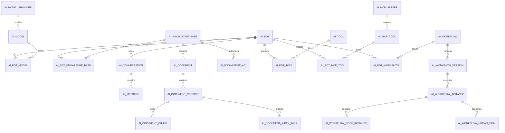

# AskXBOT 企业级 AI 智能体平台：核心表结构设计

> [!warning] 设计边界
> 本文整理 AskXBOT 项目的核心数据模型。本人主讲并负责三个模块：Bot 对话与会话记忆、RAG 知识库与混合检索、Tool Calling 与 MCP 工具接入。Agent 工作流表仅作为项目整体架构和团队协作边界，不表述为本人负责；具体物理 DDL 仍以项目实际版本为准。

## 一、第一性原则

### 1. 存储职责

| 存储 | 职责 | 是否业务事实源 |
|---|---|---|
| MySQL | Bot 配置、完整聊天历史、文档版本、工具审计、工作流实例 | 是 |
| Redis / JDBC ChatMemoryRepository | 模型当前需要的有限会话上下文 | 否 |
| Milvus | Chunk 向量与 Metadata Filter | 否，可重建 |
| Elasticsearch | Chunk BM25 索引 | 否，可重建 |
| OSS / MinIO | 原始文档和生成文件 | 文件事实源 |
| RocketMQ | 文档索引等异步任务传递 | 否 |

### 2. 公共字段

除纯关联表外，MySQL 业务表统一包含：

| 字段 | 类型 | 说明 |
|---|---|---|
| `id` | `BIGINT` | MyBatis-Plus `ASSIGN_ID`，Java 使用 `Long` |
| `tenant_id` | `BIGINT` | 多租户隔离字段，禁止从模型参数获取 |
| `created_by` | `BIGINT` | 创建人 |
| `created_at` | `DATETIME(3)` | 创建时间 |
| `updated_by` | `BIGINT` | 修改人 |
| `updated_at` | `DATETIME(3)` | 修改时间 |
| `deleted` | `TINYINT` | 逻辑删除：0 正常、1 删除 |
| `version` | `INT` | 乐观锁版本，仅并发更新表需要 |

约束规则：

- 所有业务查询必须带 `tenant_id`。
- 唯一业务编码采用“租户 + 编码”唯一，删除后通过恢复或改名处理，不在唯一键中机械追加 `deleted`。
- 密钥不保存明文，只保存 `secret_ref`。
- 高频过滤字段独立成列，不把需要查询的字段全部塞进 JSON。
- `LONGTEXT`、JSON 和大响应不进入普通联合索引。

## 二、整体关系



## 三、模块一：Bot 对话与模型

### 1. `ai_model_provider`：模型供应商

| 字段 | 类型 | 说明 |
|---|---|---|
| `provider_code` | `VARCHAR(64)` | `dashscope`、`openai` 等租户内唯一编码 |
| `provider_name` | `VARCHAR(128)` | 展示名称 |
| `provider_type` | `VARCHAR(32)` | DASHSCOPE、OPENAI_COMPATIBLE |
| `endpoint` | `VARCHAR(512)` | API 地址 |
| `secret_ref` | `VARCHAR(256)` | 密钥中心引用 |
| `config_json` | `JSON` | 低频扩展配置 |
| `status` | `TINYINT` | 0 停用、1 启用 |

索引：

- `UK(tenant_id, provider_code)`
- `IDX(tenant_id, status)`

### 2. `ai_model`：模型配置

| 字段 | 类型 | 说明 |
|---|---|---|
| `provider_id` | `BIGINT` | 供应商 ID |
| `model_code` | `VARCHAR(128)` | 平台内部编码 |
| `model_name` | `VARCHAR(128)` | 供应商模型名 |
| `model_type` | `VARCHAR(32)` | CHAT、EMBEDDING、RERANK |
| `default_options` | `JSON` | temperature、topP、maxTokens 等 |
| `embedding_dimension` | `INT` | Embedding 模型维度，非向量模型为空 |
| `support_stream` | `TINYINT` | 是否支持流式 |
| `support_tool` | `TINYINT` | 是否支持 Tool Calling |
| `status` | `TINYINT` | 是否启用 |

索引：

- `UK(tenant_id, provider_id, model_code)`
- `IDX(tenant_id, model_type, status)`

### 3. `ai_bot`：Bot 主表

| 字段 | 类型 | 说明 |
|---|---|---|
| `bot_code` | `VARCHAR(64)` | 租户内唯一编码 |
| `bot_name` | `VARCHAR(128)` | Bot 名称 |
| `description` | `VARCHAR(1000)` | 功能描述 |
| `system_prompt` | `LONGTEXT` | 系统提示词 |
| `avatar_url` | `VARCHAR(512)` | 头像 |
| `memory_window` | `INT` | 最近消息窗口大小 |
| `rag_enabled` | `TINYINT` | 是否启用知识库 |
| `tool_enabled` | `TINYINT` | 是否启用工具 |
| `anonymous_enabled` | `TINYINT` | 是否允许匿名 |
| `publish_status` | `VARCHAR(16)` | DRAFT、PUBLISHED、OFFLINE |
| `published_at` | `DATETIME(3)` | 发布时间 |

索引：

- `UK(tenant_id, bot_code)`
- `IDX(tenant_id, publish_status, updated_at)`

### 4. `ai_bot_model`：Bot 模型策略

一个 Bot 可以配置主模型和降级模型。

| 字段 | 类型 | 说明 |
|---|---|---|
| `bot_id` | `BIGINT` | Bot ID |
| `model_id` | `BIGINT` | 模型 ID |
| `model_role` | `VARCHAR(16)` | PRIMARY、FALLBACK |
| `priority` | `INT` | 同角色优先级 |
| `options_override` | `JSON` | Bot 级模型参数覆盖 |
| `enabled` | `TINYINT` | 是否启用 |

索引：

- `UK(tenant_id, bot_id, model_id)`
- `IDX(tenant_id, bot_id, model_role, priority)`

### 5. `ai_bot_knowledge_base`：Bot 与知识库绑定

| 字段 | 类型 | 说明 |
|---|---|---|
| `bot_id` | `BIGINT` | Bot ID |
| `knowledge_base_id` | `BIGINT` | 知识库 ID |
| `enabled` | `TINYINT` | 是否启用 |
| `priority` | `INT` | 多知识库检索顺序 |
| `retrieval_config_json` | `JSON` | Bot 级召回数量、阈值等覆盖项 |

索引：

- `UK(tenant_id, bot_id, knowledge_base_id)`
- `IDX(tenant_id, bot_id, enabled, priority)`

> 绑定关系不等于访问授权，运行时仍需通过 `ai_knowledge_acl` 校验当前用户是否有权访问。

### 6. `ai_conversation`：会话

| 字段 | 类型 | 说明 |
|---|---|---|
| `conversation_key` | `VARCHAR(64)` | 对外会话标识，避免暴露主键 |
| `bot_id` | `BIGINT` | Bot ID |
| `owner_user_id` | `BIGINT` | 会话所属用户 |
| `title` | `VARCHAR(256)` | 会话标题 |
| `summary` | `TEXT` | 长会话摘要 |
| `message_count` | `INT` | 消息数快照 |
| `last_message_at` | `DATETIME(3)` | 最后消息时间 |
| `status` | `VARCHAR(16)` | ACTIVE、ARCHIVED、CLOSED |

索引：

- `UK(tenant_id, conversation_key)`
- `IDX(tenant_id, owner_user_id, status, last_message_at)`
- `IDX(tenant_id, bot_id, last_message_at)`

### 7. `ai_message`：完整聊天历史

| 字段 | 类型 | 说明 |
|---|---|---|
| `conversation_id` | `BIGINT` | 会话 ID |
| `sequence_no` | `BIGINT` | 会话内单调序号 |
| `role` | `VARCHAR(16)` | SYSTEM、USER、ASSISTANT、TOOL |
| `message_type` | `VARCHAR(32)` | TEXT、IMAGE、FILE、TOOL_CALL、TOOL_RESULT |
| `content` | `LONGTEXT` | 消息正文 |
| `content_json` | `JSON` | 多模态或结构化内容 |
| `parent_message_id` | `BIGINT` | 重试或分支消息的父 ID |
| `model_id` | `BIGINT` | 助手消息使用的模型 |
| `prompt_tokens` | `INT` | 输入 Token |
| `completion_tokens` | `INT` | 输出 Token |
| `latency_ms` | `INT` | 完整响应耗时 |
| `status` | `VARCHAR(16)` | STREAMING、SUCCESS、FAILED、CANCELLED |
| `error_code` | `VARCHAR(64)` | 失败码 |

索引：

- `UK(tenant_id, conversation_id, sequence_no)`
- `IDX(tenant_id, conversation_id, created_at)`
- `IDX(tenant_id, status, created_at)`，用于失败消息巡检

> [!important] Memory 边界
> `ai_message` 是完整 Chat History。Spring AI `ChatMemoryRepository` 只保存模型所需窗口，可以使用 Redis 或 Spring AI JDBC 表，不能用它代替完整历史表。

## 四、模块二：RAG 知识库

### 1. `ai_knowledge_base`：知识库

| 字段 | 类型 | 说明 |
|---|---|---|
| `kb_code` | `VARCHAR(64)` | 租户内唯一编码 |
| `kb_name` | `VARCHAR(128)` | 知识库名称 |
| `description` | `VARCHAR(1000)` | 描述 |
| `embedding_model_id` | `BIGINT` | Embedding 模型 |
| `rerank_model_id` | `BIGINT` | Rerank 模型，可空 |
| `milvus_collection` | `VARCHAR(128)` | 当前 Collection |
| `es_index` | `VARCHAR(128)` | 当前 ES 索引 |
| `chunk_config` | `JSON` | chunkSize、overlap、splitter |
| `retrieve_config` | `JSON` | topK、threshold、融合策略 |
| `active_version` | `INT` | 当前知识库可见版本 |
| `status` | `VARCHAR(16)` | INIT、READY、REBUILDING、DISABLED |

索引：

- `UK(tenant_id, kb_code)`
- `IDX(tenant_id, status, updated_at)`

### 2. `ai_knowledge_acl`：知识库权限

| 字段 | 类型 | 说明 |
|---|---|---|
| `knowledge_base_id` | `BIGINT` | 知识库 ID |
| `subject_type` | `VARCHAR(16)` | USER、ROLE、DEPT |
| `subject_id` | `BIGINT` | 用户、角色或部门 ID |
| `permission` | `VARCHAR(16)` | READ、WRITE、MANAGE |

索引：

- `UK(tenant_id, knowledge_base_id, subject_type, subject_id, permission)`
- `IDX(tenant_id, subject_type, subject_id, permission)`

### 3. `ai_document`：文档主表

| 字段 | 类型 | 说明 |
|---|---|---|
| `knowledge_base_id` | `BIGINT` | 知识库 ID |
| `document_name` | `VARCHAR(256)` | 文档名称 |
| `file_name` | `VARCHAR(256)` | 原文件名 |
| `mime_type` | `VARCHAR(128)` | 文件类型 |
| `storage_uri` | `VARCHAR(1000)` | OSS / MinIO 地址 |
| `file_size` | `BIGINT` | 字节数 |
| `file_hash` | `CHAR(64)` | SHA-256，去重和校验 |
| `current_version` | `INT` | 当前发布版本 |
| `status` | `VARCHAR(16)` | UPLOADED、PARSING、INDEXING、AVAILABLE、FAILED、DELETING |
| `error_code` | `VARCHAR(64)` | 失败码 |
| `error_message` | `VARCHAR(2000)` | 脱敏后的失败信息 |

索引：

- `UK(tenant_id, knowledge_base_id, file_hash)`
- `IDX(tenant_id, knowledge_base_id, status, updated_at)`

### 4. `ai_document_version`：文档版本

| 字段 | 类型 | 说明 |
|---|---|---|
| `document_id` | `BIGINT` | 文档 ID |
| `knowledge_base_id` | `BIGINT` | 冗余知识库 ID，便于批量查询 |
| `version_no` | `INT` | 文档内版本号 |
| `storage_uri` | `VARCHAR(1000)` | 本版本文件地址 |
| `file_hash` | `CHAR(64)` | 本版本文件哈希 |
| `parsed_char_count` | `INT` | 解析字符数 |
| `chunk_count` | `INT` | Chunk 数量 |
| `milvus_collection` | `VARCHAR(128)` | 写入目标 Collection |
| `es_index` | `VARCHAR(128)` | 写入目标 ES 索引 |
| `status` | `VARCHAR(16)` | DRAFT、INDEXING、READY、PUBLISHED、FAILED、ARCHIVED |
| `published_at` | `DATETIME(3)` | 发布时间 |

索引：

- `UK(tenant_id, document_id, version_no)`
- `IDX(tenant_id, knowledge_base_id, status)`

### 5. `ai_document_chunk`：Chunk 业务事实

| 字段 | 类型 | 说明 |
|---|---|---|
| `knowledge_base_id` | `BIGINT` | 知识库 ID |
| `document_id` | `BIGINT` | 文档 ID |
| `document_version_id` | `BIGINT` | 文档版本 ID |
| `chunk_no` | `INT` | 版本内顺序 |
| `content` | `LONGTEXT` | Chunk 正文 |
| `content_hash` | `CHAR(64)` | 内容哈希 |
| `token_count` | `INT` | Token 数 |
| `section_path` | `VARCHAR(1000)` | 标题层级路径 |
| `metadata_json` | `JSON` | 来源页码等低频元数据 |
| `enabled` | `TINYINT` | 是否参与检索 |

索引：

- `UK(tenant_id, document_version_id, chunk_no)`
- `IDX(tenant_id, knowledge_base_id, document_id, enabled)`
- `IDX(tenant_id, content_hash)`，用于增量索引复用判断

Milvus 与 ES 都使用 `chunk.id` 的字符串形式作为外部文档 ID。

### 6. `ai_document_index_task`：索引任务

| 字段 | 类型 | 说明 |
|---|---|---|
| `document_version_id` | `BIGINT` | 文档版本 ID |
| `task_type` | `VARCHAR(16)` | INDEX、DELETE、REBUILD |
| `idempotency_key` | `VARCHAR(128)` | 文档版本 + 任务类型 |
| `status` | `VARCHAR(16)` | PENDING、RUNNING、SUCCESS、FAILED、DEAD |
| `retry_count` | `INT` | 已重试次数 |
| `max_retry_count` | `INT` | 最大重试数 |
| `next_retry_at` | `DATETIME(3)` | 下次重试时间 |
| `error_code` | `VARCHAR(64)` | 错误码 |
| `error_message` | `VARCHAR(2000)` | 脱敏错误 |
| `started_at` | `DATETIME(3)` | 开始时间 |
| `finished_at` | `DATETIME(3)` | 完成时间 |

索引：

- `UK(tenant_id, idempotency_key)`
- `IDX(tenant_id, status, next_retry_at)`，供任务扫描
- `IDX(tenant_id, document_version_id, task_type)`

### 7. Milvus Schema

| 字段 | 类型 | 说明 |
|---|---|---|
| `chunk_id` | `VARCHAR` | 主键，对应 `ai_document_chunk.id` |
| `tenant_id` | `INT64` | 租户过滤 |
| `knowledge_base_id` | `INT64` | 知识库过滤 |
| `document_id` | `INT64` | 文档过滤 |
| `document_version_id` | `INT64` | 版本过滤 |
| `enabled` | `BOOL` | 是否可见 |
| `content` | `VARCHAR` | Chunk 内容 |
| `embedding` | `FLOAT_VECTOR` | 维度必须与 Embedding 模型一致 |

### 8. Elasticsearch 文档

| 字段 | 类型 | 说明 |
|---|---|---|
| `_id` | `keyword` | 对应 Chunk ID |
| `tenant_id` | `long` | 租户过滤 |
| `knowledge_base_id` | `long` | 知识库过滤 |
| `document_id` | `long` | 文档过滤 |
| `document_version_id` | `long` | 版本过滤 |
| `enabled` | `boolean` | 是否可见 |
| `content` | `text` | BM25 检索字段 |
| `section_path` | `text + keyword` | 标题检索与聚合 |

## 五、模块三：Tool 与 MCP

### 1. `ai_tool`：平台工具

| 字段 | 类型 | 说明 |
|---|---|---|
| `tool_code` | `VARCHAR(64)` | 租户内唯一编码 |
| `tool_name` | `VARCHAR(128)` | 工具名 |
| `tool_type` | `VARCHAR(16)` | BEAN、HTTP、WORKFLOW |
| `description` | `VARCHAR(1000)` | 给模型看的明确描述 |
| `input_schema` | `JSON` | JSON Schema |
| `output_schema` | `JSON` | 返回结构 |
| `config_json` | `JSON` | URL、method 等非密钥配置 |
| `secret_ref` | `VARCHAR(256)` | 鉴权密钥引用 |
| `risk_level` | `VARCHAR(16)` | LOW、MEDIUM、HIGH |
| `confirmation_required` | `TINYINT` | 是否需要用户确认 |
| `timeout_ms` | `INT` | 调用超时 |
| `status` | `TINYINT` | 是否启用 |

索引：

- `UK(tenant_id, tool_code)`
- `IDX(tenant_id, tool_type, status)`

### 2. `ai_bot_tool`：Bot 工具授权

| 字段 | 类型 | 说明 |
|---|---|---|
| `bot_id` | `BIGINT` | Bot ID |
| `tool_id` | `BIGINT` | 工具 ID |
| `enabled` | `TINYINT` | 是否启用 |
| `config_override` | `JSON` | Bot 级超时或默认参数 |

索引：

- `UK(tenant_id, bot_id, tool_id)`
- `IDX(tenant_id, tool_id, enabled)`

### 3. `ai_mcp_server`：MCP Server

| 字段 | 类型 | 说明 |
|---|---|---|
| `server_code` | `VARCHAR(64)` | 租户内唯一编码 |
| `server_name` | `VARCHAR(128)` | 名称 |
| `transport_type` | `VARCHAR(16)` | STDIO、SSE、STREAMABLE_HTTP |
| `endpoint` | `VARCHAR(1000)` | 网络端点，STDIO 可空 |
| `config_json` | `JSON` | 启动参数和非密钥配置 |
| `secret_ref` | `VARCHAR(256)` | 密钥引用 |
| `request_timeout_ms` | `INT` | 请求超时 |
| `health_status` | `VARCHAR(16)` | UNKNOWN、UP、DOWN |
| `last_sync_at` | `DATETIME(3)` | 最近同步工具时间 |
| `status` | `TINYINT` | 是否启用 |

索引：

- `UK(tenant_id, server_code)`
- `IDX(tenant_id, status, health_status)`

### 4. `ai_mcp_tool`：MCP 工具快照

| 字段 | 类型 | 说明 |
|---|---|---|
| `mcp_server_id` | `BIGINT` | MCP Server ID |
| `tool_name` | `VARCHAR(128)` | MCP 工具名 |
| `description` | `VARCHAR(1000)` | 工具描述 |
| `input_schema` | `JSON` | 服务端 Schema 快照 |
| `schema_hash` | `CHAR(64)` | 识别 Schema 变化 |
| `risk_level` | `VARCHAR(16)` | 平台补充的风险等级 |
| `enabled` | `TINYINT` | 是否允许使用 |
| `last_seen_at` | `DATETIME(3)` | 最近发现时间 |

索引：

- `UK(tenant_id, mcp_server_id, tool_name)`
- `IDX(tenant_id, mcp_server_id, enabled)`

### 5. `ai_bot_mcp_tool`：Bot MCP 工具授权

| 字段 | 类型 | 说明 |
|---|---|---|
| `bot_id` | `BIGINT` | Bot ID |
| `mcp_tool_id` | `BIGINT` | MCP 工具 ID |
| `enabled` | `TINYINT` | 是否启用 |
| `confirmation_required` | `TINYINT` | Bot 级二次确认 |

索引：

- `UK(tenant_id, bot_id, mcp_tool_id)`

### 6. `ai_tool_execution_log`：工具执行审计与幂等

| 字段 | 类型 | 说明 |
|---|---|---|
| `conversation_id` | `BIGINT` | 会话 ID |
| `message_id` | `BIGINT` | 触发工具的消息 ID |
| `tool_source` | `VARCHAR(16)` | INTERNAL、MCP、WORKFLOW |
| `tool_id` | `BIGINT` | 平台工具或 MCP 工具 ID |
| `tool_name` | `VARCHAR(128)` | 执行时工具名快照 |
| `tool_call_id` | `VARCHAR(128)` | 模型工具调用 ID |
| `idempotency_key` | `VARCHAR(128)` | 写操作幂等键 |
| `request_digest` | `CHAR(64)` | 参数摘要 |
| `request_json` | `JSON` | 脱敏后的请求 |
| `response_summary` | `TEXT` | 截断、脱敏后的结果摘要 |
| `status` | `VARCHAR(16)` | RUNNING、SUCCESS、FAILED、TIMEOUT、REJECTED |
| `latency_ms` | `INT` | 调用耗时 |
| `error_code` | `VARCHAR(64)` | 失败码 |
| `started_at` | `DATETIME(3)` | 开始时间 |
| `finished_at` | `DATETIME(3)` | 完成时间 |

索引：

- `UK(tenant_id, tool_call_id)`
- `UK(tenant_id, idempotency_key)`，仅需要幂等的写工具必须传非空值
- `IDX(tenant_id, conversation_id, started_at)`
- `IDX(tenant_id, tool_id, status, started_at)`

> [!warning] 幂等边界
> 日志表唯一键只能阻止重复进入，真正的业务安全还需要目标业务表唯一约束或条件更新。不能让工具执行日志代替库存、余额等业务原子裁决。

## 六、团队协作模块：Agent 工作流

### 1. `ai_workflow`：工作流主表

| 字段 | 类型 | 说明 |
|---|---|---|
| `workflow_code` | `VARCHAR(64)` | 租户内唯一编码 |
| `workflow_name` | `VARCHAR(128)` | 名称 |
| `description` | `VARCHAR(1000)` | 描述 |
| `workflow_type` | `VARCHAR(16)` | GRAPH、SEQUENTIAL、ROUTING、PARALLEL |
| `current_version` | `INT` | 当前发布版本 |
| `status` | `VARCHAR(16)` | DRAFT、PUBLISHED、OFFLINE |

索引：

- `UK(tenant_id, workflow_code)`
- `IDX(tenant_id, status, updated_at)`

### 2. `ai_workflow_version`：工作流版本

| 字段 | 类型 | 说明 |
|---|---|---|
| `workflow_id` | `BIGINT` | 工作流 ID |
| `version_no` | `INT` | 版本号 |
| `graph_json` | `LONGTEXT` | Node、Edge、条件与配置 |
| `graph_checksum` | `CHAR(64)` | 图定义校验 |
| `input_schema` | `JSON` | 输入 Schema |
| `output_schema` | `JSON` | 输出 Schema |
| `status` | `VARCHAR(16)` | DRAFT、PUBLISHED、ARCHIVED |
| `published_at` | `DATETIME(3)` | 发布时间 |

索引：

- `UK(tenant_id, workflow_id, version_no)`
- `IDX(tenant_id, workflow_id, status)`

实例必须绑定版本 ID，发布新版本不能改变运行中的旧实例。

### 3. `ai_workflow_instance`：工作流实例

| 字段 | 类型 | 说明 |
|---|---|---|
| `workflow_id` | `BIGINT` | 工作流 ID |
| `workflow_version_id` | `BIGINT` | 固定版本 |
| `conversation_id` | `BIGINT` | 来源会话，可空 |
| `biz_key` | `VARCHAR(128)` | 业务幂等键 |
| `graph_instance_key` | `VARCHAR(128)` | Graph Runtime 实例标识 |
| `status` | `VARCHAR(16)` | PENDING、RUNNING、SUSPENDED、SUCCESS、FAILED、CANCELLED |
| `current_node_key` | `VARCHAR(128)` | 当前节点 |
| `input_json` | `JSON` | 脱敏输入 |
| `output_json` | `JSON` | 脱敏输出 |
| `checkpoint_key` | `VARCHAR(256)` | Checkpoint 引用 |
| `error_code` | `VARCHAR(64)` | 失败码 |
| `started_at` | `DATETIME(3)` | 开始时间 |
| `ended_at` | `DATETIME(3)` | 结束时间 |

索引：

- `UK(tenant_id, workflow_id, biz_key)`
- `UK(tenant_id, graph_instance_key)`
- `IDX(tenant_id, status, updated_at)`，用于恢复和超时扫描
- `IDX(tenant_id, conversation_id, created_at)`

并发更新使用 `version` 乐观锁；状态迁移必须采用条件更新：

```sql
UPDATE ai_workflow_instance
SET status = 'RUNNING', version = version + 1
WHERE id = ? AND tenant_id = ? AND status = 'SUSPENDED' AND version = ?;
```

### 4. `ai_workflow_node_instance`：节点执行记录

| 字段 | 类型 | 说明 |
|---|---|---|
| `workflow_instance_id` | `BIGINT` | 工作流实例 ID |
| `node_key` | `VARCHAR(128)` | 图中的节点 Key |
| `node_name` | `VARCHAR(128)` | 节点名称快照 |
| `node_type` | `VARCHAR(32)` | LLM、TOOL、ROUTER、HUMAN、CUSTOM |
| `attempt_no` | `INT` | 第几次执行 |
| `status` | `VARCHAR(16)` | PENDING、RUNNING、SUSPENDED、SUCCESS、FAILED、SKIPPED |
| `input_json` | `JSON` | 节点输入 |
| `output_json` | `JSON` | 节点输出 |
| `error_code` | `VARCHAR(64)` | 错误码 |
| `error_message` | `VARCHAR(2000)` | 脱敏错误 |
| `started_at` | `DATETIME(3)` | 开始时间 |
| `ended_at` | `DATETIME(3)` | 结束时间 |
| `latency_ms` | `INT` | 耗时 |

索引：

- `UK(tenant_id, workflow_instance_id, node_key, attempt_no)`
- `IDX(tenant_id, workflow_instance_id, status)`
- `IDX(tenant_id, node_type, status, started_at)`

### 5. `ai_workflow_human_task`：人工确认任务

| 字段 | 类型 | 说明 |
|---|---|---|
| `workflow_instance_id` | `BIGINT` | 工作流实例 ID |
| `node_instance_id` | `BIGINT` | 中断节点实例 |
| `task_key` | `VARCHAR(128)` | 对外任务标识 |
| `title` | `VARCHAR(256)` | 任务标题 |
| `form_schema` | `JSON` | 前端表单 Schema |
| `assignee_type` | `VARCHAR(16)` | USER、ROLE、DEPT |
| `assignee_id` | `BIGINT` | 处理人或组织 |
| `status` | `VARCHAR(16)` | PENDING、APPROVED、REJECTED、EXPIRED、CANCELLED |
| `submitted_data` | `JSON` | 提交数据 |
| `submitted_by` | `BIGINT` | 实际提交人 |
| `submitted_at` | `DATETIME(3)` | 提交时间 |
| `deadline_at` | `DATETIME(3)` | 截止时间 |

索引：

- `UK(tenant_id, task_key)`
- `IDX(tenant_id, assignee_type, assignee_id, status, created_at)`
- `IDX(tenant_id, workflow_instance_id, status)`

审批采用原子状态更新，防止重复提交：

```sql
UPDATE ai_workflow_human_task
SET status = ?, submitted_by = ?, submitted_data = ?, submitted_at = NOW(3)
WHERE id = ? AND tenant_id = ? AND status = 'PENDING';
```

### 6. `ai_bot_workflow`：Bot 与工作流绑定

| 字段 | 类型 | 说明 |
|---|---|---|
| `bot_id` | `BIGINT` | Bot ID |
| `workflow_id` | `BIGINT` | 工作流 ID |
| `enabled` | `TINYINT` | 是否启用 |
| `expose_as_tool` | `TINYINT` | 是否作为 Agent Tool 暴露 |
| `tool_name` | `VARCHAR(128)` | Tool 名称 |
| `tool_description` | `VARCHAR(500)` | 供模型选择工具的语义描述 |
| `input_schema_json` | `JSON` | 入参 JSON Schema |

索引：

- `UK(tenant_id, bot_id, workflow_id)`
- `IDX(tenant_id, bot_id, enabled)`

> 运行时只允许启动已发布版本，实例必须固化 `workflow_version_id`，不能跟随最新草稿漂移。
## 七、跨模块可靠性表

### `ai_outbox_event`：本地事务消息

用于“数据库状态已变更，但 MQ 消息尚未可靠发送”的场景，例如文档上传后投递索引任务。

| 字段 | 类型 | 说明 |
|---|---|---|
| `event_id` | `VARCHAR(64)` | 全局事件 ID |
| `aggregate_type` | `VARCHAR(64)` | DOCUMENT、WORKFLOW 等 |
| `aggregate_id` | `BIGINT` | 聚合根 ID |
| `event_type` | `VARCHAR(128)` | 事件类型 |
| `payload_json` | `JSON` | 事件载荷 |
| `status` | `VARCHAR(16)` | NEW、SENT、FAILED |
| `retry_count` | `INT` | 重试次数 |
| `next_retry_at` | `DATETIME(3)` | 下次发送时间 |
| `sent_at` | `DATETIME(3)` | 发送成功时间 |

索引：

- `UK(tenant_id, event_id)`
- `IDX(tenant_id, status, next_retry_at)`

## 八、关键查询与索引解释

| 场景 | 查询条件 | 索引 |
|---|---|---|
| 查询 Bot 模型策略 | tenant + bot + role，按 priority 排序 | `ai_bot_model(tenant_id, bot_id, model_role, priority)` |
| 查询 Bot 知识库 | tenant + bot + enabled，按 priority 排序 | `ai_bot_knowledge_base(tenant_id, bot_id, enabled, priority)` |
| 用户会话列表 | tenant + owner + status，按 lastMessage 倒序 | `ai_conversation(tenant_id, owner_user_id, status, last_message_at)` |
| 会话消息分页 | tenant + conversation + sequence 范围 | 唯一索引 `(tenant_id, conversation_id, sequence_no)` |
| 扫描失败文档任务 | tenant + status + nextRetry | `ai_document_index_task(tenant_id, status, next_retry_at)` |
| 查询 Bot 工具 | tenant + bot | `ai_bot_tool(tenant_id, bot_id, tool_id)` |
| 查询待办审批 | tenant + assignee + status | `ai_workflow_human_task(tenant_id, assignee_type, assignee_id, status, created_at)` |
| 查询 Bot 工作流 | tenant + bot + enabled | `ai_bot_workflow(tenant_id, bot_id, enabled)` |
| 恢复挂起工作流 | tenant + status + updatedAt | `ai_workflow_instance(tenant_id, status, updated_at)` |

索引设计原则：

- 等值字段在前，范围和排序字段在后。
- 租户字段放联合索引首列，避免跨租户扫描。
- 低区分度 `status` 不单独建索引，与租户、时间或业务 ID 组合。
- 深分页使用 `sequence_no`、`id` 或时间游标，不使用超大 Offset。
- 关联数据批量查询，避免逐行查模型、工具或文档产生 N+1。

## 九、面试主讲版

```text
我负责的模块主要分成三组表。

第一组是 Bot 对话。模型供应商和模型配置分开，Bot 通过 ai_bot_model 配主模型和降级模型；ai_conversation 保存会话元数据，ai_message 保存完整聊天历史。Spring AI ChatMemory 只是有限上下文，不代替消息历史表。

第二组是 RAG。ai_knowledge_base 保存检索配置，ai_document 和 ai_document_version 管文档版本，ai_document_chunk 是 Chunk 事实源，ai_document_index_task 管异步索引状态。Milvus 和 ES 都使用 Chunk ID，属于可重建索引。

第三组是工具和 MCP。平台工具、MCP Server、MCP 工具快照和 Bot 授权分别建表，ai_tool_execution_log 负责执行审计和幂等入口。租户和用户信息由 ToolContext 传入，不接受模型伪造。

项目中还有 Agent 工作流表。它属于团队协作模块，我只需要讲清接口边界：工作流可以把已授权的 Tool 和 MCP 工具作为节点能力，执行结果通过统一审计链路记录，但不把工作流实现说成由我负责。
```

## 十、待确认项

- 预计租户数量、单租户 Bot 数、日会话量和消息保留周期。
- 完整消息是否需要按月分表或冷热归档。
- 文件格式、单文件大小和知识库 Chunk 规模。
- Milvus 是否按租户、知识库或模型维度拆 Collection。
- Elasticsearch 索引按知识库还是按租户滚动。
- MCP 配置是否允许租户自定义 STDIO。
- 工作流 Checkpoint 使用 Redis、MySQL 还是框架专用持久化。
- 审计日志保存周期和脱敏规则。

## 关联文档

- [[AskXBOT企业级AI智能体平台-项目表述]]
- [[AskXBOT企业级AI智能体平台-项目逐字稿]]
- [[SpringAI+AIGC应用/SpringAI+AIGC应用总览]]

