# Linux 环境搭建与中间件安装手册

### 1.1、安装VM

### 1.2、在VM上导入linux iso镜像，装好linux系统

```shell
华为centos镜像下载地址
    https://mirrors.huaweicloud.com/centos/
    https://mirrors.huaweicloud.com/centos/7.9.2009/isos/x86_64/
    
网易centos镜像下载地址	
	http://mirrors.163.com/centos/7.9.2009/isos/x86_64/

查看linux版本命令
	1、cat /etc/redhat-release ：CentOS Linux release 7.9.2009 (Core)
	2、cat /etc/centos-release ：CentOS Linux release 7.9.2009 (Core)

查看linux内核命令
	uname -r : 3.10.0-1160.62.1.el7.x86_64
	cat /proc/version	
	uname -a
```

### 1.3、配置网络

```properties
# vi /etc/sysconfig/network-scripts/ifcfg-ens33 
TYPE="Ethernet"
PROXY_METHOD="none"
BROWSER_ONLY="no" 
BOOTPROTO="none"     			#开启静态IP，也可用 static
IPADDR="192.168.136.161"
NETMASK="255.255.255.0"         # 子网掩码
GATEWAY="192.168.136.2"			# 网关地址
DNS1="114.114.114.114"			# DNS服务器   
DEFROUTE="yes"
IPV4_FAILURE_FATAL="no"
IPV6INIT="yes"
IPV6_AUTOCONF="yes"
IPV6_DEFROUTE="yes"
IPV6_FAILURE_FATAL="no"
IPV6_ADDR_GEN_MODE="stable-privacy"
NAME="ens33"
UUID="63d66e06-e7d7-45ff-ab0b-8e6dcaf912b9"
DEVICE="ens33"
ONBOOT="yes"
PREFIX="24"
IPV6_PRIVACY="NO"
```


### 1.4、安装linux插件

```she
1、yum -y install net-tools		--安装网络插件（ifconfig）	
2、yum -y install vim				--安装vim插件
3、yum -y install lrzsz 			--安装传输插件	
4、yum -y install git 				--安装git
5、yum -y install tree				--安装树形展示插件
6、yum -y install wget				--安装下载插件
7、yum -y install unzip zip		--安装zip压缩插件
	zip -r myfile.zip ./* ：将当前目录下的所有文件和文件夹全部压缩成myfile.zip文件,－r表示递归压缩
	unzip -o -d /home/sunny myfile.zip ：  把myfile.zip文件解压到 /home/sunny/目录下
        -o：不提示的情况下覆盖文件；	
        -d：指明将文件解压缩到/home/sunny目录下
    zip -d myfile.zip smart.txt：删除压缩文件中smart.txt文件
    zip -m myfile.zip ./rpm_info.txt ：向压缩文件中myfile.zip中添加rpm_info.txt文件
8、yum -y update 						--更新yum源
9、yum -y install lsof					--安装lsof插件（查看端口占用）
10、yum install -y dos2unix     --安装unix文档格式转换工具
```

### 1.5、yum源修复

```shell
方式一：
    1、 CentOS7利用yum进行软件安装，报错：
         There are no enabled repos. Run "yum repolist all" to see the repos you have
    2、下载对应版本repo文件，如：CentOS7-Base-163.repo, 放入/etc/yum.repos.d/里
    3、下载地址：http://mirrors.163.com/.help/centos.html
    4、完成后，查看/etc/yum.repos.d文件夹下是否有了CentOS-Base.repo文件。
    5、执行命令，生成缓存：
       yum clean all 
       yum makecache
       
方式二：
	1、先备份本地默认的yum源
		cp /etc/yum.repos.d/CentOS-Base.repo /etc/yum.repos.d/CentOS-Base.repo_bak
	2、获取新的yum源，一般使用阿里或者网易的
		1）、阿里
		cd /etc/yum.repos.d/
	wget -O /etc/yum.repos.d/CentOS-Base.repo http://mirrors.aliyun.com/repo/Centos-7.repo
		2）、网易
		cd /etc/yum.repos.d/
		wget http://mirrors.163.com/.help/CentOS7-Base-163.repo
	3、执行命令，生成缓存：
		yum clean all 
		yum makecache
```

### 1.6、设置防火墙

```shell
关于防火墙： 要想在windows上能够访问，还需要开放防火墙的对应的端口，如mysql的3306端口
	1）、查看防火墙状态
		1、service firewalld status
		2、systemctl status firewalld 
		3、firewall-cmd --state 
	2）、开放单个端口：
		firewall-cmd --zone=public --add-port=8080/tcp --permanent
		firewall-cmd --reload
	3）、关闭单个端口：
		firewall-cmd --zone=public --remove-port=8080/tcp --permanent
		firewall-cmd --reload
	4）、查看开放端口：
		firewall-cmd --zone=public --list-ports  
	5）、完全关闭防火墙
		systemctl stop firewalld	#关闭防火墙
		systemctl disable firewalld  #禁用防火墙（禁止随系统自动启动）
	6）、开启防火墙
		systemctl start firewalld	#开启防火墙
		systemctl enable  firewalld  #启用防火墙（随系统自动启动）	
```

### 1.7、常用命令   

```shell
1、文件和目录命令
	1）、退回上一级目录 cd .. |进入根目录 cd / |进入当前用户主目录cd ~，返回上一次目录 cd -
	2）、以K、M为单位查看当前目录各文件大小：du -h --max-depth=0 *   或  ll -h
	3）、查看指定目录大小：du -sh 目录（不写目录为当前目录大小）

1、查看端口占用
	linux：	netstat -tunlp | grep 端口号
			 lsof -i:端口号  （需要root权限执行）【安装lsof：yum -y install lsof.*】
			 lsof | grep deleted
	windows: netstat -ano | findstr 端口号
	
2、杀进程
	linux:  kill -9 进程ID
	windows： tastkill /PID 进程ID /F
	通过进程ID查看进程 ： tasklist | findstr 进程ID
	
3、服务管理
	service 【服务名称】 【start|restart|stop|status】
		例子： service docker start
    systemctl 【command】 【unit】  (command为命令，unit为服务名)
    	例子： systemctl enable docker  
    	command命令还有如下：
        ​ start：立刻启动后面接的 unit。
        ​ stop：立刻关闭后面接的 unit。
        ​ restart：立刻关闭后启动后面接的 unit，亦即执行 stop 再 start 的意思。
        ​ reload：不关闭 unit 的情况下，重新载入配置文件，让设置生效。
        ​ enable：设置下次开机时，后面接的 unit 会被启动。
        ​ disable：设置下次开机时，后面接的 unit 不会被启动。
        ​ status：目前后面接的这个 unit 的状态，会列出有没有正在执行、开机时是否启动等信息。
        ​ is-active：目前有没有正在运行中。
        ​ is-enabled：开机时有没有默认要启用这个 unit。
        ​ kill ：不要被 kill 这个名字吓着了，它其实是向运行 unit 的进程发送信号。
        ​ show：列出 unit 的配置。
        ​ mask：注销 unit，注销后你就无法启动这个 unit 了。
        ​ unmask：取消对 unit 的注销。
        
4、wget : 
	 wget命令用来从指定的URL下载文件。wget非常稳定，它在带宽很窄的情况下和不稳定网络中有很强的适应性，如果
	 是由于网络的原因下载失败，wget会不断的尝试，直到整个文件下载完毕。如果是服务器打断下载过程，它会再次联
	 到服务器上从停止的地方继续下载。
	 
5、sed:
	替换文本中的关键字
	sed -i -e 's#需要被替换的关键字#目标关键字#g' 文件名
6、top命令
	https://blog.csdn.net/langzi6/article/details/124805024
	https://cloud.tencent.com/developer/article/1869211
	
	第一步：使用top命令，然后按shift+p按照CPU排序，找到占用CPU过高的进程的pid
    第二步：使用 top -H -p [进程id] 找到进程中消耗资源最高的线程的id
    第三步：使用 echo 'obase=16;[线程id]' | bc或者printf "%x\n" [线程id] 将线程id转换为16进制（字母要小写）bc是linux的计算器命令
    第四步：执行 jstack [进程id] |grep -A 10 [线程id的16进制]” 查看线程状态信息
	
6、查看进程
	查看java进程：ps -ef|grep java
	查看java进程名占用进程的进程id：pgrep java
    查看指定进程id的运行目录：pwdx 54096
    
7、移动硬盘修复
	1）、利用【嗨格式数据恢复大师】恢复数据
	2）、利用windows的cmd命令进行修复：chkdsk E: /f  （其中E为你需要修复的盘符名称） 
	3）、硬盘插入只有声音不显示：https://zhidao.baidu.com/question/1613971768860868147.html
	
8、windows内存过高
https://blog.csdn.net/tianquanAQA/article/details/143563670?sharetype=blogdetail&sharerId=143563670&sharerefer=PC&sharesource=tianquanAQA&spm=1011.2480.3001.8118
```

### 1.8、vim常用命令

```shell
1、进入vim：vim 文件名
2、进入编辑模式： 按 【i】
3、进入命令模式： 按 【ESC】
4、定位到第一行：命令模式 - 按 【gg 或 1G】
5、定位到最后一行：命令模式 -按 【G】
6、定位到指定行： 命令模式 -按【指定行号数字G】
7、定位到行首： 命令模式 - 按【0】
8、定位到行尾：命令模式 - 按 【shift + 4】
9、删除一行：命令模式 - dd
10、从光标处开始删除n行：命令模式 - ndd
11、撤销：命令模式 - 按【u】

1、显示行号：底行模式 - :set nu
2、取消显示行号：底行模式 - :set nonu
3、保存退出vim:  底行模式 - :wq
4、强制退出vim： 底行模式 -  :q!
5、定位到第10行：底行模式 -  :10
```

### 1.9、为linux命令起别名

	1、临时别名
	    命令格式：alias ***='***'
	    比如：alias nt='netstat -tunlp' 
	    注：其他终端不可用，关闭终端后会失效
	2、永久别名
		1、用vim打开隐藏文件 ~/.bashrc 修改文件
		2、在.bashrc添加命令，如： alias ds='du -h --max-depth=0 *' 
			alias rm='rm -i'
			alias cp='cp -i'
			alias mv='mv -i'
			alias dps='docker ps --format "table{{.ID}}\t{{.Names}}\t{{.Status}}\t{{.Ports}}"'
			alias dis='docker images'
			alias dexe='docker exec -it'
			alias dlog='docker logs'
			alias ds='du -h --max-depth=0 *'
		3、令文件生效：source ~/.bashrc
		4、验证是否生效

## 二、安装JDK

​		JDK下载地址：https://www.oracle.com/cn/java/technologies/downloads/

​			                       https://www.oracle.com/java/technologies/downloads/

```shell
1、自己新建一个目录，用于存放和安装JDK：mkdir -p /root/install/jdk
2、使用linux自带sftp工具（alt+p）
			 从本机上传至linux命令 : put 文件夹路径 
			 从linux上获取文件命令 : get 文件夹路径
		 或者使用lrzsz工具（yum -y install lrzsz）
			 从本机上传至linux命令 : rz （图形化界面，将文件上传至当前目录）
             从linux上获取文件命令 : sz 文件夹路径
         将JDK1.8的安装包上传至自己新建的目录
3、解压缩包： tar -zxvf jdk-8u171-linux-x64.tar.gz
4、编辑系统profile文件
    	vim /etc/profile
    	添加如下配置：
        #set java environment
        JAVA_HOME=/root/install/jdk/jdk1.8.0_171
        JRE_HOME=/root/install/jdk/jdk1.8.0_171/jre
        CLASS_PATH=.:$JAVA_HOME/lib/dt.jar:$JAVA_HOME/lib/tools.jar:$JRE_HOME/lib
        PATH=$PATH:$JAVA_HOME/bin:$JRE_HOME/bin
        export JAVA_HOME JRE_HOME CLASS_PATH PATH
        
        简配：
         JAVA_HOME=/root/publish/normal/jdk-11.0.16
		PATH=$PATH:$JAVA_HOME/bin
5、刷新配置文件
		source /etc/profile
6、验证
		java -version 
```


## 三、安装Tomcat

下载地址：https://tomcat.apache.org/

### 3.1、linux安装

```shell
1、将Tomcat的安装包上传至linux：/root/install/tomcat
2、进入tomcat目录进行解压：tar -zxvf apache-tomcat-7.0.57.tar.gz
3、启动tomcat：
	cd /root/install/tomcat/apache-tomcat-7.0.57/bin
	sh startup.sh或者./startup.sh
4、查看是否启动
	1）、通过查看日志的形式：
	     tail -500f /root/install/tomcat/apache-tomcat-7.0.57/logs/catalina.out
	2）、通过查看进程的方式：ps -ef|grep tomcat
5、可在tomcat的webapp中放入项目，如新建mytest文件夹，在其中放入index.html文件
6、访问：http://192.168.200.161:8080/mytest/index.html
```

### 3.2、docker安装

```shell
#1、搜索tomcat镜像
docker search tomcat

#2、拉取tomcat镜像
docker pull tomcat:9.0

#3、在/root目录下创建tomcat目录用于存储tomcat数据信息
mkdir ~/tomcat
cd ~/tomcat

#4、进入tomcat目录 创建容器，设置端口映射、目录映射、自动启动
docker run -id \
-p 8081:8080 \
--name=tomcat9 \
--restart=always \
-v $PWD:/usr/local/tomcat/webapps \
tomcat:9.0

#5、在tomcat目录下创建mytest目录，并新建index.html,写入文字
#6、访问 http://192.168.200.161:8081/mytest/index.html 进行测试
```


## 四、安装Mysql

### 4.1、linux安装

​	 Mysql下载地址：   https://dev.mysql.com/downloads/mysql/

​									https://downloads.mysql.com/archives/community/

​									https://dev.mysql.com/downloads/installer/

​									https://downloads.mysql.com/archives/installer/

 ```shell
 1、卸载。下载完成之后，先不要急着安装。由于某些原因，在安装 MySQL 之前，可能电脑中已经有了安装过 MySQL 的痕迹，这可能会给下面 MySQL 的安装带来各种问题（如密码不能初始化、MySQL 执行失败等），因此首先需要先彻底清除电脑中与 MySQL 有关的任何文件。
 	rpm -qa							查询当前系统中安装的所有软件
 	rpm -qa | grep mysql			查询当前系统中安装的名称带mysql的软件	
 	rpm -qa | grep mariadb			查询当前系统中安装的名称带mariadb的软件	
 	通过查询，发现在当前系统中存在mariadb数据库，是CentOS7中自带的，而这个数据库和MySQL数据库是冲突的，	所以要想保证MySQL成功安装，需要卸载mariadb数据库。
 	rpm中，卸载软件的语法为：rpm -e --nodeps  软件名称
 	卸载mariadb： 
 	rpm -e --nodeps  mariadb-libs-5.5.68-1.el7.x86_64
 	稳妥起见，用命令再次检测
 	1）、检查电脑里是否已经安装了 MySQL。输入以下命令来查看电脑中与 MySQL 有关的安装信息。
 		sudo yum list installed mysql*
 	2）、如果命令的输出什么也没有，那就无需卸载。如果有，则要输入以下命令来卸载：
 		sudo yum erase mysql*
  	3）、卸载通常不是万能的，还需要手动删除与 MySQL 有关的文件。输入以下命令来查找这种文件
  		sudo find / -name 'mysql*'
 	4）、输入以下命令来删除目录 /var/、/usr/、/etc/ 下的这些文件
 		sudo find /var /usr /etc -name "mysql*" -exec rm -r {} \;
 	5）、删除完成之后，再使用上面的查找命令，看看还能不能找到这些文件。
 	
 2、上传：将下载好的mysql rpm包上传至linux目录：/usr/temp
 
 3、解压：tar -zxvf mysql-5.7.25-1.el7.x86_64.rpm-bundle.tar.gz -C /usr/local/mysql   
 
 4、安装：核心的安装包是 mysql-community-server。在普通情况下，使用命令 sudo yum localinstall mysql-community-server-8.0.26-1.el8.x86_64.rpm 即可。但在此处却不能这样做，因为 MySQL 的各个组成安装包之间有复杂的依赖关系，而 mysql-community-server 并不是依赖的起点，所以需要按依赖关系依次安装
     rpm -ivh mysql-community-common-5.7.25-1.el7.x86_64.rpm
     rpm -ivh mysql-community-libs-5.7.25-1.el7.x86_64.rpm
     rpm -ivh mysql-community-devel-5.7.25-1.el7.x86_64.rpm
     rpm -ivh mysql-community-libs-compat-5.7.25-1.el7.x86_64.rpm
     rpm -ivh mysql-community-client-5.7.25-1.el7.x86_64.rpm
     yum install net-tools
     rpm -ivh mysql-community-server-5.7.25-1.el7.x86_64.rpm
     但是，注意： 以下命令可以自动解析本目录下各安装包的依赖关系，并自动按顺序安装：
 	sudo yum -y localinstall *.rpm
 5、验证
 	mysql --version
 6、运行状态控制：MySQL安装完成之后，会自动注册为系统的服务，服务名为mysqld。那么，我们就可以通过systemctl指令来查看mysql的状态、启动mysql、停止mysql
 	systemctl status mysqld		查看mysql服务状态
 	systemctl start mysqld		启动mysql服务
 	systemctl stop mysqld		停止mysql服务	
 	systemctl enable mysqld 	开机自启
  当然，还可以通过如下两种方式，来判定mysql是否启动：
  	netstat -tunlp					查看已经启动的服务
 	netstat -tunlp | grep mysql		查看mysql的服务信息
 	ps -ef|grep mysql				查看mysql进程
 	
 7、查看临时密码：rpm安装的mysql，在mysql第一次启动时，会自动帮我们生成root用户的访问密码，并且输出在mysql的日志文件 /var/log/mysqld.log，注意，该密码如果忘记，只能重新安装mysql(冒号后面的是密码，注意空格
 )
 	cat /var/log/mysqld.log | grep password      
 
 8、登录
 	mysql -uroot -p'ZBrVGHWNk0(A'
 
 9、修改密码
 	查看密码强度设定：SHOW VARIABLES LIKE 'validate_password%';
 	修改密码强度：
     set global validate_password_length=4;	  #密码长度最低位数，默认是8
     set global validate_password_policy=LOW;  #密码安全等级低，默认是MEDIUM，便于密码可以修改成root
     set password = password('root');		  #设置localhost user密码为root
     flush privileges;
     
     也可用如下命令修改密码：
     #设置指定user的密码为root
     ALTER USER 'root'@'localhost' IDENTIFIED WITH mysql_native_password BY '新密码';
     flush privileges;
     
     
 10、开启远程访问权限
 	#也可用来修改指定用户密码
     grant all on *.* to 'root'@'%' identified by 'root';   #注意：远程只能通过% Host访问
     #或
     update user set user.Host='%' where user.User='root';  
     
     #然后刷新权限
     flush privileges;
 	
 11、连接验证
 	1）、 通过windwos cmd连接：
     	mysql -h 192.168.200.161 -P 3306 -uroot -proot
     2）、通过客户端连接工具连接
     	通过某些客户端连接时，可能会报如下错：plugin caching sha2 password could not be loaded
     	原因是：客户端采用的密码认证方式落后了，现在8.0的mysql采用的sha2加密方式并没有更新到R包中，
     	       因此需要更改mysql的指定用户的加密方式，拿wifi举例，等于现在用户设备不支持wap2加密，只能
     	       用上一代的wap加密方式。
     	解决：修改mysql的加密方式
     	D:\2024新课程\05.新版服务框架\day03-微服务01\授课\code\his\90\hmall
     	  #查看用户认证插件
     	  select user,host,plugin from mysql.user;  # 确认用户的plugin列为 caching_sha2_password
 
     	  #修改加密规则
     	  ALTER USER 'root'@'localhost' IDENTIFIED BY 'password' PASSWORD EXPIRE NEVER;
     	  ALTER USER 'root'@'%' IDENTIFIED BY 'password' PASSWORD EXPIRE NEVER;
 		  #更新用户的密码
 		  ALTER USER 'root'@'localhost' IDENTIFIED WITH mysql_native_password BY '123';
            ALTER USER 'root'@'%' IDENTIFIED WITH mysql_native_password BY '123';
            
            # ALTER USER 'root'@'localhost' IDENTIFIED WITH caching_sha2_password BY '123'; 
            # ALTER USER 'root'@'%' IDENTIFIED WITH caching_sha2_password BY '123'; 
 
 		  #刷新权限
 		  FLUSH PRIVILEGES;
 		  
 		  #查看用户认证插件
     	  select user,host,plugin from mysql.user;  # 确认用户的plugin列为 mysql_native_password 
 		  
 		  #重置密码
 		  #ALTER USER 'root'@'localhost' IDENTIFIED  BY 'password'; 
     
 12、设置开机自启
 	systemctl enable mysqld
 	
 13、修改msyql root密码
 	方法1： 用SET PASSWORD命令
         首先登录MySQL，用如下命令查看数据库root用户密码情况：
         SELECT `HOST`,`User`,`authentication_string` FROM mysql.user WHERE `User` = 'root'
          #1、设置 localhost Host密码为root123  （localhost Host控制本机器连接）
          #2、设置 % Host密码为root123  （% Host控制远程连接）
         格式：mysql> set password for 用户名@Host = password('新密码');
         例子：mysql> set password for root@localhost = password('root123');
              mysql> set password for root@'%' = password('root123');
              flush privileges;
 
     方法2：用mysqladmin 修改Host为localhost的用户密码
         格式：mysqladmin -u用户名 -p旧密码 password 新密码
         例子：mysqladmin -uroot -proot password root123  #设置localhost Host密码为root123
              flush privileges;
 
 14、如果忘记mysql root密码
 	1）、停掉mysql服务  service mysqld stop
 	2）、修改/etc/my.cnf 文件，在mysqld下面 增加 skip-grant-tables ,作用是登陆是跳开密码校验
 	3）、启动mysql服务  service mysqld start
 	4）、登陆 mysql -u root
 	5）、修改密码（将密码修改为 root123 ） 依次执行以下操作
 		use mysql
 		#一并修改Host为%和Host为localhost的两个root用户密码为root123
 		update mysql.user set authentication_string=password('root123') where user='root' 
 		flush privileges;
 	6）、/etc/my.cnf 文件删掉 skip-grant-tables
 	6）、重启mysql服务
 		service mysqld restart
 		
 15、新增数据至数据库，中文乱码解决
 	1、一劳永逸解决方案：在mysql的配置文件 my.ini文件中追加以下配置，然后重启mysql服务即可
 		collation_server=utf8mb4_unicode_ci
 		character-set-server=utf8mb4
 	2、临时方案：修改配置文件中的mysql url
 		url后追加：characterEncoding=utf8
 		
 ```

### 4.2、windows双Mysql情况安装

```te
参考博客
1、https://blog.csdn.net/weixin_46157208/article/details/131356323
2、https://blog.csdn.net/ybb_ymm/article/details/130991491
```


在windows上已经装有一个版本的mysql基础上，安装另一个版本的mysql（如已经安装Mysql5.7，现在安装Mysql8）

1、下载mysql8

2、解压

3、在mysql安装目录新建data目录、my.ini配置文件，其中my.ini配置文件内容

```properties
[mysqld]
# 设置3307端口
port=3307
# 设置mysql的安装目录
basedir=D:\\rjaz\\mysql\\mysql-8.0.31-winx64
# 设置mysql数据库的数据的存放目录
datadir=D:\\rjaz\\mysql\\mysql-8.0.31-winx64\\data
# 允许最大连接数
max_connections=200
# 允许连接失败的次数。这是为了防止有人从该主机试图攻击数据库系统
max_connect_errors=10
# 服务端使用的字符集默认为UTF8
character-set-server=utf8mb4
# 创建新表时将使用的默认存储引擎
default-storage-engine=INNODB
# 默认使用“mysql_native_password”插件认证
default_authentication_plugin=mysql_native_password
[mysql]
# 设置mysql客户端默认字符集
default-character-set=utf8mb4
[client]
# 设置mysql客户端连接服务端时默认使用的端口
port=3307
default-character-set=utf8mb4
```

4、初始化mysql

```bash
#1、cmd窗口，在bin目录执行（管理员权限运行）
mysqld --initialize --console

#2、记录下临时密码，之后修改mysql密码要用到
```

5、安装mysql 

```bash
#cmd窗口，在bin目录执行命令（管理员权限运行），服务名要与5.7的服务名进行区分，此处服务名叫MYSQL8
mysqld --install MYSQL8
```

6、修改注册表

```bash
1、在运行中输入：regedit，进行对注册表的编辑
2、找到这个目录：计算机\HKEY_LOCAL_MACHINE\SYSTEM\CurrentControlSet\Services\MYSQL8
3、将ImagePath中的数据数值调整为：
	"D:\rjaz\mysql\mysql-8.0.31-winx64\bin\mysqld" MYSQL8
```

7、启动mysql

```bash
 #MYSQL8为安装的时候，我们自己指定的服务名称
 net start MYSQL8
```

8、修改mysql密码

```bash
#1、先使用临时密码登录
mysql -uroot -p 之前的临时密码

#2、修改密码 为root
alter user 'root'@'localhost' IDENTIFIED WITH MYSQL_NATIVE_PASSWORD BY 'root';
flush privileges;
```

9、卸载mysql

```sql
mysqld -remove MYSQL8
```


### 4.3、docker 安装

```shell
#1、搜索mysql镜像
docker search mysql

#2、拉取mysql镜像
docker pull mysql:8.0

#3、在/root目录下创建mysql目录用于存储mysql数据信息
mkdir ~/install/docker/mysql
cd ~/install/docker/mysql

#4、进入mysql目录 创建容器，设置端口映射、目录映射、自动启动
docker run -id \
-p 3307:3306 \
--name=mysql8 \
--restart=always \
-v $PWD/conf:/etc/mysql/conf.d \  
-v $PWD/logs:/logs \
-v $PWD/data:/var/lib/mysql \
-v $PWD/init:/docker-entrypoint-initdb.d \
-e MYSQL_ROOT_PASSWORD=root \
mysql:8.0 \
--character-set-server=utf8mb4 \
--collation-server=utf8mb4_unicode_ci 

#5、进入容器，操作mysql
docker exec –it mysql /bin/bash

#6、可使用mysql客户端连接mysql进行测试
```


### 4.4、windows安装

1、**下载**：链接：https://dev.mysql.com/downloads/mysql/


点击Download 就可以下载对应的安装包了, 安装包如下: mysql-8.0.31-winx64.zip

**2、解压**：下载完成后我们得到的是一个压缩包，将其解压，我们就可以得到MySQL 8.0.31 的软件本体了(就是一个文件夹)，我们可以把它放在你想安装的位置 。

**3、添加环境变量**

**4、管理员cmd验证**：cmd输入mysql，如果提示`Can't connect to MySQL server on 'localhost'`则证明添加成功；

**5、管理员cmd窗口初始化MySQL**： 

```mysql
mysqld --initialize-insecure
```

 稍微等待一会，如果出现没有出现报错信息，则证明data目录初始化没有问题，此时再查看MySQL目录下已经有data目录生成。

**6、注册MySQL服务：**管理员cmd运行命令：

```mysql
mysqld -install
```

如果显示：service successfully installed，表示 mysql安装完成

**7、启动MySQL服务：**

```bash
net start mysql  // 启动mysql服务
net stop mysql   // 停止mysql服务        
```

**8、修改默认账户密码**

在黑框里敲入`mysqladmin -u root password 1234`，这里的`1234`就是指默认管理员(即root账户)的密码，可以自行修改成你喜欢的。

```
mysqladmin -u root password 1234
```

**9、登录MySQL**

mysql    -u用户名   -p密码    -h要连接的mysql服务器的ip地址(默认127.0.0.1)      -P端口号(默认3306)

```mysql
mysql -uroot -p1234
```

**10、卸载mysql**

```mysql
# 管理员打开cmd
1、net stop mysql
2、mysqld -remove mysql
3、最后删除MySQL目录及相关的环境变量。
```

**11、双mysql情况**  

在windows上已经装有一个版本的mysql基础上，安装另一个版本的mysql（如已经安装Mysql5.7，现在安装Mysql8）

1、下载mysql8

2、解压

3、在mysql安装目录新建my.ini配置文件，其中my.ini配置文件内容

```properties
[mysqld]
# 设置3307端口
port=3307
# 设置mysql的安装目录
basedir=D:\\rjaz\\mysql\\mysql-8.0.31-winx64
# 设置mysql数据库的数据的存放目录
datadir=D:\\rjaz\\mysql\\mysql-8.0.31-winx64\\data
# 允许最大连接数
max_connections=200
# 允许连接失败的次数。这是为了防止有人从该主机试图攻击数据库系统
max_connect_errors=10
# 服务端使用的字符集默认为UTF8
character-set-server=utf8mb4
# 创建新表时将使用的默认存储引擎
default-storage-engine=INNODB
# 默认使用“mysql_native_password”插件认证
default_authentication_plugin=mysql_native_password
[mysql]
# 设置mysql客户端默认字符集
default-character-set=utf8mb4
[client]
# 设置mysql客户端连接服务端时默认使用的端口
port=3307
default-character-set=utf8mb4
```

4、初始化mysql

```bash
#1、cmd窗口，在bin目录执行（管理员权限运行）
mysqld --initialize --console

#2、记录下临时密码，之后修改mysql密码要用到   lbx!mp.=_41T
```

5、安装mysql 

```bash
#cmd窗口，在bin目录执行命令（管理员权限运行），服务名要与5.7的服务名进行区分，此处服务名叫MYSQL8
mysqld --install MYSQL8
```

6、修改注册表（如果注册表不正确的前提下）

```bash
1、在运行中输入：regedit，对注册表进行编辑
2、找到这个目录：计算机\HKEY_LOCAL_MACHINE\SYSTEM\CurrentControlSet\Services\MYSQL8
3、将ImagePath中的数据数值调整为：
	"D:\rjaz\mysql\mysql-8.0.31-winx64\bin\mysqld" MYSQL8
```

7、启动mysql

```bash
 #MYSQL8为安装的时候，我们自己指定的服务名称
 net start MYSQL8
```

8、修改mysql密码

```bash
#1、先使用临时密码登录
mysql -uroot -p 之前的临时密码

#2、修改密码 为root
alter user 'root'@'localhost' IDENTIFIED WITH MYSQL_NATIVE_PASSWORD BY 'root';
flush privileges;
```


## 五、安装Maven

​	 Maven下载地址：http://maven.apache.org/download.cgi

```shell
1、下载并上传至linux目录：/usr/tmp
2、解压：tar -zxvf apache-maven-3.6.1-bin.tar.gz -C /usr/local/maven
3、修改环境变量：编辑系统profile文件
    	vim /etc/profile
    	添加如下配置：
        #set java environment
        JAVA_HOME=/usr/local/jdk1.8.0_171
        JRE_HOME=/usr/local/jdk1.8.0_171/jre
        MAVEN_HOME=/usr/local/maven/apache-maven-3.6.1
        CLASS_PATH=.:$JAVA_HOME/lib/dt.jar:$JAVA_HOME/lib/tools.jar:$JRE_HOME/lib
        PATH=$PATH:$JAVA_HOME/bin:$JRE_HOME/bin:$MAVEN_HOME/bin
        export JAVA_HOME JRE_HOME MAVEN_HOME CLASS_PATH PATH
        
        或
        JAVA_HOME=/usr/local/jdk1.8.0_171
        MAVEN_HOME=/usr/local/maven/apache-maven-3.6.1
        PATH=$JAVA_HOME/bin:$MAVEN_HOME/bin:$PATH

  让配置生效： source /etc/profile
4、配置本地仓库地址
	1）、进入setting文件目录
		cd /usr/local/maven/apache-maven-3.6.1/conf
	2）、编辑settings.xml配置文件
		vim settings.xml
	3）、在其中增加如下配置,配置本地仓库地址
		<localRepository>/usr/local/maven/repository</localRepository>
	4）、在settings.xml中的<mirrors>标签中,配置阿里云的私服
		<mirror> 
            <id>alimaven</id> 
            <mirrorOf>central</mirrorOf> 
            <name>aliyun maven</name> 
            <url>http://maven.aliyun.com/nexus/content/groups/public/</url>
        </mirror> 
        
5、IDEA强制清理重新编译、打包 (-U 强制  -e 输出详细信息)
mvn clean compile -Dmaven.test.skip=true -e -U
mvn clean package -Dmaven.test.skip=true -e -U

6、将jar包放入本地仓库
mvn install:install-file -Dfile=pop-sdk-1.18.51-all.jar -DgroupId=com.pop.sdk -DartifactId=pop-sdk -Dversion=1.18.51-all -Dpackaging=jar
    pom引入jar包
    <dependency>
        <groupId>com.pop.sdk</groupId>
        <artifactId>pop-sdk</artifactId>
        <version>1.18.51-all</version>
    </dependency>
```

## 六、安装Nginx

```shell
1、介绍
	Nginx是一款轻量级的Web服务器/反向代理服务器及电子邮件（IMAP/POP3）代理服务器。是由伊戈尔·赛索耶夫为俄罗斯访问量第二的Rambler.ru站点（俄文：Рамблер）开发的，第一个公开版本0.1.0发布于2004年10月4日。其特点是占有内存少，并发能力强，事实上nginx的并发能力在同类型的网页服务器中表现较好，中国大陆使用nginx的网站有：百度、京东、新浪、网易、腾讯、淘宝等。

2、官网：官网：https://nginx.org/
3、官方下载：http://nginx.org/en/download.html
```

### 6.1、linux安装

```shell
1、由于nginx是基于c语言开发的，所以需要安装c语言的编译环境，及正则表达式库等第三方依赖库：
	yum -y install gcc pcre-devel zlib-devel openssl openssl-devel
2、在线下载Nginx安装包（可选）
	yum -y install wget
	wget https://nginx.org/download/nginx-1.16.1.tar.gz  （wget命令用来从指定的URL下载文件）
3、配置Nginx编译环境
	cd nginx-1.16.1
	./configure --prefix=/usr/local/nginx
4、编译 & 安装
	make & make install
5、安装完Nginx后，切换到Nginx的安装目录(/usr/local/nginx)，Nginx的目录结构如下：
	1）、conf：配置文件的存放目录
	2）、conf/nginx.conf：Nginx的核心配置文件
	3）、html：存放静态资源(html, css,等) 部署到Nginx的静态资源都可以放在html目录中
	4）、logs：存放nginx日志(访问日志、错误日志等)
	5）、sbin/nginx：二进制文件，用于启动、停止Nginx服务，执行命令需切到本目录执行
6、常用nginx命令
	1）、查看版本：./nginx -v
	2）、检查配置文件：./nginx -t （可用于修改核心配置文件后，检测文件是否有错误）
	3）、启动：./nginx 
	4）、检测：ps -ef|grep nginx（服务启动后，默认就会有两个进程，一个主进程，一个工作进程）
	5）、停止：./nginx -s stop
	6）、重新加载：./nginx -s reload （修改了Nginx配置文件后，需要重新加载才能生效）
7、配置nginx环境变量
	vim /etc/profile ：
        NGINX_HOME=/usr/local/nginx/sbin
        PATH=$PATH:$JAVA_HOME/bin:$JRE_HOME/bin:$MAVEN_HOME/bin:$NGINX_HOME
    source /etc/profile
8、访问：直接访问Nginx的80端口， http://192.168.200.161

```


### 6.2、docker安装

```shell
#1、搜索ngnix镜像
docker search ngnix

#2、拉取ngnix镜像
docker pull ngnix

#3、在/root目录下创建ngnix目录用于存储ngnix数据信息，并配置ngnix配置文件
mkdir ~/install/docker/ngnix
cd ~/install/docker/ngnix
mkdir conf
cd conf
vim nginx.conf

#4、在~/nginx/conf/下创建nginx.conf文件,粘贴下面内容
user  nginx;
worker_processes  1;
error_log  /var/log/nginx/error.log warn;
pid        /var/run/nginx.pid;
events {
    worker_connections  1024;
}
http {
    include       /etc/nginx/mime.types;
    default_type  application/octet-stream;
    log_format  main  '$remote_addr - $remote_user [$time_local] "$request" '
                      '$status $body_bytes_sent "$http_referer" '
                      '"$http_user_agent" "$http_x_forwarded_for"';
    access_log  /var/log/nginx/access.log  main;
    sendfile        on;
    #tcp_nopush     on;
    keepalive_timeout  65;
    #gzip  on;
    include /etc/nginx/conf.d/*.conf;
}

#5、进入ngnix目录 创建容器，设置端口映射、目录映射、自动启动
docker run -id -p 81:80 --name=nginx1.20 --restart=always \
-v $PWD/conf/nginx.conf:/etc/nginx/nginx.conf -v $PWD/logs:/var/log/nginx  -v $PWD/html:/usr/share/nginx/html \
nginx:1.20

docker run -id -p 82:80 --name=nginx2  \
 -v html:/usr/share/nginx/html \
nginx:1.20

#6、在html目录下新建index.html,写入文字
#7、访问 http://192.168.200.161 进行测试
```


### 6.3、nginx应用

```shell
1、nginx的配置文件(conf/nginx.conf)整体上分为三部分: 全局块、events块、http块。
	1）、全局块：配置和nginx运行相关的全局配置
	2）、events块：配置和网络连接相关的配置
	3）、http块：配置代理、缓存、日志记录、虚拟主机等配置
			http块中可以包含多个server块
				每个server块可以配置多个location块。
```

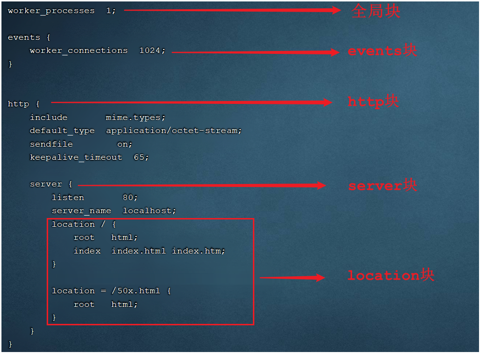

```shell
2、部署静态资源
	1）、Nginx可以作为静态web服务器来部署静态资源。这里所说的静态资源是指在服务端真实存在，并且能够直接
	    展示的一些文件，比如常见的html页面、css文件、js文件、图片、视频等资源。
	2）、相对于Tomcat，Nginx处理静态资源的能力更加高效，所以在生产环境下，一般都会将静态资源部署到
	     Nginx中。
	3）、静态资源部署到Nginx非常简单，只需要将文件复制到Nginx安装目录下的html目录中即可。
		server {
            listen 80;				#监听端口	
            server_name localhost;	#服务器名称
            location / {			#匹配客户端请求url
                root html;			#指定静态资源根目录
                index index.html;	#指定默认首页
            }
        }
	4）、示例一：在 /usr/local/nginx/html中新建文件hello.html，写入代码，访问：	
	     http://192.168.200.161/hello.html	
	5）、示例二：在配置文件http/server 块中修改如下配置
        location / {			#匹配客户端请求url
        	root  html;			#指定静态资源根目录
        	index hello.html;	#指定默认首页
        }
		重新加载：nginx -s reload
		访问： http://192.168.200.161
3、反向代理
	1）、window上用IDEA将项目project_demo打包两次，端口分别为8888、9999
	2）、上传至/root/app目录
	3）、启动
		nohup java -jar hello-project1.jar &>demo1.log &
        nohup java -jar hello-project2.jar &>demo2.log &
        
        测试访问：
        http://192.168.200.161:8888/hello
        http://192.168.200.161:9999/hello
    4）、nginx.conf并增加如下配置: 
    	#upstream指令可以定义一组服务器
        upstream targetserver{	
            server 192.168.200.161:8888;
            server 192.168.200.161:9999;
        }

        server {
            listen       8000;
            server_name  localhost;
            location / {
                proxy_pass http://targetserver;
            }
        }	
        
        server {
            listen       82;
            server_name  localhost;
            location / {
                proxy_pass http://192.168.200.161:8000;
            }
        }
        测试：http://192.168.200.161:8000/hello
        测试：http://192.168.200.161:82/hello
   5）、关于负载均衡配置
   		1、轮询默认方式
   			每个请求，按时间顺序逐一分配到不同的后端应用服务器节点，如果后端服务出现故障，nginx能够自动
   			剔除该节点
   		2、weight：权重方式，根据权重分发请求,权重大的分配到请求的概率大,权重（weight）默认值为1，
   		           权重越高，被分配的请求数量越多
                    #upstream指令可以定义一组服务器
                    upstream targetserver{	
                        server 192.168.200.201:8080 weight=2;
                        server 192.168.200.201:8081 weight=1;
                    }
   		3、ip_hash：依据ip分配方式，根据客户端请求的IP地址计算hash值，根据hash值来分发请求, 
   		           同一个IP发起的请求, 会发转发到同一个服务器上
   		          	upstream targetserver{	
   		          		ip_hash;
                        server 192.168.200.201:8080;
                        server 192.168.200.201:8081;
                    }
        4、least_conn：依据最少连接方式，哪个服务器当前处理的连接少, 请求优先转发到这台服务器
        
   	    5、url_hash：依据url分配方式，根据客户端请求url的hash值，来分发请求, 同一个url请求, 会发转发到同
   		            一个服务器上（第三方）
   		  hash $request_uri consistent;  参数一致性hash  `consistent` 参数表示使用一致性哈希，可选项

   		6、fair：依据响应时间方式，优先把请求分发给处理请求时间短的服务器（第三方）
```

```nginx
其他示例：

#1、全局块 - 主要会设置一些影响Nginx服务器整体运行的配置指令;
worker_processes  1; #允许生成的工作进程数（master进程控制工作线程）
#error_log  logs/error.log; #错误日志存放路径
#pid        logs/nginx.pid; #进程PID存放路径

#2、events 块 - 主要影响Nginx服务器与用户的网络连接 
events {
    worker_connections  1024; #每个 work process 可以同时支持的最大连接数
}

#3、http 块 - 配置最频繁的部分，可以分为：http 全局块、server 块。
#           - 反向代理、动静分离、负载均衡都是在这部分中进行配置。
http {
    #3.1）、http全局块
    include       mime.types;  #表示可以引入的文件类型，此处表示http mime类型
    default_type  application/octet-stream; 
	sendfile        on; 
	keepalive_timeout  65;  #连接超时时间
    client_max_body_size 2m; #客户端请求服务器最大允许大小（如果超过，前端会报413 Request Entity Too 								Large）
   	client_body_buffer_size 2m; #Nginx分配给请求数据的Buffer大小.如果请求的数据小于	#client_body_buffer_size直接将数据先在内存中存储。如果请求的值大于client_body_buffer_size小于#client_max_body_size，就会将数据先存储到client_body_temp的指定的临时文件中
    client_body_temp /tmp/;
	
    #log_format  main  '$remote_addr - $remote_user [$time_local] "$request" '
    #                  '$status $body_bytes_sent "$http_referer" '
    #                  '"$http_user_agent" "$http_x_forwarded_for"';
    #access_log  logs/access.log  main;  #日志自定义
    #tcp_nopush     on;
    #gzip  on;

    #3.2）、集群&负载均衡配置
	upstream webservers{
	  server 127.0.0.1:8080 weight=90 ;
	  #server 127.0.0.1:8088 weight=10 ;
	}

    #3.3）、server块 - 虚拟主机配置，每个http块可以包括多个server块，而每个server块就相当于一个虚拟主                         机。而每个server块也分为全局server块，以及可以同时包含多个locaton块。
    server {
        #3.3.1）、全局server块
        listen       80;  #监听80端口
        server_name  localhost;  #当前虚拟主机名称
		error_page   500 502 503 504  /50x.html; #错误页面
        #charset koi8-r;   #编码
        #access_log  logs/host.access.log  main;  #日志配置

        #3.3.2）、location块 - 基于 Nginx 服务器接收到的请求字符串（例如 server_name/uri-string），							   对虚拟主机名称（也可以是 IP 别名）之外的字符串（例如 前面的 /uri-                                    string）进行匹配，对特定的请求进行处理。地址定向、数据缓存和应答控制等功能
        
        #端口为80的根目录访问请求，地址定向为root对应目录下的index对应页面
        location / {
            root   html/sky;
            index  index.html index.htm;
        }

        location = /50x.html {
            root   html;
        }

        # 反向代理,处理【管理端】发送的请求
        location /api/ {
			proxy_pass   http://localhost:8080/admin/;
            #proxy_pass   http://webservers/admin/;
        }
		
		# 反向代理,处理【用户端】发送的请求
        location /user/ {
            proxy_pass   http://webservers/user/;
        }
		
		# WebSocket
		location /ws/ {
            proxy_pass   http://webservers/ws/;
			proxy_http_version 1.1;
			proxy_read_timeout 3600s;
			proxy_set_header Upgrade $http_upgrade;
			proxy_set_header Connection "$connection_upgrade";
        }
    }
}


#补充：location 指令，该指令用于匹配 URL，语法如下：
location [ = | ~ | ~* | ^~] url {
	
}

= ：用于不含正则表达式的url前，要求请求字符串与url严格匹配，如果匹配成功，就停止继续向下搜索并立即处理该请求
~： 用于表示 url 包含正则表达式，并且区分大小写
~*：用于表示 url 包含正则表达式，并且不区分大小写
^~：用于不含正则表达式的 uri 前，要求 Nginx 服务器找到标识 uri 和请求。字符串匹配度最高的 location 后，立     即使用此 location 处理请求，而不再使用 location块中的正则 uri 和请求字符串做匹配。

注意：如果 uri 包含正则表达式，则必须要有 ~ 或者 ~* 标识
```


## 七、部署项目

敏捷开发模式：https://blog.csdn.net/a715167986/article/details/128716292

### 7.1、手动部署

```shell
1、开发项目
2、项目打包 mvn package
3、获取target目录下打好的包，如:publish_demo.jar
4、上传至linux指定目录：/root/publish/normal
5、运行：java -jar publish_demo.jar
   也可以后台运行，并指定输出日志文件名，默认输出到nohup.log
   nohup java -jar publish_demo.jar &>publish_demo.log &
6、访问 http://192.168.150.101:8888/hello
```

### 7.2、自动化部署-shell脚本

```shell
1、安装maven、git
2、将代码托管至git，从git将代码clone指定位置：/root/publish/shell
	git clone http://git......
3、将写好的shell脚本上传至clone代码的同级位置，即：/root/publish/shell
4、如果不是root用户，为脚本赋权：chmod 777 publish_demo_startup.sh
5、运行shell脚本
	sh publish_demo_startup.sh
```

```shell
#!/bin/sh
echo '================================='
echo '自动化部署脚本启动'
echo '================================='

APP_NAME=publish_demo
APP_JAR_NAME=publish_demo.jar

echo '1、开始关闭旧版服务'
for process in `ps -ef | grep $APP_JAR_NAME |grep -v grep  | awk '{print $2}'`
do
	kill -9 $process;
	echo '   kill 成功'
done
echo '   关闭旧版本服务完成'

echo '2、开始从Git仓库拉取最新代码'
CURRENT_DIR=$(cd $(dirname $0); pwd)
cd $CURRENT_DIR/$APP_NAME
git pull
echo '   代码拉取完成'

echo '3、开始打包'
output=`mvn clean package -Dmaven.test.skip=true`
echo '   打包结束'

echo '4、开始启动新版项目'
cd target
nohup java -jar $APP_JAR_NAME &> ../$APP_NAME.log &
echo '   脚本执行结束，可验证项目是否启动'
```

### 7.3、自动化部署-shell脚本+docker

```shell
1、安装maven、git
2、将代码托管至git，从git将代码clone指定位置：/root/publish/docker
	git clone http://git......
3、将写好的shell脚本上传至clone代码的同级位置 ：/root/publish/docker
4、如果不是root用户，为脚本赋权：chmod 777 publish_demo_docker_startup.sh

5、上传jdk.tar 和 Dockerfile至clone代码的同级位置：/root/publish/docker
6、还原镜像：docker load -i jdk.tar
7、运行shell脚本
	sh publish_demo_docker_startup.sh
```

```shell
#!/bin/sh
echo '================================='
echo '自动化部署脚本启动'
echo '================================='

DOCKER_PORT=8888
PROJECT_PORT=8898

APP_NAME=publish_demo  # app名称
APP_JAR_NAME=${APP_NAME}.jar # jar包名称

CONTAINER_NAME=${APP_NAME} # 容器名称
IMAGE_NAME=${CONTAINER_NAME}:latest # 镜像名称
 
echo '1、关闭旧版服务- 删除旧版容器'
[ -n "`docker ps -a | grep ${CONTAINER_NAME}`" ] && docker rm -f ${CONTAINER_NAME}

echo '2、关闭旧版服务- 删除旧版镜像'
[ -n "`docker images | grep ${CONTAINER_NAME}`" ] && docker rmi ${IMAGE_NAME}

echo '3、开始从Git仓库拉取最新代码'
#进入到脚本所在的当前目录，利用pwd获取当前目录的路径赋值给CURRENT_DIR
CURRENT_DIR=$(cd $(dirname $0); pwd)
cd $CURRENT_DIR/$APP_NAME
git pull
echo '   代码拉取完成'

echo '4、开始打包'
output=`mvn clean package -Dmaven.test.skip=true`
echo '   打包结束'

echo '5、开始构建新的镜像'
cd ..
rm -rf app.jar
cp $APP_NAME/target/${APP_JAR_NAME} ./app.jar ||  exit 1
docker build -t ${IMAGE_NAME} . || exit 1
echo '   镜像构建完成'

echo '6、开始构建新的容器'
docker run -d --name ${CONTAINER_NAME} \
-p "${DOCKER_PORT}:${PROJECT_PORT}" \
${IMAGE_NAME} \
|| exit 1
echo '   容器构建完成'
echo '   脚本执行结束，可验证项目是否启动'
```

注意：在windows上将上述脚本拷贝至文件时，系统为


注意：在windows上将上述脚本拷贝至文件时，系统为windows，在linux上执行可能会报错，需要转换成unix格式

​           方式一： 在Linux直接vim文件名，将复制的shell脚本内容粘贴进去即可

​			方式二：Linux下使用vim打开文件，然后使用命令  :set ff=unix，保存文件即可

​            方式三：Linux下用dos2unix来进行文件转换：

```tex
安装dos2unix：  
	yum install -y dos2unix
执行命令：
	方式1、dos2unix windows.txt  这个的命令将覆盖原始文件。
	方式2、dos2unix -n windows.txt unix.txt：这个命令保留原文件，把转换后的输出保存为一个新文件
```


### 7.3、git免密登录

####        7.3.1、linux  https免密登录

```shell
0、免密原理：是本地存储一份git仓库的用户名和密码，这样之后第二次拉取代码就不需要再次输入密码，会在本地生成/root/.git-credentials(用来储存用户名密码)

1、执行命令：git config --global credential.helper store
   这句命令的意义是：指定第一次输入用户名密码时将凭证保存至本地/root/.git-credentials 文件中
2、拉取代码会第一次提示输入用户名和密码
	git clone “代码仓库地址”
```

####        7.3.2、linux  ssh免密登录

```shell
0、须知：linux git安全的免密登录,支持的协议仅为为ssh，所有clone代码时要采用ssh格式的链接
0、免密原理：公私钥非对称秘钥验证（本地保存私钥，git平台配置公钥）

1、输入以下这句命令，询问全部回车
 ssh-keygen -t rsa -C "邮箱"  
 
  注意：这里的 xxxxx@xxxxx.com 只是生成的 sshkey 的名称，并不约束或要求具体命名为某个邮箱。
现网的大部分教程均讲解的使用邮箱生成，其一开始的初衷仅仅是为了便于辨识所以使用了邮箱。如果忘了邮箱和用户名，可以在windows用如下命令查看当初设置的邮箱和密码:
   git config user.name
   git config user.email

输入命令：ssh-keygen -t rsa -C "liuweidong0008@163.com"

按照提示完成三次回车，即可生成 ssh key。
出现下面这一段：
    Generating public/private rsa key pair.
    Enter file in which to save the key (/root/.ssh/id_rsa): 
    Created directory '/root/.ssh'.
    Enter passphrase (empty for no passphrase): 
    Enter same passphrase again: 
    Your identification has been saved in /root/.ssh/id_rsa.
    Your public key has been saved in /root/.ssh/id_rsa.pub.
    The key fingerprint is:
    SHA256:tXWmY7AFmuHGWg0FMynR4RZB8sHdAimRSBieRaCfYLs root@localhost.localdomain
    The key's randomart image is:
    +---[RSA 2048]----+
    |  o*+.+B&Xo.     |
    | o.o. +*=@o..    |
    |o.o    o@ +.o o  |
    |.o..   = . * +   |
    | .o   . S o +    |
    |  .        . .   |
    | E               |
    |                 |
    |                 |
    +----[SHA256]-----+
2、 进入公钥文件
	 cat /root/.ssh/id_rsa.pub
3、复制公钥
4、在git平台->个人头像设置->添加公钥
5、在终端输入命令：ssh -T git@gitee.com，首次使用需要确认并添加主机到本机SSH可信列表。若返回 
Hi XXX! You've successfully authenticated, but Gitee.com does not provide shell access. 内容，则证明添加成功
6、尝试git clone拉取代码
```

####       7.3.3、windows https免密登录

```tex
0、免密原理：是本地存储一份git仓库的用户名和密码，这样之后第二次拉取代码就不需要再次输入密码，会在本地【凭据管理器】中保存

1、第一次clone代码时，会要求输入gitee的用户名密码，输入后会保存至计算机的【凭据管理器】中
2、【凭据管理器】 -> 【windos凭据】 -> [普通凭据] -> [git:https://liuweidong0008@163.com@gitee.com]，如果忘了密码，可以自行进入编辑修改
```

####       7.3.4、windows  ssh免密登录

```shell
0、免密原理：公私钥非对称秘钥验证（本地保存私钥，git平台配置公钥）

1、打开Git Bash Here，输入ssh-keygen ，然后一路回车
2、秘钥生成路径：win10：C:\Users\DKing-Acer（当前登陆系统用户）\.ssh
3、跟linux一样，也是把id_rsa.pub里的内容复制到git仓库平台中，用于添加公钥
```


​		

## 八、Redis安装

官网：[https://redis.io](https://redis.io/)   	中文网：https://www.redis.net.cn/

### 		8.1、linux安装

​			下载地址：https://download.redis.io/releases/ 、https://redis.io/download

```shell
1、下载并上传至linux：/usr/tmp/redis
2、解压： tar -zxvf redis-4.0.0.tar.gz -C /usr/local
3. 安装Redis的依赖环境gcc，命令：yum -y install gcc-c++
4. 进入/usr/local/redis-4.0.0，进行编译，命令：make
5. 进入redis的src目录进行安装，命令：make install
6、运行redis server服务：redis-server，但是存在占用终端的情况
7、通过修改配置文件，设置Redis服务后台运行、设置密码、设置允许客户端远程连接Redis服务
	vim redis.conf  
	1）、设置Redis服务后台运行：daemonize = yes
	2）、关闭保护模式：protected-mode no
	2）、设置Redis服务密码：requirepass 你的密码
	3）、设置允许客户端远程连接Redis服务，Redis服务默认只能客户端本地连接，不允许客户端远程连接。如果指定了bind，则说明只允许来自指定网卡的Redis请求。如果没有指定，就说明可以接受来自任意一个网卡的Redis请求。将配置文件中的 bind 127.0.0.1 配置项注释掉，或者绑定上允许访问的ip:   bind ip1 ip2 ip3
	4）、之后启动server需要指定配置文件：redis-server ../redis.conf  
	注意：Redis配置文件中的配置项前面不能有空格，需要顶格写
        5）、任意目录redis-cli进行客户端连接
```

### 		8.2、windows安装

​			下载地址：https://github.com/tporadowski/redis/releases、https://github.com/MicrosoftArchive/redis/tags

​          					  https://github.com/microsoftarchive/redis/releases

```shell
1、下载并解压
2、修改配置文件 redis.windows-service.conf
	requirepass 你的密码
	bind ip1 ip2 ip3
3、设置开机自启
	开启自启(服务化)：
		redis-server --service-install redis.windows.conf --loglevel verbose
	取消开机自启（卸载服务）：redis-server --service-uninstall 
	开启服务：redis-server --service-start
	停止服务：redis-server --service-stop
	
4、配置redis环境变量
5、任意目录redis-cli进行客户端连接
```

### 8.3、docker安装

```shell
#1、搜索redis镜像
docker search redis

#2、拉取redis镜像
docker pull redis:7.0

#3、创建容器，设置端口映射、目录映射、自动启动
docker run -id --name=redis7.0 --restart=always -p 6380:6379 redis:7.0

#4、使用外部机器连接redis
redis-cli -h 192.168.200.161 -p 6379
```


### 8.4、docker方式集群搭建

#### 8.4.1、主从


1、新建docker-compose.yaml文件

```yaml
version: "3.2"

services:
  r1:
    image: redis
    container_name: r1
    network_mode: "host"
    entrypoint: ["redis-server", "--port", "7001"]
  r2:
    image: redis
    container_name: r2
    network_mode: "host"
    entrypoint: ["redis-server", "--port", "7002"]
  r3:
    image: redis
    container_name: r3
    network_mode: "host"
    entrypoint: ["redis-server", "--port", "7003"]
```

2、 运行命令：docker compose up -d 创建运行所有容器，启动集群

3、建立主从关系

```yaml
# 连接r2
docker exec -it r2 redis-cli -p 7002
# 认r1主，也就是7001
slaveof 192.168.150.101 7001

# 连接r3
docker exec -it r3 redis-cli -p 7003
# 认r1主，也就是7001
slaveof 192.168.150.101 7001
```

4、.测试

​		依次在`r1`、`r2`、`r3`节点上执行下面命令：set num 123 、 get num，可以发现，只有在`r1`这个节点上可以执行`set`命令（**写操作**），其它两个节点只能执行`get`命令（**读操作**）。也就是说读写操作已经分离了。

5、关闭删除容器：docker-compose down      


#### 8.4.2、主从 + 哨兵


1、准备一个sentinel哨兵的位置文件sentinel.conf ，内容如下：

```yaml
sentinel announce-ip "192.168.150.101"
sentinel monitor hmaster 192.168.150.101 7003 2
sentinel down-after-milliseconds hmaster 5000
sentinel failover-timeout hmaster 60000
说明：
- sentinel announce-ip "192.168.150.101"：声明当前sentinel的ip
- sentinel monitor hmaster 192.168.150.101 7001 2：指定集群的主节点信息 
  - hmaster：主节点名称，自定义，任意写
  - 192.168.150.101 7001：主节点的ip和端口
  - 2：认定master下线时的quorum值
- sentinel down-after-milliseconds hmaster 5000：声明master节点超时多久后被标记下线
- sentinel failover-timeout hmaster 60000：在第一次故障转移失败后多久再次重试
```

2、虚拟机的`/root/redis`目录下新建3个文件夹：`s1`、`s2`、`s3`:

3、将sentinel.conf`文件分别拷贝一份到3个文件夹中。

4、新建docker-compose.yaml文件

```yaml
version: "3.2"

services:
  r1:
    image: redis
    container_name: r1
    network_mode: "host"
    entrypoint: ["redis-server", "--port", "7001"]
  r2:
    image: redis
    container_name: r2
    network_mode: "host"
    entrypoint: ["redis-server", "--port", "7002", "--slaveof", "192.168.150.101", "7001"]
  r3:
    image: redis
    container_name: r3
    network_mode: "host"
    entrypoint: ["redis-server", "--port", "7003", "--slaveof", "192.168.150.101", "7001"]
  s1:
    image: redis
    container_name: s1
    volumes:
      - /root/redis/s1:/etc/redis
    network_mode: "host"
    entrypoint: ["redis-sentinel", "/etc/redis/sentinel.conf", "--port", "27001"]
  s2:
    image: redis
    container_name: s2
    volumes:
      - /root/redis/s2:/etc/redis
    network_mode: "host"
    entrypoint: ["redis-sentinel", "/etc/redis/sentinel.conf", "--port", "27002"]
  s3:
    image: redis
    container_name: s3
    volumes:
      - /root/redis/s3:/etc/redis
    network_mode: "host"
    entrypoint: ["redis-sentinel", "/etc/redis/sentinel.conf", "--port", "27003"]
```

5、 运行命令：docker compose up -d 创建运行所有容器，启动集群

6、演示主节点down机

```yaml
# 连接7001这个master节点，通过sleep模拟服务宕机，60秒后自动恢复
docker exec -it r1 redis-cli -p 7001 DEBUG sleep 60

# 发现sentinel节点通过监控，触发故障转移，7002或7003当选主节点
```


7、java代码改动

```yaml
#配置哨兵地址
spring:
  redis:
    sentinel:
      master: hmaster # 集群名
      nodes: # 哨兵地址列表
        - 192.168.150.101:27001
        - 192.168.150.101:27002
        - 192.168.150.101:27003
        
#配置读写分离
@Bean
public LettuceClientConfigurationBuilderCustomizer clientConfigurationBuilderCustomizer(){
    return clientConfigurationBuilder -> clientConfigurationBuilder.readFrom(ReadFrom.REPLICA_PREFERRED);
}

#这个bean中配置的就是读写策略，包括四种：
- MASTER：从主节点读取
- MASTER_PREFERRED：优先从master节点读取，master不可用才读取slave
- REPLICA：从slave节点读取
- REPLICA_PREFERRED：优先从slave节点读取，所有的slave都不可用才读取master
```


#### 8.4.3、分片集群


```yaml
分片集群中的Redis节点必须开启集群模式，一般在配置文件中添加下面参数：
port 7000
cluster-enabled yes
cluster-config-file nodes.conf
cluster-node-timeout 5000
appendonly yes
说明：
- cluster-enabled：是否开启集群模式
- cluster-config-file：集群模式的配置文件名称，无需手动创建，由集群自动维护
- cluster-node-timeout：集群中节点之间心跳超时时间
```

1、新建docker-compose.yaml文件

```yaml
version: "3.2"

services:
  r1:
    image: redis
    container_name: r1
    network_mode: "host"
    entrypoint: ["redis-server", "--port", "7001", "--cluster-enabled", "yes", "--cluster-config-file", "node.conf"]
  r2:
    image: redis
    container_name: r2
    network_mode: "host"
    entrypoint: ["redis-server", "--port", "7002", "--cluster-enabled", "yes", "--cluster-config-file", "node.conf"]
  r3:
    image: redis
    container_name: r3
    network_mode: "host"
    entrypoint: ["redis-server", "--port", "7003", "--cluster-enabled", "yes", "--cluster-config-file", "node.conf"]
  r4:
    image: redis
    container_name: r4
    network_mode: "host"
    entrypoint: ["redis-server", "--port", "7004", "--cluster-enabled", "yes", "--cluster-config-file", "node.conf"]
  r5:
    image: redis
    container_name: r5
    network_mode: "host"
    entrypoint: ["redis-server", "--port", "7005", "--cluster-enabled", "yes", "--cluster-config-file", "node.conf"]
  r6:
    image: redis
    container_name: r6
    network_mode: "host"
    entrypoint: ["redis-server", "--port", "7006", "--cluster-enabled", "yes", "--cluster-config-file", "node.conf"]
```

2、运行命令：docker compose up -d 创建运行所有容器，启动集群，可以发现每个redis节点都以cluster模式运行。不过节点与节点之间并未建立连接。

3、使用命令创建集群

```yaml
# 进入任意节点容器
docker exec -it r1 bash
# 然后，执行命令
redis-cli --cluster create --cluster-replicas 1 \
192.168.150.101:7001 192.168.150.101:7002 192.168.150.101:7003 \
192.168.150.101:7004 192.168.150.101:7005 192.168.150.101:7006

命令说明：
- redis-cli --cluster：代表集群操作命令
- create：代表是创建集群
- --cluster-replicas 1 ：指定集群中每个master的副本个数为1
  - 此时节点总数 ÷ (replicas + 1) 得到的就是master的数量n。因此节点列表中的前n个节点就是master，其它节点都是slave节点，随机分配到不同master

#通过命令查看集群状态：
redis-cli -p 7001 cluster nodes
```

4、关于故障转移

```shell
1、分片集群的节点之间会互相通过ping的方式做心跳检测，超时未回应的节点会被标记为下线状态。当发现master下线时，会将这个master的某个slave提升为master。

2、打开一个控制台窗口，利用命令监测集群状态：
   watch docker exec -it r1 redis-cli -p 7001 cluster nodes
   命令前面的watch可以每隔一段时间刷新执行结果，方便我们实时监控集群状态变化。
   
3、利用命令让某个master节点休眠。比如这里我们让7002节点休眠，打开一个新的ssh控制台，输入下面命令：
   docker exec -it r2 redis-cli -p 7002 DEBUG sleep 30
 
4、观察集群变化
```


5、java代码改动

```yaml
#配置集群地址
spring:
  redis:
    cluster:
      nodes:
        - 192.168.150.101:7001
        - 192.168.150.101:7002
        - 192.168.150.101:7003
        - 192.168.150.101:8001
        - 192.168.150.101:8002
        - 192.168.150.101:8003
        
#配置读写分离
@Bean
public LettuceClientConfigurationBuilderCustomizer clientConfigurationBuilderCustomizer(){
    return clientConfigurationBuilder -> clientConfigurationBuilder.readFrom(ReadFrom.REPLICA_PREFERRED);
}

#这个bean中配置的就是读写策略，包括四种：
- MASTER：从主节点读取
- MASTER_PREFERRED：优先从master节点读取，master不可用才读取slave
- REPLICA：从slave节点读取
- REPLICA_PREFERRED：优先从slave节点读取，所有的slave都不可用才读取master
```


## 九、ElasticSearch安装

​		官网地址：https://www.elastic.co/cn/elasticsearch/
​		官网下载地址：https://www.elastic.co/cn/downloads/past-releases#elasticsearch

### 	 9.1、linux安装

​		**1、上传安装包**

```shell
alt+p # 打开sftp窗口
# 上传es安装包
put e:/software/elasticsearch-7.4.0-linux-x86_64.tar.gz
```

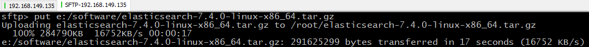

​		**2、解压**

```shell
 # 将elasticsearch-7.4.0-linux-x86_64.tar.gz解压到opt文件夹下. -C 大写
 tar -zxvf elasticsearch-7.4.0-linux-x86_64.tar.gz  -C /opt
```

​		**3、创建普通用户**

因为安全问题，Elasticsearch 不允许root用户直接运行，所以要创建新用户，在root用户中创建新用户,执行如下命令：

```shell
groupadd elsearch
useradd itheima -g elsearch # 新增itheima用户，并且设置所属组
passwd  itheima  # 为itheima用户设置密码
或
groupadd elsearch
useradd itheima -g elsearch -p itheima  #一步设置用户组和密码
```

​		**4、为新用户授权，如下图**

```shell
chown -R itheima:itheima /opt/elasticsearch-7.4.0 #文件夹所有者
```

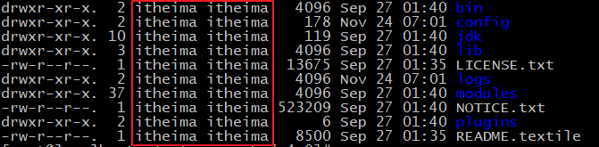

将 /opt/elasticsearch-7.4.0文件夹授权给itheima用户，由上图可见，我们的文件夹权限赋给了itheima

​		**5、修改elasticsearch.yml文件**

```shell
vim /opt/elasticsearch-7.4.0/config/elasticsearch.yml 
```

```shell
# ======================== Elasticsearch Configuration =========================
cluster.name: my-application
node.name: node-1
network.host: 0.0.0.0
http.port: 9200
cluster.initial_master_nodes: ["node-1"]
```

​		cluster.name：配置elasticsearch的集群名称，默认是elasticsearch。建议修改成一个有意义的名称

​		node.name：节点名，elasticsearch会默认随机指定一个名字，建议指定一个有意义的名称，方便管理

​		network.host：设置为0.0.0.0允许外网访问

​		http.port：Elasticsearch的http访问端口

​		cluster.initial_master_nodes：初始化新的集群时需要此配置来选举master

​		**6、修改配置文件**

​			新创建的itheima用户最大可创建文件数太小，最大虚拟内存太小，切换到root用户，编辑下列配置文件， 添加

​			类似如下内容

```shell
# 切换到root用户
su root 

#1. ===最大可创建文件数太小=======
vim /etc/security/limits.conf 
# 在文件末尾中增加下面内容
itheima soft nofile 65536
itheima hard nofile 65536
# =====
vim /etc/security/limits.d/20-nproc.conf
# 在文件末尾中增加下面内容
itheima soft nofile 65536
itheima hard nofile 65536
*  hard    nproc     4096
# 注：* 代表Linux所有用户名称	

#2. ===最大虚拟内存太小=======
vim /etc/sysctl.conf
# 在文件中增加下面内容
vm.max_map_count=655360
# 重新加载，输入下面命令：
sysctl -p
```

​		**7、启动elasticsearch**

```shell
su itheima  # 切换到itheima用户启动
cd /opt/elasticsearch-7.4.0/bin
./elasticsearch #启动
```

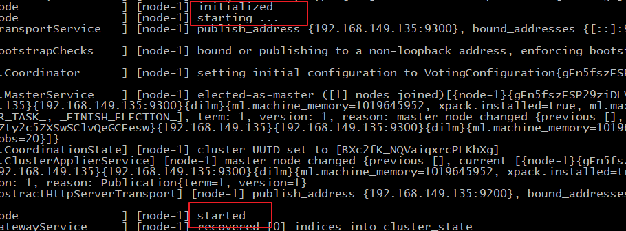

通过上图我们可以看到elasticsearch已经成功启动

​		**8、访问elasticsearch**

​       **在访问elasticsearch前，请确保防火墙是关闭的，执行命令：**

```shell
#暂时关闭防火墙
systemctl  stop  firewalld
# 或者
#永久设置防火墙状态
systemctl enable firewalld.service  #打开防火墙永久性生效，重启后不会复原 
systemctl disable firewalld.service #关闭防火墙，永久性生效，重启后不会复原 
```

浏览器输入http://192.168.149.135:9200/，如下图

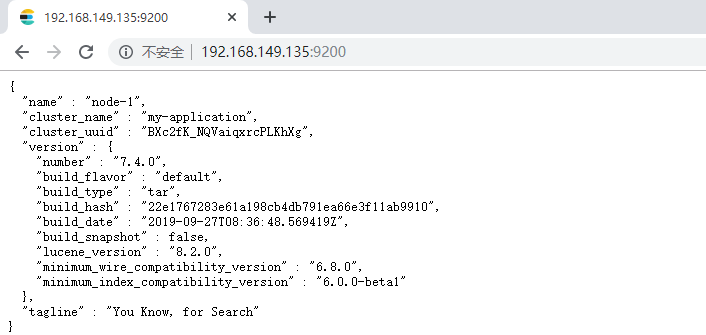

此时elasticsearch已成功启动：

```
重点几个关注下即可:
number" : "7.4.0"   表示elasticsearch版本
lucene_version" : "8.2.0"  表示lucene版本
name ： 默认启动的时候指定了 ES 实例名称
cluster_name ： 默认名为 elasticsearch
```

### 	9.2、windows安装

```yaml
1）. 解压缩：elasticsearch-7.14.0-windows-x86_64.zip，放到软件安装目录
2）. 编辑 config/elasticsearch.yml
    cluster.name: my-application
    node.name: node-1
    network.host: 0.0.0.0
    http.port: 9200
    cluster.initial_master_nodes: ["node-1"]
3）. 启动&访问：
	双击：bin/elasticsearch.bat
	访问：http://localhost:9200
4）. 查看elastic是否启动
	ps -ef|grep elastic
```

### 	9.3、 docker安装

```shell
1、需要让es和kibana容器互联。这里先创建一个网络： docker network create es-net
2、加载镜像：docker load -i es.tar，也可以自行pull
3、创建容器：
	docker run -d --name es \
   	 -e "ES_JAVA_OPTS=-Xms512m -Xmx512m" \
   	 -e "discovery.type=single-node" \							#监听的地址，可以外网访问
   	 -v es-data:/usr/share/elasticsearch/data \
   	 -v es-plugins:/usr/share/elasticsearch/plugins \
  	  --privileged \
   	 --network es-net \
   	 --restart=always
   	 -p 9200:9200 \
   	 -p 9300:9300 \
    elasticsearch:7.12.1
4、在浏览器中输入：http://192.168.136.161:9200 即可看到elasticsearch的响应结果：

5、如果访问没有反应，有可能是net.ipv4.ip_forward数据包转发有问题
	1）、要让Linux系统具有路由转发功能，需要配置一个Linux的内核参数net.ipv4.ip_forward。这个参数指定
	    了Linux系统当前对路由转发功能的支持情况；其值为0时表示禁止进行IP转发；如果是1,则说明IP转发功能
	    已经 打开。
	2）、要配置Linux内核中的net.ipv4.ip_forward参数有多种配置方式可供选择
		1、临时生效的配置方式（在系统重启，或对系统的网络服务进行重启后都会失效）
			1）、使用 sysctl 指令配置：sysctl -w net.ipv4.ip_forward=1
			2）、修改内核参数的映射文件：/proc/sys/net/ipv4/ip_forward
				echo 1 > /proc/sys/net/ipv4/ip_forward
		2、永久生效的配置方式（在系统重启、或对系统的网络服务进行重启后还会一直保持生效状态）
			1）、修改/etc/sysconfig/network配置文件
				在文件最后添加一行：FORWARD_IPV4=YES
				重启网络：service netwrok restart
```


### 9.4、Kibana安装

​	官网地址：https://www.elastic.co/cn/elasticsearch/
​	官网下载地址：https://www.elastic.co/cn/downloads/past-releases#kibana   注意：下载es对应版本zip包

#### 	9.4.1、linux安装

​     **1、什么是Kibana**

```tex
Kibana是一个针对Elasticsearch的开源分析及可视化平台，用来搜索、查看交互存储在Elasticsearch索引中的数据。使用Kibana，可以通过各种图表进行高级数据分析及展示。Kibana让海量数据更容易理解。它操作简单，基于浏览器的用户界面可以快速创建仪表板（dashboard）实时显示Elasticsearch查询动态。
```

​     **2、上传kibana**

```shell
put ‪E:\software\kibana-7.4.0-linux-x86_64.tar.gz
```

​     **3、解压kibana**

```shell
tar -zxvf kibana-7.4.0-linux-x86_64.tar.gz -C /opt
```

​    **4、修改kibana配置**

```shell
vim /opt/kibana-7.4.0-linux-x86_64/config/kibana.yml
```

```shell
server.port: 5601
server.host: "0.0.0.0"
server.name: "kibana-itcast"
elasticsearch.hosts: ["http://127.0.0.1:9200"]
elasticsearch.requestTimeout: 99999
```

```tex
server.port：http访问端口
​server.host：ip地址，0.0.0.0表示可远程访问
​server.name：kibana服务名
​elasticsearch.hosts：elasticsearch地址
​elasticsearch.requestTimeout：请求elasticsearch超时时间，默认为30000，此处可根据情况设置
```

 	**5、启动kibana**

​			由于kibana不建议使用root用户启动，如果用root启动，需要加--allow-root参数

```shell
# 切换到kibana的bin目录
cd /opt/kibana-7.4.0-linux-x86_64/bin
# 启动
./kibana --allow-root
```

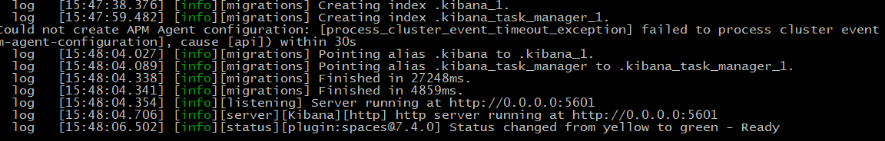

   **6、访问kibana**

​        浏览器输入http://192.168.149.135:5601/，如下图：

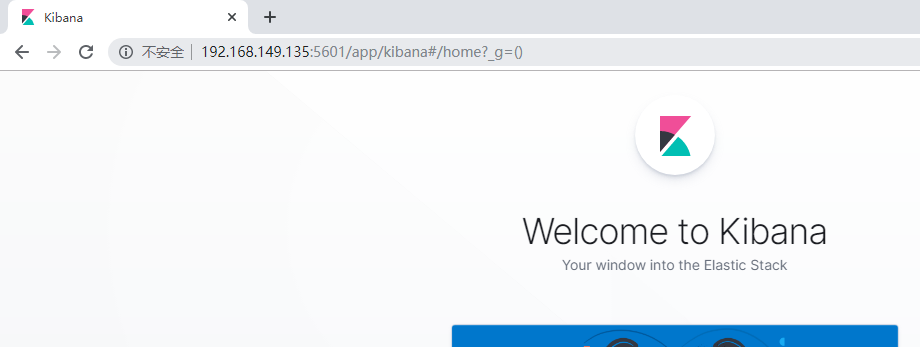

​	看到这个界面，说明Kibanan已成功安装。

```tex
 `Discover`：可视化查询分析器
	`Visualize`：统计分析图表
 	`Dashboard`：自定义主面板（添加图表）
 	`Timelion`：Timelion是一个kibana时间序列展示组件（暂时不用）
	`Dev Tools`：Console控制台（同CURL/POSTER，操作ES代码工具，代码提示，很方便）
	`Management`：管理索引库(index)、已保存的搜索和可视化结果(save objects)、设置 kibana 服务器属性。
```


#### 9.4.2、windows安装

```yaml
1. 解压缩：kibana-7.14.0-windows-x86_64.zip，放到软件安装目录
2. 编辑 config/kibana.yml
    server.port: 5601
    server.host: "0.0.0.0"
    server.name: "kibana-itcast"
    elasticsearch.hosts: ["http://127.0.0.1:9200"]
    elasticsearch.requestTimeout: 99999
3. 启动&访问：
	双击：bin/kibana.bat
	访问：http://localhost:5601
4、后台启动方式
	nohup ./kibana --allow-root&
```

#### 9.4.3、docker安装

```shell
1、导入镜像：docker load -i kibana.tar，或者自行pull
2、运行容器
	docker run -d \
        --name kibana \
        -e ELASTICSEARCH_HOSTS=http://es:9200 \
        --network=es-net \
        --restart=always \
        -p 5601:5601  \
    kibana:7.12.1
3、kibana一般启动比较慢，查看日志:docker logs -f kibana
4、在浏览器输入地址访问：http://192.168.136.161:5601，即可看到结果
```


### 9.5、head安装

```tex
head插件是ES的一个可视化管理插件，用来监视ES的状态，并通过head客户端和ES服务进行交互，比如创建映射、创建索引等。在登陆和访问head插件地址和ElasticSearch前需要事先在服务器上安装和配置好ElasticSearch以及head插件。安装完后，默认head插件的web端口为9100，ElasticSearch服务的端口为9200，使用浏览器访问head地址，如[http://IP地址:9100/](http://10.82.25.183:9100/)，推荐使用Chrome浏览器，head插件对Chrome浏览器兼容更佳。进入head页面后将ElasticSearch连接输入框中填写正确的ElasticSearch服务地址，就可以监控ElasticSearch运行信息
```

#### 9.5.1、 Node安装

1、什么是Node

简单的说 Node.js 就是运行在服务端的 JavaScript。Node.js 是一个基于 [Chrome V8](https://developers.google.com/v8/) 引擎的 JavaScript 运行环境。Node.js 使用了一个事件驱动、非阻塞式 I/O 的模型，使其轻量又高效。Node.js 的包管理器 [npm](https://www.npmjs.com/)，是全球最大的开源库生态系统。

2、下载Node

由于elasticsearch-head插件是由nodejs语言编写，所以安装elasticsearch-head前需要先安装nodejs。
首先，执行以下命令安装nodejs和grunt

打开虚拟机，执行wget命令下载Node，如下图：

```shell
wget https://nodejs.org/dist/v10.15.2/node-v10.15.2-linux-x64.tar.xz
```

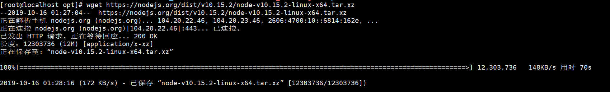

3）解压Node包

```shell
tar xvf node-v10.15.2-linux-x64.tar.xz
```

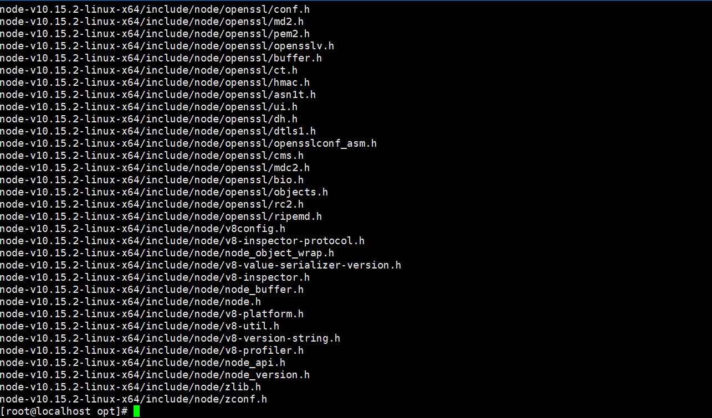

4）设置软连接

解压文件的 bin 目录底下包含了 node、npm 等命令，我们可以使用 ln 命令来设置软连接：

```shell
 ln -s bin/npm /usr/local/bin/
 ln -s bin/node /usr/local/bin/
```

在/etc/profile中配置好path环境变量

```shell
vi ~/.bash_profile
export NODE_HOME=/opt/nodejs/node-v10.15.2-linux-x64
export PATH=$PATH:$NODE_HOME/bin
```

保存退出，使文件生效

```shell
source ~/.bash_profile
```

 查看node安装版本，执行  node -v  验证安装如下图：


#### **9.5.2、 grunt安装**

安装grunt（运行在Node.js上面的任务管理器（task runner）），为了获得Grunt的更多产品特性，需要全局安装Grunt's 命令行接口（CLI），使用npm进行安装，如下：

```shell
npm install -g grunt-cli
```


查看grunt版本


输出grunt版本信息，表示安装成功。

#### **9.5.3、 head安装**

##### 9.5.3.1、客户端浏览器安装

将ElasticSearch Head-0.1.5_0.zip 解压且在浏览器以扩展程序的方式进行安装

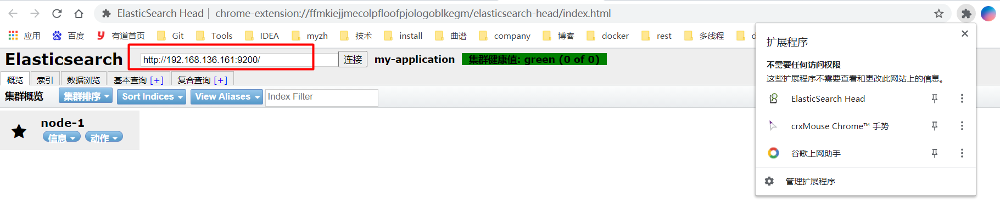

##### 9.5.3.2、服务器安装

1、执行命令安装git

```shell
git yum install git -y
```

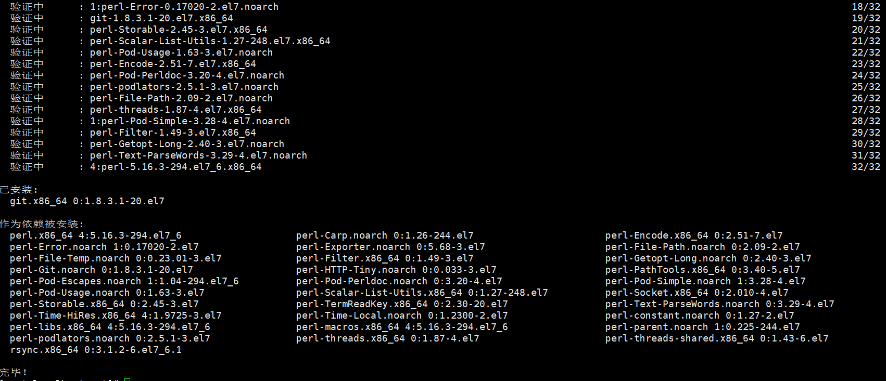

2、切换到/opt目录下,执行下面的克隆命令

```shell
git clone git://github.com/mobz/elasticsearch-head.git
```


3、进入到elasticsearch-head目录

```shell
cd elasticsearch-head
```

4、运行

​       在运行之前我们需要修改下elasticsearch.yml，因为ES默认不开启跨域访问，需要添加以下配置：

```shell
#开启cors跨域访问支持，默认为false 
http.cors.enabled: true
#跨域访问允许的域名地址，(允许所有域名)以上使用正则
http.cors.allow-origin: "*"
```

​       然后开始执行运行命令：

```shell
npm run start
```

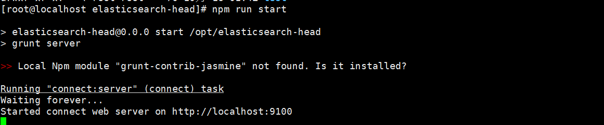

5、访问head

浏览器输入ip:port:9100，如下图

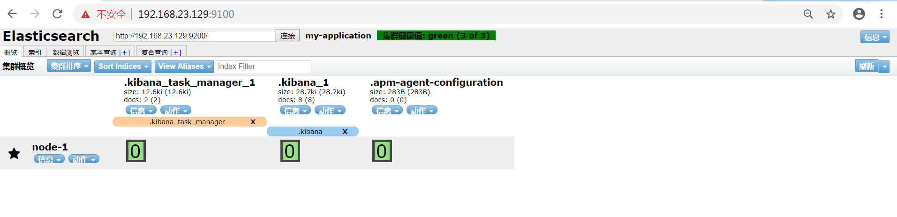

看到这个界面说明我们的head插件成功安装并且成功连接Elasticsearch。


### 9.6、 IK分词器安装

​	IK分词器下载地址：https://github.com/medcl/elasticsearch-analysis-ik/releases  注意：下载es对应版本zip包

​    Elasticsearch 要使用 ik，就要先构建 ik 的 jar包，这里要用到 maven 包管理工具，而 maven 需要java 环境

​    Elasticsearch 内置了jdk， 所以可以将JAVA_HOME设置为Elasticsearch 内置的jdk

#### 9.6.1、环境装备

**1）设置JAVA_HOME**

```shell
vim /etc/profile
# 在profile文件末尾添加
#java environment
export JAVA_HOME=/opt/elasticsearch-7.4.0/jdk
export PATH=$PATH:${JAVA_HOME}/bin
# 保存退出后，重新加载profile
source /etc/profile
```

**2）下载maven安装包**

```shell
wget http://mirror.cc.columbia.edu/pub/software/apache/maven/maven-3/3.1.1/binaries/apache-maven-3.1.1-bin.tar.gz  
```

**3）解压maven安装包**

```
tar xzf apache-maven-3.1.1-bin.tar.gz 
```

**4）设置软连接**

```
ln -s apache-maven-3.1.1 maven 
```

**5）设置path**

打开文件

```
 vim  /etc/profile.d/maven.sh
```

将下面的内容复制到文件，保存

```
export MAVEN_HOME=/opt/maven  
export PATH=${MAVEN_HOME}/bin:${PATH} 
```

设置好Maven的路径之后，需要运行下面的命令使其生效

```
source /etc/profile.d/maven.sh
```

**6）验证maven是否安装成功**

```
mvn -v
```

#### 9.6.2、安装IK分词器

**1）下载IK**

```
https://github.com/medcl/elasticsearch-analysis-ik
wget https://github.com/medcl/elasticsearch-analysis-ik/archive/v7.4.0.zip
```

**2）解压IK**

由于这里是zip包不是gz包，所以我们需要使用unzip命令进行解压，如果本机环境没有安装unzip，请执行：

```shell
yum install zip yum install unzip
```

解压IK

```shell
unzip v7.4.0.zip
```

**3）编译jar包**

```shell
# 切换到 elasticsearch-analysis-ik-7.4.0目录cd elasticsearch-analysis-ik-7.4.0/
#打包
mvn package
```

**4） jar包移动**

package执行完毕后会在当前目录下生成target/releases目录，将其中的elasticsearch-analysis-ik-7.4.0.zip。拷贝到elasticsearch目录下的新建的目录plugins/analysis-ik，并解压

```shell
#切换目录
cd /opt/elasticsearch-7.4.0/plugins
/#新建目录
mkdir analysis-ikcd analysis-ik
#执行拷贝
cp -R /opt/elasticsearch-analysis-ik-7.4.0/target/releases/elasticsearch-analysis-ik-7.4.0.zip     /opt/elasticsearch-7.4.0/plugins/analysis-ik
#执行解压
unzip  /opt/elasticsearch-7.4.0/plugins/analysis-ik/elasticsearch-analysis-ik-7.4.0.zip

以下为导师目录操作命令
#切换目录
cd /root/sys-centos/elasticsearch/elasticsearch-7.4.0/plugins
/#新建目录
mkdir analysis-ikcd analysis-ik
#执行拷贝
cp -R /root/sys-centos/elasticsearch/elasticsearch-analysis-ik-7.4.0/target/releases/elasticsearch-analysis-ik-7.4.0.zip     /root/sys-centos/elasticsearch/elasticsearch-7.4.0/plugins/analysis-ik
#执行解压
unzip /root/sys-centos/elasticsearch/elasticsearch-7.4.0/plugins/analysis-ik/elasticsearch-analysis-ik-7.4.0.zip

```

**5）拷贝辞典**

将elasticsearch-analysis-ik-7.4.0目录下的config目录中的所有文件 拷贝到elasticsearch的config目录

```shell
cp -R /opt/elasticsearch-analysis-ik-7.4.0/config/*   /opt/elasticsearch-7.4.0/config

以下为导师目录操作命令
cp -R /root/sys-centos/elasticsearch/elasticsearch-analysis-ik-7.4.0/config/*   /root/sys-centos/elasticsearch/elasticsearch-7.4.0/config
```

**记得一定要重启Elasticsearch！！！**


**6）、windows安装**

直接解压ik分词器zip包，重命名为ik，然后放入es的plugin目录，最后重启es即可。

**7）、docker安装**

根据 docker volume inspect es-plugins 命令找到当初创建容器挂载的插件数据卷所在位置，把加压好的ik插件文件夹上传至该目录，最后重启es即可

#### 9.6.3、使用IK分词器

IK分词器有两种分词模式：ik_max_word和ik_smart模式。

1、**ik_max_word**

会将文本做最细粒度的拆分，比如会将“乒乓球明年总冠军”拆分为“乒乓球、乒乓、球、明年、总冠军、冠军。

```json
#方式一ik_max_word
GET /_analyze
{  
    "analyzer": "ik_max_word",
    "text": "乒乓球明年总冠军"
}
```

ik_max_word分词器执行如下：

```json
{
	"tokens": [{
		"token": "乒乓球",
		"start_offset": 0,
		"end_offset": 3,
		"type": "CN_WORD",
		"position": 0
	}, {
		"token": "乒乓",
		"start_offset": 0,
		"end_offset": 2,
		"type": "CN_WORD",
		"position": 1
	}, {
		"token": "球",
		"start_offset": 2,
		"end_offset": 3,
		"type": "CN_CHAR",
		"position": 2
	}, {
		"token": "明年",
		"start_offset": 3,
		"end_offset": 5,
		"type": "CN_WORD",
		"position": 3
	}, {
		"token": "总冠军",
		"start_offset": 5,
		"end_offset": 8,
		"type": "CN_WORD",
		"position": 4
	}, {
		"token": "冠军",
		"start_offset": 6,
		"end_offset": 8,
		"type": "CN_WORD",
		"position": 5
	}]
}
```

2、**ik_smart**
会做最粗粒度的拆分，比如会将“乒乓球明年总冠军”拆分为乒乓球、明年、总冠军。

```json
#方式二ik_smart 

GET /_analyze
{ 
    "analyzer": "ik_smart",  
    "text": "乒乓球明年总冠军"
}
```

ik_smart分词器执行如下：

```json
{
	"tokens": [{
		"token": "乒乓球",
		"start_offset": 0,
		"end_offset": 3,
		"type": "CN_WORD",
		"position": 0
	}, {
		"token": "明年",
		"start_offset": 3,
		"end_offset": 5,
		"type": "CN_WORD",
		"position": 1
	}, {
		"token": "总冠军",
		"start_offset": 5,
		"end_offset": 8,
		"type": "CN_WORD",
		"position": 2
	}]
}
```

由此可见  使用ik_smart可以将文本"text": "乒乓球明年总冠军"分成了【乒乓球】【明年】【总冠军】

这样看的话，这样的分词效果达到了我们的要求。

#### 	9.6.4、IK分词器词库拓展与停用

在IK分词器config目录，有个文件叫：IKAnalyzer.cfg.xml

```xml
<?xml version="1.0" encoding="UTF-8"?>
<!DOCTYPE properties SYSTEM "http://java.sun.com/dtd/properties.dtd">
<properties>
        <comment>IK Analyzer 扩展配置</comment>
        <!--用户可以在这里配置自己的扩展字典 *** 添加扩展词典-->
        <entry key="ext_dict">ext.dic</entry>
    	 <!--用户可以在这里配置自己的扩展停止词字典  *** 添加停用词词典-->
        <entry key="ext_stopwords">stopword.dic</entry>
</properties>
```

```tex
1、词库拓展
   在ext.dit文件中添加需要拓展的词汇，注意当前文件的编码必须是 UTF-8 格式，严禁使用Windows记事本编辑
2、词库停用
   在stopword.dit文件中添加需要拓展的词汇，注意当前文件的编码必须是 UTF-8 格式，严禁使用Windows记事本编辑
3、重启ES让操作生效
```


### 9.7、拼音分词器安装

​	下载地址：https://github.com/medcl/elasticsearch-analysis-pinyin/releases    注意：下载es对应版本zip包


## 十、Docker安装


### 10.0、Docker初体验

```shell
#安装redis
docker run -id --name=redis -p 6380:6379  redis:7.0
#安装mysql
docker run -id  --name=mysql   -p 3307:3306  -e MYSQL_ROOT_PASSWORD=root   mysql:8.0
#安装nginx
docker run  -id --name nginx -p 80:80  nginx:1.20


#卸载redis
docker  rm -f  redis   
#卸载mysql
docker rm -f   mysql   
#卸载nginx
docker rm  -f nginx 
```

### 	 10.0、介绍

```shell
1、Docker官网：https://www.docker.com
2、Docker 分为 CE 和 EE 两大版本。CE 即社区版（免费，支持周期 7 个月），EE 即企业版，强调安全，付费使用，    支持周期 24 个月。
3、Docker CE 分为 `stable` `test` 和 `nightly` 三个更新频道。
4、官方网站上有各种环境下的 [安装指南](https://docs.docker.com/install/)，这里主要介绍 Docker CE 在    CentOS上的安装。
5、Docker CE 支持 64 位版本 CentOS 7，并且要求内核版本不低于 3.10， CentOS 7 满足最低内核的要求，所以我    们在CentOS 7安装Docker
```

###      10.1、卸载（可选）

```shell
# 如果之前安装过旧版本的Docker，可以使用下面命令卸载：
yum remove docker \
    docker-client \
    docker-client-latest \
    docker-common \
    docker-latest \
    docker-latest-logrotate \
    docker-logrotate \
    docker-selinux \
    docker-engine-selinux \
    docker-engine \
    docker-ce
```

###  	 10.2、安装

```shell
# 1、yum 包更新到最新 
yum -y update
# 2、安装需要的软件包，yum-utils提供yum-config-manager功能，另外两个是devicemapper驱动依赖的 
yum install -y yum-utils device-mapper-persistent-data lvm2 --skip-broken 
# 3、更新本地镜像源（更新为阿里镜像源）
yum-config-manager --add-repo https://mirrors.aliyun.com/docker-ce/linux/centos/docker-ce.repo
sed -i 's/download.docker.com/mirrors.aliyun.com\/docker-ce/g' /etc/yum.repos.d/docker-ce.repo
或
yum-config-manager --add-repo https://download.docker.com/linux/centos/docker-ce.repo
# 4、更新yum源，建立缓存
yum makecache fast
# 5、安装docker，出现输入的界面都按 y 
yum install -y docker-ce
或
yum install -y docker-ce docker-ce-cli containerd.io docker-buildx-plugin docker-compose-plugin #开启compose功能
# 6、 查看docker版本，验证是否验证成功
docker -v

# 6、其他
    #启动Docker
    systemctl start docker
    # 停止Docker
    systemctl stop docker
    # 重启
    systemctl restart docker
    # 设置开机自启
    systemctl enable docker
    # 执行docker ps命令，如果不报错，说明安装启动成功
    docker ps
```

### 	  10.3、配置镜像加速器

```shell
默认情况下，拉取镜像时将会从docker hub（https://hub.docker.com/）上下载 ，而国内从 DockerHub 拉取镜像有时会遇到困难，此时可以配置镜像加速器。Docker 官方和国内很多云服务商都提供了国内加速器服务。

由于阿里云镜像加速器为用户特有，速度快且稳定，一般会用阿里云的镜像加速器，使用步骤：
注册阿里云账号->工作台->容器镜像服务->镜像工具->镜像加速器(yz1nevhk)

sudo mkdir -p /etc/docker
sudo tee /etc/docker/daemon.json <<-'EOF'
{
  "registry-mirrors": [
  	    "https://docker.fxxk.dedyn.io",
        "http://hub-mirror.c.163.com",
        "https://mirrors.tuna.tsinghua.edu.cn",
        "http://mirrors.sohu.com",
        "https://yz1nevhk.mirror.aliyuncs.com",
        "https://ccr.ccs.tencentyun.com",
        "https://docker.m.daocloud.io",
        "https://docker.awsl9527.cn"
    ]
}
EOF
sudo systemctl daemon-reload
sudo systemctl restart docker

#验证：
方式一：cat /etc/docker/daemon.json
方式二：docker info

{
  "registry-mirrors": ["https://docker.m.daocloud.io","https://docker.1panel.live"]
}

{
    "registry-mirrors": [
            "https://docker.211678.top",
            "https://docker.1panel.live",
            "https://hub.rat.dev",
            "https://docker.m.daocloud.io",
            "https://do.nark.eu.org",
            "https://dockerpull.com",
            "https://dockerproxy.cn",
            "https://docker.awsl9527.cn"
      ]
}

{
  "registry-mirrors": 
  [
        "https://docker.registry.cyou",
        "https://docker-cf.registry.cyou",
        "https://dockercf.jsdelivr.fyi",
        "https://docker.jsdelivr.fyi",
        "https://dockertest.jsdelivr.fyi",
        "https://mirror.aliyuncs.com",
        "https://dockerproxy.com",
        "https://mirror.baidubce.com",
        "https://docker.m.daocloud.io",
        "https://docker.nju.edu.cn",
        "https://docker.mirrors.sjtug.sjtu.edu.cn",
        "https://docker.mirrors.ustc.edu.cn",
        "https://mirror.iscas.ac.cn",
        "https://docker.rainbond.cc"
  ]
}
```

```tex
docker拉取镜像时报错dial tcp: lookup index.docker.io on xxx.xxx.xxx.xxx:xxx: server misbehaving
最后错误信息为这类：server misbehaving DNS错误问题 no such host 表示DNS域名解析的问题

vim /etc/resolv.conf
```


1、查看应用/软件 进程   ps -ef|grep  应用名称

2、查看端口占用   netstat -tunlp|grep 端口号

3、查看磁盘/内存

4、查看CPU

5、查看项目日志/通过日志排查bug  tail   less  grep 


###      10.4、docker相关指令

```shell
1、镜像操作
    0）、搜索：docker search 镜像名称
    1）、拉取：docker pull
    2）、推送：docker push
    3）、查看：docker images
    4）、查看所有镜像ID：docker images -q
    5）、删除：docker rmi 镜像名称
    6）、删除所有：docker rmi `docker images -q`
    7）、制作镜像：docker build . 
    8）、导出镜像：docker save -o 镜像名称.tar 镜像名称
    9）、加载镜像：docker load -i 镜像名称.tar
    10）、容器转为镜像：docker commit 容器名称 镜像名称

2、容器操作
    1）、查看所有：docker ps -a
    2）、查看正在运行：docker ps
         格式化查看，更清爽： docker ps --format "table {{.ID}}\t{{.Image}}\t{{.Ports}}\t{{.Status}}\t{{.Names}}"
    3）、删除：docker rm 容器名称
    4）、强制删除：docker rm -f 容器名称
        删除所有容器： docker rm -f $(docker ps -qa)
    5）、创建容器：docker create -d --name=容器名称 -p 宿主机端口：容器内端口 镜像名称
    6）、创建并运行容器：docker run -d --name=容器名称 -p 宿主机端口：容器内端口 镜像名称
    7）、启动容器：docker start 容器名称
    8）、停止容器：docker stop 容器名称
    9）、重启容器：docker restart 容器名称
    10）、暂停容器：docker pause 容器名称
    12）、恢复容器：docker unpause 容器名称
    13）、进入容器：docker exec -it 容器名称 /bin/bash
    14）、查看容器信息：docker inspect 容器名称或者容器id
    15）、创建容器相关设置
    	 1）、自启动： --restart=always
    	 2）、挂载数据卷： -v es-data:/usr/share/elasticsearch/data
    	 3）、创建网络： docker network create es-net
    	 4）、加入网络：--network es-net
    	 5）、端口映射： -p 宿主机端口：容器内端口
    16）、修改容器设置语法
    	 docker update 相关设置 容器ID
         如：修改容器不再自启动：docker update --restart=no 容器ID  
    17）、查看容器日志：docker logs -f 容器名称

3、数据卷操作
    1）、创建数据卷：docker volume create 数据卷名称  （位于/var/lib/docker/volume目录）
    2）、查看单个数据卷详情：docker volume inspect 数据卷名称
    3）、查看数据卷列表：docker volume ls
    4）、删除数据卷：docker volume rm 数据卷名称
    5）、删除未使用的数据卷：docker volume prune
    6）、创建容器时挂载数据卷
    	1）、挂载数据卷（会自动创建数据卷）：docker run -v 数据卷名称：容器内目录路径
    	2）、挂载指定目录（要自己创建）：docker run -v 目录绝对路径：容器内目录路径
    	
4、docker网络
  	1）、创建一个网络：docker network create
	2）、查看所有网络：docker network ls
	3）、删除指定网络：docker network rm
	4）、清除未使用的网络：docker network prune
	5）、使指定容器连接加入某网络：docker network connect
	    					  docker network connect hmall mysql --alias db  --给hmall网络中的mysql起一个别名
	    					  - 在自定义网络中，可以给容器起多个别名，默认的别名是容器名本身
							  - 在同一个自定义网络中的容器，可以通过别名互相访问
	6）、使指定容器连接离开某网络：docker network disconnect
	7）、查看网络详细信息：docker network inspect
```

### 10.5、dockerfile自定义镜像

1、Dockerfile的本质是一个文件，通过指令描述镜像的构建过程

2、Dockerfile的第一行必须是FROM，从一个基础镜像来构建

3、基础镜像可以是基本操作系统，如Ubuntu。也可以是其他人制作好的镜像，例如：java:8-alpine

构建自定义的镜像时，并不需要一个个文件去拷贝，打包。

我们只需要告诉Docker，我们的镜像的组成，需要哪些BaseImage、需要拷贝什么文件、需要安装什么依赖、启动脚本是什么，将来Docker会帮助我们构建镜像。

而描述上述信息的文件就是Dockerfile文件。

**Dockerfile**就是一个文本文件，其中包含一个个的**指令(Instruction)**，用指令来说明要执行什么操作来构建镜像。每一个指令都会形成一层Layer。


更新详细语法说明，参考官网文档： https://docs.docker.com/engine/reference/builder

```dockerfile
# 基础镜像
FROM openjdk:11.0-jre-buster
# 设定时区
ENV TZ=Asia/Shanghai
RUN ln -snf /usr/share/zoneinfo/$TZ /etc/localtime && echo $TZ > /etc/timezone
# 拷贝jar包
COPY docker-demo.jar /app.jar
# 入口
ENTRYPOINT ["java", "-jar", "/app.jar"]
```


```shell
1、dockerfile自定义java镜像：
    1、新建一个空文件夹docker-demo
    2、拷贝通过idea打包好的docker-demo.jar文件到docker-demo这个目录
    3、拷贝jdk8.tar.gz文件到docker-demo这个目录
    4、拷贝Dockerfile到docker-demo这个目录
    5、运行docker构建镜像命令： docker build -t docker-demo:1.0 .（点表示当前目录的dockerfile文件）
      					     docker build -t docker-demo:1.0 /root/demo
    6、创建并运行容器
           docker run -d --name dd -p 8080:8080 docker-demo:1.0
    6、最后访问：http://虚拟机ip:8080/hello/count
```


### 10.6、安装DockerCompose

​	  一、介绍

```json
1、Docker Compose可以基于Compose文件帮我们快速的部署分布式应用，而无需手动一个个创建和运行容器！相当于
   批量的docker run
2、首先Compose文件是一个文本文件，通过指令定义集群中的每个容器如何运行。格式如下：
   version: "3.8"
     services:
      # 典型定义容器运行方式一：基于已有镜像构建容器
      mysql:
        image: mysql:5.7.25
        environment:
         MYSQL_ROOT_PASSWORD: 123 
        volumes:
         - "/tmp/mysql/data:/var/lib/mysql"
         - "/tmp/mysql/conf/hmy.cnf:/etc/mysql/conf.d/hmy.cnf"
	  # 典型定义容器运行方式二：基于dockerfile临时构建镜像，然后起容器
      web:
        build: .
        ports:
         - "8090:8090"
   上面的Compose文件就描述一个项目，其中包含两个容器：
        - mysql：一个基于`mysql:5.7.25`镜像构建的容器，并且挂载了两个目录
        - web：一个基于`docker build`临时构建的镜像容器，映射端口时8090
3、定义好docker-compose文件后，只需要在该文件的当前目录运行命令即可完成应用的快速部署：
	docker-compose up -d
4、DockerCompose的详细语法参考官网：https://docs.docker.com/compose/compose-file/	
5、可以将DockerCompose文件看做是将多个docker run命令写到一个文件，只是语法稍有差异。
```

​      二、安装

```shell
1、方式一：linux通过命令下载：
	# 安装
  curl -L https://github.com/docker/compose/releases/download/1.23.1/docker-compose-`uname
  -s`-`uname -m` > /usr/local/bin/docker-compose
2、方式二：直接将docker-compose文件上传至linux目录
	/usr/local/bin/
3、修改docker-compose文件权限，添加执行权限
  chmod +x /usr/local/bin/docker-compose
4、下载Base自动补全命令：
  # 补全命令
  curl -L https://raw.githubusercontent.com/docker/compose/1.29.1/contrib/completion/bash/
  docker-compose > /etc/bash_completion.d/docker-compose
  如果下载无反应或者报错执行（原因为无法解析该域名，可以添加域名解析映射）：
  echo "199.232.68.133 raw.githubusercontent.com" >> /etc/hosts
```

### 10.7、DockerCompose部署微服务

```json
1、将cloud-demo目录上传至linux，目录结构：
   cloud-dmo
	 gateway 
	 	app.jar  : gateway微服务打包后形成的jar
		Dockerfile  :  gateway微服务的dokerfile
     order-service  
		app.jar  :  order-service微服务打包后形成的jar
		Dockerfile  : order-service微服务的dokerfile
     user-service  
		app.jar  : user-service微服务打包后形成的jar
		Dockerfile  :   user-service微服务的dokerfile
     mysql	:  用来构建mysql容器时进行数据卷挂载
		conf : mysql的配置文件
		data : mysql数据库数据
     docker-compose.yml ：docker-compose文件
   其中微服务配置文件中的连接信息可以用dockercmpose文件中的容器名

2、docker-compose.yml说明
    version: "3.2"
    services:
      #容器名
      nacos:
        image: nacos/nacos-server
        environment:
          MODE: standalone
        ports:
          - "8848:8848"
      mysql:
        image: mysql:5.7.25
        environment:
          MYSQL_ROOT_PASSWORD: 123
        volumes:
          - "$PWD/mysql/data:/var/lib/mysql"
          - "$PWD/mysql/conf:/etc/mysql/conf.d/"
      userservice:
        build: ./user-service
      orderservice:
        build: ./order-service
      gateway:
        build: ./gateway
        ports:
          - "10010:10010"

3、在docker-compose.yml所在目录执行命令
   docker-compose up -d
4、查看各个容器运行情况
   docker-compose logs -f 
5、注意：由于nacos启动速度较慢，三个微服务启动的时候，nacos尚未启动，所以在nacos启动完成后，三个微服务还
   需要进行重启
   docker-compose restart gateway userservice orderservice
6、启动没有问题访问网关(网关端口：10010)
   http://192.168.200.161:10010/order/101?authorization=admin
```

### 10.8、搭建Docker镜像私服

​	搭建镜像仓库可以基于Docker官方提供的DockerRegistry来实现。

​     官网地址：https://hub.docker.com/_/registry

```shell
1、 简化版镜像仓库
    Docker官方的Docker Registry是一个基础版本的Docker镜像仓库，具备仓库管理的完整功能，但是没有图形化
    界面，搭建方式比较简单，命令如下：
    1）、拉取镜像： docker pull registry
    2）、启动私有仓库容器 	
        docker run -d \
        --restart=always \
        --name registry	\
        -p 5000:5000 \
        -v registry-data:/var/lib/registry \
        registry
    
    命令中挂载了一个数据卷registry-data到容器内的/var/lib/registry 目录，这是私有镜像库存放数据的目录。
    访问http://YourIp:5000/v2/_catalog 可以查看当前私有镜像服务中包含的镜像
    
2、 带有图形化界面版本
	使用DockerCompose部署带有图象界面的DockerRegistry，命令如下：
	version: '3.0'
    services:
      registry:
        image: registry
        volumes:
          - ./registry-data:/var/lib/registry
      ui:
        image: joxit/docker-registry-ui:static
        ports:
          - 8000:80
        environment:
          - REGISTRY_TITLE=你自己的私有仓库
          - REGISTRY_URL=http://registry:5000
        depends_on:
          - registry
          
3、配置Docker信任地址
   此步骤用于让 docker 信任私有仓库地址，私服采用的是http协议，默认不被Docker信任，所以需要做一个配置：
      # 打开要修改的文件
      vi /etc/docker/daemon.json
      # 添加内容：
      "insecure-registries":["http://192.168.136.128:8000"]
      # 重加载
      systemctl daemon-reload
      # 重启docker
      systemctl restart docker
      # 启动镜像容器
      docker-compose up -d
      #docker-compose start registry ui
      
4、推送、拉取镜像
	推送镜像到私有镜像服务必须先tag，步骤如下：
	1）、重新tag本地镜像，名称前缀为私有仓库的地址 : 192.168.200.161:8000/
 		docker tag redis:7.0 192.168.136.128:8000/redis:1.0
 	2）、推送镜像
 		docker push 192.168.136.128:8000/redis:1.0 
 	3）、拉取镜像
 		docker pull 192.168.136.128:8000/redis:1.0 
```

### 10.9、Docker部署hmall

```te
项目说明：
- hmall：商城的后端代码
- hmall-portal：商城用户端的前端代码
- hmall-admin：商城管理端的前端代码
```


```shell
一、部署mysql
	1、新建网络hmall
	2、创建mysql容器
        docker run -d \
          --name mysql \
          -p 3306:3306 \
          -e TZ=Asia/Shanghai \
          -e MYSQL_ROOT_PASSWORD=root \
          -v /root/mysql/data:/var/lib/mysql \
          -v /root/mysql/conf:/etc/mysql/conf.d \
          -v /root/mysql/init:/docker-entrypoint-initdb.d \
          --network hmall
        mysql
```


```shell
一、部署后端		
        1、针对hmall项目进行打包并上传至linux
        2、将Dokerfile上传至linux
        3、利用docker build命令制作镜像:  docker build -t hmall . 
        4、利用docker run命令运行容器
            docker run -d \
            --name hmall \
            -p 8080:8080 \
            --network hmall \
            hmall
	   5、后端需要注意的问题：修改数据库密码
	   6、测试，通过浏览器访问：http://你的虚拟机地址:8080/search/list
```


```shell
二、部署前端
	1、将nginx目录及其中的配置文件、静态文件上传至linux
	2、创建容器
		docker run -d \
		 --name nginx \
		 -p 18080:18080 \
		 -p 18081:18081 \
		 -v /root/nginx/html:/usr/share/nginx/html \
		 -v /root/nginx/nginx.conf:/etc/nginx/nginx.conf \
		 --network hmall \
		 nginx 
			
注意点：需要将hmall、mysql、nginx加入同一网络中
        nginx容器需要根据hmall容器名反向代理hmall
        hmall容器需要根据mysql容器名访问mysql
```

### 10.10、Docker-compose部署hmall

```tex
1、将dockerfile上传至root目录
2、执行docker compose up -d
```


```nginx
version: "3.8"

services:
  mysql:
    image: mysql
    container_name: mysql
    ports:
      - "3306:3306"
    environment:
      TZ: Asia/Shanghai
      MYSQL_ROOT_PASSWORD: 123
    volumes:
      - "./mysql/conf:/etc/mysql/conf.d"
      - "./mysql/data:/var/lib/mysql"
      - "./mysql/init:/docker-entrypoint-initdb.d"
    networks:
      - hm-net
  hmall:
    build: 
      context: .
      dockerfile: Dockerfile
    container_name: hmall
    ports:
      - "8080:8080"
    networks:
      - hm-net
    depends_on:
      - mysql
  nginx:
    image: nginx
    container_name: nginx
    ports:
      - "18080:18080"
      - "18081:18081"
    volumes:
      - "./nginx/nginx.conf:/etc/nginx/nginx.conf"
      - "./nginx/html:/usr/share/nginx/html"
    depends_on:
      - hmall
    networks:
      - hm-net
networks:
  hm-net:
    name: hmall
```


## 十一、注册中心安装

### 	  11.1、Consul 

```tex
1、介绍
    官网地址： https://www.consul.io  
    Consul 是由 HashiCorp 基于 Go 语言开发的，支持多数据中心，分布式高可用的服务发布和注册服务软件。
    • 用于实现分布式系统的服务发现与配置。
    • 使用起来也较为简单。具有天然可移植性(支持Linux、windows和Mac OS X)；安装包仅包含一个可执行文件，
      方便部署 。
2、启动
	dev模式：不会持久化数据
	   consul agent -dev
    server模式：持久化数据
       consul agent -server -ui -bootstrap-expect 1 -data-dir D:\consul\data -node=n1 -bind=127.0.0.1
3、访问控制台
	localhost:8500
```

### 	  11.2、Nacos

#### 	11.2.1、windows安装

```tex
1、介绍
    Nacos（Dynamic Naming and Configuration Service） 是阿里巴巴2018年7月开源的项目。
    • 官网：https://nacos.io/
    • 下载地址： https://github.com/alibaba/nacos/releases
    • 它专注于服务发现和配置管理领域 致力于帮助您发现、配置和管理微服务。Nacos 支持几乎所有主流类型的“服
    务”的发现、配置和管理。
    • 一句话概括就是 Nacos = Spring Cloud注册中心 + Spring Cloud配置中心。
2、启动（standalone模式：单机）
	startup -m standalone
3、访问控制台
	localhost:8848/nacos
	用户名：nacos  密码：nacos
```

#### 	11.2.2、docker安装

```tex
docker pull nacos/nacos-server
docker run -d -p 8848:8848 -e MODE=standalone -e PREFER_HOST_MODE=hostname -v /root/nacos/init.d/custom.properties:/home/nacos/init.d/custom.properties -v /root/nacos/logs:/home/nacos/logs --restart always --name nacos nacos/nacos-server
```

#### 11.2.3、删除非临时实例

```text
curl -X DELETE "http://192.168.150.101:8848/nacos/v1/ns/instance?serviceName=item-service&groupName=DEFAULT_GROUP&namespaceId=public&ip=192.168.27.150&clusterName=DEFAULT&port=8081&ephemeral=false&username=nacos&password=nacos"
```

### 	  11.3、Eureka

```tex
1、Eureka server端为注册中心
2、Eureka client端为服务提供方、服务消费方
```


## 十二、Sentenel

Sentinel是阿里巴巴开源的一款服务保护框架，目前已经加入SpringCloudAlibaba中。

官方网站：https://sentinelguard.io/zh-cn/

Sentinel 的使用可以分为两个部分:

- **核心库**（Jar包）：不依赖任何框架/库，能够运行于 Java 8 及以上的版本的运行时环境，同时对 Dubbo / Spring Cloud 等框架也有较好的支持。在项目中引入依赖即可实现服务限流、隔离、熔断等功能。
- **控制台**（Dashboard）：Dashboard 主要负责管理推送规则、监控、管理机器信息等。

```tex
启动命令：
    java -Dserver.port=8090 -Dcsp.sentinel.dashboard.server=localhost:8090 -Dproject.name=sentinel-dashboard -jar sentinel-dashboard.jar

访问http://localhost:8090页面，就可以看到sentinel的控制台了：
```


## 十二、Seata

```tex
解决分布式事务的方案有很多，但实现起来都比较复杂，因此我们一般会使用开源的框架来解决分布式事务问题。在众多的开源分布式事务框架中，功能最完善、使用最多的就是阿里巴巴在2019年开源的Seata了。

官网：https://seata.io/zh-cn/docs/overview/what-is-seata.html

其实分布式事务产生的一个重要原因，就是参与事务的多个分支事务互相无感知，不知道彼此的执行状态。因此解决分布式事务的思想非常简单：就是找一个统一的事务协调者，与多个分支事务通信，检测每个分支事务的执行状态，保证全局事务下的每一个分支事务同时成功或失败即可。大多数的分布式事务框架都是基于这个理论来实现的。

Seata也不例外，在Seata的事务管理中有三个重要的角色：
-  TC (Transaction Coordinator) - 事务协调者：维护全局和分支事务的状态，协调全局事务提交或回滚。 
-  TM (Transaction Manager) - 事务管理器：定义全局事务的范围、开始全局事务、提交或回滚全局事务。 
-  RM (Resource Manager) - 资源管理器：管理分支事务，与TC交谈以注册分支事务和报告分支事务的状态，并驱动分支事务提交或回滚。 
```

Seata的工作架构如图所示：


其中，**TM**和**RM**可以理解为Seata的客户端部分，引入到参与事务的微服务依赖中即可。将来**TM**和**RM**就会协助微服务，实现本地分支事务与**TC**之间交互，实现事务的提交或回滚。

而**TC**服务则是事务协调中心，是一个独立的微服务，需要单独部署。

### 12.1、部署TC服务：

#### 	12.1.1、准备数据库表

​				执行《seata-tc.sql》《seata-at.sql》

####    12.1.2、Docker部署

```tex
1、确保nacos、mysql都在hm-net网络中。如果某个容器不再hm-net网络，可以参考下面的命令将某容器加入指定网络：
   docker network connect [网络名] [容器名]
   
2、上传加载镜像
	docker load -i seata.tar
	
3、上传需挂载的数据卷文件夹：seata
   
2、创建容器
	docker run --name seata \
        -p 8099:8099 \
        -p 7099:7099 \
        -e SEATA_IP=192.168.150.101 \
        -v ./seata:/seata-server/resources \
        --privileged=true \
        --network hm-net \
        -d \
     seataio/seata-server:1.5.2
```


## 十三、Jmeter

### 13.1安装Jmeter

​		Jmeter依赖于JDK，所以必须确保当前计算机上已经安装了JDK，并且配置了环境变量。

#### 13.1.1、下载

​	   可以Apache Jmeter官网下载，地址：http://jmeter.apache.org/download_jmeter.cgi

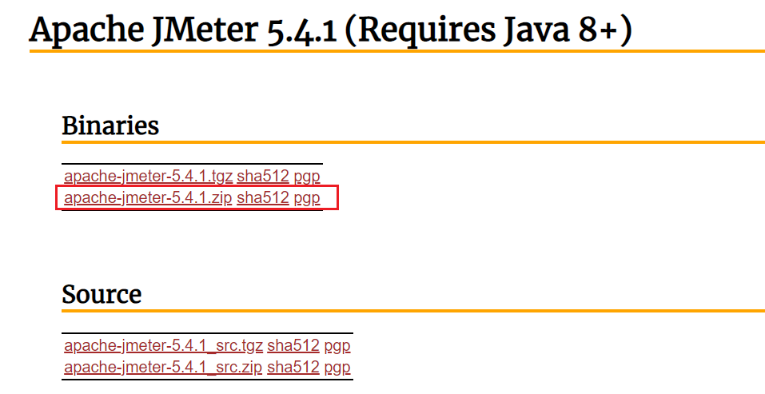

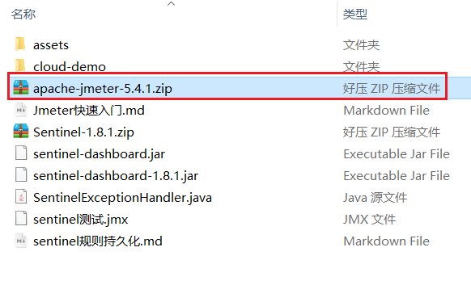

#### 13.1.2 、解压

​			因为下载的是zip包，解压缩即可使用，目录结构如下：

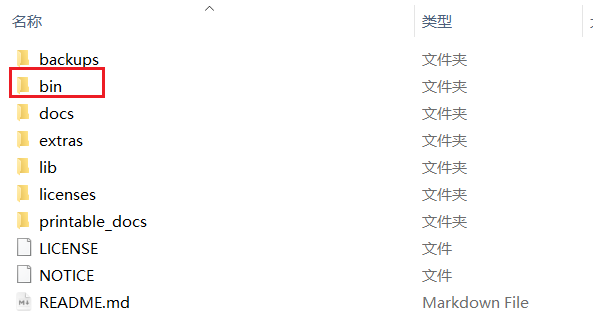

其中的bin目录就是执行的脚本，其中包含启动脚本：

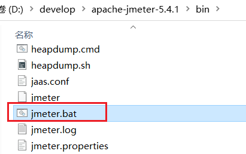

#### 13.1.3 、运行

双击即可运行，但是有两点注意：

- 启动速度比较慢，要耐心等待
- 启动后黑窗口不能关闭，否则Jmeter也跟着关闭了

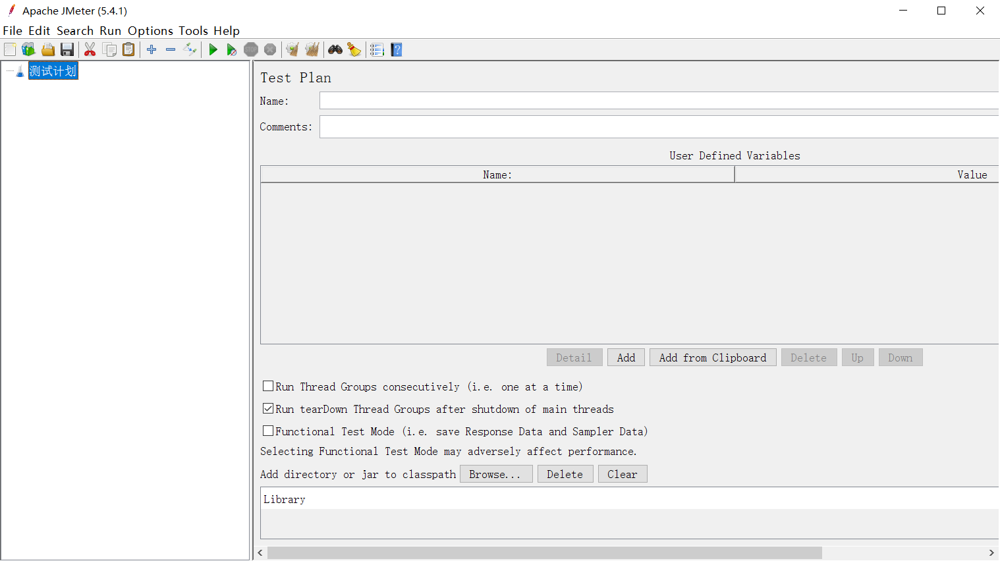


### 13.2、快速入门

#### 13.2.1 、设置中文语言

默认Jmeter的语言是英文，需要设置：

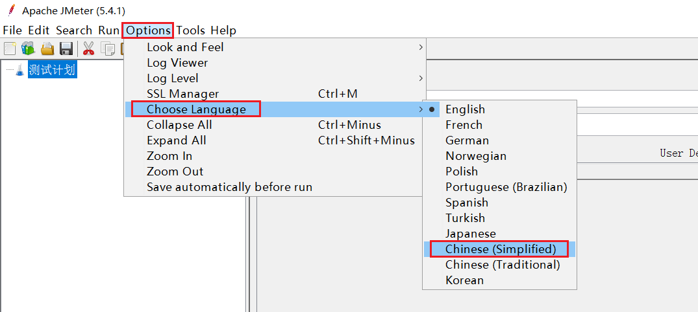

效果：

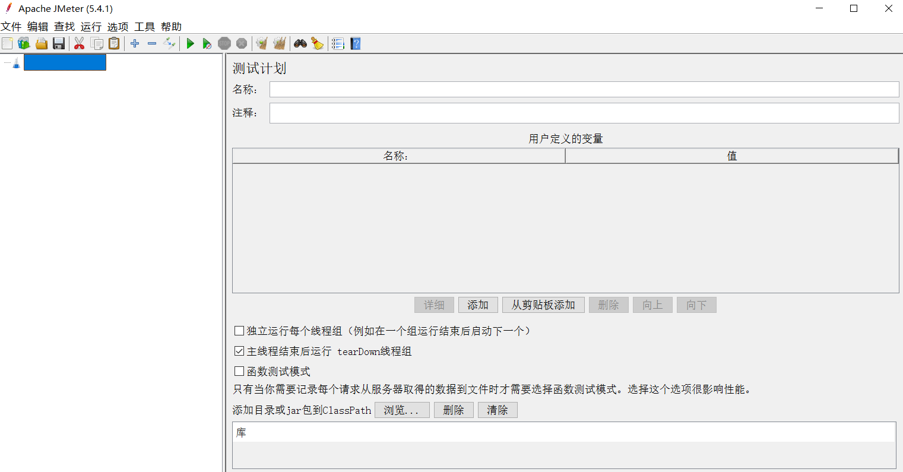


> **注意**：上面的配置只能保证本次运行是中文，如果要永久中文，需要修改Jmeter的配置文件


打开jmeter文件夹，在bin目录中找到 **jmeter.properties**，添加下面配置：

```properties
language=zh_CN
```

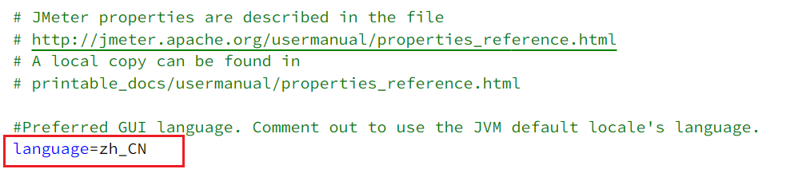


> 注意：前面不要出现#，#代表注释，另外这里是下划线，不是中划线


#### 13.2.2、基本用法

​		1、在测试计划上点鼠标右键，选择添加 > 线程（用户） > 线程组：

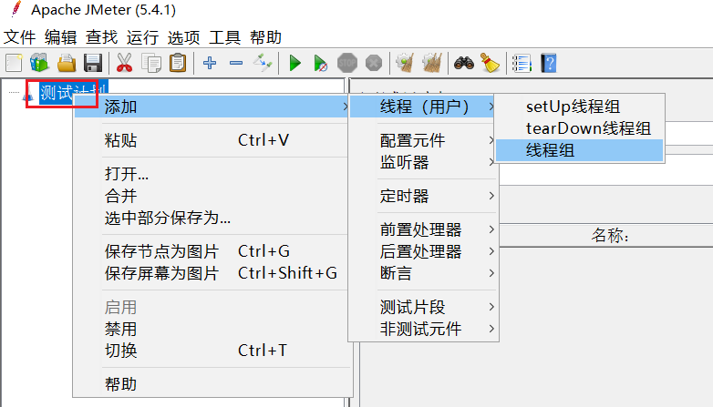

​		2、在新增的线程组中，填写线程信息：							

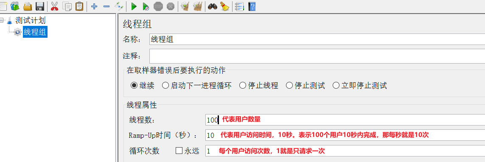


3、给线程组点鼠标右键，添加http取样器：

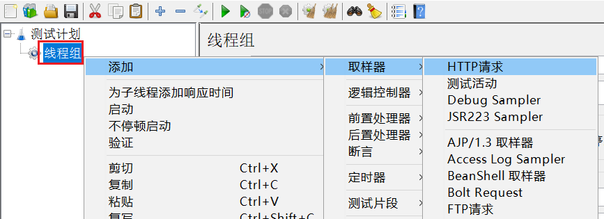


4、编写取样器内容：

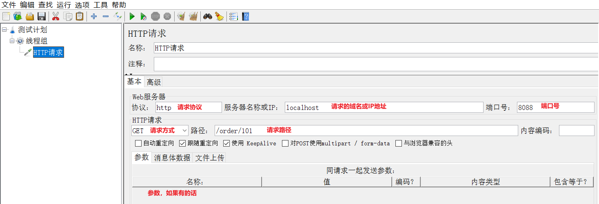

5、添加监听报告：

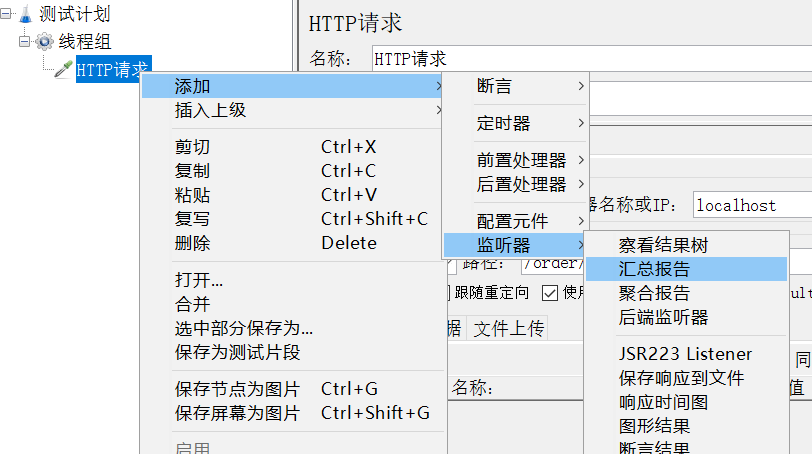

6、添加监听结果树：

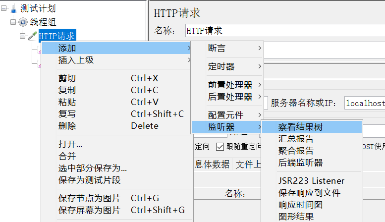


7、汇总报告结果：


8、结果树：

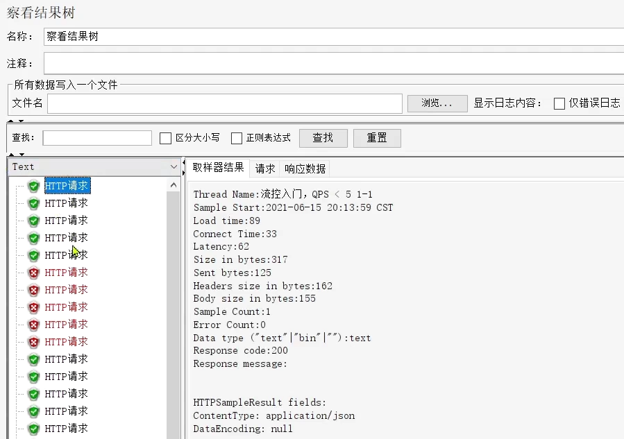

​	

## 十四、Rabbitmq安装

官方的安装指南地址为 : https://blog.rabbitmq.com/posts/2015/04/scheduling-messages-with-rabbitmq

### 		14.1 windows安装

​				下载地址：https://www.rabbitmq.com/download.html

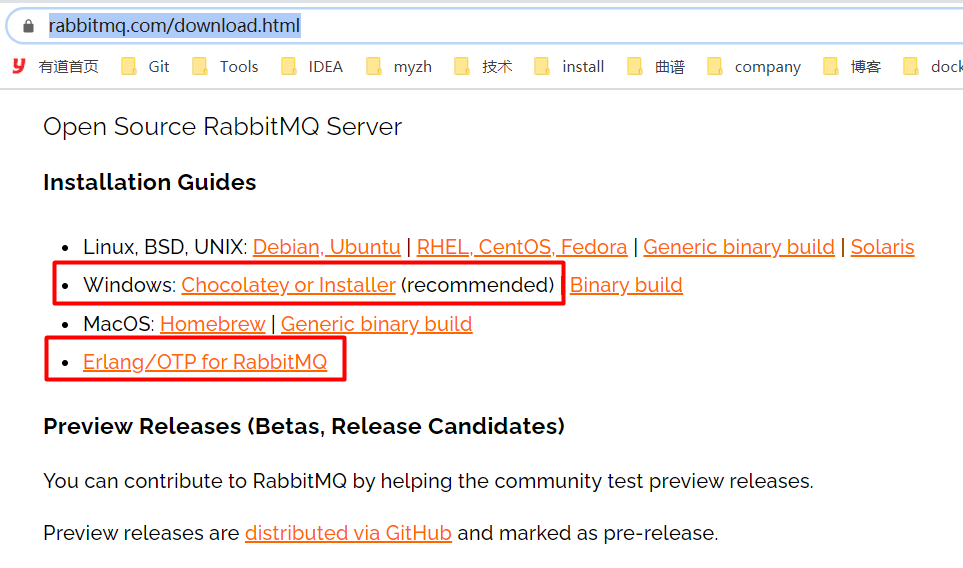

#### 14.1.1 安装Erlang

下载地址：https://www.erlang.org/downloads

1、下载对应版本的Erlang  , 如rabbitmq 3.8.14 对应的erlang最佳版本为  ： erlang 23

2、配置环境变量，cmd 下命令：erl  可测试erlang版本

#### 14.1.2 安装rabbitmq

下载地址：https://github.com/rabbitmq/rabbitmq-server/releases/tag/v3.8.14

 官方的安装指南地址为：https://blog.rabbitmq.com/posts/2015/04/scheduling-messages-with-rabbitmq

准备工作：

​	1、删除 C:\Users\Administrator\AppData\Roaming\RabbitMQ 目录；

​	2、Administrator下的.erlang.cookie拷贝至 C:\Windows\System32\config\systemprofile目录

​	3、删除注册表：HKEY_LOCAL_MACHINE\SOFTWARE\Ericsson 下的 Erlang

​	4、rabbitmq-server-3.8.14.exe  双击安装即可

​	5、安装控制台等插件 cmd下命令：rabbitmq-plugins enable rabbitmq_management

​			出现以下界面，则开启成功：

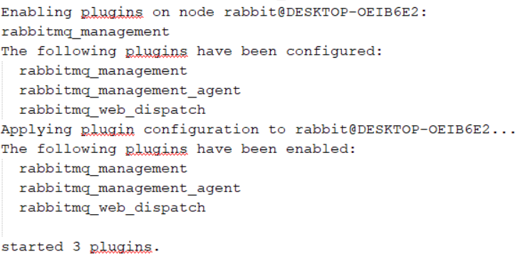

6、访问：localhost:15672  添加自定义用户

7、下载延时插件并放入rabbitmq 的 plugins目录

​		RabbitMQ有一个官方的插件社区，地址为：https://www.rabbitmq.com/community-plugins.html

​		其中包含各种各样的插件，包括我们要使用的DelayExchange插件


​		如：GitHub页面下载3.8.9版本的插件(对应RabbitMQ的3.8.5以上版本)，地址为：

​				https://github.com/rabbitmq/rabbitmq-delayed-message-exchange/releases/tag/3.8.9。

​        插件名字：rabbitmq-delayed-message-exchange-3.8.9-0199d11c.ez

​		安装插件， cmd下命令：rabbitmq-plugins enable rabbitmq_delayed_message_exchange

8、services.msc 检查rabbitmq服务是否正常开启

9、补充：

 	重装完成后若RabbitMQ service未安装则：
 	    通过：rabbitmq-service install 安装service；
 	 	通过：rabbitmq-service start 启动service
 		通过：rabbitmq-plugins enable rabbitmq_management 启动插件
 		通过：rabbitmq-plugins enable rabbitmq_delayed_message_exchange 开启延时消息插件
 	如果服务列表没有rabbitmq，则
 		通过：rabbitmq-service.bat install 来注册服务
 	后台启动rabbitmq-server：rabbitmq-server -detached 

### 14.2 linux安装

​	linux安装  https://blog.csdn.net/koponbs/article/details/110094811

### 14.3 docker安装

```shell
1、下载镜像 : docker pull rabbitmq:3.8-management
2、或者下载好镜像后，直接load：  docker load -i mq.tar
3、执行命令运行MQ容器：
	docker run \
         -e RABBITMQ_DEFAULT_USER=itcast \
         -e RABBITMQ_DEFAULT_PASS=123321 \
         -v mq-plugins:/plugins \
         --name mq \
         --hostname mq \
         -p 15672:15672 \
         -p 5672:5672 \
         -d \
    rabbitmq:3-management
    or
    rabbitmq:3.8-management
4、延时插件下载后放置在数据卷下：mq-plugins
	1）、查看数据卷对应的目录位置：docker volume inspect mq-plugins
	2）、进入容器内部：docker exec -it mq bash 
	3）、开启延时插件：rabbitmq-plugins enable rabbitmq_delayed_message_exchange
```


## 十五、xxl-job安装

​		源码地址：https://gitee.com/xuxueli0323/xxl-job       |      https://github.com/xuxueli/xxl-job

​		文档地址：https://www.xuxueli.com/xxl-job/

### 15.1、windows环境搭建

```shell
1、下载项目源码并解压，获取 “调度数据库初始化SQL脚本” 并执行即可。
	位置：`/xxl-job/doc/db/tables_xxl_job.sql`  共8张表
    - xxl_job_lock：任务调度锁表；
    - xxl_job_group：执行器信息表，维护任务执行器信息；
    - xxl_job_info：调度扩展信息表： 用于保存XXL-JOB调度任务的扩展信息，如任务分组、任务名、机器地址、执行器、执行入参和报警邮件等等；
    - xxl_job_log：调度日志表： 用于保存XXL-JOB任务调度的历史信息，如调度结果、执行结果、调度入参、调度机器和执行器等等；
    - xxl_job_logglue：任务GLUE日志：用于保存GLUE更新历史，用于支持GLUE的版本回溯功能；
    - xxl_job_registry：执行器注册表，维护在线的执行器和调度中心机器地址信息；
    - xxl_job_user：系统用户表；
调度中心支持集群部署，集群情况下各节点务必连接同一个mysql实例;
如果mysql做主从,调度中心集群节点务必强制走主库;
2、解压源码,按照maven格式将源码导入IDE, 修改xxl-job-admin的数据库密码
3、启动类启动项目，访问路径：localhost:8080/xxl-job-admin
   默认登录账号 “admin/123456”
```

### 15.2、docker环境搭建

```shell
1、创建mysql容器，初始化xxl-job的SQL脚本
    docker run -p 3306:3306 --name mysql57 \
    -v /opt/mysql/conf:/etc/mysql \
    -v /opt/mysql/logs:/var/log/mysql \
    -v /opt/mysql/data:/var/lib/mysql \
    -e MYSQL_ROOT_PASSWORD=root \
    -d mysql:5.7
2、拉取xxl-job镜像：docker pull xuxueli/xxl-job-admin:2.3.0
3、创建容器
    docker run -e PARAMS="--spring.datasource.url=jdbc:mysql://192.168.200.130:3306/xxl_job?Unicode=true&characterEncoding=UTF-8 \
    --spring.datasource.username=root \
    --spring.datasource.password=root" \
    -p 8888:8080 -v /tmp:/data/applogs \
	--name xxl-job-admin --restart=always  -d xuxueli/xxl-job-admin:2.3.0
```


## 十六、Jenkins安装

Jenkins  是一款流行的开源持续集成（Continuous Integration）工具，广泛用于项目开发，具有自动化构建、测试和部署等功能。官网：  http://jenkins-ci.org/。

### 16.1、linux安装

```shell
0、安装JDK (验证：java -version)
1.1、采用YUM方式安装
	1）、加入jenkins安装源：
		sudo wget -O /etc/yum.repos.d/jenkins.repo https://pkg.jenkins.io/redhat-stable/jenkins.repo --no-check-certificate

	    sudo rpm --import https://pkg.jenkins.io/redhat-stable/jenkins.io.key
	2）、执行yum命令安装：yum -y install jenkins
	3）、卸载
		#1、卸载
			sudo yum remove jenkins
		#2、彻底删除残留文件：
			find / -iname jenkins | xargs -n 1000 rm -rf
1.2、采用RPM安装包方式
	1）、Jenkins安装包下载地址：https://pkg.jenkins.io/redhat-stable/
		wget https://pkg.jenkins.io/redhat-stable/jenkins-2.190.1-1.1.noarch.rpm
	2）、执行安装：
		rpm -ivh jenkins-2.190.1-1.1.noarch.rpm
	3）、卸载
		#1、卸载
			rpm -e jenkins
		#2、检查是否卸载成功
        	rpm -ql jenkins
		#2、彻底删除残留文件：
			find / -iname jenkins | xargs -n 1000 rm -rf
2、修改配置文件：
		vi /etc/sysconfig/jenkins
3、修改内容
        # 修改为对应的目标用户， 这里使用的是root
        $JENKINS_USER="root"
        # 服务监听端口
        JENKINS_PORT="16060"
4、修改目录权限
	chown -R root:root /var/lib/jenkins
    chown -R root:root /var/cache/jenkins
    chown -R root:root /var/log/jenkins
5、重启：systemctl restart jenkins
6、创建JAVA环境的软链接：
	ln -s /root/install/jdk/jdk1.8.0_171/bin /usr/bin/java
7、管理后台初始化设置
	按照界面提示，去相应目录获取initialAdminPassword填入控制台
8、按默认设置，把建议的插件都安装上（需要大概10分钟，安装失败可重试）
9、安装完成之后， 创建管理员用户（设置jenkins管理员登录用户名lwd、密码lwd、全名、电子邮箱地址）
10、如果systemctl restart jenkins启动不了，可以用如下方式启动：
	后台启动jenkins并指定端口：nohup jenkins --httpPort=9999 &
						或：nohup java -jar jenkins.war --httpPort=9999 &
	停止：
		1、查找jenkins进程：ps -ef|grep jenkins
		2、杀死进程 kill -9 xxxx
	备注：jenkins war包存放目录： /usr/share/java/jenkins.war
	访问：http://192.168.200.161:9999
	重启：http://192.168.200.161:9999/restart
	停止：http://192.168.200.161:9999/exit
	重载：http://192.168.200.161:9999/reload
11、进入【系统管理】-【插件管理】- 标签页的【可选插件】下载安装 jenkins 插件
	- Maven Integration： Maven 集成管理插件（3.19）。
    - Docker： Docker集成插件（1.2.9）。
    - GitLab： GitLab集成插件（1.5.35）。
    - Publish Over SSH：远程文件发布插件（1.24）。
    - SSH: 远程脚本执行插件。 （2.6.1）
	注意，如果没有安装按钮，需要更改配置
	在安装插件的高级配置中，修改【升级站点】的链接为：http://updates.jenkins.io/update-center.json保存
12、安装git （验证：git version）
13、安装maven（验证：mvn -v）
14、安装docker（验证：docker -v）
15、进入【系统管理】--> 【全局工具配置】进行全局配置
	逐个配置JDK、maven、docker、git在机器上的安装目录（name，home）
	软件的安装目录：可以使用whereis命令查看，比如可以通过`whereis docker`命令查看docker的安装目录
	
```


## 十七、Minio安装

```tex
简介：
	一款主流、开源的分布式文件存储系统，客户端支持Java、Python、Javacript、 Golang语言。
    Minio可以做为云存储的解决方案用来保存海量的图片，视频，文档。由于采用Golang实现，服务端可以工作在Windows、Linux、 OS X和FreeBSD上。安装和配置非常简单，基本是复制可执行程序，单行命令就可以运行起来。minio还可以通过容器部署以及部署到k8s集群，详细部署方式可以查看官方文档。
  
```

### 17.1、windows安装

```shell
1、下载，下载链接：https://min.io/download#/windows
2、创建目录，得到exe运行文件，放入自定义目录，并创建minio数据目录 data
3、启动：exe目录命令方式启动：minio server ./data
  如果启动报端口错误：用如下命令启动：
  minio.exe server ./data --console-address ":9006" --address ":9005”
4、控制台登录，默认端口localhost:9000
```


## 十八、Cpolar安装

```tex
   内网穿透工具Cpolar，完全免费，它只需一行命令，就可以将内网站点发布至公网，方便给客户演示。高效调试微信公众号、小程序、对接支付宝网关等云端服务，提高编程效率。
	比如：一般项目中的支付模块在于第三方支付服务通信时，为了确保支付、退款等业务能及时得到业务执行结果，支持两种业务模式 - 基于第三方的回调通知  - 主动轮询 ，以上两种模式默认都已开启，但是回调模式依赖于内网穿透，需要配置内网穿透信息。当然，如果不配置也可以，此时走轮询模式，查询支付或退款结果可能会有一定的延时（一般延时不超过30秒）。

下载使用步骤：
1.注册并开通隧道
	官网：https://www.cpolar.com/
	下载：https://www.cpolar.com/download
	各个系统的下载安装安装官网指示即可，非常清晰，都是如下大致几个步骤：
2.登陆该网站，并注册一个账号
3.注册成功后，会跳转到套餐购买页面
4.选择免费套装，然后确定，之后会跳转到控制台页面，需要拿到自己的authtoken
5.下载对应系统安装包、安装，linux、docker都是执行命令下载，windows为安装包
5.将authtoken写入到本机的cpolar.yml中
6.使用：如将本地80端口服务暴露至公网：cpolar http 80
7.注意，如果ES同时启动，会存在9200端口被占用情况，因为cpolar web UI端口也为9200，此时可以将端口改为9201：
	linux：
		输入命令：nano /usr/local/etc/cpolar/cpolar.yml
		文件第一行添加：client_dashboard_addr: 192.168.150.101:9201
		重启cpolar服务：sudo systemctl restart cpolar
	windows：
		打开：C:\Users\Administrator\.cpolar\cpolar.yml
		文件第一行添加：client_dashboard_addr: 127.0.0.1:9201
		service.msc服务列表中重启服务
```

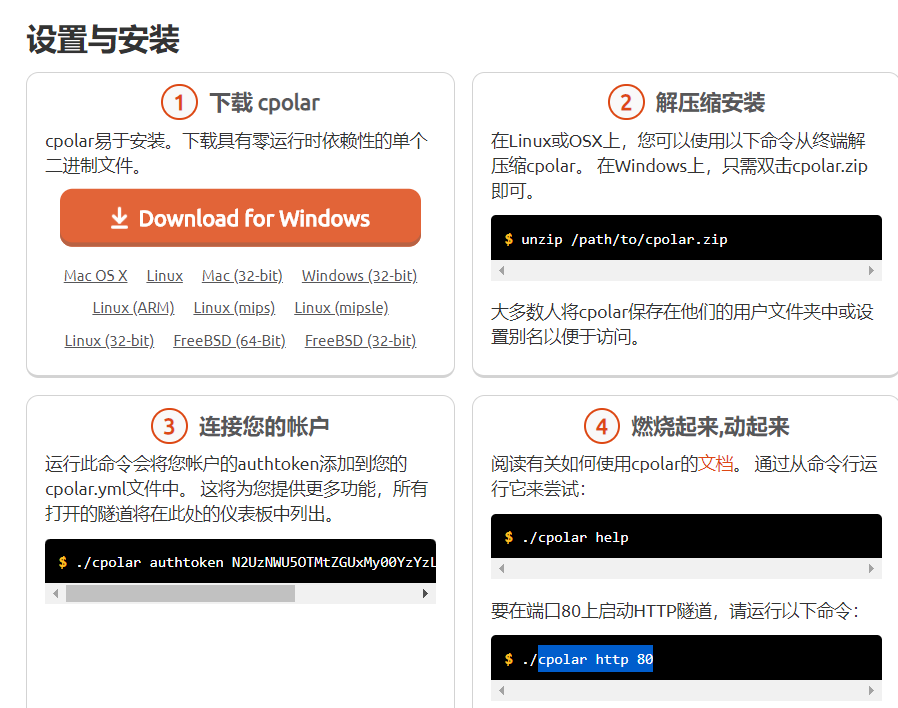

### 18.1、linux安装

​		https://www.cpolar.com/blog/linux-system-installation-cpolar?channel=0&invite=4W3F

```shell
1、联网下载安装（（国内使用））
	curl -L https://www.cpolar.com/static/downloads/install-release-cpolar.sh | sudo bash
1、联网下载安装（（国外使用））
	curl -sL https://git.io/cpolar | sudo bash

2. 查看版本号，有正常显示版本号即为安装成功
	cpolar version

3. token认证（登录cpolar官网后台，点击左侧的验证，查看自己的认证token，之后将token贴在命令行里）
	cpolar authtoken xxxxx
    会将token写入：/usr/local/etc/cpolar/cpolar.yml
    
4. 简单穿透测试
    cpolar http 8080
    按ctrl+c退出

5. 向系统添加服务（开机）
    sudo systemctl enable cpolar

6. 启动cpolar服务
    sudo systemctl start cpolar

7. 查看服务状态
    sudo systemctl status cpolar

8. 登录后台，查看隧道在线状态
    https://dashboard.cpolar.com/status

9. 卸载方法
curl -L https://www.cpolar.com/static/downloads/install-release-cpolar.sh | sudo bash -s -- --remove

其他安装说明：
    1、cpolar默认安装路径 /usr/local/bin/cpolar,
    2、安装脚本会自动配置systemd服务脚本，启动以后，可以开机自启动。
    3、如果第一次安装，会默认配置一个简单的样例配置文件，创建了两个样例隧道，一个web，一个ssh
    4、cpolar配置文件路径: /usr/local/etc/cpolar/cpolar.yml
```

### 18.2、windows安装

​		https://www.cpolar.com/download

```tex
1、下载压缩包后解压 双击安装包一路默认安装即可
2、cmd执行：cpolar authtoken xxxxx
  会将token写入：C:\Users\Administrator\.cpolar\cpolar.yml
3、简单穿透测试
    cpolar http 8080
    按ctrl+c退出
```

### 18.3、docker安装

​	    https://www.cpolar.com/blog/docker-container-installation-cpolar?channel=0&invite=4W3F


## 十九、软件下载地址

​	Git： https://git-scm.com/download

​    JDK：https://www.oracle.com/java/technologies/downloads/

​	Maven：https://maven.apache.org/download.cgi

​					https://archive.apache.org/dist/maven/maven-3/

​	Maven中央仓库：https://mvnrepository.com/

​									 https://central.sonatype.com/?smo=true

​	Mysql：https://downloads.mysql.com/archives/installer/

​	Redis：https://github.com/tporadowski/redis/releases

​	MongoDB：https://www.mongodb.com/try/download/community

​	Erlang：https://www.erlang.org/downloads

​	Rabbitmq：https://www.rabbitmq.com/download.html

​    Rabbitmq Plugin：https://www.rabbitmq.com/community-plugins.html

​	IDEA：https://www.jetbrains.com/idea/download/#section=windows

​	Pycharm：https://www.jetbrains.com/pycharm/download/#section=windows

​	Python：https://www.python.org/downloads/

​	Consul：https://www.consul.io/downloads

​	Nacos：https://nacos.io/en-us/

​	Docker：https://www.docker.com/

​	Docker Hub：https://hub.docker.com/_/redis

​	亿图图示：https://www.edrawsoft.cn/edrawmax/?hmsr=Ivymax&hmpl=&hmcu=&hmkw=&hmci=

​	SpringCloud：https://spring.io/projects/spring-cloud/

​	ElasticSearch：https://www.elastic.co/cn/elasticsearch/

​	Sentinel：https://sentinelguard.io/zh-cn/index.html

​	IK分词器：https://github.com/medcl/elasticsearch-analysis-ik/releases

​	拼音分词器：

​	Linux：华为：https://mirrors.huaweicloud.com/centos/

​				   网易：http://mirrors.163.com/centos/

​	MinIO：https://min.io/

​	Node JS：https://nodejs.org/en/download

​	VS code：https://code.visualstudio.com/Download

​	Yapi：http://yapi.smart-xwork.cn/

​	Cpolar：https://www.cpolar.com/download

## 二十、博客

芋道源码：https://www.iocoder.cn/Geek/Learn-micro-services-from-zero/What-is-a-micro-service/

美团：https://tech.meituan.com/2022/05/12/principles-and-practices-of-completablefuture.html

[Java 全栈知识体系](https://www.pdai.tech/)：https://www.pdai.tech/md/outline/x-outline.html

## 二十一、工具网站

Hutool：https://hutool.cn/docs/#/

图标：https://ant.design/components/icon-cn/

程序员导航：http://tooool.org/

Process on 模板：https://www.processon.com/diagrams/new#template

base64转图片：https://www.toolnb.com/tools/base64ToImages.html

项目库：https://s3domc2om4.feishu.cn/wiki/wikcn9vEuhh0U7GarNqxpMXSpmb?sheet=9V8a5C

文心一言：https://yiyan.baidu.com/chao

---

## 相关笔记

- [[📋 技术速查/技术速查总览|📋 技术速查总览]]

- [[MOC-工具运维|🛠️ 工具运维 MOC]]
- [[常用指令/常用指令总览|🛠️ 常用指令总览]]
- [[📋 技术速查/Redis命令|Redis 命令速查]]

