# 天机学堂项目表述(参考）

> 📂 [[天机学堂-MOC|课程索引]] | 来源：飞书公开知识库「黑马天机学堂」


## **天机学堂项目**

**产品原型**：

管理端：[https://lanhuapp.com/link/#/invite?sid=qx03viNU](https://lanhuapp.com/link/#/invite?sid=qx03viNU) Ssml

用户端：[https://lanhuapp.com/link/#/invite?sid=qx0Fy3fa](https://lanhuapp.com/link/#/invite?sid=qx0Fy3fa)  ZsP3

**项目介绍**

```Plain Text
天机学堂是一个基于微服务架构的生产级在线教育项目，面向成年人的非学历职业技能培训平台。分为两部分，学生端：其核心业务主体就是学员，所有业务围绕着学员的展开。管理端：其核心业务主体包括老师、管理员、其他员工，核心业务围绕着老师展开。项目中包含有学习服务、课程服务、点赞服务、优惠券服务、搜索服务等。
```

**技术栈**：SpringCloud Alibaba、SSM、Redis/Redisson、RabbitMQ、Mysql分库分表、XXL-Job等

**项目负责**（核心功能）

1. 负责实现学习服务，基于Redis合并写请求和DelayQueue实现断点续播功能，优化高并发的数据库写业务，使误差控制在15秒内。
2. 独立设计并实现问答评论模块，根据用户选择的匿名与否，记录问答或者评论信息，并产生对应的积分，通过RabbitMQ推送给积分系统。
3. 独立负责点赞服务的搭建与实现，用户前端发送点赞请求到达点赞服务，点赞服务负责存储点赞记录与点赞数量，并通过定时任务发送MQ消息通知业务方更新点赞数量。
4. 负责签到功能实现与优化，基于BitMap数据结构存储签到记录，通过MQ推送签到信息及积分到积分服务。
5. 负责积分排行榜功能实现，利用Redis的Zset存储本月实时排行榜数据。通过XXL-Job分片任务持久化历史榜单到Mysql数据库中，Mysql采用的是分库分表，利用MybatisPlus的动态表名来计算表名。
6. 负责优惠券管理功能，发放优惠券时利用按位加权求和算法和异步线程生成兑换码，并利用BitMap验证兑换码是否已经兑换。保证了兑换码的可读性、不可重兑、防爆刷和高效性。
7. 负责优惠券的领取功能，利用乐观锁和分布式锁Redisson解决并发安全问题，解决事务边界原因导致的锁失效问题，通过aspectj动态代理解决事务失效问题。
8. 负责实现通用分布式锁的封装，基于AOP、自定义注解、工厂模式和策略模式实现。
9. 负责优惠券的使用，通过查询所有可用优惠券，经过初筛、细筛、排列组合计算出所有可用优惠券组合，并基于CompleteableFuture并行计算每种组合的优惠明细，最后按照规则筛选出最优解。

## **项目表述**

***在讲的过程中，可以不需要跟下面写的一样，一股脑把所有技术实现流程都讲出来（因为面试官可能跟不上你的节奏），可以先讲一部分，引起面试官的兴趣了，再讲一部分，最好以一问一答的方式进行。***

### **断点续播功能**

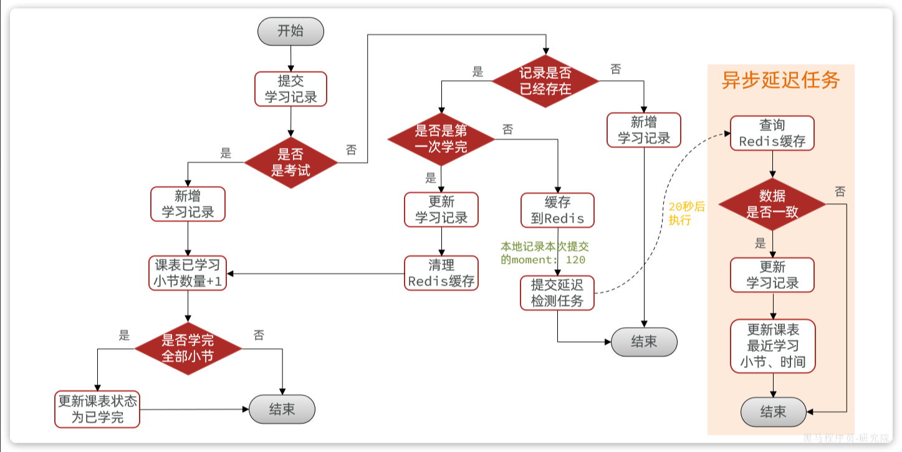


> 业务介绍

```Plain Text
用户购买课程后，会发送MQ，课程会加入到课表中，在个人中心学习界面用户就能进行学习课程。用户点击马上学习，会进入视频播放的界面，一个课程中包含很多章节视频，一般最后一个小节是考试，我这里主要负责的就是视频播放续播。在播放的过程中前端会每隔15秒提交一次播放记录，主要就是提交播放章节、播放的进度、小节类型、提交的时间等参数。我们需要在后台记录下这些信息，方便用户断点续播。并且我们规定好了，如果学习进度超过50%，代表用户已经学完该小节。
```

> 实现流程

```Plain Text
在用户提交学习记录到后台，在后台首先会判断一下小节类型，也就是判断本次提交的是视频还是考试。
如果是考试比较简单，考试只提交一次就行，代表用户已经学完这个小节，所以我们直接在学习记录表中新增一条记录，并且状态是已学完，再到课表中跟新已学习的小节数量+1，还要判断下是否学完全部小节（这里我们是通过远程调用课程服务查询全部小节，与课表中的已学习小节进行比较），如果全部学完，我们还会更新课表的状态为已学完。
如果是视频稍微麻烦一点，因为用户每隔15秒提交一次，如果同时在线的用户比较多并发量就会很高，而且在播放的过程中其实只需要给数据库中记录用户最后一次播放进度就行，前面的播放记录会被覆盖，所以会造成很多无效的写操作。这里我们使用Redis来合并写请求，并使用延迟任务DelayQueue来判断用户是否还处于播放中。
当用户提交过来视频播放记录后，我们能我们首先会查询redis缓存判断播放记录是否存在，如果不存在会直接新增一个学习记录。
如果记录存在，会判读是不是第一次学完，如果不是的话，这种请求会占用整个视频请求的90%以上，我们就会缓存到Redis中，同时会提交一个20秒之后执行的延迟任务。
在项目启动的时候我们就会开启一个异步任务，不停的检测延迟队列中是否有任务，一旦有任务，就会判断这里的任务和Redis中的学习记录是否一致，如果一致，也就是说用户已经超过20秒没有再提交新的学习记录，说明用户已经停止播放了，这里我们就会持久化到数据库中，更新学习记录和课表中最近学习小节和时间。如果不一致，说明用户还在持续播放，直接结束不做处理
另外如果经过判断是第一次学完，也会直接更新数据库的学习记录，同时还要清理Redis缓存（数据库与缓存保持一致），更新课表已学习的小节数量+1，判断是不是全部学完，如果是再更新课表状态。
所以虽然用户端不停的提交播放进度，但是优化后这里写数据库的频率就会少很多，用户第一次过来新增学习记录，第一次学完会更新学习状态，中途停止播放也会更新数据库。
```

> 可能会追加提问

```Plain Text
Redis使用的是哪种数据结构来记录的？key和value是如何设计的？
延迟任务为什么使用的是DelayQueue？有什么优点？还有其他延迟任务可供选择吗？
项目启动时的异步任务是如何实现的？
高并发问题一般还有哪些优化解决方案？
```

### 互动问答功能(着重讲清楚表设计)

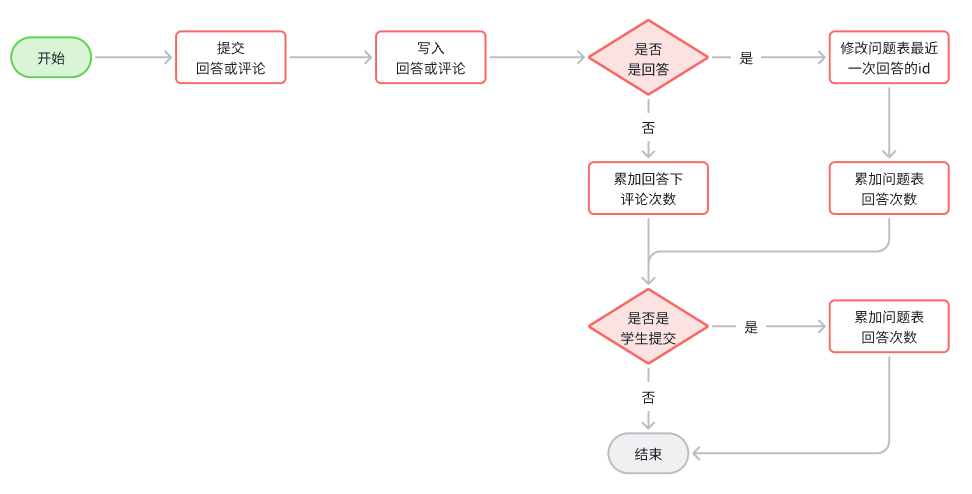


> 业务介绍

```Plain Text
用户在学习的过程中，可以在播放界面的侧边进行提问，其他用户如果看到这个问题可以对这个问题进行回答，并且也可以对回答进行评论。在管理端，管理员也可以查看这个问题，同样也可以对这个问题进行回答或者评论。并且管理端还有隐藏功能，可以对问题、回答或者评论进行隐藏。
```

> 实现流程

```Plain Text
我先说一下这里的表结构。
这里设计了两张表，分别是问题表和回答评论表。
问题表主要记录的是问题所属的课程、章、节，提问者的id，是否匿名，是否隐藏，问题内容，回答的数量，还有最近一次的回答信息等，因为我们在查询问题列表的时候需要展示最近一次回答者的信息，所以最近回答的也会被记录在问题表中。
回答表主要记录的是 问题的id，回答者的id，回答内容，是否匿名，是否隐藏，点赞数量、评论数等，还有上级的回答id，评论的目标id和目标用户。因为回答和评论是属于一张表，并且业务上可以对回答评论，可以继续对评论进行评论，所以是用自关联的方式记录了目标id。
我先说一下新增评论或者回答吧。
用户提交过来回答内容，是否匿名，上级的id，目标用户id这些之后，我们除了直接保存到回答表之外，还需要去累加一下问答数或者评论数，如果是回答，那么需要更新问题表的回答数，如果是评论，需要更新回答表的评论数。如果是学员的评论，还需要修改问题表中的一个是否查看的字段。主要是将来方便管理员查看自己是否处理过这些问题。
接着我们会发送一个MQ的消息，一般一次回答是给5个积分，推送给积分服务。
再说一下查询回答列表吧。
列表中首先会查询问题的详情，在问题详情下就会有很多的回答跟评论。
这里前端会给后端传递问题id或者回答id。
我们直接分页查询回答表
查到数据之后还需要处理提问者的信息，回复目标的信息以及当前用户点赞状态等
提问者信息和回复者信息如果不是匿名的，我们就会通过远程调用去查询用户服务，并用Stream流转换成Map结构
另外还需要查询用户点赞状态，这个也需要调用点赞的微服务，判断用户是否点过赞
最后把这些信息封装VO返回的。
```

> 后续优化方案

```Plain Text
后续优化，把数据迁移到mongoDB中，并且相应的代码也会改成mongoDB的操作
```

### **点赞功能**

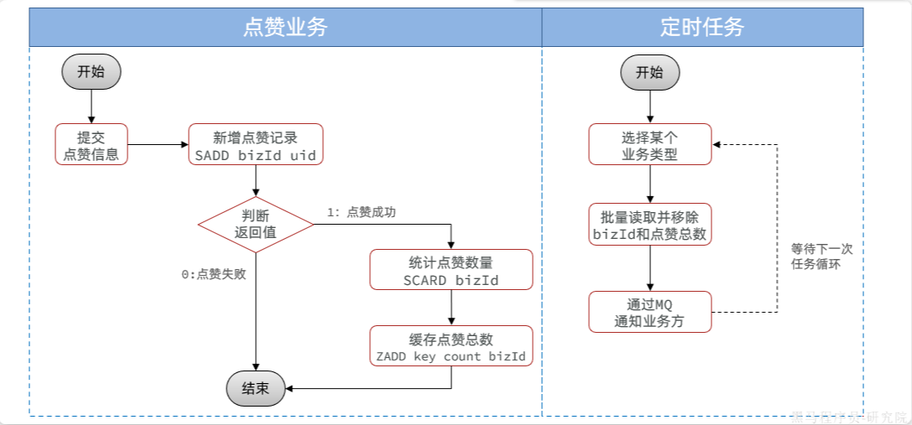


> 业务介绍

```Plain Text
在天机学堂中涉及点赞的地方还是比较多的，用户可以给问答评论做点赞，可以给笔记做点赞等。所以点赞要做成一个通用的功能，我们是单独搭建了一个点赞的服务，具有独立性和通用性，并且能适应一定的并发。
```

> 实现流程

```Plain Text
用户提交点赞信息后，会携带要点赞的业务id、点赞的业务类型到点赞服务
点赞服务主要保存点赞记录和点赞数量
这里我们使用的Redis中的Set结构来保存点赞记录，key是业务的id，值就是点赞的用户
因为Set结构中的值不能重复，所以我们通过返回值就能判断该用户之前是否已经点过赞，如果已经点过，直接结束
如果没有点过赞，我们还会通过set中SCARD命令来统计这个业务点赞的用户数量
再把点赞的数量保存到Zset结构中，key是业务类型，score是点赞数量，value是业务id。
在点赞服务中我们还开始了一个定时任务，这里使用的是XXL-JOB，定时从Zset结构中利用popmin从小到大批量的读取并移除这些业务的点赞数量，再通过MQ通知业务方，业务方会把点赞数量记录到自己的业务表中。
另外还提供Feign接口，供业务方根据业务id集合进行查询，可以判断当前登陆用户是否对这些业务点赞过。这里我们使用了Pipelined批量读取查询到的。
```

> 可能追加提问

```Plain Text
为什么利用Zset结构来存储？Zset底层原理是什么？（跳表）
```

### **签到积分功能**

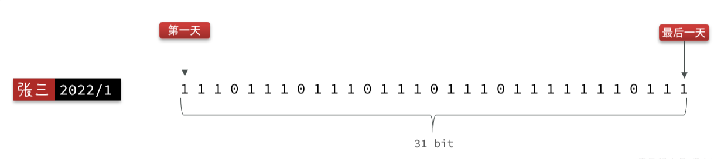


> 业务介绍

```Plain Text
用户在个人中心我的积分页面可以进行每日签到打卡，签完到之后会产生积分，我们规定了签一次到给一个积分，如果连续签到还会有额外的积分奖励，积分可以用来兑换优惠券、书籍周边等。积分除了通过点赞获得之外，还可以通过用户的学习行为获取，比如：学习、写笔记、回答问题等。这里我主要来说下签到的实现。签到需要记录用户的id、签到时间，而且签到时间将来还需要根据月进行统计。
一条记录是一个用户一次的签到记录。假如一个用户1年签到100次，而网站有100万用户，就会产生1亿条记录。
随着用户量增多、时间的推移，这张表中的数据只会越来越多，占用的空间也会越来越大。
```

> 实现流程

```Plain Text
我们使用Redis BitMap数据结构实现的。
用户在提交点赞记录后我们首先会通过SetBit指令来保存用户的签到记录，key是用户id+年月，value就是BitMap了。其中每一位代表这个月的每一天的签到情况，0代表未签到，1代表已签到。offset偏移量就是今天的日期
这样我们用一行数据就能标示这个用户一个月的签到记录，最多31个比特位，不超过4个字节，非常的节省空间。
然后还要计算下连续签到天数，通过bitField指令查询出这个用户这个月从第一天到今天为止所有的签到记录，因为查到的是10进制，所以我们让这个数字跟1做与运算，其实就是最后一位跟1做与运算，这样就能得到最后一天的签到记录，如果是1，代表已经签到过，再把这个数字右移一位，倒数第二位就成最后一位了，再跟1做与运算，得到倒数第二天的签到记录，依次循环，直到碰到结果为0的情况，最终就能得到连续签到的天数了
根据连续签到的天数的奖励积分，加上本次签到额得分，就能知道用户本次签到的总积分了，通过MQ发送消息给积分系统，积分系统会保存签到积分。
```

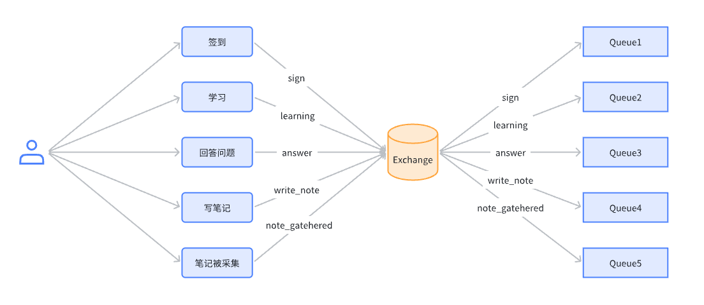

### **积分排行榜功能**

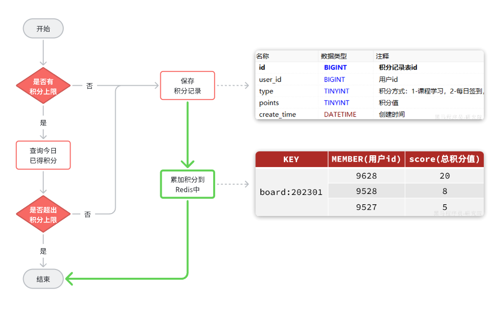


> 业务介绍

```Plain Text
在个人中心我的积分页面可以查看到用户的积分获取情况，还能看到学霸天梯榜，也就是积分排行榜。
分为实时排行榜和历史排行榜
实时排行榜展示的是本月的积分获取情况，根据用户获取的积分倒叙排名，只展示前10名，当前用户的排名始终都会展示。
历史排行榜跟实时排行榜类似，只不过是可以查询历史赛季（历史的月份）的排名情况。
```

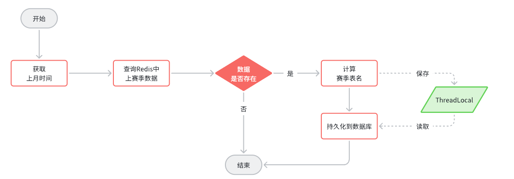

> 实现流程

```Plain Text
当用户通过点赞、学习行为产生积分时，会发送消息通知积分服务，积分服务除了保存积分明细之外，还有把积分累加到Zset中，Zset就记录的是用户本月的总积分。这个Zset就是实时榜单了。

用户在查询实时榜单时需要查询榜单列表和自己的排名
查询榜单列表通过reverseRangeWithScores命令进行查询
查询用户自己的排名则通过reverseRank命令进行查询。

历史榜单稍微会麻烦那么一点。因为历史榜单查询频率不高，所以我们没有在Redis中存在，是持久化到Mysql数据库中的。这里我们采用的是水平分表来存储，一个季度就是一张表。
通过XXL-Job定时任务来实现整个历史榜单持久化动作，分为三个定时任务
第一个定时任务是月初的时候创建新的赛季表。
第二个定时任务是在第一个定时任务执行完之后接着执行的，用来把上个月的榜单持久化到数据库中
第三个定时任务是在第二个定时任务执行完之后接着执行，用来清理Redis中上个月的榜单数据
我主要说下第二个定时任务持久化的实现流程：
首先获取到上个月的日期，然后从Redis中查询上个月的积分排名信息，再利用MybatisPlus的动态表名插件来计算对应的表，再把积分排行榜存储到数据库中，并且这里定时任务采用的是XXL-JOB的任务分片，每个实例按照自己的分片序号查询不同的数据进行持久化。
第三个定时任务我们使用了redis中的unlink指令异步删除redis中的榜单数据，防止阻塞。
```

### **优惠券管理功能/发放优惠券**

> 业务介绍

```Plain Text
优惠券管理是属于后台管理营销中心的功能。主要就是管理员对优惠券的创建、发放、查询、删除等操作。
优惠券可以指定使用的范围，比如全部课程，或者部分分类的课程
还分为很多类型、每满减、满减、无门槛、折扣等
另外还能指定发放的数量、每人限领的数量。
跟发放优惠券相关的还有一个重要的属性就是推广的方式，分为手动领取和指定发放
如果是手动领取，用户直接在活动页面点击领取就行
如果是指定发放，那么就需要生成兑换码，用户在兑换码页面输入兑换码来兑换优惠券，一个兑换码只能使用一次。
我这里主要说一下发放优惠券的实现方案。
```

> 实现流程

```Plain Text
管理员刚创建的优惠券其实是处于待发放状态，确认没有问题了，管理员就能发放优惠券了
在发放时，可以指定立即发放或者定时发放。
在后台，首先会查询优惠券，再判断优惠券的状态是处于待发放或者暂停，这两种状态下才可以进行发放
如果是立即发放，那么直接修改数据库优惠券状态即可
如果推广方式是手动领取，流程到此结束
但如果是指定发放，我们还需要生成兑换码。需要支持20亿以上的唯一兑换码，长度不超过10，只能包含字母数字，并且要保证生成和校验算法的高效。
这里我们使用了自增序列来实现的。因为自增序列号可以借助于BitMap验证兑换状态，完全不用查询数据库，效率非常高。
要满足20亿的兑换码需求，只需要31个bit位就够了，也就是在Integer的取值范围内，非常节省空间。我们就按32位来算，支持42亿数据规模。
不过，仅仅使用自增序列还不够，因为容易被人猜到爆刷。所以我们设计了一个按位加权求和的加密验签算法。
32位的自增序列，可以每4位一组，转为10进制，这样就有8个数字。提前准备一个长度为8的加权数组，作为秘钥。对自增序列的8个数字按位加权求和，得到的结果作为签名。加权数组最好使用质数，这样重复的概率会降低。
当然，考虑到秘钥的安全性，我们也可以准备多组加权数组，比如准备16组。然后生成兑换码时随机生成一个4位的新鲜值，取值范围刚好是0~15，新鲜值是几，我们就取第几组加权数组作为秘钥。然后把新鲜值、自增序列拼接后按位加权求和，得到签名。
最后把签名值的后14位、新鲜值（4位）、自增序列（32位）拼接，得到一个50位二进制数，然后与一个较大的质数做异或运算加以混淆，再基于Base32进行转码，得到的兑换码恰好10位，符合要求。

当我们要验签的时候，首先将结果 利用Base32转码为数字。然后与大质数异或得到原始数值。
接着取高14位，得到签名；取后36位得到新鲜值与自增序列的拼接结果。取中4位得到新鲜值。
根据新鲜值找到对应的秘钥（加权数组），然后再次对后36位加权求和，得到签名。与高14位的签名比较是否一致，如果不一致证明兑换码被篡改过，属于无效兑换码。如果一致，证明是有效兑换码。
接着，取出低32位，得到兑换码的自增序列号。利用BitMap验证兑换状态，是否兑换过即可。
整个验证过程完全不用访问数据库，效率非常高。
```

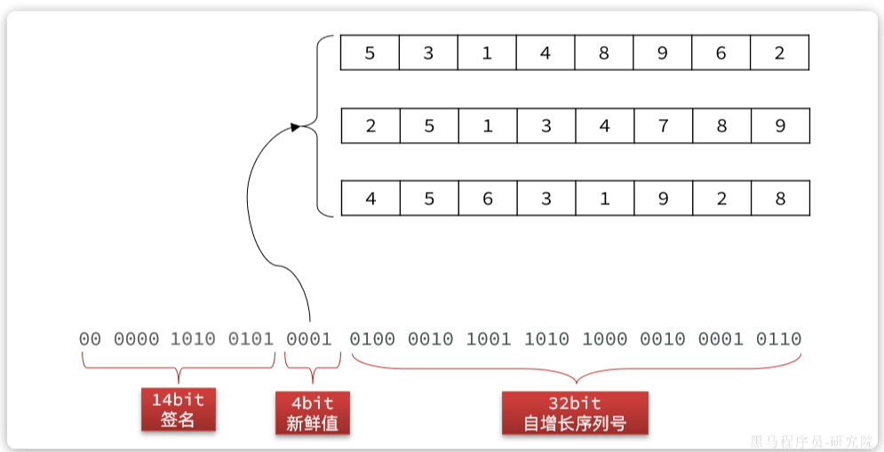

### **优惠券的领取功能**

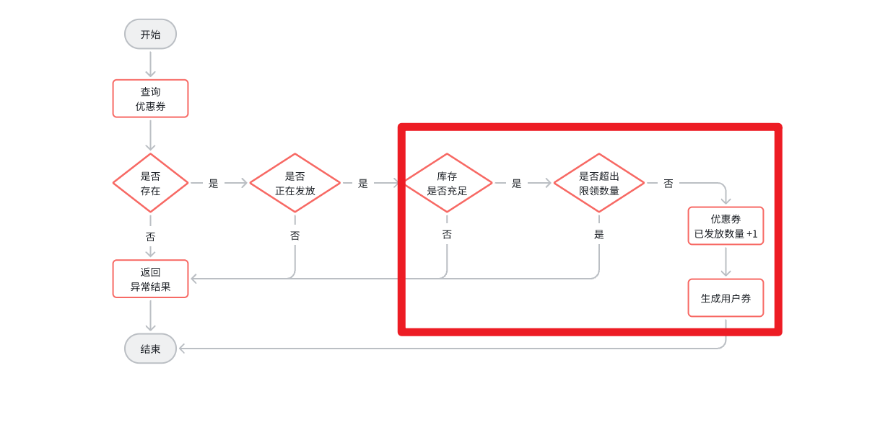

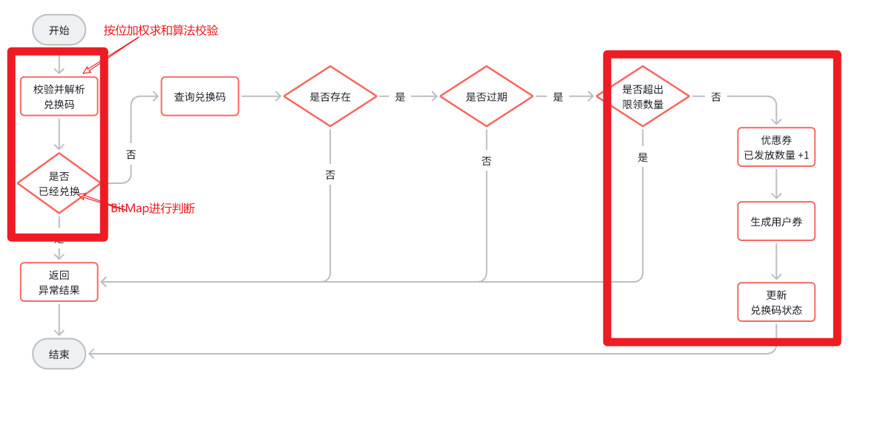


> 业务介绍

```Plain Text
在营销活动页面，会展示出所有可以手动领取的、发放中的优惠券，学员用户可以在该页面领取优惠券。
至于兑换码需要用户手动输入兑换码进行领取。
每个优惠券都有库存数量和用户限领数量，所以我们在领取的时候需要判断是否超过库存、是否超出限领数量。
用户领取成功，这个优惠券就是用户券，是单独存放在一张表中，用来记录用户和券的关系。
```

> 实现流程

```Plain Text
当用户点击领取时，携带优惠券id请求到达后台
这里流程还是比较复杂的，我主要说下核心流程
首先要判断库存，在优惠券表中有一个字段用来记录已领取的数量
接着还要判断限领数量，限领数量也在优惠券表中，判断的时候我们还会查询用户券，判断用户领取的这个券是否超过限领数量
都没有问题了，就会修改优惠券表中的已领取数量+1，同时生成一张用户券，其实就是给用户券表插入一条数据。

至于通过兑换码领取也类似，只不过多了几个流程
兑换码领取刚进来是需要校验并解析验证码（上面讲过）
接下来的流程跟手动领取基本一样。
```

```SQL
这就是领取优惠券的整个流程，不过这里会有一些并发安全的问题产生

首先就是超卖问题：
原因就是判断库存数量和修改库存数量不是原子性操作
这种场景非常适合使用乐观锁来解决，在修改的时候加入库存数量的判断即可。

第二个是超出用户限领数量问题：
原因也是因为这里的逻辑分三步，先查询数据库 --> 再判断是否超出限领数量--> 最后新增用户券
解决方式的话这里不适合使用乐观锁了，因为是新增操作，所以只能使用悲观锁了。
这里我们基于Redisson结合工厂模式（用来切换锁类型）和策略模式（锁失败之后的各种策略），还有AOP和自定义组件实现了一套通用的锁组件。只需要在对应的方法上加上注解就能实现悲观锁了。这里锁的粒度是用户id，所以性能还是比较ok的。

但是这里我们加了锁之后发现还是出现锁失效的问题：
通过各种测试与排查，我们发现是事务的原因，整体业务流程是
* 开启事务
* 获取锁
* 统计用户已领券的数量
* 判断是否超出限领数量
* 如果没超，新增一条用户券
* 释放锁
* 提交事务
由于锁过早释放，导致了事务尚未提交,那么另一个线程过来可能查询不到未提交的数据，也认为当前用户没有领过券，最后也会导致出现一个用户领了多张券的情况。
解决方案就是调整事务的边界，业务开始前，先获取锁，再开启事务。业务结束后：先提交事务，再释放锁。
所以我们把这部分核心代码抽取到一个方法中加了事务，锁的话我们利用Spring的Orderd注解把他的优先级调高了。

这样做并发安全问题能解决了。但是事务又失效了：
原因是非事务方法调用了事务方法
后来我们利用AspectJ在非事务方法中获取到当前Bean的代理对象，利用代理对象调用方法就能使事务生效了。
```

> 可能追加提问

```SQL
悲观锁和乐观锁的区别？分别有那些实现方案？
为什么使用Redisson？（说一下集群场景下Synchronize的问题）
Redisson是如何解决原子性问题？锁超时问题？可重入问题？失败重试问题？一致性问题？
你们通用锁组件是怎么实现的？具体讲讲
都有哪些锁类型？
都有哪些失败重试的策略？
```

### 通用分布式锁封装

> 实现流程

```Plain Text
我们分布式锁使用的是Redisson，在项目中我们有很多地方都会使用到分布式锁，比如优惠券领取，兑换码兑换等场景，所以我们基于AOP+自定义注解结合工厂模式策略模式实现了一套自定义的分布式锁。
首先分布式锁的使用无非就是在执行业务之前获取到锁对象，尝试获取锁，在业务执行完毕后去释放锁，所以我们写了一个自定义的注解，将来在需要加锁的方法上加上这个注解就行。另外还写了一个AOP切面，切入点就是加了注解的方法，通知类型是环绕通知。
在切面中主要做的事就是获取锁对象  -->   尝试加锁  -->   执行业务  --> 释放锁
首先获取锁对象，我们使用工厂模式来实现，因为redisson中有很多锁对象，比如可重入锁，公平锁，读锁，写锁等，我们把这些类型放到一个枚举中，并用枚举的方法来实现，然后配置到注解的属性上，将来使用的时候只需要在添加注解的时候去指定要用的锁类型就行
接着是尝试加锁，这里我们使用的是策略模式实现的。主要是封装获取锁失败后的策略。比如获取失败后是否重试，是有限重试还是无限重试，如果不重试或者重试耗尽后又怎么处理，是直接结束还是抛出异常。我们把这些封装成一个一个的策略，目前是五种策略：不重试直接结束，不重试直接抛出异常，重试超时后结束，重试超时后抛出异常，无限重试。也是使用的枚举实现，并配置到注解中，在使用时只需要在注解中指定一种即可。
最后获取锁成功后就开始执行业务。业务执行完成后释放锁。
```

### **优惠券的使用功能**

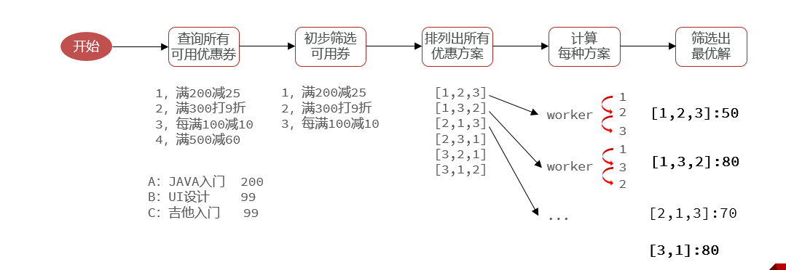

> 业务介绍

```SQL
用户在领取成功优惠券之后，可以添加课程到购物车，下单的时候就可以使用优惠券了。
首先在订单确认（预下单）时会查询出所有可用的优惠券组合，因为一个用户可能有多张券同时使用，并且每个券能应用的课程也不一样。
在下单的时候需要查询优惠明细，并核销优惠券
取消订单的时候还需要返还优惠券
在查询订单时也需要查询优惠的规则。
我这里主要做的就是在预下单时查询可用的优惠券这个功能。
用户在预下单时调用的是订单微服务，订单微服务会携带用户购买的多个课程调用优惠券的微服务
在优惠券的微服务中就需要筛选出可用的优惠券组合
```

> 实现流程

```SQL
首先会查询这个用户所有的可用优惠券
接着进行初步赛选，这里会先把金额不达标的给剔除，比如课程总金额少于使用门槛的，可以直接剔除掉了。
接着是细筛，然后全排列。找出每一个优惠券的可用的课程，判断课程总价是否达到优惠券的使用需求，然后再把这些可用的券排列组合。因为多张优惠券使用顺序不同，优惠的金额也不同，所以我们排列出所有的组合
接下来计算每种组合的优惠明细，这里我们通过CompleteableFuture多线程的方式进行并行计算，一种组合一个线程。同时利用CountDownLatch定义闭锁。
等所有线程执行完后最后还需要筛选出最优的方案。遍历每种方案，判断用券相同时，那种优惠券金额最大。判断优惠券金额相同时，那种方案用券最少，取交集。以此计算出最优解
```

> 可能追加提问

```SQL
折扣类型有哪些？你们是怎么计算每种折扣类型的？
每满减、折扣、无门槛、满减
每种折扣类型对应一种策略，这里使用策略模式实现的。每种策略都封装三个方法
    判断当前价格是否满足优惠券使用限制
    计算折扣金额
    根据优惠券规则返回规则描述信息

CompleteableFuture原理是什么？
CountDownLatch原理是什么？
```

## 其他问题

### 你们项目是如何搭建/部署的？

```Plain Text
我们项目中包含的服务有学习微服务、课程微服务、点赞微服务还有网关等十几个微服务。涉及到的中间件也很多，比如Mysql数据库、Redis、MQ、ES、注册中心nacos等等。这里我们是使用Jenkins搭建的，当我们写完代码提交到自己的git私服上，叫Gogs，在Gogs上我们配置了web钩子，发现有提交后就会触发钩子通知Jenkins，jenkins会自动执行拉取代码、构建项目，并自动部署成docker容器，最后我们还配置了自动化测试脚本，可以自动测试。

提交代码到gogs-->通知jenkins-->jenkins拉取代码-->自动构建-->自动部署-->自动测试（基于脚本）
```

### 项目中成员组成？

```Plain Text
参考：
1个项目经理
2个产品经理
7个后端开发
2个前端开发
1个测试人员
0个运维（大公司一般运维不跟随项目组）
```

### 项目中登陆认证流程？

```Plain Text
用户登陆成功之后后端会给前端返回一个token
接下来用户发起的每个请求都会携带token
每个请求到达后台都会先经过网关，在网关中我们配置了过滤器，用来获取token，并解析，拿到用户id
接着会把用户id放到请求头中，转发给微服务
每个微服务都会有一个拦截器，在拦截器中会获取请求头中的用户id，并且把用户id存入ThreadLocal中
将来在业务代码中需要用到登陆用户，直接从ThreadLocal中获取即可
```

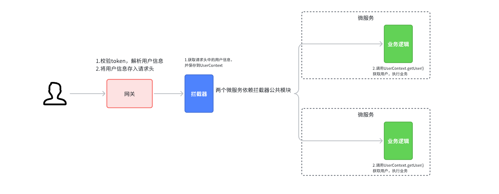

鉴权框架：

- Spring Security
- Shiro

---

## 📎 关联文档

- [[16-项目面试总结]]
- [[01-天机学堂概述]]
