-# 天机学堂项目逐字稿


> 📂 [[天机学堂-MOC|课程索引]] | 来源：本地课程资料 `E:\微服务项目\day1`

## 1、项目整体介绍

### 	  1.1、整体业务介绍

		面试官你好，我最近做的项目是【xxxx】，这个项目从业务上来说，是一个【垂直在线教育|垂直电商|社交】类型的项目，主要是对大学生提供考研考博、英语提升、四六级、雅思、托福、GRE、GMAT、SAT、ACT、AP、ALevel、日语、韩语、教资在线网课服务，我们这个项目整体分为PC用户端和PC管理端【也可再加上APP端】
		
		我们的用户可以在PC用户端和APP端查看、搜索、购买、学习课程，而在用户的学习中心，又涵盖了用户课程、考试、订单、优惠券、积分等等功能，我们公司内部人员可以在PC管理端进行课程、题目、营销中心、互动问答、用户、订单各个维度的管理。
		
		参与这个项目开发这么久，我觉得整体业务还是比较丰富的，因为这个项目具备在线学习、电商，还有社交互动的多重特征：
	    1、作为在线教育学习平台，必不可少的，有学习视频的上传、点播，也有学习辅助方面的，比如用户积分、考试
	    2、电商属性方面的，像超时订单处理、秒杀库存超卖问题、优惠券系统都有涉及到
	    3、社交互动方面，像针对于课程小节的互动问答、课程评价、点赞、排行榜也都具备
### 		1.2、整体技术介绍

```tex
   我们这个项目整体是微服务架构，根据业务维度划分，加上网关，细分一共有12个微服务
   【网关、课程、优惠券、问答评价、搜索、考试、学习、媒资、消息、支付、交易、用户】
    当然，也有一些公共模块，比如：common模块、feign api模块、auth鉴权公共模块等等
   
   整体技术栈，我们前端是用的VUE，代理我们用的Nginx，然后后端主要是Spring、SpringCloudAlibaba、MybatisPlus
   
   cloudalibaba微服务技术栈我们主要用到了网关gateway、注册中心、配置中心nacos、远程调用feign、分布式事务seata、微服务保护sentinel
   
   分布式中间件方面，消息中价间我们用的rabbitmq、分布式锁用的redisson、定时任务用的xxl-job
   数据存储方面，关系型数据库主要用的mysql、缓存redis、搜索引擎es
   持续集成方面，我们项目初期是用shell脚本发布的，后来用的是jenkins + docker
   第三方用到了阿里云短信、OSS存储、云盾内容审核
```

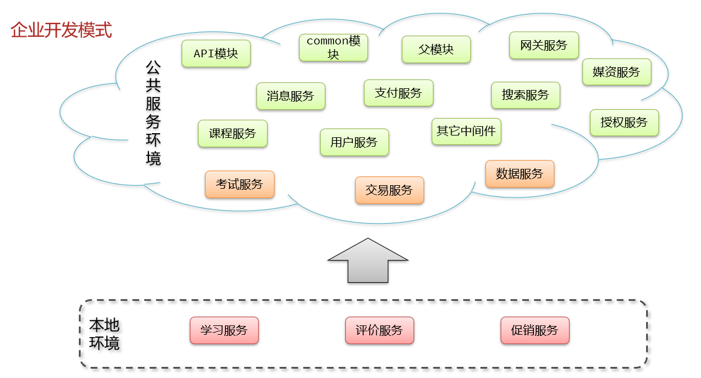

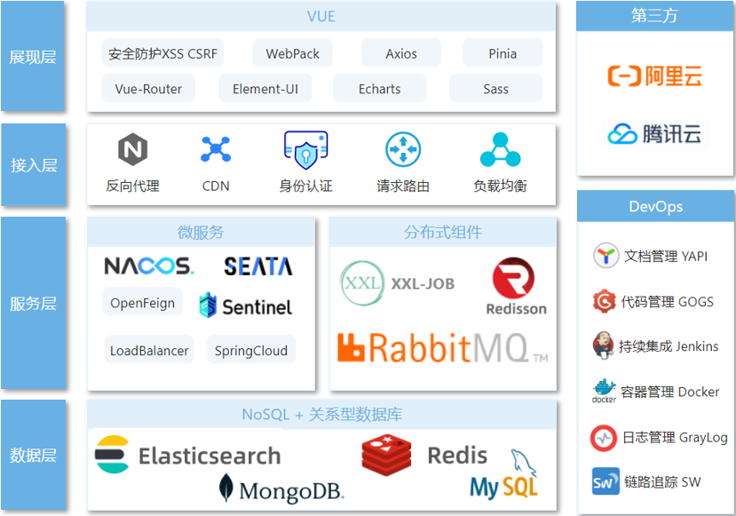

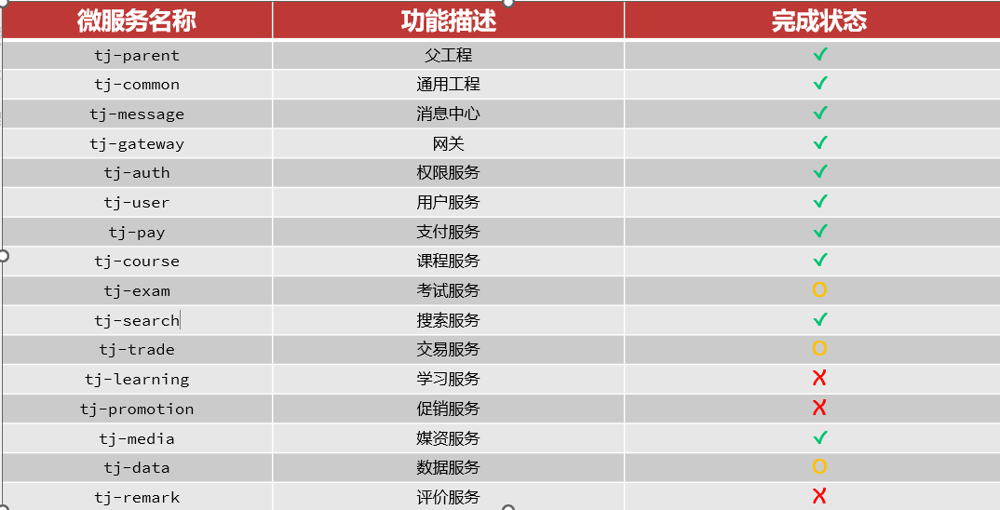


## 2、企业规范相关

### 2.1、代码版本控制规范怎么做的？

```tex
  我们版本控制是用的git，代码是托管在我们公司自己基于gogs搭的私服上面的，我们平时下来了需求，如果要迭代开发新的功能，是会基于master分支新拉一个功能分支，整个组基于新的功能分支进行开发，我们开发完自己的一些代码，会先进行单元测试，确保没什么问题了，我们下班前就会先pull，然后commit提交，push推送到远程
  
  当然，我们早上一般也都会pull拉取组内提交的最新代码，如果pull出现冲突，一般也都会拉上出现代码冲突相关的同事协商解决，避免单方面修复造成bug，尤其是业务比较复杂的时候，我们解决冲突一般都是IDEA解决，会有三个窗口，左侧是自己的，右侧是远程的，中间是自己修复的结果，修复完成我们再提交推送到远程，然后同事pull拉取就可以了
  
  我们开发完前后端联调，然后提测，这些都做完，我们会把master分支的代码合并到我们的功能分支，这个时候如果出现分支合并冲突，就又需要按照之前解决冲突的流程解决冲突，解决后发布到预上线环境交给测试部门继续测试，如果没啥问题，就进行正式发布，发布完后，我们会第一时间把功能分支代码合并到主干master，保证master代码是最新的
```

​		附（git规范）：

```tex
git使用过程中步骤规范
	1、每天下班前要对代码进行commit + 【push】
	2、commit + push之前一定要先 pull
	3、冲突的场景（idea：出现三个窗口，左侧是你自己的，右侧的是远程的，中间的是idea做的自动合并，往往都不对，需要自己处理）
		1、pull的时候就可能出现冲突
			场景：同一组开发人员在同一分支上做开发，同时有人修改了某一个类的同一个方法
		2、分支合并时可能出现冲突
			场景：不同组的开发人员在两个分支上做了开发,但是这两个组分别有人修改了某一个已存在类的同一个方法，做分支合并的时候
				组1：master -> v1  
				组2：master -> v2
		3、怎么解决？
			一定要拉上出现冲突的相关组员，一起讨论如何进行代码合并兼容，改好了之后，commit并且push，然后另外出现冲突的同事在进行pull拉取即可
			
git使用分支注意规范
	1、master永远都是最新代码 （master），且不能在master分支上进行开发
		2023-01-01 小组1开发需求1   master  -> v1
		2023-01-02 出现了紧急bug，拉取了一个修复bug的分支，并且在这一天进行修复，将正确代码合并至master
 		2023-01-03 小组2开发需求2   master  -> v2
		
		2023-01-10 小组1开发需求1完毕，将代码push至v1分支，【将master代码 合并至 v1】，发布v1的代码，将v1的代码合并至master
		2023-01-15 小组2开发需求2完毕，将代码push至v2分支，【将master代码 合并至 v2】，发布v2的代码，将v2的代码合并至master
```

### 2.2、你们项目开发流程是什么样的？

```tex
敏捷开发模式：https://blog.csdn.net/a715167986/article/details/128716292

我们这个项目整个技术团队的话大概是9个人左右
  后端4个人、前端2个人、1个UI、1个测试和1个运维，其中我们项目的UI、测试、运维是机动的，因为我们有几条产品线，所以这几个岗位是按需分配的，我们的整个开发流程是这样的

1、首先，我们市场部门一般会进行市场调研，包括从用户需求角度、还有对竞争对手产品方面进行调研
2、然后由产品部门出需求 -> 通常产品部门会开会、定需求
3、之后，产品部门会拉上我们技术部门一起开需求研讨会（产品叙述需求、和技术部门讨论该需求是否合理）
4、下会之后，技术部门内开技术研讨会
	1）、如果这个需求比较大，涉及到架构层面，这个时候一般我们的技术经理、架构师、组长会参与这个会议，进行技术宏观层面的讨论，后续由组长再拉着组员开会再分配具体需求
	2）、如果这个需求不是特别大，那就由当前需求负责的组（因为我们公司有几条产品线），然后会上会分析讨论这次需求具体有哪些功能点，然后根据功能点分配活儿
	
5、散会之后，UI会开始根据产品原型画UI界面，后端开始自己估工时，排工期，然后告诉组长，组长再评估是否合理（我们估工时很多时候是根据工期倒排的）, 最后会定具体的测试、上线的日期

6、接下来，组员开始根据需求进行表设计、接口设计，通常要出表设计概述（是一个word）和接口文档，接口文档我们一般是定义好接口后，根据knife4j自动生成的，然后离线导出接口文档给前端，然后前后端并行开发

7、整个开发过程，我们是敏捷开发模式，每天早上会开站会、有看板贴自己的任务，项目周期、节奏我们是通过禅道进行管控的，包括我们看测试部门是否给自己提了bug，都是通过这个平台看的。

8、这样到提测日期之前，我们会在本地或者开发环境进行前后端联调，到提测的日期，我们会自己用jenkins把前后端代码发布到测试环境，测试人员进行冒烟等等测试，如果期间出了bug，我们会通过禅道收到，然后及时解决，当然，bug也是分级别的，我们会根据bug的优先级进行解决。

9、后面就是预上线和上线了，我们上线和预上线是运维通过jenkins进行发布的。
```

### 2.3、项目发布持续集成方面怎么做的？

```tex
1、当我们push代码至gogs时会触发gogs设置的webhook钩子
   （http://192.168.150.101:18080/gogs-webhook/?job=tjxt-dev-build）
2、通知jenkins触发我们在jenkins提交编好的一个任务tjxt-dev-build，这个任务会开始构建整个项目，具体为：
    1）、拉取代码（jenkins配置中指定了push哪个分支会触发钩子、指定了拉取哪个分支代码）
    2）、整个项目所有模块的清理、跳过测试编译、打包
    3）、执行shell命令拷贝startup.sh shell脚本和dockerfile到某个目录
    4）、等待构建完毕 
3、构建完毕后我们会手动触发push过代码的具体微服务构建任务（这个也是提前编排好的构建任务）
    1）、执行startup.sh shell脚本（指定了很多个性化的变量参数，比如当前微服务模块名、镜像名、容器名）
        1、删除【该微服务】之前构建的镜像和正在运行的容器
        2、基于dockerfile构建镜像
        3、基于构建的镜像运行容器
```

​      附： 日常调试、项目部署操作步骤

```tex
1、远程调试
    1）、Edit Configuration，添加Remote JVM Debug
    2）、指定Name（随意）、Host（远程IP）、Use model classpath（需要调试的模块）
    3）、将以下命令参数添加至远程服务启动脚本中（已添加）
    -agentlib:jdwp=transport=dt_socket,server=y,suspend=n,address=*:5005
    4）、使用添加5005命令参数的远程服务，进行构建部署启动（点一下debug组的tj-trade-debug构建按钮即可）
    5）、将本地的服务debug启动
    6）、访问相应功能，会进入本地断点

2、本地swagger测试
    1）、访问对应微服务IP:端口/doc.html  和  网关 IP:端口/doc.html  都可以（注意添加user-info 请求头，值为用户ID）

3、组件测试
    1）、启动本地需要调试的微服务（注意配置文件修改为local环境的）
    2）、停掉需要测试微服务 远程对应的微服务（让该微服务只留下本地的实例，将来消费者拉取实例列表时就只剩下本地的了）
    3）、本地打断点，访问相应功能调试即可

4、项目部署
    1）、修改jenkins 的dev组中tjxt-dev-build配置（只用做一次）
    1、将Branch Filter改为 my-dev   （将来只有my-dev分支push了代码才会触发web-hook钩子）
    2、将Branches to build 改为 */my-dev （触发钩子后，基于哪个分支去拉取代码）
    2）、IDEA中将本地修改的代码提交push至远程 my-dev分支，触发钩子
    3）、jenkins 中 tjxt-dev-build自动清理编译打包，但是不会部署，可以跟踪查看日志，看是否是构建的指定分支代码	
    4）、tjxt-dev-build构建完毕后，在dev组中选择需要部署的微服务（修改push过代码），进行构建部署，查看日志，等待构建完成
    5）、docker中，利用dlog -f 容器名称，查看日志，等待启动完成
    6）、测试
```

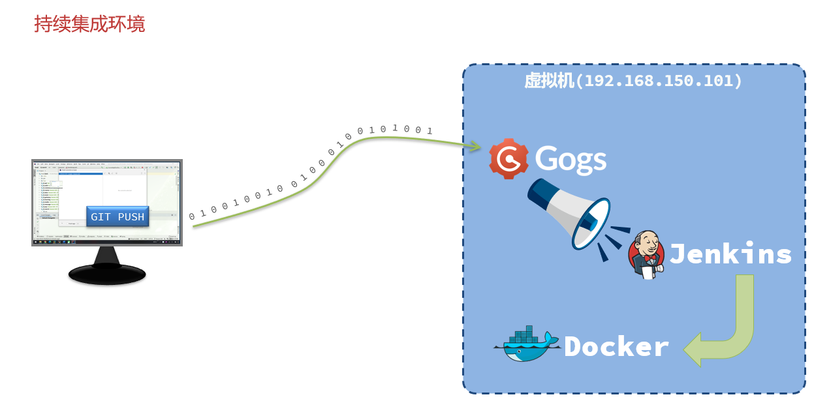


### 2.4、开发新的业务功能流程


```tex
补充：
1、分析产品原型时，一般会跟着做笔记，设计功能相关的实体（DTO\VO），
2、设计数据库表结构时，会结合原型、业务从这几个方面考虑字段，确保设计完整性
  2.1、基础字段、关系字段、辅助字段
  2.2、基本设计完成后，会基于业务分析，哪些字段该给什么类型，哪些字段适合建索引，哪些索引适合建联合索引等等
  2.3、基于设计好的表结构利用mybatisplus图形化插件自动生成代码
3、实现功能接口时，先编写好controller接口，基于knife4j生成接口文档（写代码，思路先行，画流程图、写注释）
4、测试时：分为几个测试阶段
  4.1、本地自测（单元测试、postman或knife4j接口测试、jemeter压力测试、组件测试）
5、联调时，分为：
  5.1、本地、开发环境前后端联调测试
  5.2、发布测试环境测试
  5.3、发布预上线环境测试
```

### 2.5、你们项目的访问流程是什么样的？

```tex

1、登入流程
    1、我们的前端部署在Nginx中的，前端发起请求，请求经过Nginx
    2、通过Nginx的反向代理，将请求代理至网关
    3、请求到网关后会经过全局过滤器，全局过滤器判断当前请求URL，如果是获取验证码或登录URL，直接放行（这个需要被放行的URL集合是通过配置中心配置的，而且实现了热更新）
    4、全局过滤器放行后，请求经过网关的动态路由，会将请求路由至对应的微服务
    5、在微服务会经过权限拦截器，在拦截器中，如果是需要放行的URL也是直接放行
    6、请求到达对应的controller，在service中会：
        1）、对用户的验证码、密码等等进行校验，其中，验证码是存在redis中的，密码是通过MD5加密的，且加了盐
        2）、如果各项校验通过，会根据JWT生成Token并且返回给前端，token的负载部分存储用户信息，token有效期为1个小时，前端存储在localstorage中
        3）、之后前端的每次请求会通过请求头把token携带过来。		

2、登入后，系统访问流程
    1、前端请求通过nginx，再到网关的全局过滤器，这个时候会获取请求头中的token
    2、根据JWT解析token，如果token不存在或者解析异常会直接拦截，返回无权限访问
    3、如果解析成功，会将token中存入的用户信息（userID）放入请求头，然后进行放行，将请求根据网关动态路由至对应的微服务
    4、请求到达微服务后，第一站经过权限拦截器，拦截器会获取请求头中的用户信息并且存入至ThreadLocal
    5、最后再访问对应的controller

3、Token续期（解决方案）
    1、登录成功后，会生成第一个token（old token）并且返回给前端
    2、往后的每次访问前端都会携带此token过来
    3、在网关的全局过滤器中会对该token进行有效期的校验，如token有效期只剩10分钟了，会对该token进行续期操作
        1）、解析出old token中的用户信息
        2）、根据这些用户信息生成一个新的token
        3）、以old token为 key，以新的token为value存入redis
    4、在网关全局过滤器中，会根据old token为key去redis中获取value，如果没有获取到，证明token未过期过，就使用当前token，如果获取到了，证明token存在续期操作，要使用redis中的token

    
4、防止token盗用
张三 设备ID 001     ->  登录  ->  token payload   {1,001}
李四 设备ID 002     ->  访问别的接口  ->  网关  对比 李四设备ID  002 和 token中的 设备001是否一致
 
  
双token机制
   	  1、鉴权token
   	  2、刷新token

```

课程业务

​	1、课程搜索

​    2、课程购买，加入课表

​    3、课程学习 - 学习计划& 【播放进度】  


### 2.6、ES开发流程

 你使用ES开发课程搜索微服务，大概流程是什么样的？

```tex
1、搭建ES开发环境
    1）、安装ES（7.12.1、7.14.0）
    2）、安装IK中文分词器、拼音分词器
    3）、注意：版本一定要强一致

2、建立ES索引库
    1）、根据【原型】和已存在的【数据库表】，确定需要存放在ES有哪些数据
    2）、确定这些字段的类型、是否需要参与搜索（index选项决定，默认为true）、是否需要设置分词器
    3）、根据业务分析是否需要自定义分词器(比如业务中有需要根据中文首字母或者全拼搜索的需求，那就需要自定义：拼音分词器)
    这儿自定义分词器的流程可以说一下：分词器的组成（3部分） + setting部分定义分词器 + 分词器用于哪个字段
    4）、根据业务分析是否需要自动补全查询，如果需要，还需要设置一个complation字段去存储自动补全数据

3、使用ES进行查询
    0）、自动补全查询
    1）、根据标题、内容进行全文检索查询(需要用到两次分词器：搜索框关键字分词 + 建立倒排索引分词)，此处【倒排索引的原理】可以说一下
    2）、根据分类进行精确查询
    3）、根据热度分值等跟数值相关的进行范围查询
    4）、进行多条件的boolean查询
    5）、如果有加分排名需求，还需要加上算分函数查询

4、结果处理
    1）、分页、排序、高亮、聚合

5、数据同步方面
    1）、第一次全量数据同步：使用ES的bulk操作进行数据的【分页批量导入】
    2）、增量数据同步ES：使用MQ消息进行同步
    3）、或者说：每月1号凌晨会清空ES索引库，自动从数据库进行全量数据导入
```


## 3、课程业务

### 3.1、你们课程相关业务流程是什么样的？

```tex
1、课程相关业务是交易业务的下游业务，在交易业务中，用户会先浏览选购课程，添加到购物车，最后确认订单发起支付
2、用户支付成功，会走支付回调逻辑，在回调逻辑中会修改订单状态，并且发送MQ消息，消息中包含订单的用户ID和选购课程ID集合
3、我负责的学习微服务会监听订阅这个消息（编写消费者，@RabbitListener声明交换机、队列）
	1、在消费的业务逻辑中，会使用【Feign远程调用课程服务】查询课程信息，目的有两个
		1）、判断课程是否存在
		2）、后续组装用户课表数据还要取课程有效期（单位：月）
	2、组装用户课表数据集合，批量新增这些课程到用户课表中
	3、为了避免出现用户添加同一课程到课表中的异常情况，我们针对用户课表的用户ID和课程ID添加了联合唯一索引（实质上是在做幂等性校验），当然添加索引不仅仅是这个目的，后期这两个字段联查场景也比较多，添加索引也可以提高查询性能。
	有这个索引之后，后续如果有添加重复课程的情况，数据库层面会报异常，而且由于有事务，这个异常不能捕获，否则会导致事务失效，所以必须抛出，而当前方法又是mq的消费者，我们为了确保消息可靠性，开启了消费者自动确认机制，一旦有异常，消息消费失败，消费者自动确认机制基于AOP会感知到异常进行无限制重试，为了防止mq层面的无限重试，我们开启了消费者本地重试机制，一旦本地重试次数耗尽，我们会将消息投递至指定交换机，然后路由到指定队列，最终这种异常消息会被消费记录到异常消息监控表中，人工处理。
	注意：此处可以跟面试官好好聊聊rabbitmq的可靠性是如何保证的
		1、交易微服务作为生产者如何确保不丢消息（2个生产者确认回调机制）
		2、MQ本身如何不丢（交换机、队列、消息持久化）
		3、课程微服务作为消费者如何确保不丢消息
			1）、消费者确认机制（自动、手动、none）
			2）、自动（基于AOP），会有无限重试的问题，解决-开启本地重试机制
			3）、本地重试次数耗尽，有三种策略（丢弃、放回队列、投递至指定错误交换机）

4、课程添加到用户课表中后，此时课程状态是【未学习】，后续用户就可以选择针对课程创建学习计划，当然也可以不创建，之后用户开启学习其中某一章节，课程状态会变为【学习中】，期间我们xxl-job中会有定时任务扫描购买的课程是否已经过期，如果已经过期，就会置为【已失效】，随着用户学习课程中的每一个小节，我们也会通过每个小节的播放进度统计，判定课程学习进度，最后课程状态会变【为已学完】

5、当然，因为我们是支持课程退款的，只是退款条件比较严苛，所以用户也是可以申请退款的，当退款成功，交易微服务也会发一条退款成功的MQ消息，我们订阅消息后会从用户课表中删除相应的课程
```

 

### 3.2、你们用户课表 表结构是什么样的？

```sql
CREATE TABLE IF NOT EXISTS `learning_lesson` (
    `id` bigint NOT NULL COMMENT '主键',
    `user_id` bigint NOT NULL COMMENT '学员id',
    `course_id` bigint NOT NULL COMMENT '课程id',
    `status` tinyint DEFAULT '0' COMMENT '课程状态，0-未学习，1-学习中，2-已学完，3-已失效',
    `week_freq` tinyint DEFAULT NULL COMMENT '每周学习频率，例如每周学习6小节，则频率为6',
    `plan_status` tinyint NOT NULL DEFAULT '0' COMMENT '学习计划状态，0-没有计划，1-计划进行中',
    `learned_sections` int NOT NULL DEFAULT '0' COMMENT '已学习小节数量',
    `latest_section_id` bigint DEFAULT NULL COMMENT '最近一次学习的小节id',
    `latest_learn_time` datetime DEFAULT NULL COMMENT '最近一次学习的时间',
    `create_time` datetime NOT NULL DEFAULT CURRENT_TIMESTAMP COMMENT '创建时间',
    `expire_time` datetime DEFAULT NULL COMMENT '过期时间',
    `update_time` datetime NOT NULL DEFAULT CURRENT_TIMESTAMP ON UPDATE CURRENT_TIMESTAMP COMMENT '更新时间',
    PRIMARY KEY (`id`) USING BTREE,
    UNIQUE KEY `idx_user_id` (`user_id`,`course_id`) USING BTREE) ENGINE=InnoDB DEFAULT CHARSET=utf8mb4 COLLATE=utf8mb4_0900_ai_ci ROW_FORMAT=DYNAMIC COMMENT='学生课程表';
```

### 3.3、你们学习业务有哪些业务供其他微服务远程调用？

```tex
列举几个即可
1、校验指定课程是否是用户课表中的有效课程 用于媒资微服务进入播放页面时校验
2、统计课程学习人数 用于课程微服务调用查询基本信息
3、查询当前用户指定课程的学习进度 用于课程服务进入播放页面时进行续播
```

### 3.4、我对你们的播放进度统计很感兴趣，可以聊聊这块吗？

#### 	  3.4.1、核心流程

```tex
当然可以，播放进度统计这块是我们课程学习比较核心的功能，因为这块涉及防刷课暴力获取积分，核心流程是这样的
1、用户开始播放视频开始学习，我们前端每隔15秒会向后端提交一次当前学习进度，提交信息包括课表和小节ID，提交时间、当前视频时长和当前播放进度（秒），当播放进度超过一半时，会认定为当前小节已学完

2、为什么需要每隔15秒提交学习进度，而不是浏览器关闭或者用户退出播放界面提交一次呢？原因有2个：
   1）、由于涉及到积分奖励和积分排行榜的缘故，所以需要监控用户是正常学完，而不是暴力拖动进度条获取积分
   2）、如果是非正常关闭浏览器，就不会记录用户的播放记录，用户体验会打折扣
   
3、在用户下次进入该课程的播放页面时，会自动从上次退出的小节、时间点进行续播，所以我们学习微服务也需要向课程微服务提供学习进度调用查询的远程接口，这个接口会返回课表和最近学习小节ID和学习的进度。
```

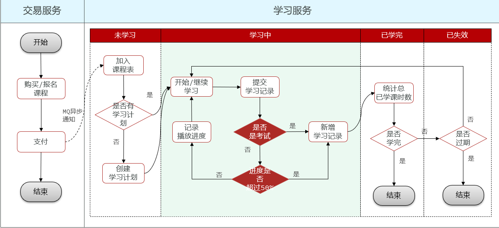

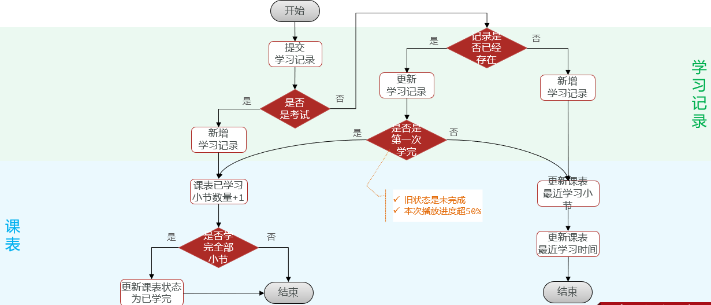

#### 3.4.2、具体流程

```tex
以上只是播放进度的核心业务流程，但是这个提交学习记录接口是公共的，除了可以提交学习记录进度信息，还涉及小节考试信息的提交，所以实际整体业务逻辑要复杂一些，具体我说一下：

1、前端发起提交学习记录请求，后台会先判断是否是提交考试记录，如果是，会向【学习记录表】添加学习记录，【用户课表】已学习小节数量直接加一，加一后也会顺便判断是否学完了这个课程的所有小节，如果是，需要更新课程状态为已学完。

2、如果不是提交考试记录，那就是提交视频学习记录了，我们会先判断该用户是否已经有当前小节的学习记录了，如果没有，证明是第一次学习这个小节，会向【学习记录表】新增学习记录，也会更新【用户课表】中的最近学习小节ID和最近学习的时间。

3、而如果已经有了当前小节的学习记录，那说明该用户已经开始学习该小节了，这个时候我们会先更新【学习记录表】中的播放进度，然后判断本次提交学习记录，是否属于第一次学完，如果是，【用户课表】已学习小节数量需要加一，加一后也会顺便判断是否学完这个课程的所有小节，如果是，需要更新课程状态为已学完。

4、如果不是第一次学完这个小节，除了更新【学习记录表】的学习进度外，还需要更新【用户课表】中的最近学习小节ID和最近学习的时间。

整体来看，判断逻辑分为四个逻辑分支，而且都涉及到操作学习记录表和用户课表的写操作，所以需要控制好事务，防止出现数据库数据不一致
```

#### 3.4.3、播放记录优化

```tex
由于提交学习进度需要每隔15秒提交一次，如果在线学习用户比较多，必然会频繁的并发对数据库进行写操作，所以后来我考虑对这个业务流程进行优化。当时优化的思路我跟您描述下：

	1、首先，我对整个业务逻辑进行了分析，发现整体业务逻辑虽然比较繁杂，但是只有一个逻辑分支需要进行并发写优化，那就是之前提到的第四个逻辑分支，因为大部分的进度提交请求都是视频进度提交，而且大部分都是未学完当前小节时的进度提交，其他都是首次操作才会走的逻辑，并不频繁，所以，优化这个逻辑分支的写操作就可以。
	
	2、得出这个结论后，我开始思考如何优化并发的写操作，根据以往经验，优化读操作，就是优化代码、优化SQL、以及合理使用缓存，对于优化写操作先对来说会少一些，当时我也知道优化写操作的一些思路，经过一番方案调研，我觉得并发写操作除了优化代码和sql外，更多的时候可以使用【同步写改异步写】或者【合并写请求】这两个大的思路
	
	3、对于【同步写改异步写】这个优化方案，比如借助mq或者多线程，它的优点是无需等待，可以大大减少请求响应时间，也可以灵活控制写数据库的时机，从而降低写数据库的频率，减轻数据库压力，但是这个方案不能减少数据库写次数，仅仅是降低频率，所以它比较适用于并发写数据库操作比较多且需要保证事务ACID的情况。
	
	4、对于【合并写请求】这个优化方案，比如将需要写入数据库的大量数据先写到redis，等到某个时间点再一次性提交至mysql，这样可以极大程度的降低数据库写频率和写次数，从而减轻数据库的并发压力，但是由于redis对事物的支持并不完善，所以这个方案适用于对数据库操作单一，不需要太多事务支持的场景。
	
	而我们这个播放记录提交就属于这种场景，只要用户一直在观看同一小节，就可以先将同一个用户的播放进度记录暂存在redis中，等用户退出学习时再将播放记录一次性提交至数据库，而且涉及数据库操作并不复杂，只需要向redis写入播放记录信息就可以，而且一旦将学习记录缓存到redis，后续查询判断学习记录是否存在只需要查询redis就可以，提高查询效率。
	redis结构，我选用的是hash结构，以课表为维度去存储播放记录，大key是课表ID，HashKey是播放小节的ID，HashValue是该小节的播放记录json（id、moment、finished），这样可以很大程度减少redis外层key的数量，减少内存占用成本。
	至于redis中的播放记录写入到mysql时机，一开始我是准备采用定时任务进行扫描，但是考虑到定时任务时效性问题放弃了，采用的是redisson的延时任务队列，在提交学习记录到redis时，同时提交延时检测任务到任务队列，提交的任务中包含了课程、小节ID以及当前播放进度，延时任务延时设定为20s
	20s后，延时任务执行，会从redis查询当前小节的播放进度，与延时任务提交时的播放进度做对比，如果进度不一样，说明用户还在观看视频，放弃写数据库的操作，如果进度一样，则说明用户已经从上次提交学习记录之后没有再学了，这个时候就可以向数据库提交用户观看当前小节的播放记录了（更新学习记录中当前小节的学习进度，更新课表中最近学习小节和学习时间）
	这里面还有一个注意的点就是当用户是第一次学完时会将数据库的当前小节是否已学完字段置为【是】，但是此时缓存中播放进度是否已学完还是否，这样数据就不一致了，所以为了保证数据双写一致性，先更新数据库，再删除了redis中的缓存，这儿不能用更新缓存的方案，因为数据库一旦回滚，会出现数据不一致问题，而且并发情况下也会出问题（参考redis双写一致性问题面试题）
	综上，使用合并写请求 + redis + 异步延迟队列方案优化了播放进度记录 
```

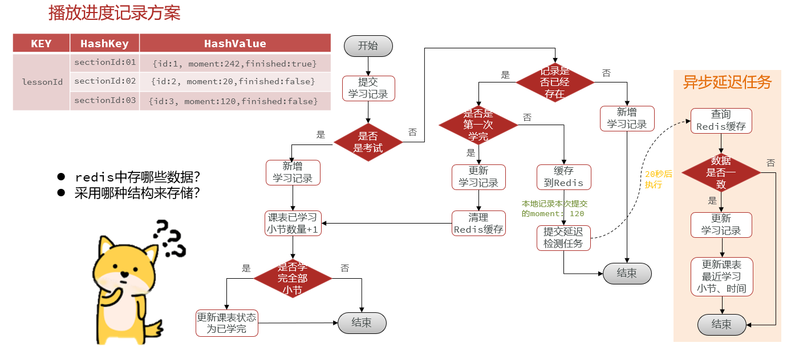

附：播放记录优化方案纲要

```tex
1、方案：合并写请求 + 异步延迟队列（原理图：重要！！！）
2、原理：
    0）、对非首次学完课程记录提交逻辑分支优化
    1）、合并写请求
1、将多次学习记录提交至Redis，播放记录持续覆盖，【将来】一次性提交至Mysql数据库
	redis命令：hset learning:record:课程ID 小节ID 小节播放记录json
	java代码：redisTemplate.opsForHash().put(key, record.getSectionId().toString(), json);
	
2、Redis数据结构选用：Hash结构（以课表为维度去存储播放记录，大大减少大Key的数量）
    Key ： 课表ID 
    HashKey  ：小节ID
    HashValue ： 该小节的播放记录json（id、moment、finished）
2）、异步延迟队列
    1、在将学习记录提交至Redis时，提交一个延时任务（20S后执行）
        hget learning:record:课程ID 小节ID
        redisTemplate.opsForHash().get(learning:record:课程ID, 小节ID);
    2、检测本地播放进度与Redis中播放进度时候一致
    3、 DelayQueue（Redisson、MQ、时间轮）    
        getDelay：待重写：获取延时任务剩余执行时间
        compareTo：待重写：对队列中的任务进行排序
    take：自带方法: 获取队列中的第一个任务（阻塞）
    4、@PostContract（Bean初始化阶段执行） + @PreDestory（容器销毁）
    5、CompletableFuture.runAsync(Runnable)
```

### 3.5、学习记录表结构是什么样的？

```sql
CREATE TABLE IF NOT EXISTS `learning_record` (
    `id` bigint NOT NULL COMMENT '学习记录的id',
    `lesson_id` bigint NOT NULL COMMENT '对应课表的id',
    `section_id` bigint NOT NULL COMMENT '对应小节的id',
    `user_id` bigint NOT NULL COMMENT '用户id',
    `moment` int DEFAULT '0' COMMENT '视频的当前观看时间点，单位秒',
    `finished` bit(1) NOT NULL DEFAULT b'0' COMMENT '是否完成学习，默认false',
    `create_time` datetime NOT NULL DEFAULT CURRENT_TIMESTAMP COMMENT '第一次观看时间',
    `finish_time` datetime DEFAULT NULL COMMENT '完成学习的时间',
    `update_time` datetime NOT NULL DEFAULT CURRENT_TIMESTAMP ON UPDATE CURRENT_TIMESTAMP COMMENT '更新时间（最近一次观看时间）',
    PRIMARY KEY (`id`) USING BTREE,
    KEY `idx_update_time` (`update_time`) USING BTREE,
    KEY `idx_user_id` (`user_id`) USING BTREE,
    KEY `idx_lesson_id` (`lesson_id`,`section_id`) USING BTREE) ENGINE=InnoDB DEFAULT CHARSET=utf8mb4 COLLATE=utf8mb4_0900_ai_ci ROW_FORMAT=DYNAMIC COMMENT='学习记录表';
```

### 3.6、创建学习计划

```tex
接口逻辑较为简单，可以自行组织语言，略。。。
```


## 4、互动问答业务

### 4.1、评论相关

```tex
1、背景：无论是在课程视频播放学习页面还是在我们课程详情页面用户都可以基于课程进行提问，其他同学可以对提出的问题进行回答，当然在后台系统，老师也可以进行回答，对于回答和评论展示方面，一次只要求展示一级，而且是一次分页展示5条。这个模块的开发，主要是在表结构设计上要支持多项需求，我们设计了2张表，一张【问题表】，一张【回复表】。

2、表结构设计
   1）、对于课程问题的回答，产品要求最大支持三级评论，我们在【回复表】中设计了一个回复目标ID parentId来支持进行多级回答和评论，这个字段来记录被回复主体ID。
   2）、由于每个问题上下都要快速展示最近一个回答的详情和回答数量，所以在【问题表】冗余了当前问题最近一次回答的ID字段，还冗余了【回答数】字段来记录回答数量
   3）、由于要展示每个问题的【回答数和每个回答、评论的回复数】，所以在问题表和回复表都通有一个字段记录这个数字
   4）、这两张表字段设计完成后，根据业务，又在合适的字段上添加了索引
  	 1、问题表中，由于需要根据课程ID或者小节ID查询、用户ID查询问题的场景较多，所以在以上三个字段上建立了索引
  	 2、回复表中，由于需要根据被评论主体ID查询回复场景较多，所以在被评论主体ID字段上建立了索引
  	
3、优化
    无论是针对问题进行了回答，还是针对回答、评论进行了评论，都需要在被回复的主体表中对回复数量进行加一，而回复又是非常频繁的行为，会频繁修改数据库，所以，我用redis缓存进行了优化，使用redis hash结构存储了这些数据
大key为评论主体类型（问题、回答或者评论），hash key为被评论主体ID，value为 数量，如：
type_question_1 162837829388723  122
			  178273822837222  142
type_question_2 162837829388723  122
			  178273822837222  142
type_answer 162837829388723  122
	        182839218238123  123     
```

### 4.2、评论表结构是什么样的？

```sql
CREATE TABLE IF NOT EXISTS `interaction_question` (
    `id` bigint NOT NULL COMMENT '主键，互动问题的id',
    `title` varchar(255) CHARACTER SET utf8mb4 COLLATE utf8mb4_0900_ai_ci NOT NULL COMMENT '互动问题的标题',
    `description` varchar(2048) CHARACTER SET utf8mb4 COLLATE utf8mb4_0900_ai_ci NOT NULL DEFAULT '' COMMENT '问题描述信息',
    `course_id` bigint NOT NULL COMMENT '所属课程id',
    `chapter_id` bigint NOT NULL COMMENT '所属课程章id',
    `section_id` bigint NOT NULL COMMENT '所属课程节id',
    `user_id` bigint NOT NULL COMMENT '提问学员id',
    `latest_answer_id` bigint DEFAULT NULL COMMENT '最新的一个回答的id', #提高分页查询问题时查询最新回答记录的效率
    `answer_times` int unsigned NOT NULL DEFAULT '0' COMMENT '问题下的回答数量',
    `anonymity` bit(1) NOT NULL DEFAULT b'0' COMMENT '是否匿名，默认false',  
    `hidden` bit(1) NOT NULL DEFAULT b'0' COMMENT '是否被隐藏，默认false',  #管理端使用
    `status` tinyint DEFAULT '0' COMMENT '管理端问题状态：0-未查看，1-已查看',   #管理端使用
    `create_time` datetime NOT NULL DEFAULT CURRENT_TIMESTAMP COMMENT '提问时间',
    `update_time` datetime NOT NULL DEFAULT CURRENT_TIMESTAMP ON UPDATE CURRENT_TIMESTAMP COMMENT '更新时间',
    PRIMARY KEY (`id`) USING BTREE,
		  KEY `idx_course_id` (`course_id`) USING BTREE,
		  KEY `section_id` (`section_id`),  
		  KEY `user_id` (`user_id`)) ENGINE=InnoDB DEFAULT CHARSET=utf8mb4 COLLATE=utf8mb4_0900_ai_ci ROW_FORMAT=DYNAMIC COMMENT='互动提问的问题表';
		  
CREATE TABLE IF NOT EXISTS `interaction_reply` (
    `id` bigint NOT NULL COMMENT '主键',
    `parentId` bigint NOT NULL COMMENT '回复目标id',
    `type` tinyint NOT null COMMENT '1:问题 2：回答 3：评论'
    `target_user_id` bigint DEFAULT '0' COMMENT '回复的目标用户id',
    `user_id` bigint NOT NULL COMMENT '回答者id',
    `content` varchar(255) CHARACTER SET utf8mb4 COLLATE utf8mb4_0900_ai_ci NOT NULL COMMENT '回答内容',
    `reply_times` int NOT NULL DEFAULT '0' COMMENT '评论数量',
    `liked_times` int NOT NULL DEFAULT '0' COMMENT '点赞数量',
    `hidden` bit(1) NOT NULL DEFAULT b'0' COMMENT '是否被隐藏，默认false',
    `anonymity` bit(1) NOT NULL DEFAULT b'0' COMMENT '是否匿名，默认false',
    `create_time` datetime NOT NULL DEFAULT CURRENT_TIMESTAMP COMMENT '创建时间',
    `update_time` datetime NOT NULL DEFAULT CURRENT_TIMESTAMP ON UPDATE CURRENT_TIMESTAMP COMMENT '更新时间',
		  PRIMARY KEY (`id`) USING BTREE,
		  KEY `parentId` (`parentId`) USING BTREE
		) ENGINE=InnoDB DEFAULT CHARSET=utf8mb4 COLLATE=utf8mb4_0900_ai_ci ROW_FORMAT=DYNAMIC COMMENT='互动问题的回答或评论';
```

### 	4.3、点赞系统设计

```tex
当时做这块开发的时候，考虑到系统中很多业务都会有点赞、喜欢之类的场景，所以把点赞这块设计成了通用型的方案，满足了这几点特性：
1）、通用：需要适用于各种不同的业务场景，如视频点赞、问题点赞、回复点赞、笔记点赞等等
2）、独立：可以供其他业务微服务直接调用，不产生任何的业务关联（独立微服务）
3）、并发：必须能应对较高的并发
4）、安全：做好校验措施，避免用户重复点赞
```

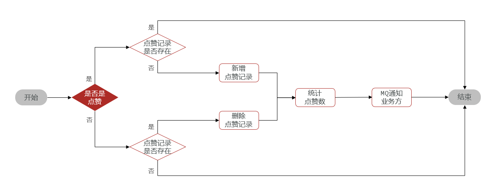

```tex

初版方案：
为了满足通用和独立，我单独起了一个点赞的微服务，整体方案上是点赞微服务 + MQ + 其他业务系统：
1、点赞微服务：专门直接承担各业务系统点赞、取消点赞请求，具体：
    点赞/取消点赞接口
	1）、校验：判断当前操作是点赞还是取消点赞
        1、如果是【取消点赞】：直接根据业务ID和用户ID直接【删除数据库】点赞记录即可
        2、如果是【点赞】：根据业务ID和用户ID【查询数据库】判断是否已点赞：如果是，直接结束，如果不是，【新增点赞记录】至数据库
	2）、统计点赞数：根据业务ID【查询数据库】统计当前业务ID下的点赞数
	3）、发消息通知业务系统：组装业务ID和对应点赞数量，发送消息至MQ的交换机
	
	点赞数查询接口：另外还需要提供根据业务ID集合查询当前用户是否对这些业务已点赞的接口：
          根据用户ID和业务ID集合进行【数据库批量查询】   where userid = #{}  and bizId in ('','')
    
2、MQ：接收点赞微服务的消息，而后投递至业务系统，routingkey为业务类型
3、其他业务系统
 	1、消费消息
		1）、声明队列与交换机，bindingkey为各自的业务类型
		2）、根据消息中的业务ID和点赞数更新对应业务表中的点赞数量（如：根据回答ID更新回答表中的点赞数）
	2、另外点赞目标数据分页查询时，还需要组装业务ID集合，调用点赞微服务进行是否已点赞的批量查询
```

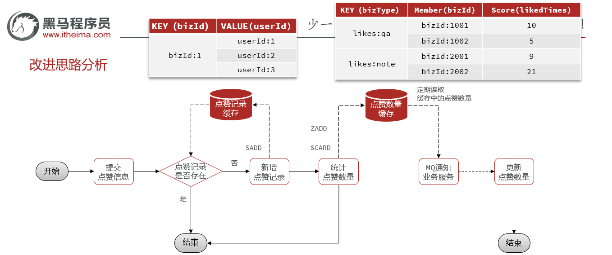

```tex

终版方案：
之前的方案整体上开始也没太大问题，但是如果后期出现并发点赞，可能会支撑不住，所以用redis + 定时任务的方式去优化了方案：点赞微服务 + Redis 缓存 +  定时任务 + MQ + 其他业务系统
1、点赞微服务：承担各业务系统点赞、取消点赞请求
	1）、校验：判断当前操作是点赞还是取消点赞
    	1、如果是【取消点赞】：将该用户ID从被点赞业务ID对应的 【Redis Set集合】中删除即可
       		redis命令：srem likes:set:biz:点赞目标ID 用户ID
        	java代码： redisTemplate.opsForSet().remove(likes:set:biz:点赞目标ID, 用户ID);
        	
    	2、如果是【点赞】：将该用户ID添加至点赞业务ID对应的 【Redis Set集合】中即可
        	redis命令：sadd likes:set:biz:点赞目标ID 用户ID
        	java代码： redisTemplate.opsForSet().add(likes:set:biz:点赞目标ID, 用户ID);
        	
	2）、统计点赞数：根据业务ID【查询Redis set集合】成员数即可
		redis命令：scard likes:set:biz:点赞目标ID
    	java代码：redisTemplate.opsForSet().size(RedisConstants.LIKES_BIZ_KEY_PREFIX + recordDTO.getBizId());
    	
	3）、缓存点赞数：将点赞数缓存至【Redis zset】集合中
		redis命令：zadd likes:times:type:QA score1 member1 
		java代码：redisTemplate.opsForZSet().add(likes:times:type:QA,业务ID,点赞数);

	4）、提供点赞数查询接口：另外还需要提供根据业务ID集合查询当前用户是否对这些业务已点赞的接口：
		查询用户ID是否在业务ID对应的点赞列表内，其中这里由于要多次执行redis set结构中的某个元素是否存在命令（sismember likes:set:biz:点赞目标ID 用户ID），这里为了减少redis命令执行在RTT上消耗的时间，使用了redis的Pipeline管道技术进行批量查询，把所有命令打包通过一次网络传输发给redis server端，server端执行完命令，再将结果一次性返回客户端，提高效率
		

2、Redis缓存
	1）、使用【Set】结构存储：点赞信息
		key(业务ID)         value(已点赞的用户ID)             
		likes:set:biz:8728  [24,63,21,67,34,98,89,23...]    ismember(likes:set:biz:8728,24)   true

	2）、使用【ZSet】结构存储点赞数量（以业务ID作为存储元素，以点赞数作为分数）：
        key(业务类型)         value(业务ID及点赞数)             
        likes:times:type:qa  [8728 728,8712 232,8274 88,8172 921,8627 232...]
        likes:times:type:note  [8728 728,8712 232,8274 88,8172 921,8627 232...]

3、定时任务
	1）、每隔20S执行一次
        2）、遍历zset结构存储的点赞数量，组装消息VO(业务ID、对应点赞数)集合
       		 redisTemplate.opsForZSet().popMin(key, maxBizSize)
        3）、发送消息至MQ（routingkey为业务类型）
	2、MQ：接收点赞微服务的消息，而后投递至业务系统，routingkey为业务类型
	
4、其他业务系统
    1）、声明队列与交换机，bindingkey为各自的业务类型
    2）、消费消息：根据消息中的业务ID和点赞数量【批量】更新对应业务表中的点赞数量（如：根据问题ID更新问题表中的点赞数）
    3）、另外点赞目标数据分页查询时，还需要组装业务ID集合，调用点赞微服务进行是否已点赞的批量查询
    
    
Redis方案
    question_01
       likes_times: 88
       love_times=: 13
       uid1: 1
       uid2: 1
```

### 4.4、点赞表结构是什么样的？

```sql
CREATE TABLE IF NOT EXISTS `liked_record` (
    `id` bigint NOT NULL AUTO_INCREMENT COMMENT '主键id',
    `user_id` bigint NOT NULL COMMENT '用户id',
    `biz_id` bigint NOT NULL COMMENT '点赞的业务id',
    `biz_type` VARCHAR(16) NOT NULL COMMENT '点赞的业务类型',
    `create_time` datetime NOT NULL DEFAULT CURRENT_TIMESTAMP COMMENT '创建时间',
    `update_time` datetime NOT NULL DEFAULT CURRENT_TIMESTAMP ON UPDATE CURRENT_TIMESTAMP COMMENT '更新时间',
		  PRIMARY KEY (`id`),
		  UNIQUE KEY `idx_biz_user` (`biz_id`,`user_id`)
		) ENGINE=InnoDB AUTO_INCREMENT=8 DEFAULT CHARSET=utf8mb4 COLLATE=utf8mb4_0900_ai_ci COMMENT='点赞记录表';
```

## 5、积分业务

### 5.1、业务背景&大体思路

```tes
1、积分这一个模块在我们系统中是一项学习辅助功能，用户很多行为可以产生积分，累计后可以在【积分商城】兑换礼物，而且我们系统还有以赛季为维度的学霸积分天梯榜功能，可以促进用户学习积极性
2、首先积分获取渠道也比较多，主要有以下几项
	1）、学习视频，每学习一小节，积分+10，每天获得上限50分
	2）、写评论，积分+10
	3）、写回答，积分+5，每天上限20分
	4）、写笔记，积分+3，如果笔记被别人采集+2，每日获得上限20分
	5）、签到，每天签到+1，连续7天签到+10，连续14天 + 20，连续28天 + 40，次月凌晨重置签到进度
3、我们在用户发生以上获取积分行为代码中，进行了埋点，会发送mq消息

4、我们学习微服务会有一个mq消费者监听积分消息，按行为类型计算相应积分，然后将积分记录插入【积分记录表】中
   这个表中的主要字段有：用户ID、获取积分方式以及积分值。
```

### 5.2、积分功能实现思路

```tex
1、对于积分获取功能开发，其中有一个获取积分场景-签到，这个获取积分场景特殊一点，其他场景都还好，签到获取积分有一个连续签到的概念，连续签到天数不一样获取积分的数量也不一样，这里我们当时面临一些问题
第一个就是：签到功能是所有用户每天的日常功能，个人中心要展示当月每天的签到情况，那这个每日签到数据记录在哪里？
第二个就是：如何快速得知这个用户连续签到多少天了
第三个就是：每月月初要将上个月的签到数据进行清空，然后把上月签到数据进行统计，写入积分赛季表。

2、对于上面这几个问题，我一开始的思路是设计了一张签到记录表去记录每个用户每天的签到情况，但是考虑每个用户每天都要签到，数据量会越来越大，而且查询连续签到情况和每天签到情况又比较频繁，这样效率不太高，所以换了一个思路，由于要标识每个用户在当月每天的签到情况，我使用了redis string数据类型中的bitmap存储签到数据，bitmap很适合存储这样的具有位置信息的标志位，举个例子：如果用户第一天签到了，那bitmap第一个位置就是1，第二天没签到，第二个位置就是0，直到这个月的最后一天，每一个位置都会有具体的标识，使用这个结构存储签到数据非常方便，而且存取速度非常快
 对于当时签到相关的几个动作，都有相关的命令，比如：
 1）、签到是：setbit userid:12:2023:05 offset 1
 
 2）、判断某一天有没有签到命令：getbit userid:12:2023:05 6
 
 3）、一次性获取截止到某一天打卡情况的命令是：bitfield userid:12:2023:05 GET u3 0，这里的key是以用户ID和年月组成的，表示这是某个用户在某个月的打卡记录，而最后一位0是指从哪个bit角标位开始获取数据，u3指的是获取几位的数据，这里指的就是获取本月前三天的打卡记录，将来需要获取截止到当天的打卡记录用这个命令就能很方便的查询出来
    但是这里有一点得注意，就是这个命令返回的结果是十进制的，而我们需要的是二进制位上的0和1，这里我是使用了位与运算和位移去获取的每一个二进制位。
    比如bitfield查询出前三天打卡十进制数据是5，那就拿着5对1进行位与运算，因为跟1做与运算总是能拿到当前位本身，由于这里5的二进制是101，这样跟1做与运算就能得出最后一位是1，也就是第三天是签到了的，接着将5向右位移一位，继续做与运算，得出结果为0，这样就知道第2天是没有打卡的，最后再向右位移一次跟1做与运算得到1，这样就知道第一天也是打卡了的。 
    使用这种思路，既可以快速获取到每人每天的打卡情况，也能快速知道用户连续打卡了多少天
    由于位运算是非常快的，所以这样就解决了大量签到请求以及查询签到情况的效率问题，而且存储成本也大大降低，存储在redis中的数据也会在次月的第一天凌晨进行清理。
```

​      附：【签到】、【查询本月签到】纲要

```tex
签到:
	1、打卡（签到）
		1）、POST、/sign-records
		2）、入参：无
		3）、出参：连续签到天数、今日签到获得的积分制
		4）、注意：每天只能签到一次、连续签到有积分奖励
		
		签到：
			setbit userid:12:2023:05 0 0 
			setbit userid:12:2023:05 1 1  
			setbit userid:12:2023:05 2 0
			setbit userid:12:2023:05 3 1
			setbit userid:12:2023:05 4 1
			setbit userid:12:2023:05 5 1			      
			010111
			[0,1,0,1,1,1]

		获取指定天有没有签到
			getbit userid:12:2023:05 6
			
		一次性获取bit数据
			bitfield userid:12:2023:05 GET u2 0     ==>   01    2的0次方  = 1
			bitfield userid:12:2023:05 GET u4 0     ==>   0101    2的0次方 + 2的2次方  = 5
			bitfield userid:12:2023:05 GET u6 0     ==>   010111	2的0次方 + 2的1次方 + 2的2次方 + 2的4次方 = 23
		
	2、查询本月历史打卡记录
		1）、GET、/sign-records
		2）、入参：无
		3）、出参：每天签到情况的数组[0110010101000]
```


### 5.3、积分学霸天梯榜实现

```sql
   之前提到过，用户的很多行为都可以获得积分，在可以获得积分行为代码中我们都进行了埋点，会发加积分的MQ消息，所以消费者收到消息后会根据业务类型不同去做积分累加的动作，最后将积分保存在【积分记录表】中
CREATE TABLE IF NOT EXISTS `points_record` (
	  `id` bigint NOT NULL AUTO_INCREMENT COMMENT '积分记录表id',
	  `user_id` bigint NOT NULL COMMENT '用户id',
	  `type` tinyint NOT NULL COMMENT '积分方式：1-课程学习，2-每日签到，3-课程问答， 4-课程笔记，5-课程评价',
	  `points` tinyint NOT NULL COMMENT '积分值',
	  `create_time` datetime NOT NULL DEFAULT CURRENT_TIMESTAMP COMMENT '创建时间',
	  PRIMARY KEY (`id`) USING BTREE,
	  KEY `idx_user_id` (`user_id`,`type`) USING BTREE,
	  KEY `idx_create_time` (`create_time`) USING BTREE
	) ENGINE=InnoDB AUTO_INCREMENT=41 DEFAULT CHARSET=utf8mb4 COLLATE=utf8mb4_0900_ai_ci ROW_FORMAT=DYNAMIC COMMENT='学习积分记录，每个月底清零';
   对于积分学霸天梯榜，我们有两个维度的数据要实时展示给用户，一个是当月的积分榜，一个是历史积分榜，而且展示这两个维度数据时，还要在旁边展示当前登录用户当时对应赛季的积分和排名数据。
   
   这两个需求，如果都通过实时统计查积分记录表实现的话，效率肯定不会高（表数据量会越来越大），所以针对这两个维度数据查询需求，我做了拆分：
   
   1、对于当月的积分排行记录，我选择放在了redis的zset结构中，加积分消费者接到消息时，做完当日积分上限校验后，除了向积分记录表保存积分记录，也会向redis zset结构中累加当前用户在当月的积分，使用zset时，以年月为key，里面的元素是用户ID，score分数就是当月当前用户的积分总和，具体命令是：zincrby boards:202305 100 2，
这样不断去累加每个用户当前月份的积分值，使用redis zset存储的好处是：
	1）、zset会自动基于分数进行排序，查询排行榜非常方便：zrevrange boards:202305 0 100 [WITHSCORES]
	     这里由于是倒序查询排行，所以要使用zrevrange，而不是zrange
    2）、查询个人积分也非常便捷：zscore boards:202305 2  就可以搞定
    3）、查询个人排名也非常便捷：zrevrank boards:202305 2
         这里由于是倒序查询排名，所以要使用zrevrank，而不是zrank

  2、对于历史排行榜数据，由于要存储每个赛季，每个人的积分、排名情况，考虑到数据量会很大，所以对积分表进行了分表，这里没有用到分区，又考虑到赛季历史信息也不用存储太久远，所以也没有进行水平分库。
   分表我是这样做的，以赛季为维度进行水平分表，首先，表的名字就是 points_board加上赛季的序号，将来不同赛季的历史数据就进到不同的赛季表，这里实现具体分表没有借助像mycat这样的中间件，而是借助的ThreadLocal和MybatisPlus的动态表名功能，大概思路是在数据进表之前，计算出当前赛季的表名放入当前线程本地变量存储threadlocal中，在进行真正save操作之前，由我定义好的mybatisplus的动态表名拦截器拦截这次save操作，从threadlocal中取出自定义的表名，替换旧的表名，最后发起insert语句。这里关于mybatisplus拦截器有个注意事项，那就是mybatisplus添加拦截器时，动态表名拦截器需要在分页拦截器之前，否则会被分页拦截器动态sql覆盖导致表名还是旧的表名。
   
  3、对于实时数据迁移到历史数据，我们是使用了xxl-job 跑批完成的，在次月首日凌晨，会执行批处理任务，这个批处理任务进行任务编排，一共有三个任务，而且任务具有顺序，第一个任务没有完成，第二个任务作为第一个任务的子任务是不会执行的
  	第一个任务内容是：根据上月的赛季编号新建历史积分榜单表
  	
  	第二个任务内容是：根据score分数倒序排名，分页读取上月redis zset结构中的数据，逐页将数据写入到数据库中，
    由于需要迁过来的数据是上月所有用户的积分记录，所以数据量会比较大，所以逐页写数据库会比较慢，但是我们xxl-job是多实例部署的，这里充分利用了xxl-job的分片 路由策略 ，我们xxl-job的多个示例都能感知到这个定时任务，
    然后利用XxlJobHelper拿到当前分片角标和当前分片总数，有了这两个关键信息，就可以对分页迁移数据的任务做
    拆分，比如我们有三台xxl-job实例，第一台迁移第1、4、7...页的数据，第二台迁移第2、5、8...页数据，第三 
    台迁移第3、6、9页数据，效率就快多了。另一个点就是我们把redis数据插入到数据库的时候是以排名序号作为id
    值的，舍弃了这张表的排名字段，后续查询直接以id作为排名字段展示，表结构：
    CREATE TABLE `${tableName}`(
            `id`      BIGINT NOT NULL AUTO_INCREMENT COMMENT '榜单id',
            `user_id` BIGINT NOT NULL COMMENT '学生id',
            `points`  INT    NOT NULL COMMENT '积分值',
            PRIMARY KEY (`id`) USING BTREE,
            INDEX `idx_user_id` (`user_id`) USING BTREE
        ) COMMENT ='学霸天梯榜' COLLATE = 'utf8mb4_0900_ai_ci' ENGINE = InnoDB ROW_FORMAT = DYNAMIC 
                  
     第三个任务内容是：清理数据库和redis zset 上月的积分信息，清理redis的zset结构时，我们没用delete
     删除，因为delete key是阻塞式删除，数据量较大的时候阻塞时间会比较久，影响redis吞吐量，我们用的
     是unlink 异步非阻塞式删除
```

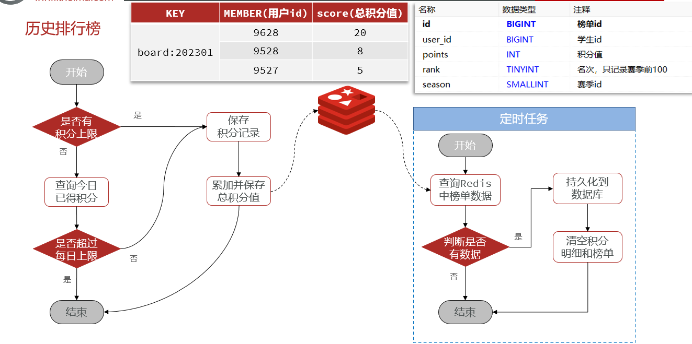     

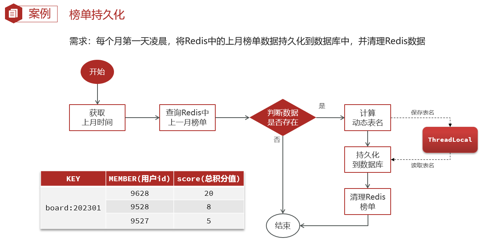

 附：【学霸天梯榜】纲要

```tex
1、实时排行榜（redis高性能实时排行）
		1）、在mq消费者消费加积分消息时，使用redis进行积分累加
			redis命令：zincrby boards:202305 100 2
			java代码：redisTemplate.opsForZSet().incrementScore(boards:202305, userId.toString(), realPoints);
		2）、在统计实时的积分信息时
			1、个人积分查询
				1）、个人分数：
					redis命令：	zscore boards:202305 2
					java代码：redisTemplate.boundZSetOps(boards:202305).score(userId);
				2）、个人排名：
					redis命令：zrevrank boards:202305 2
					java代码：redisTemplate.boundZSetOps(boards:202305).reverseRank(userId);
			2、实时积分榜查询
				redis命令：zrevrange boards:202305 0 100 [WITHSCORES]
				java代码： redisTemplate.opsForZSet().reverseRangeWithScores(boards:202305, from, from + pageSize - 1);
		
2、历史排行榜（数据量大、海量数据存储方案 - 分库分表）
		分区
		分表: 水平分表（解决数据量大的问题） + 垂直分表（解决读写性能问题）
		分库：水平分库（解决数据量大的问题） + 垂直分库（解决读写性能、业务问题） + 水平拓展（解决读写性能 + 单机故障）
		目前历史排行（水平分表：根据赛季进行分表）
		
3、实时 -> 历史 （跑批 - 分布式定时任务XXL-JOB）
	1）、分布式定时任务XXL-JOB（PowerJob也可以）
		1、部署调度中心
			1、导入XXL-JOB调度中心的SQL
			2、部署任务调度中心（docker/本地项目）
			3、新建配置执行器（可以理解为对任务的分组，等待微服务注册执行器实例过来）
			4、新建配置任务（任务挂在执行器下，指定任务执行具体配置）
			
		2、自定义服务集成调度中心
			1、导依赖
			2、加执行器配置（yaml、配置类读取）
					- 每一个项目内部都有一个执行器，要注册到调度中心的执行器管理器中，用于将来
					  调度中心根据任务策略进行灵活的调度
			3、编写任务并且标注@Xxljob注解（指定JobHandler，与调度中心新建的任务进行关联）
			4、服务跑起来
			5、调度中心 - 启动
				
		3、优点：解决了SpringTask缺陷
					
	2）、SpringTask缺陷
		1、多实例部署时，无法感知对方，同一个任务同一时间多次执行，更无法实现多实例之间的负载均衡
		2、没有控制台，无法监控任务执行的情况，无法跟踪任务执行日志
		3、无法对同一任务中的大量子任务进行切片处理
		4、无法对任务进行编排（对任务进行依赖顺序处理）
			
	3）、实现思路
		1、定义了3个分布式任务（经过了xxl-job的任务编排）
			1）、创建表
			2）、从redis的zset中查询数据持久化至数据库（如何进行动态表名映射）
				1、计算表名，存放至ThreadLocal
				2、利用MybatisPlus的动态表名插件（通过动态表名拦截器 拦截save方法，将实体上旧的表名替换成ThreadLocal中存入的表名）
				3、save的时候就会使用ThreadLocal中存入的表名
			3）、清理redis中的排行数据
				1、从redis zset中清除就可以了，根据redis的zset key直接删除：unlink
```


## 6、优惠券业务

### 6.1、优惠券发放业务背景

```
优惠券模块是我参与这个项目做的最久的一个模块，整体业务我划分成了优惠券发放和优惠券领取两大块，我先给您介绍下优惠券发放业务
   首先，在我们后台可以新建优惠券，新建的优惠券数据存储在了coupon优惠券表中：
     1）、新建的时候可以指定优惠券的发放类型，类型有手动发放和指定发放，手动发放就是常规优惠券，用户可以自行领取，而指定发放是要根据优惠券发放数量生成兑换码的，将来用户根据兑换码领取优惠券。
     2）、新建的时候还可以指定优惠券本身的类型，在我们系统中，支持的优惠券类型有四种，每满减、满减、无门槛、折扣
     3）、还可以指定优惠券的领取期限，优惠券新建后初始状态为【待发放】状态，后续随着业务推进，会有后续状态，比如【未开始、进行中、已结束、暂停】。
   其次，新建优惠券后，后台可以点击发放优惠券，发放的时候可以在表单中指定发放的数量、使用期限和每人限领数量，还可以选择是否立即发放，如果是立即发放，那优惠券状态会变为进行中，如果不是立即发放，需要指定发放时间延时发放，优惠券状态为未开始，后续如果已经到达优惠券的领取期限，优惠券状态会变为已结束，当后台暂停发放时，状态为已暂停。
   优惠券发放业务大概就是这样的，下面给您介绍下其中技术实现细节。
```

```sql
#优惠券表：
CREATE TABLE IF NOT EXISTS `coupon` (
		  `id` bigint NOT NULL AUTO_INCREMENT COMMENT '优惠券id',
		  `name` varchar(100) CHARACTER SET utf8mb4 COLLATE utf8mb4_0900_ai_ci NOT NULL DEFAULT '0' COMMENT '优惠券名称，可以和活动名称保持一致',
		  `type` tinyint NOT NULL DEFAULT '1' COMMENT '优惠券类型，1：普通券。目前就一种，保留字段',
		  `discount_type` tinyint NOT NULL COMMENT '折扣类型，1：满减，2：每满减，3：折扣，4：无门槛',
		  `specific` bit(1) NOT NULL DEFAULT b'0' COMMENT '是否限定作用范围，false：不限定，true：限定。默认false',
		  `discount_value` int NOT NULL DEFAULT '1' COMMENT '折扣值，如果是满减则存满减金额，如果是折扣，则存折扣率，8折就是存80',
		  `threshold_amount` int NOT NULL DEFAULT '0' COMMENT '使用门槛，0：表示无门槛，其他值：最低消费金额',
		  `max_discount_amount` int NOT NULL DEFAULT '0' COMMENT '最高优惠金额，满减最大，0：表示没有限制，不为0，则表示该券有金额的限制',
		  `obtain_way` tinyint NOT NULL DEFAULT '0' COMMENT '获取方式：1：手动领取，2：兑换码',
		  `issue_begin_time` datetime DEFAULT NULL COMMENT '开始发放时间',
		  `issue_end_time` datetime DEFAULT NULL COMMENT '结束发放时间',
		  `term_days` int NOT NULL DEFAULT '0' COMMENT '优惠券有效期天数，0：表示有效期是指定有效期的',
		  `term_begin_time` datetime DEFAULT NULL COMMENT '优惠券有效期开始时间',
		  `term_end_time` datetime DEFAULT NULL COMMENT '优惠券有效期结束时间',
		  `status` tinyint DEFAULT '1' COMMENT '优惠券配置状态，1：待发放，2：未开始   3：进行中，4：已结束，5：暂停',
		  `total_num` int NOT NULL DEFAULT '0' COMMENT '总数量，不超过5000',
		  `issue_num` int NOT NULL DEFAULT '0' COMMENT '已发放数量，用于判断是否超发',
		  `used_num` int NOT NULL DEFAULT '0' COMMENT '已使用数量',
		  `user_limit` int NOT NULL DEFAULT '1' COMMENT '每个人限领的数量，默认1',
		  `ext_param` json DEFAULT NULL COMMENT '拓展参数字段，保留字段',
		  `create_time` datetime NOT NULL DEFAULT CURRENT_TIMESTAMP COMMENT '创建时间',
		  `update_time` datetime NOT NULL DEFAULT CURRENT_TIMESTAMP ON UPDATE CURRENT_TIMESTAMP COMMENT '更新时间',
		  `creater` bigint NOT NULL COMMENT '创建人',
		  `updater` bigint NOT NULL COMMENT '更新人',
		  PRIMARY KEY (`id`) USING BTREE
		) ENGINE=InnoDB AUTO_INCREMENT=1630563495906942979 DEFAULT CHARSET=utf8mb4 COLLATE=utf8mb4_0900_ai_ci COMMENT='优惠券信息';
```


### 6.2、优惠券发放技术实现细节

```tex
1、对于优惠券延时发放，使用Rabbitmq的死信队列+ttl机制实现，当然也可以用死信交换机实现，但是这个地方我们出现过bug，我们一开始是使用的死信队列+ttl，但是这种方案会有一个问题，延时时间长的任务（延时30秒）先进入队列会阻塞延时时长短的任务（延时5秒），因为这个延时任务是存储在队列的，而队列的特性是先进先出 FIFO，后来我们换成了延时交换机插件实现的。

2、对于优惠券过期，使用xxl-job定时任务扫描数据库实现的，到达领取的结束日期后就会置为已失效

3、对于优惠券指定发放，需要生成兑换码，当时设计这套兑换码生成规则，也费了一些周折，因为这套兑换码不是简单直接根据UUID或者雪花算法生成一些唯一ID，而是要满足很多要求：
	1）、第一就是可读性要好：因为用户是需要输入兑换码来兑换优惠券的，所以我们给出了一些要求：
	  - 长度不超过10个字符
	  - 抛除字母中的I和O、数字中的1和0，只能是24个大写字母和8个数字：ABCDEFGHJKLMNPQRSTUVWXYZ23456789
	2）、第二个就是这种算法支持生成的兑换码数据量要大：因为优惠活动比较频繁，必须有充足的兑换码，最好有30亿
	    以上的量
	3）、第三就是唯一性：30亿兑换码都必须唯一，不能重复，否则会出现兑换混乱的情况
	4）、第四就是不可重兑：而且校验兑换码 是否兑换过要很方便
	5）、第五就是防止爆刷：兑换码的规律性不能很明显，不能轻易被人猜测到其它兑换码
	6）、最后一个就是高效：兑换码生成、验证的算法必须保证效率，避免对数据库带来较大的压力
4、为了满足这几个要求，我们最终兑换生成算法是这样设计的
    1）、首先，兑换码的总体思路是由50个bit位构成的，以每5个bit为一组，算出10进制数字，去32个字母中取对照的字符构成10位兑换码。
	2）、其中低32位是兑换码的核心，它是利用Redis自增来生成的序列号，可以承载42亿左右不重复的兑换码，
	3）、其中中间的4位是优惠券id的后4个bit位，使用它来作为新鲜值，换算成10进制可以得到0到15，以0到15的数字为角标可以从我们提前定义好的16组秘钥中获得其中一组秘钥。
	4）、最后剩下的高14位是签名，是由秘钥对低36位加密而来，主要是为了防止暴刷
5、兑换码的校验逻辑是这样的：
    1、从要校验的兑换码中分别获取32位序列号、4位的新鲜值与14位的签名
		f：0010
		c：00000 00000 1001
		s：00 00000 00000 00000 00000 00000 00011
	2、再次利用生成兑换码中的算法，再次计算得到签名c2
	3、将c2与c比较，如果一致则认为是有效兑换码
	4、兑换码使用过后，我们利用BitMap标记序列号s对应位为1，用于下次校验兑换码是否已经使用过
```

附：兑换码生成算法示例

```tex
兑换码生成算法：
	1、利用Redis自增（比如3）来生成序列号s，作为兑换码的核心
		0000 0000 0000 0000 0000 0000 0000 0011
		
	2、利用优惠券id的后4 bit位做新鲜值f（0010），得到加密密钥，比如：4 5 2 9 0 8 6 3
		2 5 1 9 0 8 6 3
		4 5 2 9 0 8 6 3
		8 5 1 3 0 8 6 3
		........
	3、利用密钥对序列号s加密，得到14位签名c
		1）、序列号以每4位为一组，转10进制
			0000 0000 0000 0000 0000 0000 0000 0011
			0	 0	  0	   0	0	 0	  0    3
		2）、10进制结果与加密密码进行相乘求和
		    0	 0	  0	   0	0	 0	  0    3
		    4 	 5 	  2    9 	0 	 8 	  6    3
		    9 ==>  转为二进制： 00000000001001
		
	4、将f、c、s拼接，利用Base32编码，得到最终兑换码
		00000 00000 10010 01000 00000 00000 00000 00000 00000 00011
		E      H     U     A     C     2     W      P     Z     6
	
如何校验兑换码：
	1、从要校验的兑换码中分别获取f、c、s
		f：0010
		c：00000 00000 1001
		s：00 00000 00000 00000 00000 00000 00011
	2、再次利用生成算法，得到签名c2
		重复兑换码生成算法中的2、3步骤，再次得到签名C2
	3、将c2与c比较，一致则认为是有效兑换码
	4、兑换码使用过后，利用BitMap标记序列号s对应位为1，用于下次校验兑换码是否已经使用过
```

```sql
CREATE TABLE IF NOT EXISTS `exchange_code` (
		  `id` int NOT NULL COMMENT '兑换码id',
		  `code` varchar(10) CHARACTER SET utf8mb4 COLLATE utf8mb4_0900_ai_ci NOT NULL COMMENT '兑换码',
		  `status` tinyint NOT NULL DEFAULT '1' COMMENT '兑换码状态， 1：待兑换，2：已兑换，3：兑换活动已结束',
		  `user_id` bigint NOT NULL DEFAULT '0' COMMENT '兑换人',
		  `type` tinyint NOT NULL DEFAULT '1' COMMENT '兑换类型，1：优惠券，以后再添加其它类型',
		  `exchange_target_id` bigint NOT NULL DEFAULT '0' COMMENT '兑换码目标id，例如兑换优惠券，该id则是优惠券的配置id',
		  `create_time` datetime NOT NULL DEFAULT CURRENT_TIMESTAMP COMMENT '创建时间',
		  `expired_time` datetime NOT NULL COMMENT '兑换码过期时间',
		  `update_time` datetime NOT NULL DEFAULT CURRENT_TIMESTAMP ON UPDATE CURRENT_TIMESTAMP COMMENT '更新时间',
		  PRIMARY KEY (`id`) USING BTREE,
		  KEY `index_status` (`status`) USING BTREE,
		  KEY `index_config_id` (`exchange_target_id`) USING BTREE
		) ENGINE=InnoDB DEFAULT CHARSET=utf8mb4 COLLATE=utf8mb4_0900_ai_ci COMMENT='兑换码';
```


### 6.3、优惠券领取业务背景

```tex
1、优惠券的领取，对应优惠券发放就有两个领取场景，分为在【优惠券中心领取优惠券】和【个人中心兑换优惠券】
2、在优惠券中心，用户可以看到系统后台发放的优惠券，根据优惠券是否有余量和用户是否已经到达领取上限，每张优惠券下面会有不同的操作按钮，比如优惠券已经领取完，会显示【已领完】，如果已经到达上限并且领取的都已经使用，会显示【已达领取上限】，如果还未使用，显示【去使用】
3、在个人中心，用户可以手动输入我们系统发放的兑换码兑换优惠券

这两种领取场景的优惠券数据都会进到一张user_coupon用户优惠券表
```

### 6.4、优惠券领取实现并发细节

```tex
下面我介绍下优惠券领取的技术实现细节，当时做这块功能的时候，还是出了比较多的问题，也经历了很多次的优化
1、其实无论是领取优惠券还是兑换优惠券，本质上就是优惠券这种共享资源的一种归属问题，如果用户领取了一张券，这张券的归属就确定了，对应user_coupon表会新增一条数据，coupon表的优惠券已领取数量也会+1。
2、既然是共享资源操作，我当时做的时候就考虑到肯定会有并发问题，所以我对于实现逻辑中到底会有哪些并发场景进行了分析，就拿优惠券中心领取优惠券来说，经过分析，就发现有两个场景的并发问题。
```

```tex
   第一个并发场景是：如果大量的不同用户请求涌入抢同一个优惠券，我需要判断优惠券有没有领完，如果已经被领完，就要给出提示，如果没有就要对coupon表已领取数量+1，然后新增user_coupon用户优惠券数据，那这里判断优惠券有没有领完和更新优惠券数量+1、新增用户券数据的操作就要保证原子性，如果没有的话，就会出现并发安全问题，进而导致已领取数量大于优惠券发放总数的情况，也就是超领。当时第一反应就是对这几个操作要进行加锁，保证这几步操作的原子性，不被别的请求线程干扰，但是如果加【悲观锁】，比如synchronize或者JUC下的lock，这样一个线程进来，别的线程就会阻塞，效率会很低，所以考虑能不能用【乐观锁】，正好呢，这个场景本质上就要要保证判断优惠券已发放数量和【修改】已发放优惠券数量的原子性，对于修改来说，用乐观锁的比较替换的思想非常合适，所以这里我把代码逻辑改造为了：
	1、先查询优惠券的已发放数量
	2、然后判断已发放数量有没有大于优惠券发放总数
	3、如果没有就将优惠券已发放数量+1，只是这里更新加1的时候，在sql的where语句里面会加上优惠券已发放数量 = 之前查询的已发放数量 的条件，如果在这之间，有别的线程修改了已发放总数，本次的领取就会失败，更新返回的代表是否更新成功的int值就会等于0，也就不会再新增用户券数据。
	
	4、另外要说明的一点是这个场景使用乐观锁如果出现ABA问题，也是没什么影响的，所以不用考虑ABA问题
	逻辑到这，我觉得问题应该不大了，所以用jemeter对这段程序进行了测试，结果，发现了一个问题，那就是：当优惠券余量即使很充足，并发抢券大部分的抢券请求也都会失败，事后查看库里，也还有很多未领取的券。
	所以对这个问题进行了分析，结果发现是因为那个sql的where条件判断有问题，这个判断不会看余量是否充足，而是对每一张券的并发领取都会进行cas比较，这样一来在券余量充足的情况下，并发领取的成功率就会很低，所以，我对这sql中的where条件进行了改造，由原来的优惠券已发放数量 = 之前查询的已发放数量 改为了: 优惠券已发放数量 < 优惠券总数，后来经过测试，并发领取成功率问题解决了，而且并发安全问题也得到了控制。
```

```tex
   第二个并发场景是：如果大量的同一用户请求涌入抢同一个优惠券，我需要判断这个用户有没有达到当前券的领取上限，如果达到了，要给出提示，如果没有，才可以走最后的领券逻辑，也就是要保证查询判断当前券当前用户领取的数量有没有到达上限 和 新增优惠券逻辑的原子性，而这里查询当前券当前用户领取多少张是上user_coupon表实时查询的，新增也是向user_coupon表插入数据，所以就是要保证这个查询判断和新增操作的原子性。这里产生并发问题的数据库操作不是更新，而是新增，所以没有用乐观锁，而是用悲观锁解决的。
  当时用的就是synchronize同步代码块，由于锁的是同一个用户抢券的并发问题，所以锁对象就是用的用户ID，而用户ID是Long类型，所以当时考虑不能用Long，因为Long类型只有在-128到127这个范围是有常量池的，所以大部分情况下，Long对象都不是同一个，锁不住，于是，顺手就写了一个userid.toString()当锁用了，后来测试的时候才发现草率了，因为toString方法内部也是新new的一个字符串对象，锁对象也不是同一个，根本锁不住，所以，后来又改为了userId.toString().intern, 从字符串常量池取，这样锁对象才是同一个，才解决掉锁对象不是同一个导致的【锁失效问题】。
  但是这还没完，后来测试的时候，还是出现了【锁失效的问题】，一开始的时候百思不得其解，后来多次查阅博客文档才发现是由于spring事务切面和锁边界问题导致的，由于事务切面的范围比我上锁的范围广，导致我是先释放锁，才提交事务，这样一来就会出现并发问题了，在释放锁但还没提交事务的一瞬间，如果有别的线程进来查询是否到达领取上限，由于我们事务隔离级别都是读已提交，这个时候肯定是读不到还没有提交的数据的，所以，肯定没有达到领取上限，这样就又能领取成功，锁就失效了。解决方案的话，其实也简单，就是扩大锁的边界，把事务包裹在锁里面就可以了，所以我当时单独提取了一个方法，这个方法加了锁，在方法内部再调用的事务方法，但是，这个时候问题又来了，出现了事务失效的问题（同类中一个没有事务的方法调用有事务的方法） -> 过度到事务失效场景面试题
```

### 6.5、优惠券领取实现优化细节

```tex
1、synchronized悲观锁改为分布式锁
    原因：synchronized只适合单体架构，不适用分布式场景，tomcat都不是同一个
    
2、分布式锁实现
	1）、自己封装工具，利用redis setnx实现
	 	可以用于分布式锁场景使用
	 	问题：要自己处理死锁、2种误删锁、锁续命、一致性等问题，考虑用redisson实现
	 	
	2）、redisson工具集
	 	解决了redis很多问题需要自己解决实现的麻烦
	 	问题：不够优雅，对业务代码有侵入
	 	
    3）、自定义注解 + AOP切面 + 策略设计模式 
        解决了redisson分布式锁代码不优雅，对业务有侵入的问题
     	1、使用AOP（LockAspect） + 自定义注解（@Lock）优化改造分布式锁（只用在需要控制并发的方法上标注@Lock注解）
		   1）、出现问题：Redisson分布式锁失效
		   2）、原因：AOP切面顺序问题（事务切面通知先于分布式锁切面执行，于是造成事务尚未提交，锁先释放了）
		   3）、解决：LockAspect实现Ordered接口，自定义切面顺序，让LockAspect分布式锁切面通知先于事务
		        切面通知执行即可
			 
		2、LockAspect切面需要支持用户灵活自定义Redisson锁的类型
		   1）、在@Lock上增加锁类型：LockType
		   2）、在LockAspect切面中根据LockType调用工厂类LockFactory获取对应的锁类型【简单
			      工厂设计模式】
			   使用EnumMap存储锁类型与获取锁的行为（Function），效率更高
		
		3、使用策略模式改造取锁与取锁结果判断的逻辑
		  1）、枚举中直接定义策略与策略逻辑
		  2）、LockAspect切面中直接根据@Lock注解中指定的策略类型获取对应的策略，执行相应tryLock逻辑即可
```


---

## 📎 关联文档

- [[01-天机学堂概述]]
- [[16-项目面试总结]]
- [[17-项目表述]]
